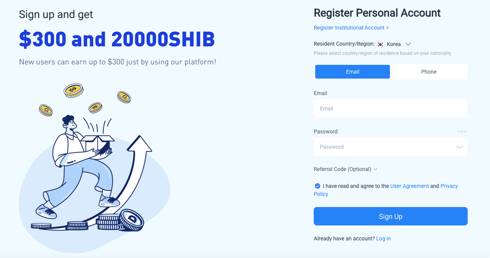

## Table of Contents

## What is Huobi Global and its history?

Huobi Global is a cryptocurrency exchange where people can buy, sell, and trade different types of digital money like Bitcoin and Ethereum. It was started in 2013 by Leon Li, who used to work at Oracle. The company began in China but moved its main office to Singapore because of strict rules about cryptocurrencies in China. Huobi Global wants to help people all over the world use and trade cryptocurrencies easily and safely.

Over the years, Huobi Global has grown a lot. It now has offices in many countries and serves customers from more than 130 countries. They offer many different services, like trading, staking, and even their own digital money called Huobi Token (HT). Huobi Global also works hard to make sure their platform is safe and follows the rules in different countries. They use strong security measures to protect users' money and information.

## How does Huobi Global cater to beginners in cryptocurrency trading?

Huobi Global makes it easy for beginners to start trading cryptocurrencies. They have a simple and friendly website that is easy to use. When you sign up, you can quickly learn how to buy, sell, and trade digital money. Huobi also has guides and tutorials that explain everything in a way that is easy to understand. This helps new users feel more confident as they start trading.

Another way Huobi Global helps beginners is by offering different types of trading options. They have a basic trading platform that is perfect for people just starting out. This platform has clear charts and simple tools that make it easy to make trades. Plus, Huobi has a practice mode where you can trade with fake money to learn without risking real money. This is a great way for beginners to practice and get better at trading before they start using real money.

## What are the key features of Huobi Global's trading platform?

Huobi Global's trading platform has many features that make it easy and safe to trade cryptocurrencies. One big feature is the user-friendly interface, which means it's easy to use even if you're new to trading. The platform has clear charts and simple tools that help you make trades quickly. You can also choose from different types of trading, like spot trading, where you buy and sell cryptocurrencies right away, or futures trading, where you can bet on future prices. Huobi also has a practice mode where you can trade with fake money to learn without risking your real money.

Another important feature is the security measures Huobi uses to keep your money and information safe. They use strong encryption to protect your data and have systems in place to stop hackers. Huobi also has a special fund called the Huobi Security Reserve to help users if something goes wrong. Plus, they follow the rules in different countries to make sure they are doing everything the right way. This makes users feel more secure when they use the platform.

Huobi Global also offers other services that can help you make the most of your cryptocurrencies. For example, you can stake your cryptocurrencies, which means you can earn more digital money by holding onto what you already have. They also have their own [cryptocurrency](/wiki/cryptocurrency) called Huobi Token (HT), which you can use to get discounts on trading fees and other benefits. All these features together make Huobi Global a great choice for anyone looking to trade cryptocurrencies.

## How does Huobi Global ensure the security of user assets?

Huobi Global takes many steps to keep your money and information safe. They use strong encryption to protect your data, which means they turn your information into a special code that is very hard for hackers to break. They also have systems in place to stop hackers from getting into their platform. These systems watch for anything strange and stop it before it can cause problems. Huobi also has a special fund called the Huobi Security Reserve. This fund is like a safety net that can help users if something goes wrong and they lose their money.

Another way Huobi Global keeps things safe is by following the rules in different countries. They make sure they are doing everything the right way so that users can trust them. They also have a team that is always working to make their security even better. This team looks for new ways to keep the platform safe and fixes any problems they find quickly. All these steps together help make sure that your cryptocurrencies are safe when you use Huobi Global.

## What are the fees associated with trading on Huobi Global?

Huobi Global has different fees for different types of trading. For spot trading, which is when you buy and sell cryptocurrencies right away, the fee is usually around 0.2% of the total amount you trade. But if you use their own cryptocurrency called Huobi Token (HT), you can get a discount on these fees. The more HT you hold, the bigger the discount you get. This makes it cheaper for you to trade on their platform.

For futures trading, where you bet on future prices, the fees are a bit different. There's a fee for opening a trade, which is usually around 0.02% of the total amount, and another fee for closing a trade, which is also around 0.02%. These fees can change a bit depending on how much you trade and what kind of futures contract you use. Just like with spot trading, using HT can help you save money on these fees too.

## What types of cryptocurrencies can be traded on Huobi Global?

Huobi Global lets you trade many different types of cryptocurrencies. You can trade popular ones like Bitcoin and Ethereum, which are known by many people. They also have other well-known cryptocurrencies like Litecoin and Ripple. But Huobi doesn't stop there. They also offer a lot of lesser-known cryptocurrencies, which gives you many choices when you want to trade.

Besides the big names, Huobi Global has a wide range of smaller cryptocurrencies. This means you can find and trade new and exciting digital money that might not be available on other platforms. Whether you're interested in the most popular cryptocurrencies or want to explore new ones, Huobi Global has a lot to offer.

## How does Huobi Global's mobile app enhance the trading experience?

Huobi Global's mobile app makes trading cryptocurrencies easy and fun, even when you're away from your computer. The app is designed to be user-friendly, so you can quickly buy, sell, and trade your digital money no matter where you are. It has all the same features as the website, like clear charts and simple tools, but everything is right at your fingertips on your phone. This means you can keep an eye on your trades and make quick decisions whenever you need to.

The app also lets you get notifications about your trades and the market, so you never miss an important update. You can set up alerts to tell you when the price of a cryptocurrency changes or when it's time to make a move. Plus, the app is secure, using the same strong encryption and safety measures as the website to protect your money and information. With Huobi Global's mobile app, you can trade with confidence and convenience, making it a great tool for anyone interested in cryptocurrencies.

## What are the advanced trading options available on Huobi Global?

Huobi Global offers many advanced trading options for people who want to do more than just simple buying and selling. One of these options is futures trading, where you can bet on what the price of a cryptocurrency will be in the future. This can be a bit riskier, but it also gives you the chance to make more money if you guess right. Huobi also has margin trading, where you can borrow money to make bigger trades. This can help you make more profit, but it's important to be careful because you could also lose more money.

Another advanced feature is the ability to use trading bots. These are special programs that can make trades for you based on rules you set up. This can save you time and help you trade even when you're not watching the market. Huobi Global also has a feature called "grid trading," which lets you set up a series of buy and sell orders at different price levels. This can help you make money from small changes in the price of a cryptocurrency. All these advanced options give experienced traders more ways to make the most of their trading on Huobi Global.

## How does Huobi Global comply with regulatory requirements globally?

Huobi Global works hard to follow the rules in different countries where it operates. They know that rules about cryptocurrencies can be different everywhere, so they make sure to understand and follow all the local laws. For example, they moved their main office to Singapore because of strict rules in China. They also have teams that keep an eye on new rules and changes, so they can always stay compliant. This helps them keep their platform safe and trusted by users all over the world.

To make sure they are following the rules, Huobi Global works with regulators and gets the right licenses. They have licenses in places like the United States, Japan, and South Korea, which shows they are serious about doing things the right way. They also use strong security measures and checks to stop illegal activities like money laundering. By doing all this, Huobi Global makes sure that users can trade cryptocurrencies safely and legally, no matter where they are.

## What are the liquidity and volume statistics for Huobi Global?

Huobi Global is known for having good [liquidity](/wiki/liquidity-risk-premium) and high trading volumes. Liquidity means how easy it is to buy or sell something without the price changing too much. Huobi has a lot of users and a big market, so it's usually easy to trade cryptocurrencies on their platform. They also have many different cryptocurrencies available, which helps keep the liquidity high. This is good for traders because it means they can make trades quickly and at good prices.

The trading [volume](/wiki/volume-trading-strategy) on Huobi Global is also very high. Trading volume is the total amount of cryptocurrencies that are bought and sold on the platform in a certain time, like a day. Huobi often has millions of dollars in trading volume every day. This shows that a lot of people are using the platform to trade. High trading volume is important because it means there are always people ready to buy or sell, making it easier for everyone to trade.

## How does Huobi Global support institutional investors and traders?

Huobi Global has special services for big investors and traders, like banks or big companies. They know that these big players need different things than regular people, so they offer things like special accounts and tools that make trading easier and safer. For example, they have a service called Huobi OTC (Over-The-Counter) trading, which lets big investors trade large amounts of cryptocurrencies without affecting the market prices. They also have a program called Huobi Prime, which gives early access to new cryptocurrencies, which can be interesting for big investors looking for new opportunities.

Another way Huobi Global helps big investors is by offering strong security and following rules in different countries. They know that big investors need to feel safe and trust the platform. So, they use strong security measures like encryption and special funds to protect money. They also work hard to follow all the rules in the places where they operate, which makes it easier for big investors to use their services without worrying about breaking any laws. This way, Huobi Global makes sure that big investors can trade with confidence and ease.

## What are the future plans and developments for Huobi Global in 2024?

In 2024, Huobi Global plans to keep growing and making their platform better. They want to add more cryptocurrencies for people to trade. This means you'll have even more choices when you want to buy or sell digital money. They also want to make their services easier to use, so more people can start trading, no matter if they're new or experienced. Huobi Global is always looking for new ways to help their users, so they're working on new tools and features that will make trading easier and safer.

Another big plan for Huobi Global in 2024 is to expand into more countries. They want to make sure more people around the world can use their platform. This means they'll be working on getting more licenses and following more rules in different places. They also want to keep their platform safe and secure, so they'll be improving their security measures. By doing all this, Huobi Global hopes to become an even bigger and better place for people to trade cryptocurrencies.

## References & Further Reading

[1]: Bergstra, J., Bardenet, R., Bengio, Y., & Kégl, B. (2011). ["Algorithms for Hyper-Parameter Optimization."](https://papers.nips.cc/paper/4443-algorithms-for-hyper-parameter-optimization) Advances in Neural Information Processing Systems 24.

[2]: ["Advances in Financial Machine Learning"](https://www.amazon.com/Advances-Financial-Machine-Learning-Marcos/dp/1119482089) by Marcos Lopez de Prado

[3]: ["Evidence-Based Technical Analysis: Applying the Scientific Method and Statistical Inference to Trading Signals"](https://www.amazon.com/Evidence-Based-Technical-Analysis-Scientific-Statistical/dp/0470008741) by David Aronson

[4]: ["Machine Learning for Algorithmic Trading"](https://github.com/stefan-jansen/machine-learning-for-trading) by Stefan Jansen

[5]: ["Quantitative Trading: How to Build Your Own Algorithmic Trading Business"](https://www.amazon.com/Quantitative-Trading-Build-Algorithmic-Business/dp/1119800064) by Ernest P. Chan