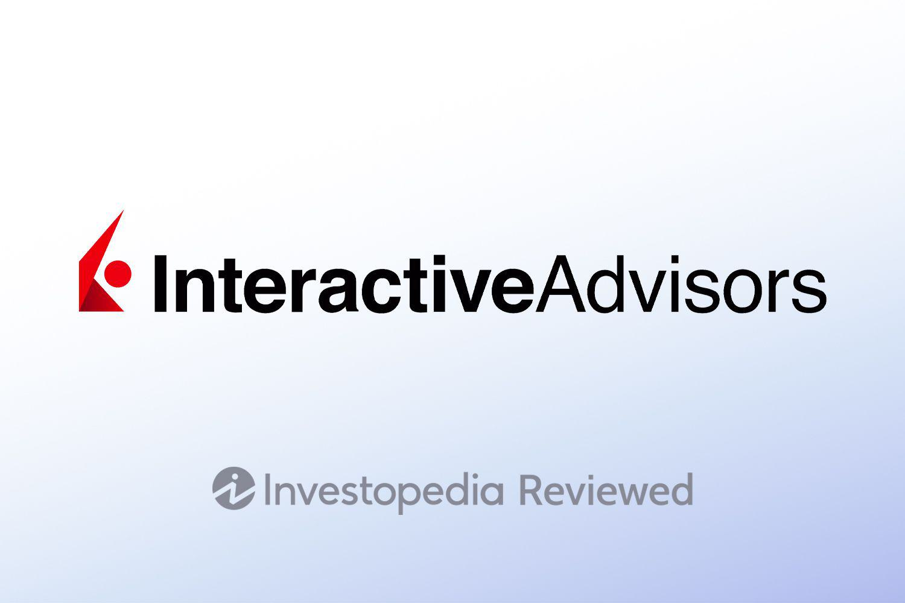

Automated investing platforms have gained considerable traction in recent years, reshaping how individuals approach wealth management and investment strategies. These platforms offer an array of sophisticated tools enabling investors, both novice and seasoned, to diversify their portfolios without the need for in-depth market knowledge or constant monitoring. The allure lies in their ability to provide a hands-off, efficient investment experience powered by cutting-edge technology.

Interactive Advisors, a key player in this domain, exemplifies the synergy between innovation and financial acumen. As a subsidiary of Interactive Brokers, a pioneering entity in the brokerage industry, Interactive Advisors stands out through its distinctive approach to automated investing. Interactive Brokers' acquisition of Covestor was a pivotal moment, marking its strategic expansion into personal finance management and leveraging Covestor's expertise in model-driven investment strategies. This acquisition facilitated the rebranding to Interactive Advisors, aligning more closely with the parent company's legacy of technological excellence and market intelligence.



The importance of comprehensive financial reviews is paramount in navigating the plethora of investment platforms available today. These evaluations guide potential investors by elucidating the strengths and limitations of each platform, helping them make informed decisions tailored to their financial goals. By dissecting fees, account minimums, and performance metrics, financial reviews serve as an invaluable resource in an increasingly complex investment landscape.

Algorithmic trading is a cornerstone of modern investment strategies, revolutionizing how trading operations are conducted. By utilizing algorithms, investment platforms can automate trade execution based on pre-defined criteria such as timing, price, or volume, thereby eliminating human error and optimizing transaction efficiency. Algorithmic trading enhances the ability of platforms like Interactive Advisors to apply sophisticated strategies across diverse asset classes, ensuring precise and timely portfolio rebalancing and management. As investors continue to seek advanced methodologies to better navigate volatile markets, the role of algorithmic trading in automated platforms is expected to grow, underscoring its significance in the future of investing.

## Table of Contents

## Understanding Interactive Advisors

Interactive Advisors, a subsidiary of Interactive Brokers, has established itself as a key player in the automated investing landscape. The roots of Interactive Advisors can be traced back to the acquisition of the investment platform Covestor by Interactive Brokers in 2015. This acquisition was a strategic move to enhance the capabilities of Interactive Brokers by integrating a robust online investment management service. Covestor had already carved out a niche for itself by allowing individuals to replicate the strategies of professional investors, effectively democratizing access to sophisticated investment tactics.

After the acquisition, the platform was rebranded as Interactive Advisors, aligning it more closely with its parent company, Interactive Brokers, renowned for its comprehensive trading services. The rebranding was not merely cosmetic; it signaled a shift towards a more integrated and seamless offering for clients who were increasingly favoring automated investment solutions over traditional methods. The transition to the Interactive Advisors name symbolized a commitment to expanding and refining its suite of services to better serve the evolving needs of investors.

Interactive Advisors is distinguished by its comprehensive range of investment portfolios. These offerings are designed to cater to diverse investment goals and risk appetites. The platform provides access to a wide array of portfolios, including those that adhere to socially responsible investing principles, thereby allowing investors to align their financial goals with their ethical values. Such portfolios are crafted to meet high standards of environmental, social, and governance ([ESG](/wiki/esg-investing)) criteria, making them appealing to the growing demographic of conscientious investors.

Moreover, Interactive Advisors is committed to the advancement of automated investing. By leveraging sophisticated algorithms and technology, the platform enables efficient and cost-effective management of investment portfolios. Automated investing reduces the traditional barriers of cost and complexity, empowering a broader segment of the population to engage in investing. It also allows for dynamic rebalancing and tax-efficient strategies, thereby optimizing returns for users. This alignment with technological advancements in the financial sector underscores Interactive Advisors' dedication to staying at the forefront of investment innovation.

Through its sophisticated offerings and strong integration with [Interactive Brokers](/wiki/interactive-brokers-api), Interactive Advisors provides a compelling option for investors seeking an automated, diversified, and tailored investing experience.

## Features of Interactive Advisors

Interactive Advisors offers a diverse array of investment portfolios designed to cater to various investor preferences and goals. The platform provides a mix of managed portfolios with different strategies, allowing investors to choose from a wide range of asset allocations and investment themes. Some of these include index tracking, income generation, socially responsible investing (SRI), and tactical portfolios that adjust based on market conditions. Each portfolio has an associated risk level, helping investors align their investment choices with their risk tolerance.

One notable feature of Interactive Advisors is the customization options available to investors. The platform supports socially responsible investment choices, enabling users to align their investments with personal values related to environmental, social, and governance (ESG) criteria. This feature appeals to investors who wish to support companies with sustainable business practices while achieving competitive returns. 

Interactive Advisors also integrates tax-loss harvesting as a service for its users. This process involves selling securities at a loss to offset capital gains taxes on other investments, thereby potentially improving after-tax returns. The platform automates this strategy, taking the responsibility off investors and ensuring that their portfolios remain in compliance with IRS regulations while optimizing for tax efficiency.

Additionally, the platform offers cash management services that help investors maximize the utility of idle cash within their accounts. Features like automatic fund allocation ensure that uninvested cash is optimally deployed to balance risk and return according to the selected portfolio strategy.

By combining a range of tailored investment portfolios with features such as customization, tax-loss harvesting, and cash management, Interactive Advisors provides investors with a robust and adaptable automated investing solution.

## Fees and Account Minimums

Interactive Advisors offers a competitive fee structure with rates ranging from 0.08% to 0.75% annually. The fee percentage is influenced by the specific portfolio selected and the level of customization involved. Lower-end fees typically apply to standard portfolios with fewer complexities, whereas strategies involving broader diversification or active management might incur higher costs.

Account minimums at Interactive Advisors vary across its different investment strategies, reflecting the platform's aim to cater to a broad spectrum of investors. For instance, certain portfolios may require minimum investments as low as $100, making them accessible to new or smaller-scale investors. In contrast, more sophisticated portfolios, potentially involving higher-risk assets or specific mandates, may necessitate minimums reaching $50,000. This range of account minimums ensures that both novice investors and those with significant capital can find suitable investment options on the platform.

When comparing the fee structures and account minimums of Interactive Advisors to other robo-advisors, it becomes evident that Interactive Advisors is competitive, particularly for investors seeking customizable and socially responsible investment options. Many robo-advisors offer flat fee structures or similar minimum investment requirements. However, Interactive Advisors distinguishes itself by providing a balance between affordability and comprehensive service options. While some robo-advisors might offer lower fees or no minimums, the breadth of Interactive Advisors' portfolio options and the sophistication of their management strategies can offer more value to certain investors.

For potential investors weighing costs across different platforms, Interactive Advisors provides a scalable fee and investment structure conducive to various investing goals. Whether aiming for cost efficiency or engaging in intricate investment strategies, the range and flexibility offered by Interactive Advisors can meet diverse investment preferences while maintaining competitive industry standards.

## Algorithmic Trading with Interactive Advisors

Automated trading, also known as [algorithmic trading](/wiki/algorithmic-trading), involves the use of computer algorithms to execute trades based on preset criteria. The primary benefit of automated trading is its ability to process large volumes of complex data swiftly, making split-second trading decisions without human intervention. This can lead to increased efficiency, reduced emotional biases, and greater consistency in trading strategy execution.

Interactive Advisors leverages algorithmic strategies to optimize investment portfolios for its clients. By building on the robust infrastructure of its parent company, Interactive Brokers, Interactive Advisors integrates sophisticated algorithms that can manage diverse portfolios, operate across various asset classes, and adhere to specific investment mandates. Key to these strategies is automated rebalancing, a process that adjusts the proportions of assets in a portfolio to maintain an investor’s desired risk-return profile. This ensures that the portfolio remains aligned with the client’s objectives, especially in the face of market fluctuations.

Algorithms play a pivotal role in portfolio management within Interactive Advisors. The algorithms are designed to continuously evaluate market conditions and amend portfolios as needed. For instance, if a portfolio's asset allocation deviates from the target due to market movements, the algorithm will execute trades to restore the desired allocation. This process is typically seamless and aims to optimize performance while minimizing transaction costs.

The implementations of these algorithmic strategies can be visualized through a simplified Python code snippet that illustrates portfolio rebalancing:

```python
def rebalance_portfolio(portfolio, target_allocation):
    current_value = sum(portfolio.values())
    target_value = {asset: current_value * allocation for asset, allocation in target_allocation.items()}

    trades = {asset: target_value[asset] - portfolio[asset] for asset in portfolio}
    return trades

# Example: Portfolio and target allocation
portfolio = {'stocks': 5000, 'bonds': 3000}
target_allocation = {'stocks': 0.6, 'bonds': 0.4}

trades = rebalance_portfolio(portfolio, target_allocation)
print(trades)
```

In this example, the algorithm calculates the differences between current and target allocations and generates trades to bridge these differences. This ensures that Interactive Advisors can manage portfolios effectively in response to changing market conditions.

Overall, by implementing algorithmic trading, Interactive Advisors provides a robust platform capable of efficiently managing investor portfolios. The automated nature of these services offers a significant advantage to clients who seek sophisticated, consistent, and unbiased investment strategies.

## Pros and Cons of Using Interactive Advisors

Interactive Advisors offers a compelling suite of features for investors. One of its primary strengths lies in its extensive range of portfolio options. Investors can choose from a variety of professionally managed portfolios, including those focused on environmental, social, and governance (ESG) criteria, catering to those interested in socially responsible investing. This diversity allows users to tailor their investment strategy to their personal values and financial goals, potentially enhancing their engagement and satisfaction with the platform.

Additionally, Interactive Advisors is known for its competitive fee structure, with management fees ranging from 0.08% to 0.75%. This range is relatively low compared to traditional investment advisors, making it an attractive option for cost-conscious investors. By minimizing costs, investors can potentially maximize their net returns over time, aligning with the increasing preference for low-fee investment solutions in the market.

However, the platform has its limitations. Notably, Interactive Advisors does not offer a dedicated mobile app, which could be a drawback for users who value the convenience of managing their investments on-the-go. In an era where mobile access is increasingly regarded as essential, this absence might deter potential investors who prioritize digital ease of use and accessibility.

Another limitation is the restricted implementation of tax-loss harvesting, a strategy where investors sell securities at a loss to offset capital gains tax liabilities. While this feature is a staple among many robo-advisors to improve tax efficiency, its limited availability on Interactive Advisors could diminish its appeal for tax-sensitive investors looking to optimize their after-tax returns.

Interactive Advisors is particularly suitable for a broad range of investor profiles, especially those seeking a hands-off investment approach with the flexibility to incorporate personalized and socially responsible investment choices. It suits beginners looking for low-cost, automated investing solutions, as well as experienced investors who want to diversify their holdings with customized portfolios. However, investors who emphasize mobile accessibility or comprehensive tax optimization strategies may need to weigh these aspects carefully when considering the platform.

## User Experience and Customer Support

Interactive Advisors provides an intuitive and straightforward user interface that facilitates smooth navigation for investors. The platform's design focuses on simplicity without sacrificing functionality, making it accessible to both novice and experienced users. The dashboard presents a clear overview of investment portfolios, current market trends, and personal account details, allowing users to easily monitor their investment performance. Interactive Advisors emphasizes responsive design, ensuring compatibility across various devices, although it currently lacks a dedicated mobile application.

Customer support is a critical component of the Interactive Advisors experience. The platform offers various channels for customer interaction, including email and phone support. A notable feature is the availability of financial advisors who can provide personalized guidance, enhancing the platform's appeal to investors seeking human interaction in managing their investments. These advisors assist with portfolio selection, address user queries, and offer insights into financial strategies, contributing to a more personalized experience.

The importance of education and resources is well-recognized by Interactive Advisors, which provides extensive educational materials and tools to empower investors. These resources include articles, webinars, and tutorials designed to increase financial literacy and aid users in making informed investment decisions. By offering a robust educational framework, Interactive Advisors aims to demystify complex investment concepts and promote user confidence in automated investing. This commitment to educational resources not only supports portfolio management decisions but also enriches the overall user experience, catering to a wide range of investor expertise levels.

## Conclusion

Interactive Advisors, a pioneer in automated investing, offers a comprehensive range of investment solutions designed to cater to various investor needs. The platform is distinguished by its extensive portfolio options, enabling investors to engage with diverse asset classes and investment strategies. With low fee structures ranging from 0.08% to 0.75%, and competitive account minimums, Interactive Advisors positions itself as an accessible choice for both novice and seasoned investors seeking cost-effective management of their portfolios.

The strategic implementation of algorithmic trading within Interactive Advisors provides a robust framework for automated portfolio management, including efficient asset rebalancing. This feature is particularly beneficial for investors who prioritize a hands-off approach, allowing them to benefit from algorithmic precision without the necessity of constant manual intervention. Additionally, the platform incorporates socially responsible investment options, catering to investors with a focus on environmental, social, and governance (ESG) criteria.

For investors exploring automated investment solutions, Interactive Advisors presents a compelling option, particularly due to its commitment to reducing investment costs and offering diverse portfolio personalization. The platform's strengths lie in its expansive offering and low expenses, making it suitable for cost-conscious investors, as well as those interested in ESG investing.

When considering Interactive Advisors for specific investment goals, it's important to assess individual risk tolerance and investment horizons. While the platform provides extensive options for customization, it may not fully serve investors seeking a mobile-first experience or those requiring elaborate tax management services. Therefore, investors should weigh these factors and possibly complement their portfolio with additional tools or platforms that address these specific needs.

In conclusion, Interactive Advisors offers a competitive and cost-effective solution for automated investments, appealing to a broad range of investor profiles. Its combination of algorithm-driven strategies and investor-centered features positions it as a strong candidate for those interested in a diversified and automated portfolio management approach.

## References & Further Reading

[1]: Bergstra, J., Bardenet, R., Bengio, Y., & Kégl, B. (2011). ["Algorithms for Hyper-Parameter Optimization."](https://papers.nips.cc/paper/4443-algorithms-for-hyper-parameter-optimization) Advances in Neural Information Processing Systems 24.

[2]: ["Advances in Financial Machine Learning"](https://www.amazon.com/Advances-Financial-Machine-Learning-Marcos/dp/1119482089) by Marcos Lopez de Prado

[3]: ["Evidence-Based Technical Analysis: Applying the Scientific Method and Statistical Inference to Trading Signals"](https://www.amazon.com/Evidence-Based-Technical-Analysis-Scientific-Statistical/dp/0470008741) by David Aronson

[4]: ["Machine Learning for Algorithmic Trading"](https://github.com/stefan-jansen/machine-learning-for-trading) by Stefan Jansen

[5]: ["Quantitative Trading: How to Build Your Own Algorithmic Trading Business"](https://www.amazon.com/Quantitative-Trading-Build-Algorithmic-Business/dp/1119800064) by Ernest P. Chan

[6]: Interactive Brokers. (2021). ["Interactive Brokers History: Building the IB Empire."](https://www.interactivebrokers.com/download/2021-IBG-AR.pdf)

[7]: Pwc. (2021). ["The rise of robo-advice: Changing the concept of wealth management."](https://www.pwc.com/gx/en/issues/c-suite-insights/the-leadership-agenda/ai-and-wealth-management-a-new-era.html)

[8]: Narang, R. K. (2009). ["Inside the Black Box: The Simple Truth About Quantitative Trading."](https://onlinelibrary.wiley.com/doi/book/10.1002/9781118267738) 

[9]: OpenAI. (2020). ["Artificial Intelligence in Financial Services."](https://crsreports.congress.gov/product/pdf/R/R47997)