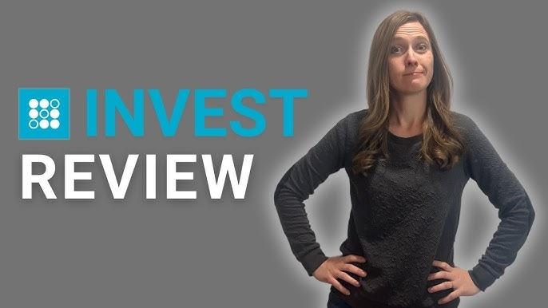

## Table of Contents

## What is SoFi Automated Investing?

SoFi Automated Investing is a service that helps people invest their money without having to make all the decisions themselves. It's like having a smart friend who knows a lot about investing and does the work for you. You tell SoFi how much risk you're okay with, and they put your money into a mix of investments that match your comfort level. This mix is called a portfolio, and SoFi keeps an eye on it, making changes when needed to keep it performing well.

This service is great for people who want to invest but don't have the time or knowledge to do it themselves. SoFi takes care of everything, from choosing the right investments to adjusting them over time. Plus, they charge a low fee for this service, which means you get to keep more of your money. It's a simple and easy way to start investing and grow your savings over time.

## How does SoFi Automated Investing work for beginners?

SoFi Automated Investing is really easy for beginners to use. You start by answering a few questions about your goals and how much risk you're okay with. Based on your answers, SoFi creates a special plan for you called a portfolio. This portfolio is a mix of different investments that match what you're comfortable with. You don't need to know a lot about investing because SoFi does all the hard work for you.

Once your portfolio is set up, SoFi keeps an eye on it all the time. If they think something needs to change to keep your investments doing well, they'll make those changes without you having to do anything. It's like having a helper who makes sure your money is working hard for you. Plus, SoFi charges a small fee for this service, so it's affordable for beginners who are just starting to invest.

## What are the fees associated with SoFi Automated Investing?

SoFi Automated Investing has a very low fee. They charge 0.25% of the money you have invested each year. This means if you have $10,000 invested, you'll pay $25 a year for SoFi to manage your investments.

This fee is taken out of your account automatically, so you don't have to worry about paying it separately. It's a lot less than what many other investment services charge, which makes it a good choice for people who want to start investing without spending a lot on fees.

## What investment options does SoFi Automated Investing offer?

SoFi Automated Investing offers a mix of different investments to help you grow your money. They use something called ETFs, which stands for Exchange-Traded Funds. These are like baskets of different stocks and bonds that you can buy and sell easily. SoFi picks ETFs that focus on things like stocks, bonds, and real estate, and they mix them together in a way that fits your risk level and goals.

The mix of investments, or your portfolio, is designed to match how much risk you're okay with. If you're okay with more risk, SoFi might put more of your money into stocks. If you want less risk, they might put more into bonds. SoFi keeps an eye on your portfolio and makes changes if they think it will help your investments do better. This way, you don't have to worry about [picking](/wiki/asset-class-picking) the right investments yourself.

## How does SoFi Automated Investing compare to other robo-advisors?

SoFi Automated Investing is a lot like other robo-advisors because it helps you invest your money without you having to do all the work. Like other robo-advisors, SoFi asks you about your goals and how much risk you're okay with, then they pick a mix of investments that fit what you want. The big difference with SoFi is that they only charge a 0.25% fee each year, which is lower than many other robo-advisors. This means you get to keep more of your money.

Another way SoFi stands out is that it's really easy to use, even if you're new to investing. They take care of everything, from picking the right investments to keeping an eye on them and making changes when needed. Some other robo-advisors might offer more choices or different kinds of investments, but SoFi keeps things simple and focuses on helping you grow your money without a lot of fuss.

## What are the minimum investment requirements for SoFi Automated Investing?

SoFi Automated Investing makes it easy for people to start investing without needing a lot of money. You can begin with just $1. This low minimum means you don't have to save up a big amount before you can start growing your money.

Once you put in your first dollar, SoFi will use it to build your investment portfolio. They'll pick the right mix of investments for you based on what you tell them about your goals and how much risk you're okay with. This way, even if you start small, your money can start working for you right away.

## How does SoFi Automated Investing handle tax strategies?

SoFi Automated Investing helps you with your taxes by using a strategy called tax-loss harvesting. This means they look for chances to sell investments that have gone down in value, which can help lower the taxes you have to pay on your investments. It's a smart way to make the most of your money, even when some investments aren't doing well.

They do all this work for you without you having to do anything extra. SoFi keeps an eye on your investments all the time and makes these moves when it makes sense. This way, you can focus on other things while SoFi helps you save on taxes.

## What kind of customer support does SoFi Automated Investing provide?

SoFi Automated Investing offers great customer support to help you with any questions or problems you might have. You can reach them through phone, email, or even chat online. They're there to help you understand how your investments are doing and answer any questions you might have about your account.

They also have a lot of helpful resources on their website, like articles and guides, to help you learn more about investing. So if you're new to all this, you can read up and feel more confident about your money. SoFi wants to make sure you feel supported every step of the way.

## Can you customize your investment portfolio with SoFi Automated Investing?

With SoFi Automated Investing, you can't really customize your investment portfolio the way you might with some other services. When you start, you answer some questions about your goals and how much risk you're okay with. Based on your answers, SoFi picks a mix of investments that they think is best for you. This mix is called your portfolio, and it's designed to match your comfort level with risk.

While you can't change the specific investments in your portfolio, you can adjust your risk level if your goals or feelings about risk change. For example, if you start feeling more comfortable with risk, you can tell SoFi, and they'll adjust your portfolio to include more stocks. But the actual picking and changing of investments is done by SoFi, not by you. This makes things simple and easy, but it means you have less control over the exact investments in your portfolio.

## How does SoFi Automated Investing perform in terms of returns?

SoFi Automated Investing aims to help you grow your money over time, but the exact returns you get can change a lot. This depends on things like how the stock market is doing, what kind of investments are in your portfolio, and how much risk you're okay with. If you're okay with more risk, your portfolio might have more stocks, which can go up and down a lot but might give you bigger returns over time. If you want less risk, your portfolio might have more bonds, which usually don't change as much but might give you smaller returns.

SoFi doesn't promise any specific returns because nobody can really do that with investing. But they do their best to pick a good mix of investments for you based on what you tell them about your goals and risk level. Over time, many people have found that using a robo-advisor like SoFi can help them get better returns than if they just kept their money in a regular savings account. Just remember, investing always comes with some risk, so your returns can go up or down.

## What are the security features of SoFi Automated Investing?

SoFi Automated Investing takes keeping your money safe very seriously. They use strong security measures to protect your account. This includes things like encryption, which is like a secret code that keeps your information safe when it's sent over the internet. They also use two-[factor](/wiki/factor-investing) authentication, which means you need more than just a password to get into your account. This makes it a lot harder for someone else to get in, even if they know your password.

Another important part of SoFi's security is that they keep an eye on your account all the time. If they see anything that looks strange or like someone might be trying to get into your account without permission, they'll let you know right away. They also have insurance to protect your money if something goes wrong. SoFi works hard to make sure your investments are safe and secure.

## What advanced features does SoFi Automated Investing offer for expert investors?

SoFi Automated Investing is really easy to use, even if you're new to investing. But for expert investors, there are some cool features that can help you get more out of your investments. One big thing is tax-loss harvesting. This is a smart way to save on taxes by selling investments that have gone down in value. SoFi does this for you without you having to do anything extra, which can be a big help for people who know a lot about investing and want to make the most of their money.

Another feature that might interest expert investors is the ability to adjust your risk level. If you're an expert and your feelings about risk change, you can tell SoFi, and they'll change your portfolio to match. This way, you can keep your investments in line with your goals and how much risk you're okay with, without having to pick the specific investments yourself. SoFi keeps things simple but still gives you the tools you need to fine-tune your investing strategy.

## What are Investment Strategies and Algo Trading with SoFi?

SoFi Automated Investing applies algorithmic strategies to streamline asset allocation, guided by clients' risk tolerance levels. The platform employs a range of portfolios categorized from Conservative to Aggressive, each designed to align with varying investment goals and risk appetites. Algorithms tailor these portfolios through an initial risk assessment questionnaire that evaluates the investor's financial situation, objectives, and risk tolerance.

SoFi's approach harnesses principles of Modern Portfolio Theory (MPT), which aims to maximize expected returns based on a given level of market risk, or to equivalently minimize risk for a given level of expected return. MPT involves diversification across uncorrelated assets, which can mathematically be expressed through the optimization of the portfolio's expected return $E(R_p)$ against its variance $\sigma^2_p$. The goal is to find the portfolio's efficiency frontier, a set of optimal portfolios offering the highest expected return for a defined level of risk. The equation is:

$$
E(R_p) = \sum_{i=1}^{n} w_iE(R_i)
$$

Where:
$E(R_p)$ = Expected return of the portfolio  
$w_i$ = Weight of each asset in the portfolio  
$E(R_i)$ = Expected return of each asset

While powerfully grounded in established financial theory, SoFi's model has limitations, particularly regarding customization. Unlike competitors that offer environmental, social, and governance ([ESG](/wiki/esg-investing)) investing options, SoFi does not currently provide portfolios specifically tailored to ESG criteria. Additionally, the platform lacks tax-loss harvesting, a strategy used by some robo-advisors to help investors minimize tax liabilities on capital gains. This omission can be crucial for optimizing after-tax returns, especially for investors in higher tax brackets. 

Consequently, SoFi Automated Investing's strategies encompass a fundamental and accessible investment approach, but its comparative rigidity may not meet the complex or specific investment needs of all users.

## References & Further Reading

[1]: ["Social Finance, Inc. (SoFi)"](https://en.wikipedia.org/wiki/SoFi) - Official website for more details on SoFi's financial products and services.

[2]: Barber, B. M., & Odean, T. (2001). ["The Internet and the Investor"](https://www.aeaweb.org/articles?id=10.1257/jep.15.1.41). Journal of Economic Perspectives, 15(1), 41-54. 

[3]: ["Modern Portfolio Theory: Foundations, Analysis, and New Developments"](http://www.jcfrancis.com/Modern%20Portfolio%20Theory.pdf) by Jack Clark Francis, & Dongcheol Kim

[4]: ["Investing and Portfolio Management"](https://www.investopedia.com/terms/p/portfoliomanagement.asp) - Online course on portfolio management strategies offered by the University of Geneva on edX.

[5]: Financial Industry Regulatory Authority (FINRA). ["Robo-Advisers"](https://www.finra.org/sites/default/files/digital-investment-advice-report.pdf) - Overview and considerations regarding the use of robo-advisors for automated investing.