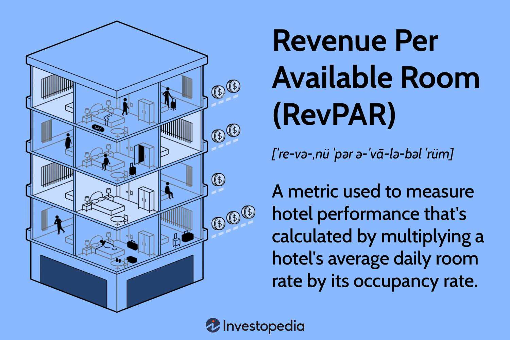

In the competitive landscape of the hospitality industry, hotels continually strive to enhance their performance and maximize profitability. This pursuit has led to the adoption of sophisticated metrics and strategies. One such metric, Revenue per Available Room (RevPAR), serves as a key performance indicator by assessing a hotel's effectiveness in filling available rooms at an average rate. RevPAR is calculated by multiplying a hotel's average daily room rate (ADR) by its occupancy rate or by dividing total room revenue by the number of available rooms. This metric provides valuable insights into revenue performance, yet to obtain a comprehensive view, it must be used alongside additional indicators of profitability and costs.

The integration of concepts from algorithmic trading into hotel revenue management offers exciting new pathways for optimizing operations. Algorithmic trading, widely used in financial markets, relies on complex algorithms to make decisions and execute trades at optimal times. In the context of hotel management, these strategies utilize data analytics and predictive modeling to forecast demand and refine pricing strategies. This approach allows hotels to dynamically adjust room rates in response to real-time demand and market conditions, akin to the dynamic pricing models employed in trading.



By exploring the intersection of traditional hospitality metrics like RevPAR with algorithmic trading strategies, this article examines how data-driven approaches can drive operational efficiencies in hotel management. The analysis includes considerations for implementing these advanced methodologies, addressing potential challenges, and highlighting successful examples from the industry. Through this exploration, it becomes evident that adopting data-driven techniques not only enhances pricing and occupancy but also contributes to improved guest satisfaction and overall competitiveness in the hospitality sector.

## Table of Contents

## Understanding RevPAR

Revenue per Available Room (RevPAR) is a key performance metric in the hospitality industry that provides insights into a hotel's ability to generate revenue from its available rooms. It serves as a measure of a hotel's efficiency in filling rooms at an average rate. 

The calculation of RevPAR can be achieved through two methods:

1. **Multiplying ADR by Occupancy Rate**:
$$
   \text{RevPAR} = \text{ADR} \times \text{Occupancy Rate}

$$
   Where ADR (Average Daily Rate) represents the average rental income per occupied room in a given time period, and occupancy rate is the percentage of occupied rooms.

2. **Total Room Revenue Divided by Number of Available Rooms**:
$$
   \text{RevPAR} = \frac{\text{Total Room Revenue}}{\text{Number of Available Rooms}}

$$

Both methods yield the same result, giving hotel operators a snapshot of the revenue being generated irrespective of the number of guests.

While RevPAR is widely utilized as a performance indicator due to its straightforward calculation and interpretation, it has its limitations. The RevPAR metric doesn't account for the costs associated with generating room revenue such as operational or indirect costs. Therefore, it should be used alongside other financial indicators like Gross Operating Profit per Available Room (GOPPAR) and Total Revenue per Available Room (TRevPAR) for a more comprehensive analysis of financial performance.

In summary, RevPAR offers valuable insights into how well a hotel fills its rooms and maximizes revenue. However, to fully understand the financial health and operational efficiency, hotel managers should consider additional metrics that provide a broader view of profitability and cost management.

## Enhancing RevPAR with Advanced Metrics

Revenue per Available Room (RevPAR) serves as an essential metric in assessing hotel performance, offering a snapshot of revenue generation capabilities. Despite its utility, RevPAR provides limited insight into overall profitability since it overlooks costs incurred in running hotel operations. To acquire a comprehensive understanding of financial performance, hotels can adopt advanced metrics such as Net RevPAR, GOPPAR, and TRevPAR.

Net RevPAR refines the RevPAR calculation by considering the expenses directly associated with room sales. This metric provides a clearer picture of the actual revenue generated from room sales after accounting for distribution costs, commissions, and transaction fees. Calculating Net RevPAR involves deducting these expenses from room revenue and then dividing by the total available rooms:

$$
\text{Net RevPAR} = \frac{\text{Total Room Revenue} - \text{Room-Related Expenses}}{\text{Available Rooms}}
$$

GOPPAR (Gross Operating Profit per Available Room) goes a step further by incorporating all operating expenses, giving a more thorough insight into a hotel’s profitability. Unlike RevPAR, GOPPAR considers both revenue streams and operational costs, offering a balanced view of financial performance. The calculation of GOPPAR is as follows:

$$
\text{GOPPAR} = \frac{\text{Total Revenue} - \text{Operating Expenses}}{\text{Available Rooms}}
$$

In contrast, TRevPAR (Total Revenue per Available Room) expands the focus from room revenues to include all sources of income a hotel might generate, such as food and beverage, spa services, and more. TRevPAR allows hoteliers to evaluate the overall revenue potential beyond room sales, thus enabling a holistic approach to revenue management:

$$
\text{TRevPAR} = \frac{\text{Total Revenue from All Operations}}{\text{Available Rooms}}
$$

These advanced metrics provide a multidimensional view of a hotel's financial health, allowing for improved decision-making. By understanding both revenue generation and cost implications, hotels can implement strategies to maximize profitability. Effective use of these metrics can guide resource allocation, marketing strategies, and pricing models, ensuring that efforts are aligned with financial goals. Moreover, they assist in identifying operational inefficiencies, thereby enabling cost reduction and profitability enhancement. As the hospitality industry continuously evolves, leveraging these metrics is vital for hotels aiming to maintain a competitive edge.

## Integrating Algo Trading Strategies into Hotel Revenue Management

Algorithmic trading, a technique widely used in financial markets, leverages complex algorithms and data analytics to make informed decisions and execute trades at optimal times. The core concept involves processing vast amounts of data to forecast market movements and dynamically adjust trading positions. Similarly, integrating these principles into hotel revenue management can significantly enhance pricing strategies and revenue outcomes.

Incorporating algorithmic strategies in hotels primarily centers around data analytics and predictive modeling. Hotels can utilize historical data, market trends, and current booking patterns to forecast demand with greater accuracy. This predictive capability allows for more precise room rate adjustments, akin to the dynamic pricing models employed in financial trading.

One approach is the use of regression analysis to forecast demand. Using Python, a simple linear regression model can be implemented to predict future room bookings based on past data. Here is an illustrative example:

```python
import pandas as pd
from sklearn.linear_model import LinearRegression
from sklearn.model_selection import train_test_split

# Sample data: Past room bookings and other relevant features
data = {'Bookings': [100, 150, 200, 250, 300],
        'Month': [1, 2, 3, 4, 5],
        'Price': [100, 110, 120, 115, 125]}

df = pd.DataFrame(data)

# Features and target variable
X = df[['Month', 'Price']]
y = df['Bookings']

# Split data into training and testing sets
X_train, X_test, y_train, y_test = train_test_split(X, y, test_size=0.2, random_state=42)

# Create and train the model
model = LinearRegression()
model.fit(X_train, y_train)

# Forecast future bookings
predictions = model.predict(X_test)
```

This basic regression model enables hotels to anticipate periods of high and low demand, providing a foundation for pricing strategies that optimize occupancy and revenue.

Furthermore, the use of algorithms allows hotels to engage in real-time dynamic pricing. By continuously analyzing market conditions, such as local events or competitor pricing, algorithms can adjust room rates in real-time to match demand fluctuations. This approach, closely mirroring high-frequency trading in financial markets, maximizes room occupancy while ensuring pricing remains competitive.

Dynamic pricing implementations can be further enhanced by deploying [machine learning](/wiki/machine-learning) models, such as decision trees or neural networks, which accommodate non-linear relationships and complex interdependencies in data. These models can process a broader range of variables, including customer behavior patterns, improving the precision of demand forecasts and pricing decisions.

In summary, the adoption of [algorithmic trading](/wiki/algorithmic-trading) strategies in hotel revenue management provides a sophisticated framework for data-driven decision-making and dynamic pricing. These strategies deliver competitive advantages by optimizing room rates and improving the overall profitability of hotel operations.

## Implementing Technology for Better Revenue Management

The integration of technology plays a crucial role in enhancing hotel revenue management through efficient algorithmic strategies. Central Reservation Systems (CRS) and data analytics platforms serve as the backbone of this technological advancement. By harnessing these tools, hotels can achieve real-time data collection and analysis, allowing for precise and informed pricing decisions that have a direct impact on improving Revenue per Available Room (RevPAR).

Central Reservation Systems serve as centralized hubs for managing reservations across various distribution channels, including online travel agencies, direct bookings, and corporate accounts. This centralization ensures that hotels can operate with seamless efficiency, minimizing errors in booking and optimizing availability. One of the key benefits of a CRS is its capability to gather real-time data from multiple sources, providing hotels with a comprehensive view of current market dynamics and customer preferences.

Data analytics platforms further augment the functionality of CRSs by offering sophisticated tools for data interpretation and forecasting. Advanced analytics enable hotels to analyze customer behavior, booking patterns, and market trends. This analysis is vital for customizing offerings to guests and enhancing their overall experience. For instance, predictive analytics can identify peak booking periods, allowing hotels to dynamically adjust rates to maximize revenue while maintaining high occupancy rates.

The combination of these technologies empowers hotels to adopt a proactive approach to revenue management. By using machine learning algorithms, hotels can predict demand fluctuations and set competitive pricing strategies that are responsive to real-time changes in the market. A simple algorithm for demand forecasting might involve the use of historical booking data to train a model in Python as follows:

```python
import pandas as pd
from sklearn.model_selection import train_test_split
from sklearn.linear_model import LinearRegression

# Load historical booking data
data = pd.read_csv('booking_data.csv')

# Feature selection and preprocessing
features = data[['season', 'room_type', 'lead_time', 'previous_bookings']]
target = data['bookings']

# Splitting the data
X_train, X_test, y_train, y_test = train_test_split(features, target, test_size=0.2, random_state=42)

# Train a linear regression model
model = LinearRegression()
model.fit(X_train, y_train)

# Predict future demand
predicted_demand = model.predict(X_test)
```

By implementing such technological solutions, hotels not only optimize pricing strategies but also customize guest experiences. Utilizing customer data and insights drawn from market trends enables hotels to tailor their services and promotional offers, ultimately enhancing customer satisfaction and loyalty. This personalized approach is pivotal in driving higher occupancy and improving average rates, thereby maximizing profitability in a competitive market landscape.

In summary, the strategic implementation of technology in hotel revenue management is indispensable for leveraging data-driven insights and optimizing operational efficiency. Through tools like CRSs and data analytics platforms, hotels can navigate the intricacies of market variability, ensuring a robust revenue management approach that aligns with modern hospitality standards.

## Case Studies and Examples

Several hotels have successfully leveraged data-driven revenue management strategies to enhance their Revenue per Available Room (RevPAR) and overall profitability. These implementations have often involved dynamic pricing models and predictive analytics, both of which borrow principles from algorithmic trading.

One illustrative example is the application seen at a major hotel chain that adopted a dynamic pricing strategy. By utilizing real-time data analytics, this chain was able to adjust room rates based on factors such as current occupancy levels, competitor pricing, and local events. This approach closely mirrors algorithmic trading in financial markets, where prices are adjusted based on market conditions and predictions. As a result, the hotel chain noted a significant increase in their occupancy rates, especially during peak periods, leading to a marked improvement in RevPAR.

Predictive analytics has played a crucial role as well. For instance, another hotel group integrated machine learning algorithms to forecast future demand more accurately. These algorithms analyze historical booking data, seasonal trends, and wider economic indicators to predict booking patterns. By doing so, the hotel can anticipate high-demand periods and adjust their pricing strategy accordingly. This predictive capability helps maximize room revenue while minimizing periods of low occupancy.

A notable example of such an approach can be explained through a simplified model using Python. Suppose a hotel wishes to forecast demand using past data. By employing a time series model like ARIMA (AutoRegressive Integrated Moving Average), the hotel can predict future booking trends:

```python
import pandas as pd
from statsmodels.tsa.arima_model import ARIMA

# Sample historical bookings data
data = pd.read_csv('hotel_bookings_data.csv')
bookings = data['bookings']

# Fit an ARIMA model
model = ARIMA(bookings, order=(1, 1, 1))
model_fit = model.fit(disp=0)

# Forecast future bookings
forecast = model_fit.forecast(steps=30)[0]

print(forecast)
```

This example highlights how hotels can adopt algorithmic trading concepts such as predictive analytics to refine their revenue management tactics. Through these enhanced strategies, hotels have not only seen increased occupancy and improved RevPAR but have also been able to attract a more diverse customer base, even during off-peak periods.

In conclusion, case studies from various hotel chains present compelling evidence of the benefits of data-driven revenue management strategies. By adopting dynamic pricing models and predictive analytics, these hotels have optimized their operations, setting a new benchmark for revenue management practices across the industry. The integration of algorithmic trading concepts holds vast potential for further evolution and innovation within hospitality revenue management.

## Challenges and Considerations

Integrating algorithmic trading strategies into hotel revenue management provides numerous advantages, but it also presents several challenges that require careful consideration. One of the primary concerns is data privacy. As hotels collect and process large amounts of sensitive customer information to tailor experiences and adjust pricing dynamically, they must adhere to stringent data protection regulations. This includes compliance with laws such as the General Data Protection Regulation (GDPR) in Europe and the California Consumer Privacy Act (CCPA) in the United States. Compliance not only ensures legal adherence but also builds trust with customers who are increasingly aware of how their data is used.

Another significant challenge is the demand for skilled personnel to develop, implement, and manage these sophisticated systems. The integration of algorithmic strategies requires knowledge of data analysis, machine learning, and IT security. As such, hotels need to invest in hiring and training staff who are proficient in these areas. This can be costly, but it is essential for successfully leveraging data-driven technologies.

The implementation of algorithmic trading concepts also necessitates continuous software updates and algorithm tuning. The dynamic nature of market conditions requires that algorithms be regularly updated to maintain their relevance and effectiveness. This could involve recalibrating models to account for shifts in customer behavior, economic conditions, or competitive actions. As a result, ongoing investment in technology maintenance and development is necessary. 

Moreover, the hotel industry must be prepared for the potential risk of over-reliance on automated systems. While algorithmic strategies enhance decision-making capabilities, they can also lead to unintended consequences if not properly monitored. For example, errors in pricing algorithms could result in significantly overpriced or underpriced room rates, impacting revenue and customer satisfaction. Therefore, establishing checks and balances within these systems is crucial to mitigate risks associated with automation.

In summary, while the adoption of algorithmic trading strategies in the hospitality industry holds promise for enhancing revenue management, it requires careful attention to data privacy, skilled human resources, constant technological upkeep, and risk management. Addressing these challenges effectively will be key to ensuring the successful integration of these advanced strategies in hotel operations.

## Conclusion

The fusion of Revenue per Available Room (RevPAR) metrics with algorithmic trading strategies signifies a transformative step in hotel revenue management. By integrating technology and advanced analytics, hotels can fine-tune room pricing strategies to respond effectively to fluctuating market demands. This approach enables dynamic adjustments in room rates, akin to the adaptive pricing models utilized in financial markets, thereby optimizing revenue potential from available inventory.

Algorithmic techniques offer the advantage of real-time data analysis and predictive modeling, enhancing the precision of demand forecasting. This capability not only improves occupancy rates but also maximizes average room rates, contributing to increased profitability. For instance, by employing predictive analytics, hotels can identify peak demand periods and adjust pricing accordingly, ensuring competitive advantage without sacrificing guest satisfaction.

As the hospitality industry progresses, the adoption of data-driven techniques will become increasingly vital. The ongoing evolution of consumer preferences and competitive pressures necessitates an agile approach to revenue management. Embracing such methodologies not only positions hotels to efficiently maximize profits but also enhances the overall guest experience, fostering loyalty and repeat business.

In conclusion, the strategic application of RevPAR metrics alongside algorithmic trading practices empowers hotels to navigate the complexities of modern revenue management. This combined approach not only supports financial objectives but also caters to the nuanced needs of contemporary travelers, ensuring that hotels remain competitive in an ever-evolving marketplace.

## References & Further Reading

[1]: Cross, R.G., Higbie, J.A., & Cross, D.Q. (2009). ["Revenue Management's Renaissance: A review of revenue management theory and how it has been applied in the hospitality industry."](https://journals.sagepub.com/doi/full/10.1177/1938965508328716) Cornell Hospitality Quarterly.

[2]: Bertsimas, D., & Kallus, N. (2020). ["From Predictive to Prescriptive Analytics: Hotel Revenue Management with Online Price Optimization."](https://journals.sagepub.com/doi/abs/10.1177/10591478241242122?journalCode=paoa) Manufacturing & Service Operations Management.

[3]: ["Revenue Management and Pricing: Case Studies and Applications"](https://www.veritecsolutions.com/wp-content/uploads/2019/12/RM-and-Pricing-Case-Studies-and-App.pdf) by Ian Yeoman & Una McMahon-Beattie.

[4]: Phillips, R. (2005). ["Pricing and Revenue Optimization."](https://archive.org/details/pricingrevenueop0000phil) Stanford University Press.

[5]: Talluri, K.T., & van Ryzin, G.J. (2004). ["The Theory and Practice of Revenue Management."](https://link.springer.com/book/10.1007/b139000) Springer.

[6]: ["Dynamic Pricing in a Digital World: Trends and Implications for Revenue Management"](https://online.hbs.edu/blog/post/what-is-dynamic-pricing) by Dr. Kalyan T. Talluri.

[7]: ["Hotel Management through Algorithms: Finding new strategies for pricing and forecasting in hospitality."](https://journals.sagepub.com/doi/full/10.1177/14727978241298467) SAGE Open.