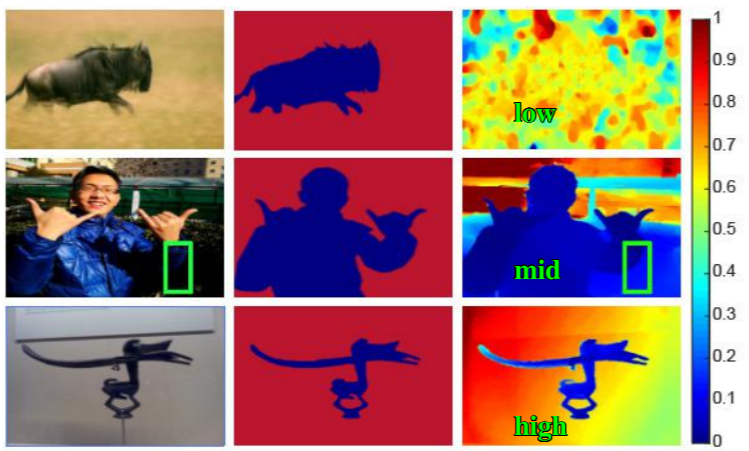

## Table of Contents

## What is saliency detection and why is it important in computer vision?

Saliency detection is a way for computers to figure out which parts of an image or video are the most important or interesting. It's like how our eyes are drawn to certain things first when we look at a scene. The computer uses special methods to find these important parts, often called "salient" regions. These regions might be bright, colorful, or different from the rest of the image.

This is important in computer vision because it helps computers understand images and videos better, just like how we do. By knowing which parts are salient, computers can focus on those areas for tasks like object recognition, tracking objects as they move, or even helping self-driving cars know where to look. It makes computer vision systems more efficient and closer to how humans see the world.

## How does RGB-D data differ from traditional RGB data in saliency detection?

RGB-D data adds an extra layer of information to the traditional RGB data, which is just the red, green, and blue color channels. The 'D' in RGB-D stands for depth, which means it includes information about how far away things are from the camera. This depth information can be really helpful in saliency detection because it gives the computer a better understanding of the scene's layout. For example, if there's an object that's closer to the camera, it might be more important or interesting, so the computer can use the depth data to highlight it as a salient region.

In traditional RGB data, saliency detection relies only on color and brightness differences. This can work well, but sometimes it's hard to tell which parts of the image are more important just from color alone. With RGB-D data, the computer can use both the color information and the depth information to make better decisions about what's salient. This can lead to more accurate and useful saliency maps, which are like heat maps showing the most interesting parts of an image. So, using RGB-D data can make computer vision systems smarter and more like how humans see the world.

## What are the basic components of an RGB-D saliency detection model?

An RGB-D saliency detection model usually has two main parts: one for processing the color information (RGB) and another for handling the depth information (D). The RGB part looks at the colors and brightness in the image to figure out which parts stand out. It might use techniques like finding edges or differences in color to spot interesting areas. The depth part, on the other hand, uses the distance information to understand the 3D layout of the scene. It can help highlight objects that are closer to the camera or have a different shape compared to the background.

These two parts work together to create a saliency map, which shows which parts of the image are most important. The model might combine the RGB and depth information in different ways. Some models might fuse the information early on, right after processing the RGB and depth data separately. Others might wait until later, after each part has made its own guesses about saliency, and then combine those guesses. This combined information helps the model make a more accurate saliency map, which can be really useful for tasks like object recognition or helping robots navigate.

## Can you explain the architecture of the UCNet model for RGB-D saliency detection?

The UCNet model for RGB-D saliency detection is designed to use both color (RGB) and depth (D) information to find the most important parts of an image. It starts by processing the RGB and depth data separately using something called a [convolutional [neural network](/wiki/neural-network)](/wiki/convolutional-neural-network) (CNN). This is like a computer's way of looking at the image and understanding what's in it. The CNN helps the model see the colors and shapes in the RGB part and the distances in the depth part. After processing these separately, the model combines the information in a smart way. It uses a method called "cross-modal interaction" to make sure the RGB and depth data work together well. This means the model can use the colors to help understand the depth, and the depth to help understand the colors.

Once the RGB and depth data are combined, the UCNet model uses a special part called the "U-shaped network" to make the final saliency map. This U-shaped network is like a journey where the model first breaks down the image into smaller pieces and then puts it back together, but with a better understanding of what's important. At the end, the model gives us a saliency map that shows which parts of the image are most interesting or important. This map can be used for things like helping robots see better or making computers understand pictures more like humans do.

## What are the key features that UCNet uses to improve saliency detection performance?

UCNet improves saliency detection by using both color and depth information in a smart way. It starts by looking at the colors and shapes in the RGB part of the image and the distances in the depth part separately. Then, it combines these two types of information using a technique called cross-modal interaction. This means the model can use the colors to help understand the depth, and the depth to help understand the colors. By doing this, UCNet can find the most important parts of the image more accurately than if it only used one type of information.

After combining the RGB and depth data, UCNet uses a U-shaped network to make the final saliency map. This U-shaped network works by breaking down the image into smaller pieces and then putting it back together, but with a better understanding of what's important. This process helps the model focus on the key parts of the image, making the saliency map more detailed and accurate. By using both types of information and this special network, UCNet can create better saliency maps that are really useful for tasks like helping robots see better or making computers understand pictures more like humans do.

## How does UCNet handle the integration of depth information with RGB data?

UCNet uses a smart way to combine the color (RGB) and depth (D) information to find the most important parts of an image. It starts by looking at the colors and shapes in the RGB part and the distances in the depth part separately. Then, it uses a technique called cross-modal interaction to mix these two types of information together. This means the model can use the colors to help understand the depth, and the depth to help understand the colors. By doing this, UCNet can find the most important parts of the image more accurately than if it only used one type of information.

After combining the RGB and depth data, UCNet uses a special network called a U-shaped network to make the final saliency map. This network works by breaking down the image into smaller pieces and then putting it back together, but with a better understanding of what's important. This process helps the model focus on the key parts of the image, making the saliency map more detailed and accurate. By using both types of information and this special network, UCNet can create better saliency maps that are really useful for tasks like helping robots see better or making computers understand pictures more like humans do.

## What datasets are commonly used to train and evaluate RGB-D saliency detection models like UCNet?

To train and evaluate RGB-D saliency detection models like UCNet, researchers often use datasets that have both color and depth information. One popular dataset is the NJU2K dataset. It has 2,000 images with their depth maps and saliency ground truths. Another commonly used dataset is the NLPR dataset, which has 1,000 images. These datasets help the model learn how to find the most important parts of an image by looking at both the colors and the distances.

Another dataset that is used is the DES dataset, which has 135 images. It's smaller but still useful for testing how well the model works. The STERE dataset is also used sometimes, and it has 1,000 images. These datasets are important because they give the model a lot of different examples to learn from. By training on these datasets, models like UCNet can get better at understanding which parts of an image are most interesting or important.

## What metrics are used to evaluate the performance of RGB-D saliency detection models?

To evaluate how well RGB-D saliency detection models like UCNet work, researchers use several metrics. One important metric is the F-measure, which looks at both how accurate the model is and how complete its predictions are. The F-measure combines precision, which is how many of the model's predictions are correct, and recall, which is how many of the important parts the model finds. A good F-measure means the model is both accurate and good at finding all the important parts. Another common metric is the mean absolute error (MAE), which measures the average difference between the model's saliency map and the true saliency map. A lower MAE means the model's predictions are closer to the truth.

Other metrics used include the Structural Similarity Index (SSIM) and the Area Under the Curve (AUC). SSIM looks at how similar the model's saliency map is to the true saliency map in terms of structure, which is important for understanding the overall layout of the image. AUC measures how well the model can separate the important parts from the less important parts by looking at the whole range of possible thresholds. These metrics help researchers see how well the model works from different angles, making sure it's good at finding the most important parts of an image using both color and depth information.

## How does UCNet compare to other state-of-the-art RGB-D saliency detection models?

UCNet performs really well compared to other state-of-the-art RGB-D saliency detection models. It uses both color and depth information in a smart way, which helps it find the most important parts of an image more accurately. In tests, UCNet often gets higher scores on metrics like the F-measure and mean absolute error (MAE) than other models. This means it's both more accurate and better at finding all the important parts of an image. For example, when tested on the NJU2K dataset, UCNet showed better results than models like D3Net and DMRA, which also use RGB-D data but don't combine the information as effectively.

One reason UCNet does so well is its use of cross-modal interaction, which lets it use the colors to help understand the depth, and the depth to help understand the colors. This makes its saliency maps more detailed and accurate. Other models might not use this technique, or they might combine the RGB and depth data differently, which can lead to less accurate results. Overall, UCNet's smart way of combining color and depth information, along with its U-shaped network, makes it a top performer in RGB-D saliency detection.

## What are the challenges faced when implementing RGB-D saliency detection in real-world applications?

One big challenge with using RGB-D saliency detection in real life is getting good depth data. Depth sensors can be affected by things like lighting or shiny surfaces, which can make the depth information less accurate. If the depth data is not good, the saliency detection model might not work as well as it should. Also, these sensors can be expensive, so it might be hard to use them in places where money is tight. This means that even though models like UCNet can do well in tests, they might not work as well in the real world if the depth data is not up to par.

Another challenge is making the models fast enough to use in real-time situations. For example, if you want to use saliency detection to help a robot see, the model needs to work quickly so the robot can react fast enough. But, processing both the color and depth data can take a lot of time and computer power. This can be a problem for devices that don't have a lot of power, like small robots or phones. So, researchers need to find ways to make these models work faster without losing too much accuracy. This is a tricky balance, but it's really important for using RGB-D saliency detection in real-life situations.

## How can the performance of models like UCNet be further optimized for specific use cases?

To make models like UCNet work better for specific jobs, you can change the model to fit the job better. For example, if you're using UCNet to help a robot see, you might want to make it focus more on objects that are close by. You can do this by changing how the model uses the depth information. Another way to improve the model is by training it with more data that looks like the specific job it will do. If the job is to find people in a crowd, you can use more pictures of crowded places to train the model. This helps the model learn what's important in that kind of situation.

Another way to make UCNet better for a specific use is to make it faster. Some jobs need the model to work in real-time, so you can use special tricks to speed it up. One trick is to use a smaller version of the model that still works well but doesn't need as much computer power. Another trick is to use something called "pruning," which means getting rid of parts of the model that don't help much. By making the model smaller and faster, it can work better in real-life situations where speed is important.

## What future directions or research opportunities exist in the field of RGB-D saliency detection?

One exciting direction for RGB-D saliency detection is to make the models work better in real-life situations. Right now, these models do well in tests, but they can have trouble when used in the real world. This is because the depth sensors can be affected by things like lighting or shiny surfaces, which can make the depth information less accurate. Researchers could work on making the models more robust to these kinds of problems. They could also try to make the models faster, so they can work in real-time for things like helping robots see or making self-driving cars safer. By focusing on these areas, RGB-D saliency detection could become more useful in everyday life.

Another area for future research is to use new kinds of data along with RGB and depth information. For example, some cameras can also measure how things move or how warm they are. Adding this kind of information to the models could make them even better at finding what's important in a scene. Researchers could also look into using [artificial intelligence](/wiki/ai-artificial-intelligence) techniques like [reinforcement learning](/wiki/reinforcement-learning) to help the models learn from their mistakes and get better over time. By exploring these new ways of using data and learning, the field of RGB-D saliency detection could keep improving and finding new uses.

## References & Further Reading

[1]: Cong, R., Lei, J., Fu, H., et al. (2019). ["Review on Depth Saliency: Datasets, Methods and Challenges."](https://arxiv.org/pdf/1803.03391v1) Pattern Recognition, 91, 426-443.

[2]: Zhao, J., Cao, Y., Pang, Y., Zhang, L., & Lu, H. (2020). ["Suppress and Balance: A Simple Gated Network for Salient Object Detection."](https://arxiv.org/abs/2007.08074) Pattern Recognition, 107.

[3]: Peng, H., Zhang, B., Fu, H., & Xiao, J. (2014). ["RGBD Salient Object Detection: A Benchmark and Algorithms."](https://link.springer.com/chapter/10.1007/978-3-319-10578-9_7) In Proceedings of the European Conference on Computer Vision (ECCV).

[4]: Wang, W., Shen, J., Lu, H. (2018). ["RGB-D Salient Object Detection with a Top-Down Recurrent Attention Network."](https://openaccess.thecvf.com/content_cvpr_2018/papers_backup/Wang_Salient_Object_Detection_CVPR_2018_paper.pdf) IEEE Transactions on Image Processing, 27(5), 2367-2375.

[5]: Fan, D.-P., Cheng, M.-M., Liu, Y., Li, T., & Borji, A. (2017). ["Structure-Measure: A New Way to Evaluate Foreground Maps."](https://arxiv.org/abs/1708.00786) In Proceedings of the IEEE International Conference on Computer Vision (ICCV).