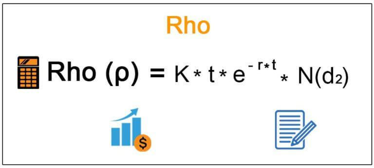

Financial derivatives have fundamentally transformed financial markets by offering sophisticated tools for hedging risks and exploiting market opportunities. These instruments play a crucial role in modern finance by allowing investors to manage exposure to various financial risks—including changes in interest rates, currency exchange rates, and commodity prices. Among the key metrics used to evaluate and manage derivatives is "rho," a sensitivity measure often referred to as one of the Greeks. Rho specifically quantifies the expected change in an option's price concerning variations in interest rates, providing essential insights for traders and risk managers.

The application of rho is imperative as it helps market participants understand and anticipate how fluctuations in interest rates affect the value of derivative contracts. This is particularly important in environments with volatile interest rates, where small shifts can result in substantial changes to an option's valuation. Consequently, rho can be especially significant for long-dated options, where interest rate effects are more pronounced over time.



Algorithmic trading has further enhanced the utility of derivatives by automating complex strategies to account for variables such as rho and other Greeks. By deploying advanced algorithms, traders can efficiently adjust their positions in response to real-time market data, optimizing both risk exposure and return on investment. These algorithms enable market participants to automate the monitoring and adjusting of their portfolios, ensuring timely responses to interest rate changes that could affect derivative pricing and portfolio performance.

This article aims to examine the significance of rho within the sphere of financial derivatives and explore how algorithmic trading leverages this measure to foster robust and effective trading strategies. Understanding rho's impact not only facilitates better financial modeling and risk management but also empowers traders to secure a competitive edge in an ever-evolving market landscape.

## Table of Contents

## What is Rho?

Rho is a measure of an option’s price sensitivity with respect to changes in the risk-free interest rate, a critical component in the pricing of options and other derivatives. It forms part of the Greeks, a set of essential metrics that aid in understanding the various sensitivities involved in options pricing. Specifically, rho indicates the rate at which an option's price will change for a one-percentage-point increase in the risk-free interest rate. This metric is particularly useful for traders and portfolio managers who need to assess the potential impact of interest rate fluctuations on the valuation of their options positions.

In the context of option pricing, the Greeks are utilized to manage and mitigate risks associated with various factors that can affect an option's price. While delta, gamma, theta, and vega might be more widely focused on, rho plays an important role, especially when considering options that have long expiration periods. These long-dated options are more sensitive to interest rate changes due to the impact of compounding interest over time, making rho a crucial metric in these scenarios.

The influence of rho is fundamentally linked to the present value aspect of options pricing, as the present value of future cash flows is directly affected by changes in interest rates. For call options, a positive rho signifies that an increase in interest rates will lead to an increase in the option's value. Conversely, put options typically exhibit a negative rho, meaning their value will decrease as interest rates rise. This differential behavior between call and put options underlines the significance of rho in formulating trading strategies and managing risks in portfolios sensitive to [interest rate](/wiki/interest-rate-trading-strategies) movements.

In summary, while rho might be less prominent compared to other Greeks in day-to-day options trading, its importance is pronounced in certain market conditions, particularly those involving long-term positions. Understanding rho is crucial for developing comprehensive trading strategies that effectively account for interest rate risks.

## The Calculation and Impacts of Rho

Rho is quantified as the first derivative of an option's price with respect to a change in the risk-free interest rate. Mathematically, for a European call option, rho ($\rho$) can be expressed as:

$$
\rho = \frac{\partial C}{\partial r}
$$

where $C$ denotes the call option price and $r$ represents the risk-free interest rate. For European put options, rho is similarly defined but typically presents a negative value, indicating that an increase in interest rates tends to decrease the value of the put option. 

This sensitivity metric is particularly significant for long-term options. As the time to expiration increases, the effect of interest rate changes—compounded over time—becomes more pronounced, magnifying rho's impact. Consequently, understanding the impact of interest rates is crucial for evaluating long-dated options.

In applying option pricing models like Black-Scholes, which presuppose a constant risk-free interest rate over the option's life, rho's calculation becomes integral. The Black-Scholes model incorporates this aspect, allowing traders to assess the effects of interest rate variations systematically. Here is a simplified Python code snippet demonstrating how rho might be calculated using the Black-Scholes model:

```python
from scipy.stats import norm
import numpy as np

def calculate_rho_call(S, K, T, r, sigma):
    # S: Current stock price
    # K: Option strike price
    # T: Time to expiration in years
    # r: Risk-free interest rate
    # sigma: Volatility of the stock
    d1 = (np.log(S / K) + (r + 0.5 * sigma ** 2) * T) / (sigma * np.sqrt(T))
    rho_call = K * T * np.exp(-r * T) * norm.cdf(d1)
    return rho_call

# Example usage
S = 100  # Stock price
K = 100  # Strike price
T = 1    # Time to expiration
r = 0.05 # Risk-free rate
sigma = 0.2 # Volatility
rho_call = calculate_rho_call(S, K, T, r, sigma)
print(f"Call option Rho: {rho_call:.2f}")
```

In this code, `calculate_rho_call` computes the rho for a call option, demonstrating how interest rates can affect option pricing. This value guides traders in understanding potential changes to an option’s price due to shifts in interest rates, thereby informing better hedging and investment decisions.

## Algorithmic Trading and Rho

Algorithmic trading represents a significant advancement in the financial markets, where computer algorithms execute trading strategies based on predefined criteria and real-time data inputs. These algorithms are designed to process high volumes of data from multiple sources, adjusting trading positions dynamically to optimize risk management and returns. A critical [factor](/wiki/factor-investing) in these strategies is the incorporation of the Greeks, such as rho, which measures an option's sensitivity to interest rate changes.

Integrating rho into trading algorithms enables traders to hedge against fluctuations in interest rates more effectively. For instance, when interest rates are expected to rise, an algorithm that considers rho can increase the weighting of call options with a positive rho, thus benefiting from any increase in option value. Conversely, in a falling interest rate environment, algorithms might adjust the positions to gain from put options, which typically have a negative rho.

Algorithms capitalize on this by using real-time data feeds and computational power to execute trades faster than human traders. They continuously assess interest rate data along with other market variables, recalibrating portfolios to maintain stability and reduce exposure to adverse movements. For example, consider a scenario where an unexpected central bank announcement leads to an interest rate hike. A sophisticated algorithm would quickly analyze the change, compute the impact on rho, and reallocate the option positions to neutralize potential losses.

In Python, integrating rho into an algorithmic strategy could involve updating a portfolio based on rho's value relative to expected interest rate changes. A simplified approach might look like this:

```python
import numpy as np

def adjust_positions(options_portfolio, interest_rate_change):
    for option in options_portfolio:
        rho = option['rho']  # assumed to be pre-calculated or accessed from a database
        if interest_rate_change > 0 and rho > 0:
            # Increase allocation for positive rho due to rising interest rates
            option['allocation'] *= 1.1
        elif interest_rate_change < 0 and rho < 0:
            # Increase allocation for negative rho due to falling interest rates
            option['allocation'] *= 1.1
    return options_portfolio

# Sample options portfolio
options_portfolio = [{'name': 'CallOption1', 'rho': 0.5, 'allocation': 100},
                     {'name': 'PutOption1', 'rho': -0.5, 'allocation': 100}]

# Adjust positions based on a hypothetical interest rate increase
new_portfolio = adjust_positions(options_portfolio, interest_rate_change=0.01)
```

In this code snippet, the `adjust_positions` function manipulates the allocations in an options portfolio based on each option's rho value and an assumed interest rate change. This automation is crucial for achieving quick responses to market news, minimizing delays that could result in financial losses.

The integration of rho into [algorithmic trading](/wiki/algorithmic-trading) extends beyond hedging; it fundamentally alters how strategies are devised, implemented, and adjusted. By leveraging rho's insights, traders enhance their ability to maintain portfolio balance and ensure returns amidst an ever-shifting interest rate landscape.

## Practical Applications of Rho in Trading

Rho's application in trading extends into tangible practices that directly influence decision-making in financial markets. Portfolio managers, for instance, utilize rho to strategize around anticipated shifts in monetary policy that could impact interest rates. By understanding the sensitivity of their options portfolios to interest rate changes, they can better hedge potential adverse effects. This is particularly crucial in environments where central banks signal possible rate adjustments.

In fixed-income derivatives, where prices are directly tied to interest rates, rho becomes a vital metric. The valuation of bonds and bond options, for example, is significantly impacted by changes in interest rates. Rho helps assess how these rate variations can alter the price and yield of bond-derived instruments, informing strategies to mitigate interest rate risk.

Trading strategies often capitalize on rho by anticipating interest rate movements when selecting between call and put options. For instance, if an increase in interest rates is expected, traders may favor call options, which typically exhibit a positive rho, indicating a potential increase in value. Conversely, put options tend to have a negative rho, suggesting a decrease in value with rising rates.

By integrating rho into their analytical frameworks, traders are better equipped to make informed decisions that optimize their responses to interest rate changes, enhancing both risk management and return on investment.

## Challenges and Limitations

Rho, as a sensitivity measure in options pricing, presents a unique set of challenges and limitations largely attributed to the assumptions underlying its calculation models. A fundamental issue arises from the reliance on models such as the Black-Scholes-Merton, which presuppose constant interest rates and volatilities. In reality, market conditions are dynamic, with interest rates frequently changing in response to economic and geopolitical factors. This divergence between model assumptions and market behavior can lead to inaccuracies when using rho for predicting price changes in options.

Moreover, rho's significance varies widely across different types of options. It is particularly pronounced in long-term options because of the compounding effect of interest rates over extended periods. In contrast, for short-term options, changes in interest rates have a minimal impact on these instruments due to the short duration involved. Consequently, traders focusing on short-term strategies may find rho less relevant compared to other Greeks like delta or gamma.

Additionally, the nature of interest rate environments can drastically alter the interpretation of rho. In scenarios of low or negative interest rates, the conventional understanding of rho might not apply straightforwardly. For example, in a negative interest rate environment, traditional expectations of a positive relationship between rho and a call option's value could be reversed. This necessitates a nuanced approach to rho, whereby traders must adjust their models and strategies to account for atypical rate settings.

These challenges underscore the importance of integrating more sophisticated models that can adapt to changing interest rates and volatilities. Traders and algorithmic systems must be equipped to reassess rho's influences continually, ensuring that strategies remain robust amid evolving market landscapes.

## Conclusion

Rho is an essential metric in options trading, quantifying the sensitivity of an option's price to fluctuations in interest rates. Its integration within trading algorithms underscores its significance; algorithmic trading platforms harness rho within advanced computational strategies to automate and refine trading approaches. This utilization allows for dynamic management of trades, incorporating real-time market data to mitigate risks associated with interest rate movements.

Despite certain challenges, such as the assumptions of constant interest rates and market [volatility](/wiki/volatility-trading-strategies), insightful application of rho supports risk management and enhances trading outcomes. By understanding the nuances of rho and incorporating it into trading strategies, traders can more effectively anticipate and react to market shifts, thereby optimizing portfolios for both risk and return.

As financial markets continue to grow in complexity, mastering rho, alongside other sensitivity metrics known as Greeks, remains critical. These metrics collectively offer traders a comprehensive toolkit for assessing and responding to various market influences, thereby securing a competitive advantage in an ever-evolving market landscape. The importance of such insights will only amplify as market conditions become increasingly interconnected and algorithmically driven.

## References & Further Reading

[1]: Hull, J. C. (2012). ["Options, Futures, and Other Derivatives"](https://www.semanticscholar.org/paper/Options%2C-Futures%2C-and-Other-Derivatives-Hull/89bdee500c8623864fc9eb7a471546aa713acc44). Pearson Education.

[2]: Black, F., & Scholes, M. (1973). ["The Pricing of Options and Corporate Liabilities."](https://www.scirp.org/reference/referencespapers?referenceid=1887191) Journal of Political Economy, 81(3), 637–654.

[3]: Wilmott, P., Howison, S., & Dewynne, J. (1995). ["The Mathematics of Financial Derivatives: A Student Introduction."](https://www.cambridge.org/core/books/mathematics-of-financial-derivatives/7121345D07C5BCE4FBEC91A8A7E6F267) Cambridge University Press.

[4]: Murphy, C. H. (2002). ["Understanding Risk Management and Compliance, What Is Different After Monday, April 20, 2015."](https://rpc.cfainstitute.org/research/financial-analysts-journal/2009/understanding-risk-the-theory-and-practice-of-final) Research and Markets.

[5]: Fabozzi, F. J., & Grant, J. L. (2004). ["Equity Portfolio Management"](https://archive.org/details/equityportfoliom00fran) John Wiley & Sons.

[6]: Broadie, M., & Detemple, J. (1997). ["The Valuation of American Options."](https://www.columbia.edu/~mnb2/broadie/Assets/multi_asset_math_finance.pdf) The Review of Financial Studies, 10(3), 371-408.

[7]: Lopez de Prado, M. (2018). ["Advances in Financial Machine Learning."](https://www.amazon.com/Advances-Financial-Machine-Learning-Marcos/dp/1119482089) Wiley.