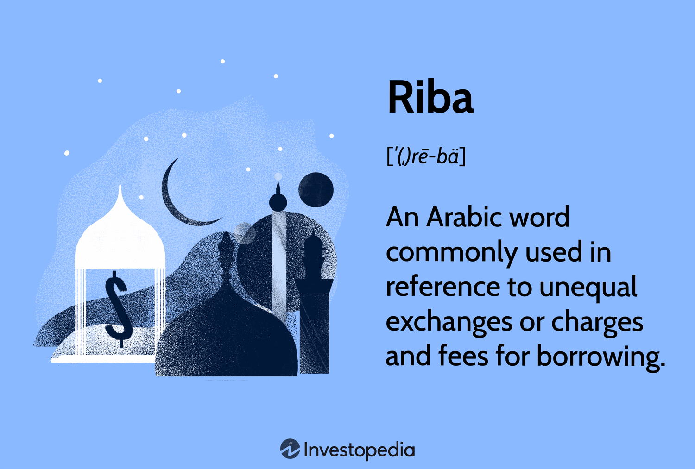

Islamic finance, a rapidly growing segment within the global finance sector, offers a unique approach grounded in religious principles. It emphasizes equity, fairness, and ethical practices. Over the past decade, this form of finance has gained significance due to its resilience to market shocks, as evidenced during financial crises. With assets estimated to reach over $3.8 trillion by 2023, Islamic finance continues to expand its influence across geographies and industries.

A fundamental tenet of Islamic finance is the prohibition of "Riba," or usury, which refers to the practice of charging interest on loans. According to Islamic jurisprudence, Riba is considered exploitative and unjust. This prohibition is based on various Quranic verses and Hadiths that denounce interest-bearing transactions. The ethical and moral rationale behind this lies in promoting fair and equitable financial dealings, where wealth creation should result from genuine economic activities and risk-sharing, not merely from lending capital at a guaranteed profit.



In contrast to traditional financial systems, which rely heavily on interest-based transactions, Islamic finance supports profit-loss sharing mechanisms. This necessitates the development of Shariah-compliant financial instruments that align with Islamic values while offering competitive financial solutions.

Algorithmic trading represents a progressive innovation in finance, involving the use of computer algorithms to automate trading decisions across financial markets. This technological advancement has transformed trading dynamics by allowing rapid execution of trades based on predefined criteria. Algorithms can analyze vast datasets, identify patterns, and execute trades at speeds unobtainable by human traders, thereby improving efficiency and liquidity in financial markets.

The purpose of this article is to explore the intersection of Islamic finance, the prohibition of Riba, and algorithmic trading. This exploration involves examining the potential for algorithmic trading to coexist with the principles of Islamic finance, and how innovative solutions might navigate the apparent conflicts, offering new opportunities for ethically aligned financial practices within modern technological frameworks.

## Table of Contents

## Understanding Riba and Its Prohibition in Islam

Riba, an Arabic term often translated as "interest" or "usury," is a pivotal concept in Islamic finance. In Islamic jurisprudence, Riba is defined as any guaranteed interest or profit on a loan. It is divided into two primary types: Riba al-Nasi'ah and Riba al-Fadl. Riba al-Nasi'ah refers to the increase on the principal amount due to deferred payment, wherein the lender makes a profit solely from the passage of time. Riba al-Fadl, on the other hand, is the excess compensation received in a direct exchange of goods of the same kind and quality, often arising from unequal barter transactions. 

Historically, Riba is considered haram, or forbidden, due to its perceived exploitative nature. In pre-Islamic times, money lending was rampant in Arabia, with lenders often extorting excessive amounts from borrowers, leading to severe economic and social inequality. The unfairness inherent in such practices prompted a prohibition under Islamic law, aimed at fostering equity and social justice.

The prohibition of Riba is underscored by several Quranic verses and Hadiths (sayings of Prophet Muhammad). Notably, the Quran states, "Those who consume Riba will stand like those who have been driven to madness by the touch of Satan" (Quran 2:275). Another verse clearly instructs, "Allah has permitted trade and forbidden Riba" (Quran 2:275). Such verses illustrate the gravity of engaging in Riba, portraying it as not only economically detrimental but spiritually debilitating.

Ethically and morally, the rationale against Riba revolves around the principles of fairness and socio-economic equality. Riba is seen as exploitative, where lenders benefit at the expense of borrowers. It leads to an unproductive accumulation of wealth, exacerbating the gap between the rich and the poor. The prohibition of Riba aims to encourage trade and commerce based on mutual benefit and risk-sharing, thus promoting a more equitable distribution of wealth. By eliminating guaranteed returns, Islamic finance seeks to foster entrepreneurship and investment on a more ethical basis, mandating that returns be earned through genuine economic activity and shared responsibility.

In conclusion, the prohibition of Riba in Islam is rooted in its historical exploitative role, with Quranic and prophetic teachings advocating for economic justice. Its moral and ethical rejection underscores a commitment to fairness and social responsibility, principles core to the philosophy of Islamic finance.

## Principles of Islamic Finance

Islamic finance operates on a set of principles derived from Islamic jurisprudence (Shariah), which fundamentally distinguishes it from conventional finance. One of the core tenets is risk-sharing, where both lender and borrower share the risks and rewards of an investment. This is often embodied through profit-loss sharing mechanisms, such as Mudarabah (partnership where one party provides capital and the other expertise) and Musharakah (joint venture with shared profit and loss).

Shariah-compliant financial instruments are critical in ensuring adherence to these principles. These instruments abstain from elements prohibited in Islam, such as Riba (usury), excessive uncertainty (Gharar), and investments in haram (forbidden) activities. Instead, they promote ethical and socially responsible investing, emphasizing justice and equitable distribution of wealth.

The differences between Islamic finance and conventional finance are stark. In conventional finance, the payment and receipt of interest (Riba) is a standard practice, while Islamic finance prohibits it completely. Conventional financial systems often allow for high-risk speculative activities, whereas Islamic finance requires underlying tangible assets or services, fostering transparency and reducing excessive uncertainty.

Prominent Islamic financial products and services include:

1. **Sukuk (Islamic Bonds):** Unlike traditional bonds, Sukuk represent ownership in a tangible asset, usufruct, or services, and returns are generated from the asset's performance, not interest payments.

2. **Takaful (Islamic Insurance):** This mutual guarantee system follows a cooperative model, where participants contribute to a pool of funds to cover each other's losses, aligning with the principles of shared risk.

3. **Murabaha (Cost-Plus Financing):** A sale agreement whereby the seller discloses the cost and a profit margin. This facilitates trade financing in a manner compliant with Shariah as the transaction involves actual sale of goods rather than interest-based lending.

4. **Ijara (Leasing):** Similar to conventional leasing, but the ownership of the asset and the responsibility associated with it remain with the lessor during the lease period.

These principles and products illustrate how Islamic finance integrates ethical considerations into economic activities, providing an alternative to conventional financial systems.

 to Algorithmic Trading

Algorithmic trading, often referred to as algo trading, constitutes the use of computer programs to execute trading strategies in financial markets. This method leverages algorithms—sets of rules or instructions for solving a problem or completing a process—to automate trading decisions with minimal human intervention. The primary benefits of [algorithmic trading](/wiki/algorithmic-trading) include enhanced speed, improved accuracy, and the ability to process large volumes of data efficiently.

In essence, algorithms in trading are designed to monitor the market, identify trading opportunities, and execute orders at a pace and frequency that would be impossible for a human trader. By analyzing a variety of market indicators and historical data, algorithms aim to make real-time decisions that optimize the profitability of trades. For instance, an algorithm might be programmed to buy a stock if its moving average rises above a certain threshold, suggesting an upward trend.

Recent advancements in algorithmic trading have been driven by the accelerated development of technology, notably in areas such as high-frequency trading ([HFT](/wiki/high-frequency-trading-strategies)) and [machine learning](/wiki/machine-learning). HFT involves executing a large number of orders at extremely high speeds, often taking advantage of small price discrepancies across different markets or securities. On the other hand, machine learning algorithms, which have the ability to learn from and adapt to new data, are increasingly being integrated into trading systems to enhance their predictive capabilities.

The digital transformation of financial markets has further heightened the significance of algorithmic trading. As global markets become more interconnected and data-driven, algos enable traders to operate efficiently across multiple markets and time zones. They also facilitate the management of complex portfolios by automatically rebalancing them in response to changing market conditions.

Furthermore, algorithmic trading is crucial for risk management, as it allows for consistent execution of strategies, thus minimizing human error and emotional trading. Advanced risk assessment models can be integrated into these algorithms to monitor the portfolio's risk exposure and make necessary adjustments in real-time.

In summary, algorithmic trading stands at the forefront of modern finance, offering a sophisticated and efficient approach to trading that harnesses the power of computing to maximize market opportunities. As technology continues to evolve, the role of algorithms in shaping financial strategies is poised to grow even more critical.

## Challenges and Opportunities in Aligning Islamic Finance with Algorithmic Trading

The integration of algorithmic trading with Islamic finance presents unique challenges and opportunities, primarily due to the need to adhere to Shariah principles such as the prohibition of Riba (usury) and the mandate for ethical and socially responsible investing. Traditional algorithmic trading often involves speculative practices and interest-based transactions, both of which can conflict with Islamic financial norms.

### Potential Conflicts

Conventional algorithmic trading strategies often capitalize on [interest rate](/wiki/interest-rate-trading-strategies) movements and [arbitrage](/wiki/arbitrage) opportunities that involve Riba, presenting a fundamental conflict with Islamic finance. Additionally, high-frequency trading (HFT) strategies that exploit price differences within milliseconds can raise ethical concerns regarding fairness and transparency, core principles in Islamic jurisprudence. Furthermore, activities characterized by excessive uncertainty (Gharar) or gambling (Maisir) are problematic under Shariah law.

### Innovative Approaches to Shariah-compliant Algorithms

To cater to the requirements of Islamic finance, innovative approaches have been adopted for developing Shariah-compliant trading algorithms. These approaches focus on filtering non-compliant securities by leveraging financial data analytics to assess the compliance status of various investment vehicles. Algorithms are designed to exclude securities of companies involved in non-halal activities, and those heavily reliant on debt.

One prevalent approach is the use of machine learning models to predict market movements based on historical Shariah-compliant data. Algorithmic strategies are developed to comply with Islamic ethical standards by incorporating rule-based logic that adheres to Shariah principles. For instance, Python can be employed to automate the filtering process:

```python
def is_shariah_compliant(stock):
    # Custom function to check if the stock complies with Shariah standards
    if stock['debt_ratio'] < 0.33 and stock['non_halal_income_ratio'] < 0.05:
        return True
    return False

# Example usage:
stocks_data = [
    {'ticker': 'ABC', 'debt_ratio': 0.30, 'non_halal_income_ratio': 0.04},
    {'ticker': 'XYZ', 'debt_ratio': 0.40, 'non_halal_income_ratio': 0.03}
]

compliant_stocks = [stock for stock in stocks_data if is_shariah_compliant(stock)]
print(compliant_stocks)
```

### Case Studies

There are notable cases of firms successfully aligning algorithmic trading with Islamic finance. For instance, some firms develop algorithms for Islamic Exchange Traded Funds (ETFs), which exclusively invest in Shariah-compliant stocks. These firms rigorously backtest their strategies against Islamic indices to ensure compliance and optimize returns within the given constraints.

Another case is the use of robo-advisors that provide automated, Shariah-compliant financial advice to investors. These platforms use algorithms to allocate assets based on risk tolerance without engaging in prohibited transactions.

### Technological Advancements

Technological advancements play a critical role in bridging the gap between Islamic finance and algorithmic trading. The adoption of blockchain technology, for instance, offers transparency and traceability, which are important for maintaining trust in Shariah-compliant financial activities. Smart contracts can enforce compliance rules automatically, reducing the risk of human error.

Artificial intelligence and big data analytics facilitate the analysis of vast amounts of financial information, allowing for more efficient identification of Shariah-compliant securities and monitoring of portfolios for ongoing compliance.

In summary, while challenges remain in reconciling the principles of Islamic finance with the practices of algorithmic trading, ongoing innovations and technological advancements offer promising avenues to create solutions that respect Shariah principles while utilizing the benefits of automated trading systems.

## The Future of Islamic Finance and Technology Integration

The integration of technology with Islamic finance represents a significant opportunity for evolving financial landscapes. As global financial markets continue to innovate, the alignment of Islamic finance with emerging technologies presents vast potential. 

Artificial Intelligence (AI) and Machine Learning (ML) are at the forefront of technological advancements influencing Islamic financial services. These technologies enable financial institutions to offer personalized banking experiences, optimize operational efficiencies, and enhance decision-making processes. For instance, AI can be employed to develop Shariah-compliant investment strategies by analyzing large datasets to identify investment opportunities that adhere to Islamic finance principles. Moreover, machine learning algorithms can enhance credit scoring systems while adhering to ethical mandates by ensuring fairness and transparency.

Regulatory considerations are paramount to the successful adoption of such technologies in Islamic finance. The implementation of technology must ensure compliance with Shariah laws while aligning with global regulatory standards. Financial regulators and Islamic scholars must collaborate to develop frameworks that facilitate innovation while maintaining doctrinal integrity. For example, regulatory bodies could establish guidelines for employing AI-driven financial products, ensuring they do not contradict Islamic jurisprudence regarding risk-sharing and ethical investing.

The potential benefits for investors and financial institutions are substantial. Technology integration can lead to increased market participation by providing more accessible and diverse financial services. Enhanced data analytics can empower investors with deeper insights and risk assessment tools, fostering a more informed decision-making process. Furthermore, technological advancements can aid financial institutions in managing portfolios, reducing transaction costs, and increasing overall resilience.

In conclusion, the future of Islamic finance and technology integration holds promising prospects, with AI and ML playing a pivotal role in evolving Shariah-compliant financial services. By effectively addressing regulatory considerations, Islamic finance can harness technological innovations to offer enhanced services to investors and strengthen its position in the global financial market.

## Conclusion

Adhering to Islamic principles in finance is fundamental to fostering a system that aligns with ethical, moral, and religious values outlined in Shariah law. This adherence emphasizes equitable transactions, risk-sharing, and prohibition of exploitative practices such as Riba (usury), which ensures fairness and social justice. The essence of Islamic finance lies in creating financial stability and inclusivity through Shariah-compliant instruments and transactions that reflect these core principles.

Algorithmic trading, when aligned with Islamic finance, presents a unique opportunity to enhance financial services while adhering to Shariah law. By developing Shariah-compliant algorithms, financial institutions can harness the efficiencies of algorithmic trading, such as speed, precision, and the ability to manage complex portfolios, without compromising Islamic principles. For instance, algorithms can be tailored to automatically exclude non-compliant securities, ensuring that trading activities remain within permissible boundaries. 

The future pathway for Islamic finance within the global market is decidedly progressive, with technology playing a crucial role in facilitating this evolution. The integration of [artificial intelligence](/wiki/ai-artificial-intelligence) and machine learning offers potential improvements in risk assessment, credit evaluation, and customer service, promising to revolutionize Islamic financial services. As these technologies mature, they hold the potential to drastically enhance the reach and efficiency of Islamic financial institutions, making them more competitive on a global scale.

The dialogue surrounding the intersection of technology and Islamic finance is ongoing and requires further exploration. Continuous research is essential, not only to refine Shariah-compliant algorithms but also to address regulatory challenges and ensure that technological adoption does not contravene Islamic principles. By fostering an environment of innovation and collaboration, stakeholders can develop solutions that meet the ethical and financial needs of the Muslim community. It is imperative to continue this dialogue to explore the full potential of combining modern financial technologies with the rich traditions of Islamic finance.

## References & Further Reading

[1]: El-Gamal, M. A. (2006). ["Islamic Finance: Law, Economics, and Practice."](https://www.jstor.org/stable/26200273) Cambridge University Press.

[2]: Siddiqi, M. N. (2004). ["Riba, Bank Interest and the Rationale of Its Prohibition."](https://ia601301.us.archive.org/10/items/jebmaweb_gmail_Fiqh/Riba%20bank%20interest%20and%20its%20prohibitions.pdf) Islamic Economic Research Centre, King Abdul Aziz University.

[3]: Obaidullah, M. (2005). ["Islamic Financial Services."](https://www.researchgate.net/publication/266149378_Islamic_Financial_Services) Scientific Publishing.

[4]: Lopez de Prado, M. (2018). ["Advances in Financial Machine Learning."](https://www.amazon.com/Advances-Financial-Machine-Learning-Marcos/dp/1119482089) Wiley.

[5]: Khan, T. & Bhatti, M. I. (2006). ["Developments in Islamic Banking: The Case of Pakistan."](https://link.springer.com/book/10.1057/9780230582309) Palgrave Macmillan UK.

[6]: Kamali, M. H. (2000). ["Islamic Commercial Law: An Analysis of Futures and Options."](https://events.taa.org/textbooks/Resources/HomePages/islamic_commercial_law_an_analysis_of_futures_and.pdf) Islamic Text Society.