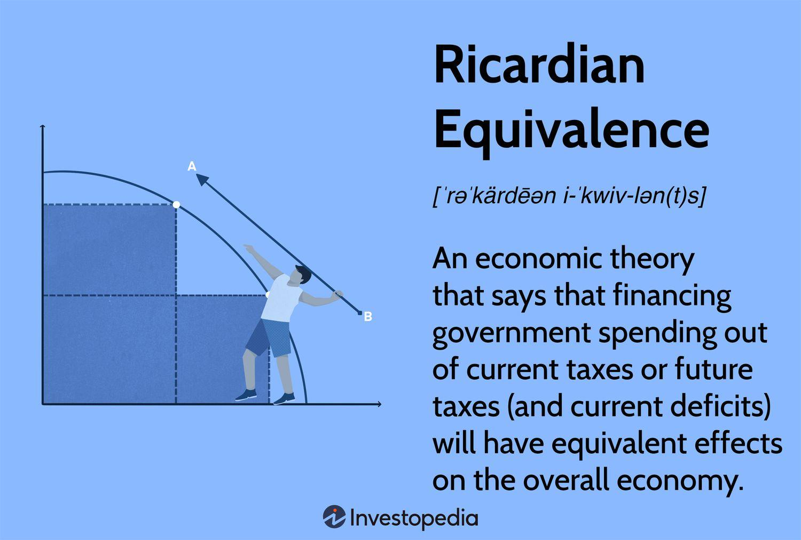

Ricardian vice is a concept in economics that refers to the potential pitfalls of constructing economic models based overly on abstract assumptions rather than reflecting real-world complexities. The term is associated with economist Joseph Schumpeter, who criticized the tendency to oversimplify in the creation of theoretical models that could lead to misleading or incomplete conclusions. This critique stems from the work of David Ricardo, a prominent British political economist in the early 19th century, whose contributions to economic theory, particularly the law of comparative advantage and labor theory of value, have been both influential and subject to scrutiny due to their reliance on simplified assumptions.

David Ricardo's contributions laid foundational aspects for classical and modern economic thought. He is best known for the theory of comparative advantage, which argues that nations should engage in trade to specialize in producing goods for which they have a relative production efficiency. Ricardo's ideas have significantly influenced trade policies and global economic structures. However, some economists argue that his reliance on abstract models formed a basis for unrealistic assumptions, which may not always hold true in practical, dynamic economies.



In recent years, the discussion about Ricardian vice has shifted towards the domain of algorithmic trading and the development of trading models. Algorithmic trading, which relies extensively on automated systems and pre-defined mathematical models to execute trades, can be negatively impacted by Ricardian vice if the underlying assumptions of these models fail to capture the nuances of the markets. Simplified economic models, while useful for theoretical explorations, may not effectively anticipate market behavior characterized by volatility and complex interdependencies.

This article explores the nuances of Ricardian vice, beginning with an introduction to the term and its historical context. A critical analysis of Ricardo’s economic theories will highlight areas where oversimplification presents challenges. The article will then examine the principle of comparative advantage, considering its application and critiques over time. Subsequently, it will explore the intersection of economic modeling and algorithmic trading, addressing how Ricardian vice can impact the efficacy of trading algorithms. Finally, case studies will illustrate scenarios where economic models in trading algorithms may have led to flawed strategies due to unrealistic assumptions, offering insights and potential improvements for future models.

## Table of Contents

## Understanding Ricardian Vice

Ricardian vice, a term introduced by the influential economist Joseph Schumpeter, critiques the method of economic model construction that relies heavily on abstraction, often to the detriment of real-world applicability. Schumpeter coined the term as a reference to David Ricardo's approach to economic theorizing, which, despite its contributions, was criticized for oversimplifying complex economic phenomena through abstract, mathematical models.

David Ricardo, a foundational figure in classical economics, is best known for his theory of comparative advantage and the labor theory of value. His work laid important groundwork in the study of economics, but it also exemplified certain limitations that later economists, including Schumpeter, sought to address. Schumpeter's critique highlighted how Ricardo's models, while elegant, often depended on strict assumptions that did not always align with the complexities of real-world economies.

One of the primary criticisms associated with Ricardian vice is the reliance on overly abstract assumptions, which can lead to models that fail to capture important nuances of economic interactions. For instance, Ricardo's theory of comparative advantage assumes factors such as labor mobility and perfect market conditions, which rarely exist in practice. This has led some critics to argue that such models, while useful for theoretical exploration, offer limited guidance for practical policy-making or economic forecasting.

Examples of Ricardian vice in classical economic theories include the use of representative [agents](/wiki/agents) in macroeconomic modeling and the assumption of constant returns to scale in international trade theory. These simplifications can lead to models that do not adequately account for factors such as market imperfections, economies of scale, or the heterogeneity of economic agents.

In summary, Ricardian vice remains a vital concept in understanding the limitations of economic models that overly prioritize mathematical elegance over empirical realism. The term continues to inform debates on the balance between abstraction and applicability in economic theory and practice.

## Economic Theories: Ricardian Vice Critique

David Ricardo's contributions to economic theory, particularly his introduction of the concepts of comparative advantage and the labor theory of value, have been seminal in shaping classical economics. However, his models have often been critiqued for oversimplifying complex economic realities, a critique encapsulated in the notion of "Ricardian vice." 

The theory of comparative advantage posits that even if one nation is less efficient than another across all products, mutual trade can be beneficial if each specializes in goods where it has a relative efficiency advantage. The foundational assumption is that factors of production are immobile domestically and ignore transport costs, income distribution effects, and economies of scale. These simplifications make the model less applicable in the complex, interdependent modern global economy. For instance, it assumes perfect mobility of labor and capital within national borders without considering legal, cultural, or social barriers that impede such mobility.

Similarly, Ricardo's labor theory of value, which suggests that the value of a good is determined by the labor required to produce it, is criticized for not accounting for capital intensity and technological advancements. The theory assumes homogeneity of labor and static technology, overlooking the diversity of skills and rapid technological changes that characterize contemporary economic activity.

In modern contexts, the reliance on models with Ricardian assumptions can lead to policies that may not align with economic realities. For example, using comparative advantage as a justification for promoting trade may ignore critical issues like environmental sustainability or social welfare. This gap highlights the need for more nuanced models that integrate behavioral insights and empirical data to capture the complexities of global trade dynamics.

The critiques of Ricardo's theories underscore the importance of realistic and adaptable assumptions in economic modeling. While they provide foundational insights, the oversimplifications in Ricardo's work necessitate ongoing revisions and extensions to address current economic challenges. This approach ensures that economic models remain relevant and useful as tools for understanding and directing economic policy in an ever-evolving economic landscape.

## Comparative Advantage: Reality Check

The principle of comparative advantage is fundamental in international trade theory, originally articulated by early 19th-century economist David Ricardo. It posits that even if one country holds an absolute advantage in producing all goods more efficiently than another, trade can still be beneficial. This is possible if each country specializes in producing goods where they have a relative efficiency advantage. The underlying mathematics of comparative advantage can be seen in the opportunity costs associated with producing various goods.

Historically, the principle of comparative advantage has guided global trade policies and economic thought. Ricardo illustrated his theory using a two-country, two-commodity model, demonstrating that trade benefits both nations when they produce goods in which they have comparative efficiency. This model, despite its simplicity, has been a foundational concept influencing trade negotiations and policy.

Criticisms of the principle, notably from economists like Friedrich List, focus on its assumptions and practical limitations. List argued that comparative advantage ignores the dynamic aspects of economic development, emphasizing that industrialization and technological advancement are crucial to long-term national interest. He suggested that protectionist policies might be necessary for developing nations to build their industrial base before engaging in free trade.

Other criticisms target the static nature of Ricardo’s model, which overlooks factors such as resource mobility, economies of scale, and technological advancements. For instance, Paul Krugman and other New Trade Theorists have expanded on traditional models by incorporating elements like economies of scale and network effects, which play a significant role in modern trade dynamics.

Alternative perspectives on trade theories argue for more dynamic models that consider the complexities of global economics. These include endogenous growth theories that emphasize the role of technological change and innovation in driving trade competitiveness. Economists advocating these views propose integrating real-world complexities, such as changing consumer preferences, environmental concerns, and the impact of multinational corporations on trade patterns.

In summary, while the principle of comparative advantage remains a cornerstone of economic theory, its application in contemporary trade requires consideration of more dynamic and multifaceted economic models. These models need to accommodate the rapid technological advancements and evolving economic landscapes to provide a more accurate guide for global trade policies.

## Algorithmic Trading and Economic Models

Algorithmic trading, an integral part of modern financial markets, is the use of computer-generated algorithms to execute trading orders. These algorithms rely heavily on economic models to predict market movements and optimize trading strategies. The success of [algorithmic trading](/wiki/algorithmic-trading) hinges on the accuracy and reliability of these models. However, the phenomenon known as Ricardian vice poses significant challenges to the creation and operation of trading algorithms.

Ricardian vice, a term popularized by economist Joseph Schumpeter, refers to the use of oversimplified assumptions in economic modeling which can lead to misleading conclusions. This concept highlights the potential pitfalls of relying on abstract models that fail to account for real-world complexities. In the context of algorithmic trading, these oversimplifications can result in faulty trading algorithms that do not adequately respond to market dynamics.

For instance, economic models often make assumptions about human behavior, market efficiency, and information symmetry. While these assumptions can simplify analysis and model building, they also risk ignoring critical variables and interactions present in actual markets. An algorithm based on such a model might predict the movement of stock prices with elegant mathematical precision, yet fail under conditions of market stress or irregular events, such as a financial crisis.

Developing robust trading algorithms necessitates a careful balance between simplification and realistic modeling. This involves incorporating a wide range of variables and potential market scenarios into the models. One approach is employing [machine learning](/wiki/machine-learning) techniques, which allows algorithms to learn from vast datasets and improve their accuracy over time. Machine learning can capture complex patterns and non-linear relationships that traditional economic models might miss.

```python
import numpy as np
from sklearn.model_selection import train_test_split
from sklearn.ensemble import RandomForestRegressor

# Sample code for a machine learning-based trading model
# Assume market_data is a DataFrame containing historical market data
X = market_data.drop('target_variable', axis=1)
y = market_data['target_variable']
X_train, X_test, y_train, y_test = train_test_split(X, y, test_size=0.2, random_state=42)

# Random Forest Regressor for predicting future values
model = RandomForestRegressor(n_estimators=100, random_state=42)
model.fit(X_train, y_train)

# Evaluate model accuracy
accuracy = model.score(X_test, y_test)
print(f'Model Accuracy: {accuracy:.2f}')
```

Despite technological advances, the inherent unpredictability of financial markets ensures that challenges remain. Market conditions can change rapidly due to geopolitical events, technological innovations, or regulatory shifts, necessitating continuous refinement and adaptation of trading models. Additionally, the interconnected nature of global markets introduces systemic risks and feedback loops that simple models might overlook.

To mitigate the influence of Ricardian vice, model developers should prioritize the integration of diverse data sources and consider stress-testing algorithms against rare but consequential events. By doing so, algorithmic trading can become more resilient and effective, better reflecting the complexities of real-world financial markets.

## Case Studies: Economic Models in Trading Algorithms

Algorithmic trading relies heavily on economic models to anticipate market movements and execute trades. However, models that succumb to Ricardian vice, characterized by oversimplifications and unrealistic assumptions, can lead to faulty trading strategies. This section analyzes specific scenarios where the Ricardian vice impacted algorithmic trading and examines lessons learned to improve model robustness.

One prominent example involves high-frequency trading ([HFT](/wiki/high-frequency-trading-strategies)) algorithms utilized in stock exchanges. These algorithms operate on assumptions about market efficiency and continuity. For instance, the Efficient Market Hypothesis (EMH) suggests that asset prices fully reflect all available information at any point. While elegant theoretically, the assumption often fails in practice, particularly in volatile markets. In 2010, the infamous "Flash Crash" demonstrated the chaos that can ensue when algorithms, based on assumptions of market [liquidity](/wiki/liquidity-risk-premium) and stable conditions, interact with each other. As prices plunged dramatically within minutes, algorithms exacerbated the problem by executing trades based on short-term fluctuations, disregarding fundamental values, or long-term trends.

The lessons from this event paved the way for algorithmic improvements. First, developers began integrating circuit breakers into trading models to halt operations during periods of extreme [volatility](/wiki/volatility-trading-strategies). These act as a recalibration mechanism, allowing for human intervention when prices deviate significantly from historical trends. Additionally, there was a shift towards hybrid models that combine algorithmic efficiency with the nuanced judgment of experienced traders.

Another case study involves currency trading algorithms, which traditionally relied on models assuming constant economic conditions and ignoring geopolitical risks. Consider a scenario where algorithms forecast currency pair movements based solely on historical price patterns. An unforeseen geopolitical event, such as a sudden change in government or trade policy, can invalidate these models, leading to significant financial losses. For example, the Brexit referendum in 2016 caught many currency traders off guard, as algorithms had not accounted for the probability and potential impact of such an event.

Improvements in this aspect focus on enhancing model adaptability and introducing external variables such as geopolitical risk indicators. Machine learning techniques, particularly those involving natural language processing (NLP), are increasingly used to analyze news articles and political statements. By doing so, algorithms become more responsive to shifts in the political landscape that could affect currency values.

Moreover, the incorporation of sentiment analysis tools leverages social media and other unstructured data sources, providing real-time insights into market sentiment and potential shifts in trading patterns. This approach helps address the limitations of traditional economic models, aligning them closer to real-world complexities.

In conclusion, recognizing the pitfalls of Ricardian vice, particularly in the prevalence of oversimplification, is crucial for developing more resilient algorithmic trading systems. By integrating diverse data sources and refining models to account for volatile conditions and external shocks, traders can mitigate risk and improve the reliability of algorithmic strategies. This iterative learning process continues to shape the evolution of economic models in the fast-paced domain of algorithmic trading.

## Conclusion

In concluding the discussion on Ricardian vice and its implications for economic modeling and algorithmic trading, it is vital to underscore the necessity of grounding economic models in realistic assumptions. Ricardian vice, characterized by the tendency to base economic theories on overly simplified and abstract assumptions, highlights the risks of neglecting the complexity of real-world dynamics. Economic models should, therefore, strive for a greater alignment with empirical realities to enhance their applicability and reliability.

The integration of complex, real-world factors into economic theories is paramount. Economic environments are influenced by an intricate interplay of technological advancements, behavioral dynamics, institutional factors, and geopolitical developments. Ignoring these elements can result in models that fail to predict or respond effectively to market conditions. For instance, algorithmic trading systems that operate on models lacking in such considerations may misinterpret market signals, leading to suboptimal trading decisions.

Looking to the future, economic theorists should prioritize the development of models that incorporate a wider range of variables and recognize non-linear dynamics and feedback loops present in economies. This could involve adopting approaches from complexity science, such as agent-based modeling, which allows for the simulation of interactions between diverse agents under varying conditions.

For algorithmic traders, there is a critical need to integrate robust data analytics and machine learning techniques that facilitate adaptive learning and decision-making. These tools can help in managing uncertainty and addressing the limitations of models derived from Ricardian principles. Continuous testing and validation against historical and real-time data can further enhance the resilience and accuracy of algorithmic trading strategies.

In summary, advancing both economic theory and algorithmic trading algorithms necessitates a commitment to realism and flexibility, ensuring they are equipped to handle the multifaceted challenges of modern economic landscapes.

## References & Further Reading

[1]: Schumpeter, J. A. (1954). ["History of Economic Analysis."](https://archive.org/details/HISTORYOFECONOMICANALYSISJOSEPHALOISSCHUMPETER) Oxford University Press.

[2]: Ricardo, D. (1817). ["Principles of Political Economy and Taxation."](https://www.econlib.org/library/Ricardo/ricP.html) Courier Corporation.

[3]: Krugman, P. (1991). ["Increasing Returns and Economic Geography."](https://pr.princeton.edu/pictures/g-k/krugman/krugman-increasing_returns_1991.pdf) The Quarterly Journal of Economics, 106(2), 483-499.

[4]: List, F. (1856). ["The National System of Political Economy."](https://archive.org/details/nationalsystemp00colwgoog) Transaction Publishers.

[5]: Lopez de Prado, M. (2018). ["Advances in Financial Machine Learning."](https://www.amazon.com/Advances-Financial-Machine-Learning-Marcos/dp/1119482089) Wiley.

[6]: Chan, E. P. (2009). ["Quantitative Trading: How to Build Your Own Algorithmic Trading Business."](https://github.com/ftvision/quant_trading_echan_book) Wiley.