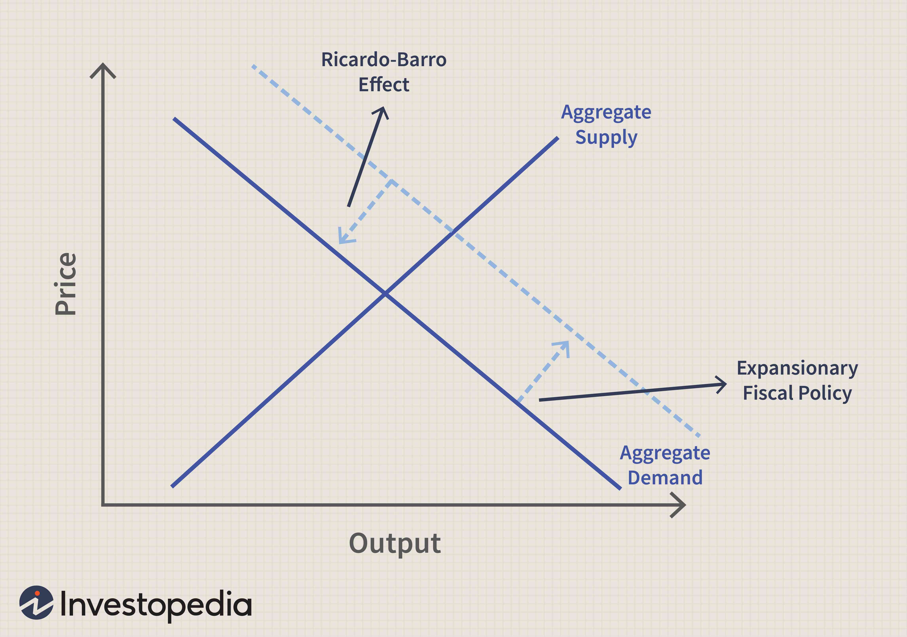

Fiscal policy is a critical component of economic planning employed by governments to influence a nation's economic activity by adjusting spending levels and tax rates. Its primary objectives include achieving macroeconomic stability, encouraging economic growth, and reducing the levels of unemployment and inflation. Fiscal policy can take a variety of forms, such as expansionary measures aimed at stimulating the economy during recessions or contractionary measures designed to cool down an overheated economy.

Central to debates concerning fiscal policy is the Ricardo-Barro effect, also known as Ricardian equivalence. This economic theory suggests that it does not matter whether a government finances its spending with debt or taxes because the effect on total demand in the economy remains the same. Named after economist David Ricardo, who first introduced the idea in the early 19th century, and later formalized by Robert J. Barro in the 1970s, the Ricardo-Barro effect posits that rational consumers anticipate future taxes that will repay government debt. Consequently, these consumers save more when the government increases debt, offsetting any stimulus intended by increased public spending.



The mingling of economic theories like the Ricardo-Barro effect with modern trading technologies introduces an intriguing dimension to current economics discussions. Algorithmic trading, which employs algorithms to execute trades in the financial markets rapidly, relies on quantitative models and can be influenced by fiscal policy outcomes and projected economic conditions. The interplay between traditional economic theories and advanced technology like algorithmic trading raises questions about the potential shifts in market behaviors and economic dynamics.

This article aims to explore the relevance of the Ricardo-Barro effect in contemporary fiscal policy debates, scrutinize its criticisms, and analyze its implications in an era increasingly dominated by technological advances in trading. Through this examination, we seek to bridge classical economic theories with cutting-edge financial technologies, facilitating an enriched discourse that invites further exploration by policymakers and economic theorists alike.

## Table of Contents

## Understanding the Ricardo-Barro Effect

The Ricardo-Barro effect, more commonly known as Ricardian equivalence, is an economic theory suggesting that government borrowing does not affect the total level of demand in an economy. The theory posits that when a government increases its debt, consumers anticipate future tax increases to pay off the debt and therefore save money instead of spending. As a result, the increase in government spending is offset by a decrease in private consumption, theoretically leaving total demand unchanged.

The concept originates from the work of David Ricardo, a 19th-century British economist, who first speculated on the effects of government debt in his work on political economy. However, it was economist Robert Barro who formalized the theory in the 1970s, constructing a comprehensive model to explain its mechanics and assumptions.

The Ricardo-Barro effect hinges on several key assumptions:

1. **Rational Consumers**: It assumes that consumers are forward-thinking and understand the future implications of government borrowing, primarily that taxes will eventually be raised to repay the debt.

2. **Perfect Capital Markets**: Consumers can borrow and save freely at prevailing market interest rates, allowing them to plan their spending and savings efficiently over their lifetime.

3. **Intergenerational Links**: Consumers care about their descendants, factoring in future generations' tax liabilities in their current economic decisions.

4. **Governments and Consumers have the same borrowing constraints**: If consumers are limited in their borrowing capacity, government borrowing does not offer additional consumption opportunities.

Given these assumptions, the effect predicts that government fiscal policy becomes neutral regarding its impact on an economy's aggregate demand.

For example, consider a government deciding between financing its expenditures through taxes now or by issuing debt and spreading taxes over the future. Under Ricardian equivalence, if the government opts for debt, rational consumers, foreseeing future tax liabilities, will increase their savings to pay for future taxes, countering the surge in demand that could have stemmed from the government's deficit spending. The expected output is that national savings rates remain unchanged, failing to stir economic activity as might typically be anticipated through enhanced government expenditure.

In practice, the Ricardo-Barro effect continues to elicit debate, as real-world deviations from its assumptions can lead to different outcomes. Factors such as [liquidity](/wiki/liquidity-risk-premium) constraints, myopic consumer behavior, and varying consumer priorities across generations often influence actual economic responses, offering fertile ground for further empirical investigation and theoretical critique.

## Arguments and Criticisms

The Ricardo-Barro effect, also known as Ricardian equivalence, posits that government fiscal policies, such as tax cuts or increases in public spending, do not affect the overall level of demand in an economy as private [agents](/wiki/agents) anticipate future tax liabilities. However, this concept has faced substantial criticism on both theoretical and empirical fronts.

A primary criticism of the Ricardo-Barro effect is its reliance on several stringent assumptions. One of the fundamental assumptions is the existence of perfect capital markets. It presumes that individuals can borrow and lend freely at a uniform [interest rate](/wiki/interest-rate-trading-strategies), which is often not the case in reality due to credit constraints faced by a significant portion of the population. Additionally, the assumption that individuals have perfect foresight or rational expectations about future taxes and government policies is frequently challenged. In practice, uncertainty and limited informational access can hinder the ability of economic agents to accurately forecast future tax obligations, thereby affecting their consumption and saving behaviors.

Empirical challenges to the Ricardo-Barro effect are substantial. Historical economic data has often contradicted the principle of Ricardian equivalence. For instance, during periods of pronounced government fiscal action, such as the New Deal in the United States or post-World War economic rebuilding in Europe, increased government spending did not appear to be counterbalanced by equivalent declines in private consumption or saving. Instead, these periods often saw significant boosts in aggregate demand.

From a theoretical perspective, Keynesian economists argue that government spending can lead to increased aggregate demand, particularly during periods of economic slack when resources are underutilized. In such scenarios, they assert, the multiplier effect of fiscal stimulus can lead to real increases in output and employment levels. This stands in contrast to the Ricardian view, suggesting that in certain economic conditions, particularly those involving underutilization, government intervention can effectively stimulate economic activity without being fully offset by private sector responses.

Ricardian economic theory, while acknowledging possible short-term impacts of fiscal policies, tends to emphasize long-term neutrality, where agents adjust their behaviors to mitigate government-induced variances in disposable income. However, this perspective faces practical criticism, suggesting that complete neutrality is rarely observed on a macroeconomic scale.

In summary, criticisms of the Ricardo-Barro effect primarily hinge on its unrealistic assumptions and the failure of empirical evidence to support its core tenets consistently. The contrasting views from Keynesian and Ricardian theories highlight fundamental differences in understanding government spending's role, underscoring ongoing debates within economic policy discussions.

## Fiscal Policy and Economic Stimulus

Fiscal policy is a key tool for governments to manage economic demand and influence overall economic activity. When designed effectively, it can help stabilize an economy during downturns and control inflation during periods of rapid growth. Different strategies are employed to boost economic demand through fiscal policy, the most prominent being debt-financed government spending and adjustments to interest rates.

Debt-financed government spending involves the government borrowing funds to increase its expenditure, aiming to stimulate economic activity. This approach is particularly effective during recessionary periods when private sector demand is low. By increasing government spending, either through direct consumption or investments in infrastructure and services, aggregate demand is boosted, potentially leading to higher production and employment levels.

An alternative approach is managing interest rates, primarily conducted through monetary policy rather than fiscal policy. However, fiscal authorities can influence the economic environment by coordinating with monetary authorities. Lowering interest rates can stimulate borrowing and spending by businesses and consumers, thereby increasing demand. This strategy, however, is typically more within the purview of central banks, like the Federal Reserve in the United States or the European Central Bank in the eurozone.

The crowding-out effect is a critical [factor](/wiki/factor-investing) in analyzing the implications of debt-financed government spending. When the government borrows extensively from the domestic financial markets, it can lead to higher interest rates as a consequence of increased demand for available funds. This rise in interest rates may deter private investment, as the cost of borrowing becomes expensive, potentially offsetting the initial stimulus from increased government spending. The magnitude of the crowding-out effect is subject to debate, as its impact can vary based on the economic context. In a liquidity trap, where interest rates are low and savings rates are high, the crowding-out effect may be negligible.

Recent economic policies provide valuable insights into the application and impact of fiscal strategies. The global financial crisis of 2008 saw substantial government interventions, notably through debt-financed spending packages aimed at reviving demand. In the United States, the American Recovery and Reinvestment Act of 2009 injected approximately $831 billion into the economy through tax cuts, expansion of welfare benefits, and public investments, which contributed to the stabilization and eventual recovery of the economy.

Similarly, during the COVID-19 pandemic, governments worldwide adopted aggressive fiscal measures to counteract the economic downturn. The United States implemented the Coronavirus Aid, Relief, and Economic Security (CARES) Act and subsequent packages that collectively exceeded $3 trillion. These measures included direct financial assistance to individuals, expanded unemployment benefits, and support for businesses to retain employees, which were crucial in mitigating the pandemic's economic impact.

These examples underline the complexities and potential of fiscal policy as a tool for economic stabilization. The effectiveness of these policies depends on various factors, including economic conditions, the existing fiscal and monetary landscape, and the specific design of the interventions. Consequently, ongoing analysis and adaptation are crucial for maximizing the benefits of fiscal policy in enhancing economic demand and activity.

## The Role of Algo Trading in Modern Economics

Algorithmic trading, often referred to as algo trading, is a method of executing trades using automated and pre-programmed trading instructions that account for variables such as time, price, and [volume](/wiki/volume-trading-strategy). This increasingly prevalent approach in financial markets leverages complex mathematical models and high-speed computing to make trading decisions. Algo trading can process information and react to market conditions faster than human traders, allowing it to capitalize on fleeting opportunities and manage risks effectively.

The impact of economic theories, including the Ricardo-Barro effect, on trading strategies is significant. The Ricardo-Barro effect, also known as Ricardian equivalence, suggests that consumers anticipate future taxation effects of government debt, and therefore, changes in government spending do not affect aggregate demand. While this theory posits that fiscal policy may have limited real impacts, in practice, market participants often respond to policy signals, leading algo trading systems to adapt accordingly. By analyzing government fiscal announcements and their anticipated long-term effects, algorithms can adjust portfolios to optimize returns while mitigating exposure to potential policy reversals.

Algo trading systems are particularly adept at adapting to fiscal policy changes and economic data by utilizing [machine learning](/wiki/machine-learning) and data analytics. For instance, an algorithm might analyze historical data to determine correlations between government spending shifts and stock market indices. Upon detecting a fiscal expansion, the algorithm could optimize trading strategies by reallocating assets towards sectors that have historically benefited from increased government expenditure, such as infrastructure or defense.

Here is an example of a simple Python pseudocode for an algorithm that might adjust trading strategies based on fiscal policy changes:

```python
def adjust_portfolio(fiscal_policy_change, historical_data):
    impact_scores = analyze_historical_data(historical_data)
    portfolio = get_current_portfolio()

    for asset in portfolio:
        asset_score = impact_scores.get(asset.sector, 0)
        if fiscal_policy_change == 'expansion':
            asset.weight += asset_score * 0.01
        elif fiscal_policy_change == 'contraction':
            asset.weight -= asset_score * 0.01

    rebalance_portfolio(portfolio)
```

While [algorithmic trading](/wiki/algorithmic-trading) provides advanced tools for integrating economic theories with trading strategies, it also presents challenges. A key challenge lies in accurately modeling the complexities of economic systems and the uncertainties inherent in fiscal policy decisions. Traditional economic theories often assume rational behavior and efficient markets, assumptions that may not hold in the complicated landscape of modern financial markets. The integration of these traditional theories with cutting-edge technologies demands a nuanced understanding of both domains.

Potential synergies exist, as algorithmic trading can enhance the precision of economic forecasts and the responsiveness of trading strategies to new data. By continuously learning from market outcomes, algo trading systems can refine their models, leading to more efficient markets. However, this synergy requires careful calibration to ensure the algorithms do not simply reinforce prevailing biases or amplify market [volatility](/wiki/volatility-trading-strategies).

In conclusion, algorithmic trading holds a transformative potential for modern economics. Its ability to swiftly incorporate economic theories like the Ricardo-Barro effect and respond to fiscal policy changes positions it as a pivotal player in shaping trading strategies and market dynamics. Nonetheless, achieving harmonious integration with traditional economic models necessitates ongoing collaboration between economists and technologists, fostering a deeper understanding of both economic theories and technological capabilities.

## Conclusion

The article explored the major aspects of fiscal policy, particularly focusing on the Ricardo-Barro effect and its implications in contemporary economic discourse. The Ricardo-Barro effect, also known as Ricardian equivalence, suggests that government borrowing does not affect overall demand in an economy because individuals anticipate future taxation to pay off debts and thus save accordingly. Despite its theoretical foundations laid by David Ricardo and later elaborated by Robert Barro, this effect has faced numerous criticisms, largely questioning its assumptions like perfect capital markets and the ability of individuals to predict future taxes accurately.

The discussions highlighted the diverse views surrounding the Ricardo-Barro effect, emphasizing how its assumptions rarely hold true in real-world scenarios. Empirical evidence often contradicts the theory, with fiscal policy showing tangible effects on economic activities, challenging the idea of perfect neutrality in government borrowing. Theoretical debates also contrast the perspectives of Keynesian economics, which advocates active government intervention, against Ricardian approaches that often cast doubt on such interventions' long-term neutrality.

The role of fiscal policy, particularly debt-financed spending, remains vital in economic stimulus measures, as evidenced by various policy implementations worldwide. The crowding-out effect, where government spending results in reduced investment in the private sector due to higher interest rates, is also a consideration for policymakers.

Furthermore, the advent of algorithmic trading introduces a modern dimension to these economic theories. The integration of real-time data and complex algorithms in trading blurs traditional boundaries and necessitates a reevaluation of how economic theories play out in high-speed financial environments. Algorithmic trading's response to fiscal policy changes adds a layer of complexity, representing both an opportunity and a challenge for economic theorists and practitioners.

In conclusion, the Ricardo-Barro effect remains a significant theoretical construct within fiscal policy debates, and while its practical relevance is often questioned, it continues to provoke insightful discussions. Policymakers and economists must navigate the evolving landscape where traditional economic theories meet advanced financial technologies. This convergence suggests a need for further research and collaborative dialogue to ensure that fiscal strategies are well-informed and adaptive to modern economic realities. Encouraging further exploration of these interactions will ensure that fiscal policies harness the full potential of both economic theory and technological advancements.

## References & Further Reading

[1]: Ricardo, D. (1821). ["Principles of Political Economy and Taxation."](https://www.econlib.org/library/Ricardo/ricP.html) Dover Publications.

[2]: Barro, R. J. (1974). ["Are Government Bonds Net Wealth?"](https://www.semanticscholar.org/paper/Are-Government-Bonds-Net-Wealth-Barro/e8f6db2299e2949de2c891d69dd4caa2ec046cbc) Journal of Political Economy, 82(6), 1095-1117.

[3]: Blanchard, O. J., & Perotti, R. (2002). ["An Empirical Characterization of the Dynamic Effects of Changes in Government Spending and Taxes on Output."](https://www.nber.org/papers/w7269) Quarterly Journal of Economics, 117(4), 1329-1368.

[4]: Romer, C. D., & Bernstein, J. (2009). ["The Job Impact of the American Recovery and Reinvestment Act."](https://www.jec.senate.gov/public/_cache/files/ed404bd4-5098-4499-8f12-3152d485ea52/romerandbernsteinanalysisofeffectsofstimulusjobscreatedorsaved.pdf) Executive Office of the President.

[5]: ["Algorithmic Trading: Winning Strategies and Their Rationale"](https://www.amazon.com/Algorithmic-Trading-Winning-Strategies-Rationale-ebook/dp/B00CY5HC0U) by Ernie Chan

[6]: Taylor, J. B. (1993). ["Discretion versus Policy Rules in Practice."](https://web.stanford.edu/~johntayl/Onlinepaperscombinedbyyear/1993/Discretion_versus_Policy_Rules_in_Practice.pdf) Carnegie-Rochester Conference Series on Public Policy, 39, 195-214.