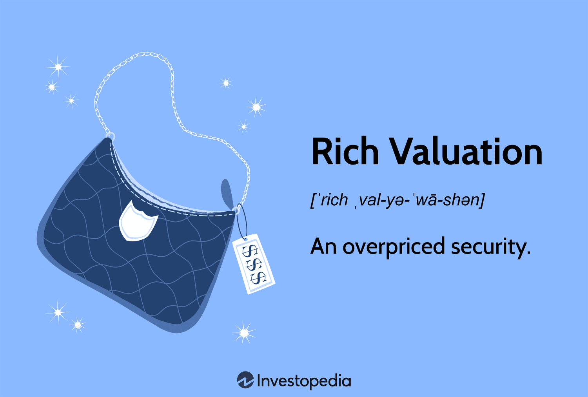

In the ever-evolving landscape of finance, understanding valuation is crucial for investors and traders alike. At its core, valuation serves as the compass guiding investment decisions, enabling stakeholders to ascertain the intrinsic worth of a company or asset. This understanding is indispensable across various domains of finance, from traditional equity and bond markets to the rapidly advancing field of algorithmic trading.

Valuation methods offer a structured approach to estimating a company’s economic value, facilitating a comprehensive analysis of business prospects, risk factors, and financial health. For investors, these methods underpin decisions such as whether to buy, hold, or sell a security, while providing insights into the expected future performance and risk profile of investments. In traditional finance, valuation techniques are employed for activities ranging from pricing initial public offerings (IPOs) to mergers and acquisitions.



Moreover, with technology-driven advancements in trading strategies, the integration of valuation methods into algorithmic trading has become increasingly significant. Algorithms, programmed to execute orders at optimal prices and speeds, rely on valuation data to assess market conditions and identify investment opportunities. Valuation models, such as Discounted Cash Flow (DCF) analysis and Earnings Multipliers, serve as critical inputs for these algorithms, fine-tuning their decision-making processes and enhancing their ability to capitalize on pricing inefficiencies visible in real-time market data.

This article explores various valuation methods, examining their applications in both traditional finance and modern algorithmic trading strategies. Through this exploration, readers gain a deeper understanding of how robust valuation practices contribute to informed financial decisions, and how technological advancements are reshaping the way these practices are applied in today's financial markets.

## Table of Contents

## What is Business Valuation?

Business valuation is the process of determining the economic value of a company or asset. This process is essential for understanding a company's market position and informing strategic decisions such as mergers and acquisitions. The valuation provides a comprehensive analysis encompassing a business's financial performance, market conditions, and capital structure.

In assessing financial performance, valuation examines historical and projected financial statements to estimate cash flows, revenue growth, and profitability. The analysis typically involves reviewing income statements, balance sheets, and cash flow statements. Important financial metrics, such as earnings before interest, taxes, depreciation, and amortization (EBITDA), net income, and revenue, form the basis for valuation calculations.

Market conditions also play a significant role in business valuation. An understanding of current industry dynamics, competitive landscape, and economic factors is essential. Market trends such as demand fluctuations, regulatory changes, and macroeconomic indicators influence a company's potential value. Industry-specific benchmarks and comparable companies’ valuations provide contextual insights for this purpose.

The capital structure is a critical [factor](/wiki/factor-investing) in business valuation. It involves examining the composition of a company’s debt and equity, alongside assessing the cost of capital. A company’s weighted average cost of capital (WACC) is a fundamental element in discounting future cash flows in models like Discounted Cash Flow (DCF) analysis. The formula for WACC is:

$$
\text{WACC} = \left( \frac{E}{V} \times Re \right) + \left( \frac{D}{V} \times Rd \times (1 - Tc) \right)
$$

where:
- $E$ is the market value of equity
- $V$ is the total market value of equity and debt
- $Re$ is the cost of equity
- $D$ is the market value of debt
- $Rd$ is the cost of debt
- $Tc$ is the corporate tax rate

These elements combined create a holistic view of a company's value, providing vital information for investors, managers, and stakeholders in making strategic economic decisions. Understanding and accurately applying valuation methods is critical to assessing an entity's fair market value, thus influencing investment and strategic business choices effectively.

## Key Valuation Methods

Valuation methods are essential tools for determining a company's financial worth. They offer diverse perspectives and can influence investment decisions and strategic planning. Here, we examine three common methodologies: Market Capitalization, Earnings Multiplier, and Discounted Cash Flow (DCF) Analysis.

### Market Capitalization

Market capitalization is one of the simplest valuation methods, often used for publicly traded companies. It is calculated by multiplying the company’s current share price by its total number of outstanding shares. The formula is:

$$
\text{Market Capitalization} = \text{Share Price} \times \text{Outstanding Shares}
$$

This method offers a straightforward snapshot of a company's size and is useful for comparing companies within the same industry. However, it is often limited by short-term market perceptions and does not account for a company’s future growth potential or intrinsic value.

### Earnings Multiplier

The earnings multiplier, often represented by the Price-to-Earnings (P/E) ratio, evaluates a company’s worth by comparing its current share price to its earnings per share (EPS). The formula is:

$$
\text{P/E Ratio} = \frac{\text{Share Price}}{\text{Earnings Per Share (EPS)}}
$$

This method normalizes a company's earnings relative to its price, offering insight into whether a stock is overvalued or undervalued compared to its earnings. An advantage of the P/E ratio is its ability to facilitate comparisons across companies. However, it can be misleading if earnings are volatile or artificially inflated.

### Discounted Cash Flow (DCF) Analysis

Discounted Cash Flow analysis is a more detailed valuation method that estimates a company’s intrinsic value. It is based on the principle that a company is worth the present value of its future cash flows. The formula involves calculating:

$$
\text{DCF} = \sum \frac{C_t}{(1 + r)^t}
$$

where $C_t$ is the cash flow in year $t$, and $r$ is the discount rate. 

DCF is robust and considers the time value of money, making it suitable for long-term valuation assessments. It allows valuation beyond current market conditions or earnings multiples by factoring in expected future performance. However, its accuracy heavily depends on the assumptions made about future cash flows and the chosen discount rate, which can introduce subjectivity.

### Conclusion

Each valuation method provides insights suited to different aspects of financial analysis. Market Capitalization offers a quick market-based assessment, Earnings Multiplier assists in pricing relative earnings, and DCF provides a comprehensive intrinsic value through cash flow projections. Selecting an appropriate method often depends on the nature of the company and the specific valuation objectives.

## Valuing Non-Public Companies

Valuing private companies presents unique challenges primarily due to the absence of publicly available market data. This lack of transparency makes it difficult to apply traditional valuation metrics that rely heavily on market sentiment and trading activity. To address these challenges, several methods are commonly employed, each focusing on different aspects of a company's financial and operational profile.

**Comparables Analysis**: This method, also known as the 'market approach,' involves evaluating similar companies within the same industry to estimate the value of a private company. The process requires identifying a peer group of publicly traded companies and using their valuation multiples (such as price-to-earnings ratios, price-to-book ratios, or EV/EBITDA). These multiples are then applied to the private company's financial metrics to derive an estimated value. The formula for this approach is:

$$
\text{Value of Private Company} = \text{Financial Metric} \times \text{Median Multiple of Comparables}
$$

For instance, if a private company has earnings of $1 million and the average P/E ratio of comparable public companies is 15, then the estimated value of the private company would be $15 million.

**Precedent Transactions**: This method involves analyzing past transactions of similar companies that were acquired. It assumes that the value of a company can be inferred from the prices paid in similar acquisitions. This approach is particularly useful for understanding the market trends and investor appetite for companies within a specific sector. The formula for this analysis generally looks like:

$$
\text{Value of Private Company} = \text{Financial Metric} \times \text{Median Transaction Multiple}
$$

This approach requires a significant amount of industry-specific data and assumes that past market conditions are indicative of current and future conditions.

**Asset-Based Approach**: This technique focuses on a company's net asset value, essentially calculating what the company would be worth if it were liquidated. The asset-based method is particularly relevant for companies with substantial tangible assets or those in industries such as real estate or manufacturing. The calculation involves summing the market values of all assets and subtracting liabilities to find the net asset value:

$$
\text{Net Asset Value} = \text{Total Assets} - \text{Total Liabilities}
$$

The asset-based approach may not accurately reflect the true market value for companies with significant intellectual property or strong brands, as these intangible assets can be difficult to appraise.

Each of these valuation methods requires careful consideration of market conditions and company characteristics, such as growth potential, competitive positioning, and financial health. Moreover, the applicability and accuracy of these methods can be influenced by economic factors and industry-specific trends, as well as the availability and reliability of comparable data. Combining several methods can yield a more comprehensive valuation by mitigating the limitations inherent in using a single approach.

## Intersection of Valuation and Algo Trading

Algorithmic trading enhances trading precision and profitability by leveraging valuation models. These models are crucial for identifying market opportunities and making informed trading decisions. Valuation techniques, such as Discounted Cash Flow (DCF) analysis and Price-to-Earnings (P/E) ratios, are integral to these algorithms. These methods enable traders to ascertain whether securities are undervalued or overvalued relative to their intrinsic value.

**Discounted Cash Flow (DCF) Analysis**:

DCF analysis calculates the present value of expected future cash flows of an asset, providing a measure of intrinsic value. The formula for DCF is given by:

$$

DCF = \sum \frac{C_t}{(1 + r)^t} 
$$

Where:
- $C_t$ = Cash flow at time $t$
- $r$ = Discount rate
- $t$ = Time period

By comparing DCF values against current market prices, algorithms can identify potentially mispriced securities.

**Price-to-Earnings (P/E) Ratio**:

The P/E ratio is a valuation metric that evaluates a company's current share price relative to its earnings per share (EPS). It is calculated as:

$$

P/E = \frac{\text{Market Value per Share}}{\text{Earnings per Share (EPS)}} 
$$

A lower P/E ratio might suggest that a security is undervalued compared to industry peers, making it an attractive target for [algorithmic trading](/wiki/algorithmic-trading) systems seeking value investments.

**Machine Learning Integration**:

Machine learning augments the predictive capabilities of these trading algorithms. By analyzing large datasets, [machine learning](/wiki/machine-learning) models can identify patterns and trends in valuation data, augmenting traditional valuation techniques. For instance, regression models or neural networks can be used to predict future price movements based on historical valuation metrics.

Below is a simple example illustrating the integration of machine learning in Python. This example uses a linear regression model to predict stock prices based on historical features, including DCF and P/E ratios:

```python
from sklearn.linear_model import LinearRegression
import numpy as np

# Sample historical data: [DCF, P/E Ratio, Historical Price]
data = np.array([
    [100, 15, 120],
    [110, 18, 130],
    [105, 20, 125]
])

# Features and label
X = data[:, :2]  # DCF, P/E Ratio
y = data[:, 2]   # Historical Price

# Initialize and train model
model = LinearRegression()
model.fit(X, y)

# Predict future price based on new valuation data
new_valuation = np.array([[115, 17]])
predicted_price = model.predict(new_valuation)

print(f"Predicted Price: {predicted_price[0]:.2f}")
```

Through this integration, traders can enhance the efficiency and accuracy of their trading strategies. By combining valuation models with advanced algorithmic techniques, financial professionals can refine their approach to identifying and exploiting market opportunities. As technology and financial strategies evolve, the interplay between valuation and algorithmic trading is poised to become increasingly sophisticated.

## Examples of Valuation in Practice

Renaissance Technologies, a prominent quantitative [hedge fund](/wiki/hedge-fund-trading-strategies), exemplifies the integration of sophisticated valuation techniques like Discounted Cash Flow (DCF) analysis in algorithmic trading strategies. By leveraging complex mathematical models and statistical methods, Renaissance Technologies effectively identifies investment opportunities that may not be apparent using traditional analysis. The use of DCF within its algorithms allows for the estimation of future cash flows, adjusted for time value, enabling the fund to assess intrinsic value accurately and make data-driven investment decisions.

Berkshire Hathaway, led by renowned investor Warren Buffett, is another example where valuation plays a pivotal role in decision-making. The company employs rigorous valuation methods to carefully evaluate potential acquisition targets. This often involves a comprehensive analysis of earnings, cash flows, and other financial metrics to derive an intrinsic value for the target companies. By focusing on the margin of safety and ensuring that purchases are made below intrinsic value, Berkshire Hathaway maximizes long-term investment returns.

Different industries adopt varying valuation methods based on market dynamics and company specifics. For instance, technology companies might prioritize DCF analysis due to their emphasis on future growth and cash flows, whereas manufacturing firms might rely more on asset-based valuation methods, reflecting the significance of physical assets in these industries. In the financial sector, the use of price-to-earnings (P/E) ratios and book value metrics is prevalent, as they provide insights into earnings potential relative to stock price.

Overall, valuation methods are inherently adaptable, allowing investors to tailor their approaches to fit industry standards and company characteristics. Whether through algorithmic strategies or traditional assessment, these methods remain integral to sound investment practices.

## Challenges and Limitations

Valuation processes in finance, while fundamentally critical, are fraught with challenges and limitations that experts must navigate for accurate assessments. One primary challenge is market [volatility](/wiki/volatility-trading-strategies), which can significantly influence valuation outcomes. Market conditions can change rapidly due to factors such as geopolitical events, economic shifts, and investor sentiment, making it difficult for analysts to maintain reliable valuations over time. This unpredictability necessitates the use of dynamic models that can adapt to shifting market landscapes.

Another significant limitation is the reliance on subjective assumptions within valuation models. For instance, determining discount rates in Discounted Cash Flow (DCF) analysis involves assumptions about future interest rates and risk premiums, which are inherently speculative. The accuracy of these assumptions is critical, as they directly impact the present value calculations of anticipated cash flows. Incorrect assumptions can lead to overvaluation or undervaluation of a company, affecting investment decisions.

Accurate valuation also requires a careful balance between quantitative data and qualitative insights. Quantitative measures such as financial ratios and market data provide tangible metrics, but qualitative aspects like management expertise, brand strength, and competitive positioning are equally pivotal. Merging these components demands a comprehensive understanding of both the numerical data and the operational dynamics of the business.

In the context of private companies, the lack of transparent data presents additional complexities. Without publicly available financial statements or market prices, valuing non-public entities requires alternative methods such as Comparables Analysis or Precedent Transactions. These approaches rely on data from similar companies or recent sales transactions, introducing further challenges in selecting appropriate comparables and ensuring the relevance of the data.

Furthermore, adjusting for non-market factors such as regulatory changes or technological advancements becomes crucial in aligning valuations with real-world scenarios. Analysts must incorporate these considerations to ensure that their valuations not only reflect current market conditions but are also resilient to future uncertainties.

In summary, valuation is a multifaceted process that involves synthesizing both quantitative and qualitative data, adapting to market volatility, and carefully addressing subjective assumptions. While these challenges may complicate the valuation process, they also emphasize the importance of robust and adaptable valuation methodologies to derive meaningful insights in finance.

## Conclusion

Valuation is an indispensable tool in the financial sector, playing a crucial role in various applications such as strategic planning, mergers and acquisitions, and algorithmic trading. The ability to accurately assess a company's worth provides investors and financial professionals with the insights necessary to make informed decisions in a dynamic market. As financial markets evolve, valuation methods must also adapt to changing conditions and integrate new technologies to remain effective.

Modern financial markets are marked by complexity and rapid change, necessitating the continuous adaptation and exploration of valuation methods. The integration of advanced statistical techniques and machine learning models into traditional valuation frameworks has the potential to improve accuracy and predictability. For example, by incorporating real-time data analysis and pattern recognition, machine learning algorithms can enhance the precision of valuation predictions, allowing for more effective trading strategies.

In the context of algorithmic trading, robust valuation techniques can significantly enhance decision-making and strategic outcomes. By utilizing detailed valuation models like the Discounted Cash Flow (DCF) analysis or Price-to-Earnings (P/E) ratios, algorithms can identify undervalued or overvalued securities, thereby optimizing buy and sell decisions. This integration of valuation methods into algorithmic frameworks not only bolsters trading performance but also supports risk management by providing a deeper understanding of market valuations.

Furthermore, the synergy between valuation and emerging technologies like [artificial intelligence](/wiki/ai-artificial-intelligence) offers vast potential for innovation in financial analysis and trading. By leveraging these technologies, financial professionals can navigate the complexities of modern markets with greater efficiency and strategic insight. This ongoing fusion of valuation techniques and algorithmic tools underscores the importance of staying updated with the latest advancements in both fields.

In conclusion, the strategic application of valuation methods enriches financial decision-making, from high-level corporate strategies to the granular execution of trades in algorithmic portfolios. As markets continue to transform, the evolution of valuation techniques will remain a cornerstone in achieving optimal financial outcomes, ensuring that professionals are equipped to respond to the challenges and opportunities of the future.

## References & Further Reading

For those interested in deepening their understanding of valuation methods, an array of resources is available. Investopedia is an excellent starting point, offering accessible explanations of various valuation techniques and their applications. It covers the fundamentals as well as more advanced topics, providing a solid foundation for both novices and experienced investors.

To gain more advanced insights, consider the authoritative works by Aswath Damodaran, a renowned expert in the field of valuation. His [books](/wiki/algo-trading-books) and research papers provide detailed methodologies and conceptual frameworks for valuing businesses, making them essential reads for anyone involved in financial analysis.

For those focused on algorithmic trading, it's crucial to keep abreast of the latest developments in valuation models. Online courses from platforms like Coursera, edX, and Udacity can be valuable for learning the integration of machine learning with financial valuation. Industry publications such as the Journal of Finance and the Journal of Financial Economics often publish cutting-edge research on these topics.

Furthermore, engaging with financial textbooks that cover valuation subjects extensively can enhance one’s grasp of the theoretical underpinnings of these techniques. Textbooks such as "Valuation: Measuring and Managing the Value of Companies" by McKinsey & Company, Inc., provide comprehensive insights into the intricate processes involved in valuation.

Staying current with industry practices is essential for anyone interested in valuation and algorithmic trading. Subscribing to industry newsletters and participating in financial seminars can be effective ways to remain informed about recent trends and innovations in these rapidly evolving fields.

