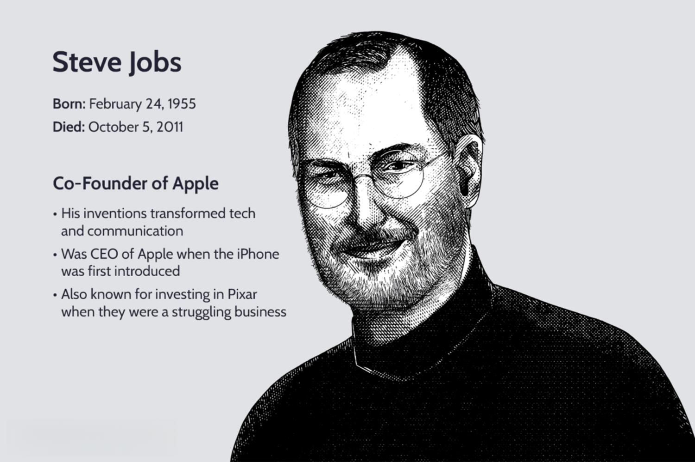

This article explores the significant contributions of Richard H. Redding to the world of financial markets, particularly in algorithmic trading. Richard H. Redding, widely known as Rick Redding, is an influential figure in the financial industry and currently serves as the CEO of the Index Industry Association (IIA). Throughout his career, Redding has been instrumental in shaping the dynamics of financial markets and the evolution of trading practices.

With a career spanning over 25 years, Redding has played pivotal roles in major financial institutions, fundamentally impacting the development of sophisticated trading systems and the structure of financial products. His work at the Chicago Mercantile Exchange (CME) helped pave the way for innovations in electronic trading, significantly influencing the tools and strategies that underpin modern algorithmic trading.

Redding's contributions extend beyond product development. His leadership in the Index Industry Association highlights his commitment to enhancing the global index framework and regulatory practices. This article examines Redding's career journey, focusing on his key contributions to algorithmic trading and the broader financial sector. His work continues to facilitate advancements in financial markets, making him a critical figure in the transition to technology-based trading mechanisms that define contemporary finance.

## Table of Contents

## Career Beginnings and Early Contributions

Richard H. Redding commenced his professional journey in the financial sector as a financial analyst, contributing his expertise to U.S. Medical Equipment and First Republic Bank in Houston, Texas. This initial phase of his career laid the foundation for a significant trajectory in the financial markets. In 1988, he joined the Chicago Mercantile Exchange (CME), a pivotal step that would herald substantial developments in the finance industry.

At CME, Redding's career evolved through a series of progressively influential roles. He started in market surveillance, a critical function that ensured trading activities adhered to established regulations and standards. His astute understanding of market dynamics and regulatory frameworks facilitated his advancement to overseeing product marketing functions. This role positioned Redding at the intersection of innovation and market demand, allowing him to contribute significantly to the development of new financial products.

A notable period in Redding's tenure at the CME was during its merger with the Chicago Board of Trade (CBOT). This merger was a landmark event in the finance industry, leading to the creation of one of the largest and most diverse derivatives marketplaces in the world. Redding's leadership during this period was crucial in driving the integration and expansion of stock index futures and options offerings. These financial instruments became vital tools for hedging and speculating, providing market participants with enhanced capabilities to manage risk and leverage market opportunities.

Redding's early contributions were marked by his ability to navigate complex market environments and identify opportunities for growth and innovation. His strategic initiatives and leadership at CME not only propelled his career but also contributed to transforming the financial landscape, particularly in derivative trading. By laying the groundwork for future advancements, Redding played a key role in shaping the evolution of modern financial markets.

## Major Achievements at CME Group

Richard H. Redding played a significant role at the CME Group as managing director and head of products and services. His primary responsibilities included overseeing global product management, development, and strategic growth initiatives. This role positioned Redding to influence the [course](/wiki/best-algorithmic-trading-courses) of modern financial markets significantly.

One of Redding's notable achievements at the CME Group was the introduction and expansion of the E-mini product line. The E-mini futures contracts, smaller-sized versions of standard futures, were designed to attract a broader range of market participants by offering a more accessible entry point. This innovation catered especially to individual investors and smaller institutional traders, resulting in increased trading volumes. The success of the E-mini contracts demonstrated Redding's foresight in identifying market trends and developing products that met the evolving needs of traders.

Redding also contributed to advances in electronic trading and strategic mergers, which were transformative for the CME Group. During his tenure, he was involved in integrating electronic trading platforms and enhancing [algorithmic trading](/wiki/algorithmic-trading) infrastructure. These developments were critical in transitioning from traditional open outcry trading to electronic platforms, which became the backbone of modern trading practices. Algorithmic trading, relying heavily on electronic execution, benefited immensely from these infrastructural changes, allowing for more efficient and quicker trade executions.

Furthermore, Redding's involvement in strategic mergers, such as the merger between the CME and the Chicago Board of Trade, expanded the range of financial instruments available to traders. This expansion not only diversified the financial products offered but also increased market efficiency and [liquidity](/wiki/liquidity-risk-premium). Through these strategic actions, Redding helped to lay the groundwork for the integrated global trading systems in use today.

In summary, Redding's tenure at the CME Group was marked by significant achievements that propelled the organization to the forefront of financial innovation. His ability to foresee industry shifts and implement strategic initiatives has left an indelible mark on both the CME Group and the broader landscape of algorithmic trading.

## Leadership at the Index Industry Association

Richard H. Redding assumed the position of CEO at the Index Industry Association (IIA) in 2012, becoming the organization's inaugural leader. In his role as CEO, Redding is responsible for spearheading the global education and advocacy efforts for the index industry. The IIA serves as a pivotal institution in the financial sector, representing the global index industry and aiming to foster best practices and ensure the integrity of financial benchmarks.

Redding plays a crucial role in bridging the gap between market participants and regulatory bodies, advocating for robust and transparent practices within the industry. His efforts have been directed towards enhancing the infrastructure of the financial industry by promoting standardized methodologies and fostering an environment conducive to innovation and growth. This includes engaging with stakeholders to discuss and address issues such as the potential risks and challenges associated with indexing and benchmark determination.

Under Redding's leadership, the IIA has positioned itself as an influential voice within the regulatory landscape, aligning with global regulatory frameworks to ensure that the index industry operates within a set of well-defined guidelines and standards. This involves close collaboration with regulatory bodies to address pertinent concerns related to market integrity and investor protection, as well as ensuring that indices are calculated and distributed in a fair and transparent manner.

Redding's commitment to advancing the financial industry's infrastructure is evident through his active participation in international dialogues and working groups, where he advocates for policies and practices that support sustainable economic growth and development. His leadership at the IIA not only reflects his dedication to the index industry but also his broader vision of fostering a resilient and efficient financial ecosystem that aligns with global regulatory standards.

## Redding's Impact on Algorithmic Trading

Richard H. Redding's career has significantly shaped the landscape of algorithmic trading, reflecting his deep involvement in the evolution and adaptation of this critical element of modern financial markets. His innovations in electronic trading have impacted the tools and methodologies that underpin today's algorithmic trading practices.

Redding's early engagements in product offerings and market integration at the Chicago Mercantile Exchange (CME) facilitated the shift towards technology-driven trading mechanisms. He was pivotal in the development and introduction of the E-mini product line, which was specially designed to offer a smaller, more accessible entry point for futures trading, thereby augmenting liquidity and enabling high-frequency trading strategies. This shift played a critical role in making algorithmic trading more prevalent, by accommodating traders who utilized automated systems to execute trades.

Redding's strategic foresight and innovations in electronic trading technology have fostered a conducive environment for algorithmic trading to flourish. The implementation of electronic trading platforms has revolutionized the speed, efficiency, and precision of executing trades, which are fundamental to the success of algorithmic strategies. By promoting the integration of electronic trading systems, Redding laid the foundation for more sophisticated and efficient trade execution, which algorithmic trading depends upon.

Moreover, Redding's influence penetrates through the way algorithmic trading has been formalized within regulatory frameworks. His involvement with market participants and regulatory bodies, particularly through his leadership at the Index Industry Association, has emphasized the need for robust, transparent practices within algorithmic trading. This has not only ensured a fairer trading environment but has also led to the development of more sophisticated risk management tools that algorithmic traders rely on.

Through these strategic initiatives and his forward-thinking approach, Richard H. Redding has transformed algorithmic trading into a cornerstone of modern financial markets, ensuring its ongoing evolution and alignment with technological advancements. His work continues to impact how algorithmic systems are designed and integrated within the broader financial ecosystem, ensuring its critical role in market operations today and in the future.

## Conclusion

Richard H. Redding's contributions have left a lasting imprint on the financial markets and algorithmic trading industries. As both a practitioner and leader, his strategic initiatives have driven technological innovation and market growth. His pioneering efforts in the development of electronic trading platforms and products like the E-mini have significantly advanced trading volumes and market integration. These achievements have provided the foundation for the algorithmic trading systems used widely today. 

Redding's ongoing work with the Index Industry Association ensures his impact will continue to shape the future of financial trading. By promoting best practices and regulatory alignment within the index industry, he has played a critical role in shaping the standards and infrastructure of modern finance. This leadership promotes transparency and efficiency across global markets, essential for the continued development and optimization of algorithmic trading.

His career serves as a dynamic example of the influence one individual can have within the global financial industry. From his beginnings at the Chicago Mercantile Exchange to his current leadership role, Redding has consistently championed the integration of technology and finance. Through his foresight and influence, Redding has not only advanced the field of algorithmic trading but has also set a blueprint for the integration of innovative practices in the financial markets at large. His ongoing contributions continue to define the trajectory of trading technologies and market operations worldwide.

## References & Further Reading

[1]: ["Quantitative Trading: How to Build Your Own Algorithmic Trading Business"](https://www.amazon.com/Quantitative-Trading-Build-Algorithmic-Business/dp/1119800064) by Ernest P. Chan

[2]: ["Advances in Financial Machine Learning"](https://www.amazon.com/Advances-Financial-Machine-Learning-Marcos/dp/1119482089) by Marcos Lopez de Prado

[3]: ["Machine Learning for Algorithmic Trading"](https://github.com/stefan-jansen/machine-learning-for-trading) by Stefan Jansen

[4]: "The Electronic Futures Revolution: How Electronic Trading Transformed Futures Markets" by Henry Sanderson

[5]: Harris, L. (2003). "Trading and Exchanges: Market Microstructure for Practitioners." Oxford University Press.

[6]: ["Evidence-Based Technical Analysis: Applying the Scientific Method and Statistical Inference to Trading Signals"](https://www.amazon.com/Evidence-Based-Technical-Analysis-Scientific-Statistical/dp/0470008741) by David Aronson

[7]: Hasbrouck, J. (2007). "Empirical Market Microstructure: The Institutions, Economics, and Econometrics of Securities Trading." Oxford University Press.