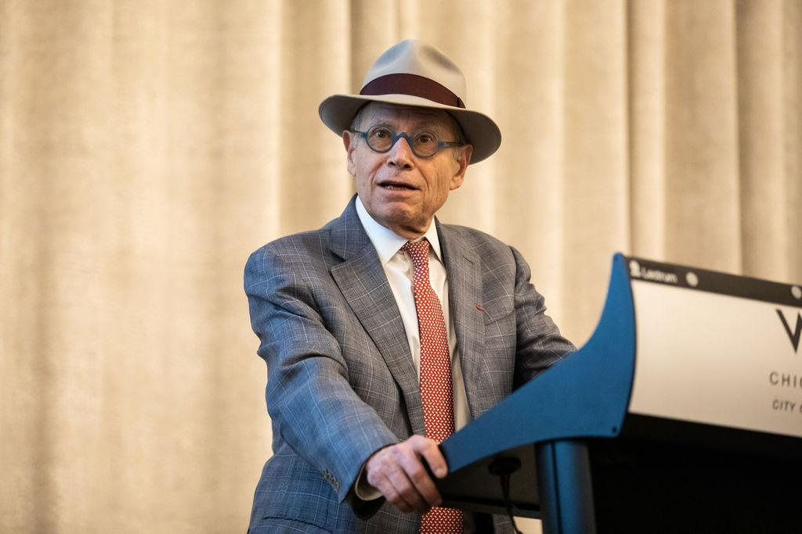

## Table of Contents

## Who is Richard L. Sandor?

Richard L. Sandor is a businessman and economist who has made big changes in how we trade and manage environmental issues. He started the Chicago Climate Exchange, which was the first system in the world where people could trade greenhouse gas emissions. This helped companies reduce their impact on the environment by buying and selling credits.

Before working on environmental issues, Sandor helped create financial products like interest rate futures. These are tools that help banks and businesses manage the risk of changes in interest rates. He has worked at big companies like the Chicago Board of Trade and has written books about his work and ideas.

## What is Richard L. Sandor's educational background?

Richard L. Sandor went to college at City College of New York and got a Bachelor's degree in Business Administration. After that, he went to the University of Minnesota and got a Master's degree in Business Administration. He also studied at the University of Minnesota for a Doctorate in Economics, but he did not finish it.

Later, Sandor went to the University of Chicago to study more. There, he got another Master's degree, this time in Economics. He also started working on a Doctorate in Economics at the University of Chicago, but he left before finishing it to start his career in finance and environmental markets.

## What are some key positions Richard L. Sandor has held in his career?

Richard L. Sandor has had many important jobs in his career. He worked at the Chicago Board of Trade, where he helped create new financial products like interest rate futures. These products help banks and businesses manage risks better. He also started his own company called Environmental Financial Products, LLC, which focused on creating markets for environmental issues.

Later, Sandor founded the Chicago Climate Exchange, which was the first place in the world where people could trade greenhouse gas emissions. This was a big step in helping companies reduce their impact on the environment. He also started other companies like the American Financial Exchange and the Cantor CO2e, which work on similar ideas.

Sandor has also been a teacher and a writer. He taught at Northwestern University's Kellogg School of Management and has written books about his work and ideas. He has been on the boards of many organizations and has advised governments and companies on how to create and use environmental markets.

## What is Richard L. Sandor's contribution to the field of environmental finance?

Richard L. Sandor made a big difference in environmental finance by starting the Chicago Climate Exchange. This was the first place in the world where people could trade greenhouse gas emissions. Before this, there was no easy way for companies to buy and sell credits to reduce their impact on the environment. Sandor's idea helped companies find new ways to be more eco-friendly and manage their emissions better.

Sandor also started other companies like the American Financial Exchange and Cantor CO2e. These companies work on similar ideas, helping to create markets where people can trade things that are good for the environment. His work has shown governments and businesses how they can use markets to fight climate change. By creating these markets, Sandor has made it easier for everyone to take part in protecting the planet.

## How did Richard L. Sandor contribute to the development of the Chicago Climate Exchange?

Richard L. Sandor started the Chicago Climate Exchange, which was the first place where people could trade greenhouse gas emissions. Before this, there was no easy way for companies to buy and sell credits to reduce their impact on the environment. Sandor saw a chance to help companies be more eco-friendly by creating a market where they could trade these credits. He worked hard to make this idea happen, and the Chicago Climate Exchange opened in 2003.

The Chicago Climate Exchange helped companies find new ways to manage their emissions. By trading credits, companies could lower their impact on the environment and save money at the same time. Sandor's work showed that markets could be used to fight climate change. His idea spread to other places and helped more people and businesses take part in protecting the planet.

## What role did Richard L. Sandor play in the creation of financial futures?

Richard L. Sandor helped create financial futures, which are tools that help banks and businesses manage risks. He worked at the Chicago Board of Trade and came up with the idea for interest rate futures. These futures let people buy and sell contracts that predict what interest rates will be in the future. This helps companies plan better and protect themselves from sudden changes in interest rates.

Sandor's work on financial futures changed how the finance world works. Before his ideas, there were not many ways for companies to manage the risk of changing interest rates. By creating interest rate futures, Sandor made it easier for businesses to plan for the future and feel more secure. His work at the Chicago Board of Trade helped make financial markets more stable and useful for everyone.

## What awards and recognitions has Richard L. Sandor received for his work?

Richard L. Sandor has been recognized for his work in many ways. He received the 2007 Honor Award from the International Emissions Trading Association for his big role in starting the Chicago Climate Exchange. This award shows how his work helped the world fight climate change. Sandor also got the 2013 Lifetime Achievement Award from the Futures Industry Association, which honored his long career and big ideas in finance and environmental markets.

He was also named one of Time Magazine's "Heroes of the Environment" in 2007. This list celebrates people who do important work to protect the planet. Sandor's work on the Chicago Climate Exchange and other environmental markets made him a leader in this field. His ideas have helped many people and businesses around the world be more eco-friendly.

## What are some of Richard L. Sandor's published works?

Richard L. Sandor has written a few books about his work and ideas. One of his books is called "Good Derivatives: A Story of Financial and Environmental Innovation." In this book, Sandor talks about how he helped create financial products like interest rate futures and how these products help banks and businesses manage risks. He also explains how he started the Chicago Climate Exchange and how it helps companies reduce their impact on the environment by trading greenhouse gas emissions.

Another book by Sandor is "Sustainable Investing and Environmental Markets: Opportunities in a New Economic Landscape." This book is about how people can invest in ways that are good for the environment. Sandor explains how environmental markets work and how they can help fight climate change. He shares ideas on how businesses and governments can use these markets to be more eco-friendly and make money at the same time.

## How has Richard L. Sandor influenced global carbon markets?

Richard L. Sandor has had a big impact on global carbon markets by starting the Chicago Climate Exchange. This was the first place in the world where people could trade greenhouse gas emissions. Before this, there was no easy way for companies to buy and sell credits to reduce their impact on the environment. Sandor's idea helped companies find new ways to be more eco-friendly by creating a market where they could trade these credits. The Chicago Climate Exchange opened in 2003 and showed that markets could be used to fight climate change.

Sandor's work did not stop with the Chicago Climate Exchange. He also started other companies like the American Financial Exchange and Cantor CO2e. These companies work on similar ideas, helping to create markets where people can trade things that are good for the environment. His work has shown governments and businesses around the world how they can use markets to reduce emissions. By creating these markets, Sandor has made it easier for everyone to take part in protecting the planet. His ideas have spread to other places and helped more people and businesses be more eco-friendly.

## What is Richard L. Sandor's perspective on sustainable investing?

Richard L. Sandor believes that sustainable investing is a smart way to make money while also helping the environment. He thinks that by investing in things that are good for the planet, like renewable energy or eco-friendly products, people can make a profit and also fight climate change. Sandor has written about this in his book "Sustainable Investing and Environmental Markets," where he explains how these investments can work and why they are important.

He sees sustainable investing as a way to create new markets where people can trade things that help the environment. Sandor started the Chicago Climate Exchange, which was the first place where people could trade greenhouse gas emissions. This showed that markets can be used to reduce pollution and make the world a better place. He believes that if more people and businesses invest in sustainable ways, it will help the planet and the economy at the same time.

## What are Richard L. Sandor's current projects or initiatives?

Richard L. Sandor is still working on new ideas to help the environment and the economy. He is involved with the American Financial Exchange (AFX), which he helped start. AFX is a place where people can trade things like interest rates and other financial products. Sandor wants to use this exchange to help banks and businesses manage risks better and make the financial system more stable.

Sandor also works on projects that help fight climate change. He is part of the Environmental Financial Products, LLC, which focuses on creating markets for environmental issues. These markets help companies reduce their impact on the environment by trading credits. Sandor believes that by creating these markets, more people and businesses can take part in protecting the planet.

## How does Richard L. Sandor envision the future of environmental markets?

Richard L. Sandor sees a bright future for environmental markets. He believes that these markets will become more important as more people and businesses want to fight climate change. Sandor thinks that by trading things like greenhouse gas emissions, companies can find new ways to be eco-friendly and make money at the same time. He wants to see more markets like the Chicago Climate Exchange, where people can buy and sell credits to reduce their impact on the environment.

In his vision, environmental markets will help the planet and the economy grow together. Sandor believes that if more people invest in sustainable ways, it will create new jobs and make the world a better place. He thinks that governments and businesses should work together to make these markets bigger and better. By doing this, everyone can help fight climate change and build a greener future.

## References & Further Reading

[1]: Sandor, R. L. (2012). ["Good Derivatives: A Story of Financial and Environmental Innovation"](https://books.google.com/books/about/Good_Derivatives.html?id=jEj2rZsIjUAC). John Wiley & Sons.

[2]: Loeber, J., & Vesting, T. (Eds.). (2011). ["Carbon Trading in Europe: Environmental Policy and the International Economic Order"](https://onlinelibrary.wiley.com/doi/10.1002/cbm.2151). Springer Science & Business Media.

[3]: MacKenzie, D. (2009). ["Making Things the Same: Gases, Emission Rights and the Politics of Carbon Markets"](https://www.sciencedirect.com/science/article/pii/S036136820800010X). Accounting, Organizations and Society.

[4]: Geman, H. (2005). ["Commodities and Commodity Derivatives: Modelling and Pricing for Agriculturals, Metals and Energy"](https://download.e-bookshelf.de/download/0000/5675/90/L-G-0000567590-0015270354.pdf). John Wiley & Sons.

[5]: Harris, L. (2003). ["Trading and Exchanges: Market Microstructure for Practitioners"](https://academic.oup.com/book/52292). Oxford University Press.