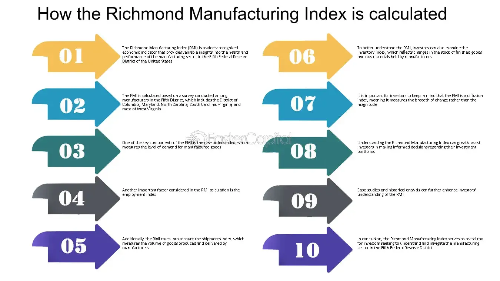

## Table of Contents

## What is the Richmond Manufacturing Index?

The Richmond Manufacturing Index is a report that shows how well factories and businesses that make things are doing in the Fifth Federal Reserve District. This district includes parts of Maryland, North Carolina, South Carolina, Virginia, West Virginia, and all of Washington, D.C. The report comes out every month and helps people understand if the manufacturing part of the economy is growing or shrinking.

The index is made up of numbers that show different parts of manufacturing, like how many new orders are coming in, how much stuff is being shipped, and how many workers are being hired. If the index number is above zero, it means things are getting better. If it's below zero, it means things are getting worse. This information is useful for business owners, investors, and people who make economic policies because it helps them make decisions based on how the manufacturing industry is doing.

## Who publishes the Richmond Manufacturing Index?

The Richmond Manufacturing Index is published by the Federal Reserve Bank of Richmond. This bank is part of the Federal Reserve System, which is the central bank of the United States. The Federal Reserve Bank of Richmond looks after the Fifth Federal Reserve District, which includes parts of Maryland, North Carolina, South Carolina, Virginia, West Virginia, and all of Washington, D.C.

The index comes out every month. It helps people understand how well factories and businesses that make things are doing in this area. The report includes numbers about new orders, shipments, and hiring. If the number is above zero, it means things are getting better. If it's below zero, it means things are getting worse. This information is useful for business owners, investors, and people who make economic policies.

## How often is the Richmond Manufacturing Index released?

The Richmond Manufacturing Index comes out every month. It is a report that shows how well factories and businesses that make things are doing in the Fifth Federal Reserve District. This district includes parts of Maryland, North Carolina, South Carolina, Virginia, West Virginia, and all of Washington, D.C.

The index is made up of numbers that show different parts of manufacturing, like how many new orders are coming in, how much stuff is being shipped, and how many workers are being hired. If the index number is above zero, it means things are getting better. If it's below zero, it means things are getting worse. This information is useful for business owners, investors, and people who make economic policies because it helps them make decisions based on how the manufacturing industry is doing.

## What does the Richmond Manufacturing Index measure?

The Richmond Manufacturing Index measures how well factories and businesses that make things are doing in the Fifth Federal Reserve District. This district includes parts of Maryland, North Carolina, South Carolina, Virginia, West Virginia, and all of Washington, D.C. The index comes out every month and gives a snapshot of the health of the manufacturing industry in this area.

The index looks at several different parts of manufacturing. It checks things like how many new orders are coming in, how much stuff is being shipped out, and how many workers are being hired. If the number of the index is above zero, it means that the manufacturing industry is doing better than the month before. If it's below zero, it means things are not as good as they were the month before. This information helps business owners, investors, and people who make economic policies understand what's happening in the manufacturing world.

## How is the Richmond Manufacturing Index calculated?

The Richmond Manufacturing Index is calculated by taking surveys from businesses in the Fifth Federal Reserve District. This district includes parts of Maryland, North Carolina, South Carolina, Virginia, West Virginia, and all of Washington, D.C. The Federal Reserve Bank of Richmond sends out questionnaires to these businesses every month. The businesses answer questions about different parts of their manufacturing activities, like new orders, shipments, and employment.

After collecting the responses, the Federal Reserve Bank of Richmond calculates the index by looking at the percentage of businesses that report an increase in activity, those that report a decrease, and those that report no change. The index is the difference between the percentage of businesses reporting an increase and those reporting a decrease. If more businesses report an increase than a decrease, the index will be above zero, showing that manufacturing is improving. If more businesses report a decrease than an increase, the index will be below zero, indicating that manufacturing is getting worse.

## What are the main components of the Richmond Manufacturing Index?

The Richmond Manufacturing Index is made up of several important parts that help show how well factories and businesses that make things are doing in the Fifth Federal Reserve District. This district includes parts of Maryland, North Carolina, South Carolina, Virginia, West Virginia, and all of Washington, D.C. The main components of the index include new orders, which tells us how many new requests for products businesses are getting; shipments, which shows how much stuff is being sent out; and employment, which looks at how many workers are being hired or let go.

Each of these components is measured by asking businesses in the area about their experiences over the past month. The Federal Reserve Bank of Richmond sends out a survey, and businesses report if they've seen an increase, a decrease, or no change in these areas. The index is then calculated by taking the difference between the percentage of businesses that report an increase and those that report a decrease. If the index is above zero, it means things are getting better in manufacturing. If it's below zero, it means things are getting worse.

## How can the Richmond Manufacturing Index be used to gauge economic health?

The Richmond Manufacturing Index can help people understand how well the economy is doing by looking at how factories and businesses that make things are doing in the Fifth Federal Reserve District. This district includes parts of Maryland, North Carolina, South Carolina, Virginia, West Virginia, and all of Washington, D.C. If the index number is above zero, it means that manufacturing is doing better than the month before. This can be a good sign for the economy because it shows that businesses are getting more orders, sending out more products, and hiring more workers. When manufacturing is doing well, it often means that other parts of the economy, like retail and services, might also be doing well.

On the other hand, if the index number is below zero, it means that manufacturing is not doing as well as it was the month before. This can be a warning sign for the economy because it might mean that businesses are getting fewer orders, sending out less product, and maybe even letting workers go. When manufacturing struggles, it can affect other parts of the economy too, like how much people spend and how confident they feel about their jobs. So, the Richmond Manufacturing Index is a useful tool for business owners, investors, and people who make economic policies to see if the economy is growing or shrinking.

## What is considered a 'good' or 'bad' reading on the Richmond Manufacturing Index?

A 'good' reading on the Richmond Manufacturing Index is when the number is above zero. This means that more businesses in the Fifth Federal Reserve District, which includes parts of Maryland, North Carolina, South Carolina, Virginia, West Virginia, and all of Washington, D.C., are reporting that things are getting better than those saying things are getting worse. When the index is positive, it shows that manufacturing is growing. This is usually a sign that the economy is doing well because factories are getting more orders, shipping more products, and hiring more workers.

A 'bad' reading on the Richmond Manufacturing Index is when the number is below zero. This means that more businesses are reporting that things are getting worse than those saying things are getting better. When the index is negative, it shows that manufacturing is shrinking. This can be a warning sign for the economy because it might mean that factories are getting fewer orders, shipping less product, and maybe even letting workers go. A negative index can affect other parts of the economy too, like how much people spend and how confident they feel about their jobs.

## How does the Richmond Manufacturing Index compare to other regional manufacturing indices?

The Richmond Manufacturing Index is one of several regional manufacturing indices in the United States. Each index looks at how well factories and businesses that make things are doing in different parts of the country. For example, the Richmond Index covers the Fifth Federal Reserve District, which includes parts of Maryland, North Carolina, South Carolina, Virginia, West Virginia, and all of Washington, D.C. Other indices, like the Philadelphia Fed Manufacturing Index, cover the Third District, which includes parts of Pennsylvania, New Jersey, and Delaware. The Empire State Manufacturing Index looks at the Second District, which includes New York State. Each index is useful for understanding what's happening in manufacturing in these specific areas.

These regional indices are similar because they all use surveys to gather information from businesses about things like new orders, shipments, and employment. They calculate their numbers in a similar way too, by looking at the difference between businesses that report an increase and those that report a decrease in these areas. If the number is above zero, it means things are getting better. If it's below zero, it means things are getting worse. However, because they cover different regions, the numbers can be different. For example, the Richmond Index might show growth while the Philadelphia Index shows a decline. This helps people see how manufacturing is doing in different parts of the country and can give a more complete picture of the national economy.

## What historical trends can be observed in the Richmond Manufacturing Index?

Over the years, the Richmond Manufacturing Index has shown different trends that reflect how manufacturing in the Fifth Federal Reserve District has been doing. One big trend is that the index often goes up and down with the overall economy. When the economy is doing well, the index usually shows positive numbers, meaning more businesses are getting new orders, shipping more products, and hiring more workers. But when the economy is not doing so well, like during a recession, the index often shows negative numbers, showing that manufacturing is struggling. For example, during the Great Recession in 2008 and 2009, the Richmond Manufacturing Index dropped a lot, showing how hard the manufacturing industry was hit.

Another trend we can see is how the index sometimes shows quick changes in manufacturing activity. For example, if there's a big event like a new trade policy or a natural disaster, the index can change a lot from one month to the next. This shows how sensitive manufacturing can be to what's happening in the world. Also, over the long term, the Richmond Manufacturing Index has helped show how manufacturing in the region has changed. Sometimes, the index stays positive for a long time, which shows that manufacturing is growing steadily. Other times, it might stay negative, showing that the industry is facing challenges for a while.

## How do changes in the Richmond Manufacturing Index influence financial markets?

Changes in the Richmond Manufacturing Index can have a big effect on financial markets. When the index goes up, it often means that factories and businesses in the Fifth Federal Reserve District are doing better. This can make investors feel good about the economy, so they might buy more stocks and other investments. This can push stock prices up and make the financial markets go up too. On the other hand, if the index goes down, it can make investors worried. They might think the economy is not doing well, so they might sell their stocks and other investments. This can make stock prices go down and the financial markets can go down too.

The Richmond Manufacturing Index is just one part of a bigger picture, but it's an important part. People who work in financial markets, like traders and investors, watch this index closely because it can give them clues about what might happen next in the economy. If the index shows that manufacturing is growing, it can make people feel more confident about spending money and making investments. But if the index shows that manufacturing is shrinking, it can make people feel less sure about the future, which can lead them to be more careful with their money. So, changes in the Richmond Manufacturing Index can cause big moves in financial markets, depending on what the numbers show.

## What are the limitations and criticisms of the Richmond Manufacturing Index?

The Richmond Manufacturing Index has some limitations that people should know about. One big problem is that it only looks at a small part of the country, the Fifth Federal Reserve District. This means it might not tell us the whole story about what's happening in manufacturing across the United States. Also, the index is based on what businesses say in a survey, and sometimes these answers can be a bit off. For example, businesses might not always know exactly how things are going, or they might guess wrong about the future. This can make the index less accurate.

Another criticism is that the Richmond Manufacturing Index can change a lot from month to month. This can make it hard to see the big picture and understand what's really going on in the economy. Some people also think that the index might not be as important as other economic reports because it only looks at manufacturing and not other parts of the economy, like services or retail. So, while the Richmond Manufacturing Index is helpful, it's important to use it along with other information to get a better idea of how the economy is doing.

## What are the practical applications in algo trading?

Algorithmic trading has become an integral part of modern financial markets, driven by technological advancements and the availability of real-time economic data. The Richmond Manufacturing Index, as a key economic indicator, has been instrumental in influencing trading strategies within this domain. This section explores practical applications of using the Richmond Manufacturing Index in algorithmic trading.

One notable case study involves the incorporation of the Richmond Manufacturing Index into predictive analytics models utilized by hedge funds and proprietary trading firms. These entities often employ sophisticated statistical models and machine learning algorithms to forecast market movements. For instance, a trading algorithm might be designed to analyze the historical correlation between the Richmond Manufacturing Index and stock market indices such as the S&P 500. By implementing a regression analysis, the algorithm can predict potential market reactions to changes in the Index. In practice, this might involve calculating the regression line:

$$
Y = \beta_0 + \beta_1 \times \text{Richmond Manufacturing Index} + \epsilon
$$

where $Y$ represents the market index value, $\beta_0$ and $\beta_1$ are coefficients, and $\epsilon$ is the error term. Such models can be pivotal in forming trading strategies that capitalize on anticipated economic shifts indicated by the Index.

Optimizing trading strategies based on economic indicator fluctuations is another critical application. Traders might use the Richmond Manufacturing Index's data to adjust their positions depending on whether the data suggests an expanding or contracting manufacturing sector. For example, a drop in new orders reported by the Index might signal an impending slowdown, prompting traders to adopt more conservative positions or even short certain stocks. Conversely, a surge in employment can indicate sector growth, influencing traders to increase their long positions.

Technological advancements have further enhanced the integration of economic data into trading systems. With the proliferation of high-frequency trading platforms, algorithms can now react to newly released data within milliseconds. Trading systems are increasingly incorporating API services to ingest the Richmond Manufacturing Index data in real-time, allowing algorithms to adjust trading decisions instantaneously. Python libraries like Pandas and NumPy are commonly employed for data manipulation and analysis, enabling efficient processing of large datasets.

```python
import pandas as pd
import numpy as np

# Example: Using Pandas to read Richmond Manufacturing Index data
data = pd.read_csv('richmond_index_data.csv')
current_index_value = data['Index Value'].iloc[-1]

# Simple decision rule based on Index value
def trading_strategy(index_value):
    if index_value > 50:
        return "Long Position"
    elif index_value < 50:
        return "Short Position"
    else:
        return "Hold"

strategy_decision = trading_strategy(current_index_value)
print(f"Trading Decision: {strategy_decision}")
```

Continually evolving trends indicate a future where economic indicators will play an even more significant role in algorithmic trading. As machine learning and artificial intelligence technologies advance, the accuracy and efficiency of algorithms that utilize economic data are expected to improve. Emerging trends might include the development of hybrid models that combine structured data like the Richmond Manufacturing Index with unstructured data from news reports and social media to enhance predictive accuracy.

In conclusion, economic indicators like the Richmond Manufacturing Index are invaluable tools in the arsenal of algorithmic trading. By utilizing these indices, traders can refine strategies, optimize performance, and gain insights into market dynamics, all while adapting to the fast-paced and ever-evolving nature of financial markets.

## References & Further Reading

[1]: ["Federal Reserve Bank of Richmond - Manufacturing Index Releases"](https://tradingeconomics.com/united-states/richmond-fed-manufacturing-index)

[2]: "Capital Ideas Evolving" by Peter L. Bernstein

[3]: ["Advances in Financial Machine Learning"](https://www.amazon.com/Advances-Financial-Machine-Learning-Marcos/dp/1119482089) by Marcos Lopez de Prado

[4]: ["Algorithmic Trading: Winning Strategies and Their Rationale"](https://www.wiley.com/en-us/Algorithmic+Trading%3A+Winning+Strategies+and+Their+Rationale-p-9781118746912) by Ernest P. Chan

[5]: ["Richmond Fed Economic Briefs"](https://www.richmondfed.org/publications/research/economic_brief/) - Publications on regional economic indicators and their implications.