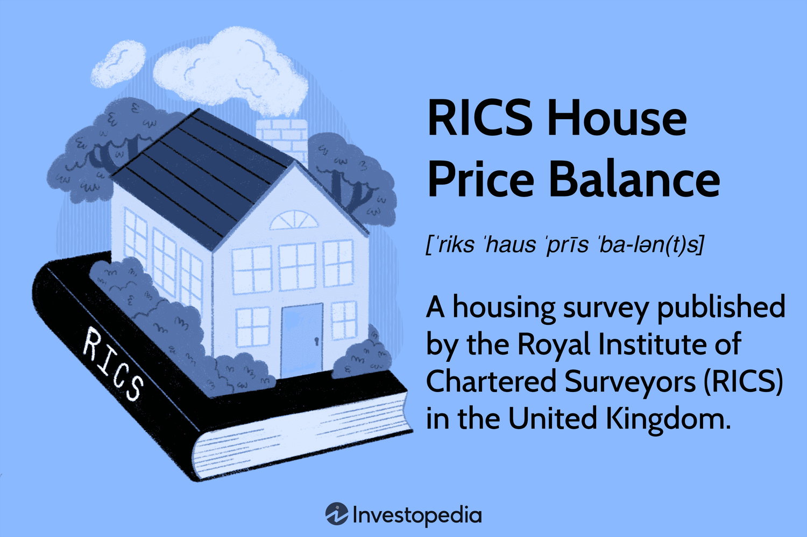

## Table of Contents

## What is the RICS House Price Balance?

The RICS House Price Balance is a measure used to understand the trends in the housing market. It is put out by the Royal Institution of Chartered Surveyors (RICS). The balance is calculated by taking the percentage of surveyors who report a rise in house prices and subtracting the percentage of surveyors who report a fall in house prices. A positive number means more surveyors saw prices going up, while a negative number means more saw prices going down.

This measure is important because it gives a good snapshot of what's happening in the housing market across different regions. It helps people like home buyers, sellers, and policymakers understand if house prices are generally increasing or decreasing. The RICS House Price Balance is released every month, so it's a timely indicator that people can use to make informed decisions about buying or selling property.

## Who compiles the RICS House Price Balance?

The RICS House Price Balance is put together by the Royal Institution of Chartered Surveyors, or RICS for short. They ask a bunch of surveyors from all over the UK about what's happening with house prices in their areas. These surveyors tell RICS if they think prices are going up, staying the same, or going down.

Every month, RICS takes all this information and figures out the House Price Balance. They do this by taking the percentage of surveyors who say prices are going up and subtracting the percentage of surveyors who say prices are going down. This number helps everyone from people looking to buy a home to those making big decisions about the economy understand what's happening with house prices across the country.

## How often is the RICS House Price Balance released?

The RICS House Price Balance comes out every month. This means that once a month, people can see the latest numbers and understand if house prices are going up or down.

It's helpful because it gives a fresh look at what's happening in the housing market. People like home buyers, sellers, and even big decision-makers in the government can use this information to make smart choices about buying or selling homes.

## What does a positive RICS House Price Balance indicate?

A positive RICS House Price Balance means that more surveyors are seeing house prices go up than seeing them go down. It's like a thumbs up for the housing market, showing that things are getting more expensive.

This number is important because it helps people understand the overall trend. If the balance is positive, it might mean it's a good time to sell a house because prices are rising. But if you're thinking about buying, you might want to act quickly before prices go up even more.

## What does a negative RICS House Price Balance indicate?

A negative RICS House Price Balance means that more surveyors are seeing house prices go down than seeing them go up. It's like a warning sign that the housing market might be cooling off or prices are dropping.

This information is useful for people looking to buy or sell homes. If the balance is negative, it might be a good time to buy because prices could be lower. But if you're thinking about selling, you might want to wait and see if the market picks up again.

## How is the RICS House Price Balance calculated?

The RICS House Price Balance is figured out by asking surveyors across the UK about what they see happening with house prices in their areas. They tell the Royal Institution of Chartered Surveyors, or RICS, if prices are going up, staying the same, or going down. 

To get the balance, RICS takes the percentage of surveyors who say prices are going up and subtracts the percentage of surveyors who say prices are going down. If the number is positive, it means more surveyors saw prices going up. If it's negative, more saw prices going down. This helps everyone understand if the housing market is getting more expensive or less expensive.

## What regions does the RICS House Price Balance cover?

The RICS House Price Balance covers all regions of the United Kingdom. This includes big areas like England, Scotland, Wales, and Northern Ireland. They break it down even more to look at smaller regions within these countries, like the North East, the South West, and London in England.

By looking at all these different places, the RICS House Price Balance gives a full picture of what's happening with house prices all over the UK. This helps people see if prices are going up or down in their own area or in other parts of the country. It's useful for anyone thinking about buying or selling a home because it shows trends in different regions.

## How does the RICS House Price Balance differ from other housing market indicators?

The RICS House Price Balance is different from other housing market indicators because it's based on what surveyors see happening in their areas. Other indicators might use data from property sales, mortgage approvals, or government [statistics](/wiki/bayesian-statistics). The RICS balance is unique because it's a monthly snapshot that comes from the people who are out there looking at homes every day. This makes it a more immediate and personal look at what's happening with house prices.

Another way it's different is that it covers all regions of the UK and breaks down the data into smaller areas. Some other indicators might focus on national trends or only look at big cities. The RICS balance gives a detailed view, which helps people see how house prices are changing in their own neighborhoods, not just across the whole country. This regional focus can be really helpful for someone deciding whether to buy or sell a home in a specific area.

## What are the limitations of the RICS House Price Balance?

The RICS House Price Balance can be useful, but it has some limitations. One big one is that it's based on what surveyors think, not on actual sales data. This means it's more of a guess about what's happening with house prices rather than a hard fact. Surveyors might see things differently or might not always be right about what's going to happen next.

Another limitation is that it doesn't tell the whole story about the housing market. It only looks at whether prices are going up or down, but it doesn't say anything about how many homes are being sold or how easy it is to get a mortgage. These other things can be just as important for understanding what's happening in the housing market. So, while the RICS House Price Balance is helpful, it's best to look at it along with other indicators to get a full picture.

## How can the RICS House Price Balance be used to forecast future housing market trends?

The RICS House Price Balance can help people guess what might happen with house prices in the future. It does this by showing what surveyors are seeing right now. If the balance is positive and more surveyors are seeing prices go up, it might mean that prices will keep going up for a while. On the other hand, if the balance is negative and more surveyors are seeing prices go down, it could mean that prices might keep falling.

But, it's important to remember that the RICS House Price Balance is just one piece of the puzzle. It's based on what surveyors think, not on actual sales data, so it's not always perfect. To get a better idea of what might happen in the future, it's a good idea to look at other things too, like how many homes are being sold, how easy it is to get a mortgage, and what's happening with the economy. By putting all these pieces together, people can make smarter guesses about where the housing market is headed.

## What historical trends can be observed from the RICS House Price Balance data?

Looking at the RICS House Price Balance over time, we can see some interesting patterns. For example, during times when the economy is doing well, the balance often stays positive for a long time. This means more surveyors are seeing house prices go up, which makes sense because people feel more confident about buying homes when they have good jobs and money to spend. On the other hand, during economic downturns, like the big financial crisis in 2008, the balance can turn negative for a while. This shows that more surveyors are seeing prices go down, which can happen when people are worried about their jobs and money.

Another trend we can see is how the balance can change from one region to another. Sometimes, the balance might be positive in one part of the UK, like London, but negative in another part, like the North East. This shows that the housing market can be different in different places. Over the years, we've also seen that the balance can swing a lot from month to month, which tells us that the housing market can be pretty unpredictable. By looking at these historical trends, people can get a better idea of how the housing market has moved in the past and maybe even guess a little about what might happen next.

## How do economic factors influence the RICS House Price Balance?

Economic factors play a big role in the RICS House Price Balance. When the economy is doing well, people usually have more money and feel more confident about buying homes. This can lead to more surveyors seeing house prices go up, which makes the balance positive. On the other hand, when the economy is struggling, like during a recession, people might be worried about their jobs and money. This can make them less likely to buy homes, causing more surveyors to see prices going down, and the balance turns negative.

Interest rates are another important economic [factor](/wiki/factor-investing). When interest rates are low, it's cheaper for people to borrow money to buy a home. This can push house prices up because more people can afford to buy, leading to a positive balance. But if interest rates go up, borrowing money becomes more expensive, which can slow down the housing market and make the balance negative. So, the RICS House Price Balance can show us how these economic factors are affecting what surveyors see in the housing market.

## What is the RICS House Price Balance and how can it be understood?

The RICS House Price Balance serves as a pivotal metric for gauging trends in the UK housing market. This indicator is derived from surveys conducted by the Royal Institution of Chartered Surveyors (RICS), targeting property surveyors across the UK. These surveys result in a net balance figure, computed by subtracting the percentage of surveyors who report a fall in house prices from those who report a rise. Mathematically, this can be expressed as:

$$

\text{Net Balance} = \%(\text{Reported Rise}) - \%(\text{Reported Fall})
$$

This net balance is instrumental for economists and investors because it provides an early indication of shifts in the housing market, which can precede changes in consumer spending patterns and broader economic conditions. A positive net balance signals that a higher proportion of surveyors are observing an increase in house prices, suggesting a robust housing market. In contrast, a negative balance indicates a trend of declining prices, pointing to potential weaknesses within the market.

The RICS House Price Balance stands as a leading indicator, offering foresight into future economic activity. This is because movements in house prices often reflect underlying economic forces such as employment rates, wage growth, and consumer confidence. As these prices fluctuate, they can significantly affect household wealth and, consequently, consumer spending behavior.

By closely monitoring the RICS House Price Balance, investors can obtain crucial insights into the UK's economic landscape. This insight aids in making informed decisions about real estate investments, financial planning, and policy-making. For economists, this indicator is a valuable tool for forecasting economic health and potential market adjustments. Ultimately, the RICS House Price Balance is an essential component of understanding and predicting the intricate dynamics of the housing market.

## References & Further Reading

[1]: Bergstra, J., Bardenet, R., Bengio, Y., & Kégl, B. (2011). ["Algorithms for Hyper-Parameter Optimization."](https://papers.nips.cc/paper/4443-algorithms-for-hyper-parameter-optimization) Advances in Neural Information Processing Systems 24.

[2]: ["Advances in Financial Machine Learning"](https://www.amazon.com/Advances-Financial-Machine-Learning-Marcos/dp/1119482089) by Marcos Lopez de Prado

[3]: ["Evidence-Based Technical Analysis: Applying the Scientific Method and Statistical Inference to Trading Signals"](https://www.amazon.com/Evidence-Based-Technical-Analysis-Scientific-Statistical/dp/0470008741) by David Aronson

[4]: ["Machine Learning for Algorithmic Trading"](https://github.com/stefan-jansen/machine-learning-for-trading) by Stefan Jansen

[5]: ["Quantitative Trading: How to Build Your Own Algorithmic Trading Business"](https://www.amazon.com/Quantitative-Trading-Build-Algorithmic-Business/dp/1119800064) by Ernest P. Chan