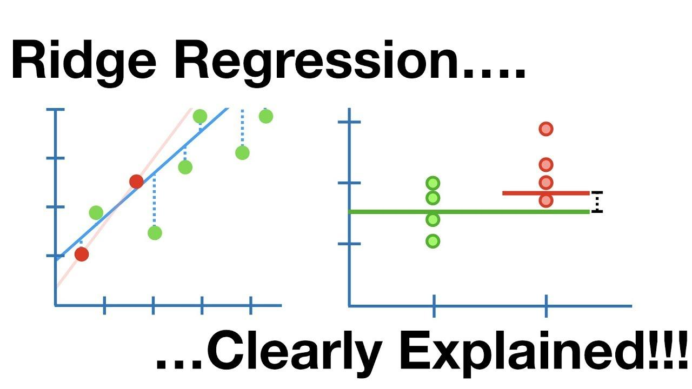

## Table of Contents

## What is Ridge Regularization in the context of machine learning?

Ridge regularization is a technique used in machine learning to prevent overfitting by adding a penalty to the model's complexity. When training a model, we want it to learn from the data without memorizing it too closely, which can lead to poor performance on new, unseen data. Ridge regularization achieves this by adding a term to the loss function that discourages large weights. The added term is proportional to the square of the magnitude of the coefficients, which is why it's also known as L2 regularization. This encourages the model to use all the features but with smaller weights, leading to a more generalized model.

Mathematically, if we have a linear regression model, the loss function with ridge regularization can be written as $$ \text{Loss} = \sum_{i=1}^{n} (y_i - \hat{y}_i)^2 + \lambda \sum_{j=1}^{p} \beta_j^2 $$. Here, the first term is the usual mean squared error, and the second term is the ridge penalty. The parameter $$\lambda$$ controls the strength of the penalty; a higher $$\lambda$$ means more regularization, leading to smaller coefficients. By tuning $$\lambda$$, we can find a balance between fitting the training data well and keeping the model simple enough to perform well on new data.

## How does Ridge Regularization differ from ordinary least squares regression?

Ridge regularization and ordinary least squares (OLS) regression are both methods used to find the best fit line for a set of data, but they differ in how they handle the complexity of the model. In OLS regression, the goal is to minimize the sum of the squared differences between the observed values and the predicted values. This is done without any additional constraints on the size of the coefficients, which can sometimes lead to overfitting, especially when dealing with a large number of features or noisy data.

Ridge regularization adds a penalty to the OLS loss function to prevent overfitting. This penalty is proportional to the square of the magnitude of the coefficients, which is known as L2 regularization. Mathematically, the loss function for ridge regression is $$ \text{Loss} = \sum_{i=1}^{n} (y_i - \hat{y}_i)^2 + \lambda \sum_{j=1}^{p} \beta_j^2 $$. Here, the first term is the same as in OLS, but the second term, controlled by the parameter $$\lambda$$, discourages the model from using very large coefficients. This results in a model that is less likely to overfit by keeping the coefficients smaller and more balanced.

## What is the mathematical formula for Ridge Regression?

Ridge regression is a way to make a model that fits the data well but doesn't get too complicated. It does this by adding a special term to the usual formula for finding the best fit line. This special term is called a penalty, and it helps keep the model simple by making the numbers that the model uses to predict (called coefficients) smaller.

The formula for ridge regression looks like this: $$ \text{Loss} = \sum_{i=1}^{n} (y_i - \hat{y}_i)^2 + \lambda \sum_{j=1}^{p} \beta_j^2 $$. The first part, $$ \sum_{i=1}^{n} (y_i - \hat{y}_i)^2 $$, is just like the formula for ordinary least squares regression. It measures how far off the model's predictions are from the actual data. The second part, $$ \lambda \sum_{j=1}^{p} \beta_j^2 $$, is the penalty that ridge regression adds. Here, $$ \lambda $$ is a number that you can choose to make the penalty stronger or weaker. The bigger $$ \lambda $$ is, the more the model will try to keep the coefficients small, which helps prevent the model from getting too complicated and fitting the data too closely.

## Why is Ridge Regularization used in machine learning?

Ridge regularization is used in machine learning to help make models that work well with new data, not just the data they were trained on. When a model is too complicated and fits the training data too closely, it might not do a good job with new data. This is called overfitting. Ridge regularization helps prevent this by adding a penalty to the model's complexity. This penalty makes the model use smaller numbers (called coefficients) to predict, which helps keep the model simple and more likely to work well with new data.

The penalty added by ridge regularization is based on the square of the coefficients. Mathematically, if we have a linear regression model, the loss function with ridge regularization can be written as $$ \text{Loss} = \sum_{i=1}^{n} (y_i - \hat{y}_i)^2 + \lambda \sum_{j=1}^{p} \beta_j^2 $$. The first part of this formula is the usual way to measure how well the model fits the data, and the second part is the penalty. The parameter $$ \lambda $$ controls how strong the penalty is. A bigger $$ \lambda $$ means more regularization, which leads to smaller coefficients and a simpler model. By choosing the right $$ \lambda $$, we can balance fitting the training data well and keeping the model simple enough to work well on new data.

## How does the regularization parameter (lambda) affect the Ridge Regression model?

The regularization parameter, often called lambda ($$ \lambda $$), plays a big role in how Ridge Regression works. It controls how much the model is penalized for using big numbers (coefficients) to make predictions. When $$ \lambda $$ is small, the penalty is weak, and the model can use bigger coefficients. This means the model might fit the training data really well but could overfit, meaning it might not work as well with new data. On the other hand, when $$ \lambda $$ is big, the penalty is strong, and the model is forced to use smaller coefficients. This makes the model simpler and less likely to overfit, but it might not fit the training data as closely.

Choosing the right $$ \lambda $$ is important because it helps balance fitting the training data well and keeping the model simple enough to work well on new data. If $$ \lambda $$ is too small, the model might be too complex and overfit. If $$ \lambda $$ is too big, the model might be too simple and underfit, meaning it doesn't capture the patterns in the data well enough. By tuning $$ \lambda $$, you can find the sweet spot where the model performs well on both the training data and new, unseen data.

## What are the benefits of using Ridge Regularization over other regularization techniques?

Ridge regularization is good at keeping all the features in the model but making sure none of them get too important. It does this by adding a penalty to the model's complexity based on the square of the coefficients, which is called L2 regularization. This means that even if some features are not very helpful, they still stay in the model but with smaller numbers. This can be really useful when you think all your features might have some information to give, even if it's not a lot. The formula for ridge regression is $$ \text{Loss} = \sum_{i=1}^{n} (y_i - \hat{y}_i)^2 + \lambda \sum_{j=1}^{p} \beta_j^2 $$, where the first part measures how well the model fits the data, and the second part is the penalty that keeps the coefficients small.

Another benefit of ridge regularization is how it handles multicollinearity, which is when some of your features are closely related to each other. In regular least squares regression, this can make the model unstable because small changes in the data can lead to big changes in the coefficients. But ridge regularization helps by shrinking the coefficients, which makes the model more stable. This means that even if your features are related, the model won't swing wildly when you change the data a little bit. By choosing the right value for $$ \lambda $$, you can control how much the model is penalized, helping you find a good balance between fitting the data well and keeping the model simple.

## How can you choose the optimal value of lambda in Ridge Regression?

Choosing the best value for lambda ($$ \lambda $$) in ridge regression is important because it helps the model work well with new data. One way to find the best lambda is by using a method called cross-validation. Cross-validation splits the data into different parts, trains the model on some of the parts, and then tests it on the other parts. By trying different values of lambda and seeing how well the model does on the test parts, you can pick the lambda that makes the model perform the best. This helps make sure the model isn't just good at fitting the training data but also works well with new data it hasn't seen before.

Another way to choose the optimal lambda is by using a technique called grid search. In grid search, you pick a range of lambda values and test each one to see which gives the best results. You can use a formula to measure how well the model does, like the mean squared error (MSE). The lambda that gives the lowest MSE is the one you should use. Here's a simple example of how you might do this in Python using the scikit-learn library:

```python
from sklearn.linear_model import Ridge
from sklearn.model_selection import GridSearchCV
import numpy as np

# Assume X and y are your features and target variables
ridge = Ridge()
param_grid = {'alpha': np.logspace(-3, 3, 100)}  # alpha is lambda in scikit-learn
grid_search = GridSearchCV(ridge, param_grid, cv=5, scoring='neg_mean_squared_error')
grid_search.fit(X, y)

best_lambda = grid_search.best_params_['alpha']
print(f"The best lambda value is: {best_lambda}")
```

By using cross-validation or grid search, you can find the lambda that makes your ridge regression model perform the best, helping it to be more accurate and reliable when it's used on new data.

## Can you explain the concept of bias-variance tradeoff in the context of Ridge Regularization?

The bias-variance tradeoff is about finding the right balance in how a model makes predictions. In simple terms, bias is how much the model's predictions are off from the true values, and variance is how much the predictions change if you use different sets of data. When you use Ridge Regularization, you're trying to lower the variance of your model by adding a penalty to the size of the coefficients. This penalty, which is $$ \lambda \sum_{j=1}^{p} \beta_j^2 $$ in the formula for ridge regression, makes the model simpler and less likely to fit the training data too closely, which helps reduce variance. But, as you make the model simpler, it might not capture all the patterns in the data as well, which can increase the bias.

So, when you choose the value of lambda ($$ \lambda $$) in Ridge Regularization, you're deciding how much you want to trade off between bias and variance. A small lambda means less penalty, so the model can be more complex and fit the training data better, which might lower the bias but increase the variance. On the other hand, a large lambda means more penalty, making the model simpler and reducing variance, but it might increase the bias because the model can't fit the data as well. By tuning lambda, you're trying to find the sweet spot where the model performs well on both the training data and new, unseen data, balancing the bias and variance to get the best overall performance.

## How does Ridge Regularization handle multicollinearity in datasets?

Ridge regularization helps deal with multicollinearity, which happens when some of your features are closely related to each other. In regular least squares regression, multicollinearity can make the model unstable because small changes in the data can lead to big changes in the coefficients. But ridge regularization adds a penalty to the size of the coefficients, which is $$ \lambda \sum_{j=1}^{p} \beta_j^2 $$. This penalty shrinks the coefficients, making the model more stable. So, even if your features are related, the model won't swing wildly when you change the data a little bit.

By using ridge regularization, you can control how much the model is affected by multicollinearity. The parameter lambda ($$ \lambda $$) decides how strong the penalty is. If you choose a bigger lambda, the penalty is stronger, and the coefficients get smaller, which helps the model stay stable even when the features are closely related. This way, ridge regularization makes sure the model works well and doesn't get thrown off by multicollinearity.

## What are some practical applications of Ridge Regression in real-world scenarios?

Ridge regression is used in many real-world situations where you want to predict something but need to make sure the model doesn't get too complicated. For example, in finance, people might use ridge regression to predict stock prices or to figure out how different economic factors affect the market. By using ridge regression, they can include a lot of different factors in their model without worrying that the model will overfit to the past data and not work well with new data. The formula for ridge regression, $$ \text{Loss} = \sum_{i=1}^{n} (y_i - \hat{y}_i)^2 + \lambda \sum_{j=1}^{p} \beta_j^2 $$, helps keep the model simple by adding a penalty to the size of the coefficients, which makes the predictions more reliable.

Another practical use of ridge regression is in healthcare, where it can be used to predict patient outcomes based on a variety of medical data. For instance, doctors might want to predict the risk of a disease using many different health indicators. Ridge regression helps by allowing all these indicators to be included in the model while keeping the model from getting too complex. This way, the model can still use all the available information but won't be thrown off by small changes in the data, making the predictions more stable and useful for real-world decision-making.

## How does Ridge Regularization perform in comparison to Lasso Regression, especially in terms of feature selection?

Ridge regularization and Lasso regression are both ways to make a model simpler and better at predicting new data. The big difference between them is how they treat the numbers (called coefficients) used to make predictions. Ridge regularization adds a penalty to the size of the coefficients based on their squares, which is $$ \lambda \sum_{j=1}^{p} \beta_j^2 $$. This makes all the coefficients smaller but keeps them all in the model. On the other hand, Lasso regression adds a penalty based on the absolute value of the coefficients, which is $$ \lambda \sum_{j=1}^{p} |\beta_j| $$. This can make some coefficients exactly zero, which means those features are not used in the model at all. So, Lasso regression can be used for feature selection because it can remove features that are not very helpful.

In terms of feature selection, Ridge regularization is not as good as Lasso regression. Ridge regularization will keep all the features in the model but with smaller coefficients, even if some features are not very important. This can be good if you think all your features might have some useful information, even if it's not a lot. But if you want to find out which features are really important and which ones you can ignore, Lasso regression is better because it can set some coefficients to zero, effectively removing those features from the model. So, if feature selection is important for your project, Lasso regression might be a better choice than Ridge regularization.

## What are the limitations and potential drawbacks of using Ridge Regularization in machine learning models?

Ridge regularization is a good way to make a model simpler and better at predicting new data by adding a penalty to the size of the coefficients, which is $$ \lambda \sum_{j=1}^{p} \beta_j^2 $$. But it has some limitations. One big problem is that ridge regularization doesn't do feature selection. It keeps all the features in the model but makes their coefficients smaller. This can be bad if you have a lot of features and some of them are not important at all. You might end up with a model that's still too complex because it's using features that don't help much.

Another drawback is that choosing the right value for lambda ($$ \lambda $$) can be tricky. If you pick a lambda that's too small, the model might still overfit because the penalty isn't strong enough to make the model simple. If you pick a lambda that's too big, the model might become too simple and not fit the data well, which is called underfitting. Finding the best lambda often needs a lot of testing and can take a lot of time, especially if you have a big dataset. This can make it harder to use ridge regularization in some real-world situations where you need quick results.