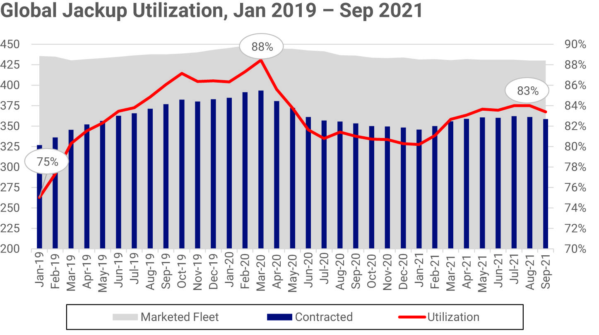

## Table of Contents

## What is the Rig Utilization Rate?

The Rig Utilization Rate is a measure used in the oil and gas industry to show how busy drilling rigs are. It tells us the percentage of rigs that are currently being used out of all the rigs available. This rate is important because it helps companies and investors understand how active the drilling market is. If the rate is high, it means many rigs are working, which usually means the industry is doing well. If the rate is low, it might mean there is less demand for drilling.

This rate can change because of many things, like the price of oil, new technology, or even government rules. For example, if oil prices go up, companies might want to drill more, so the rig utilization rate could go up too. On the other hand, if new laws make drilling harder or more expensive, companies might use fewer rigs, and the rate could go down. Keeping an eye on the rig utilization rate helps people in the industry make smart decisions about where to invest their money and how to plan for the future.

## Why is the Rig Utilization Rate important in the oil and gas industry?

The Rig Utilization Rate is really important in the oil and gas industry because it shows how busy the drilling rigs are. It tells us what percentage of all the available rigs are actually being used to drill for oil and gas. This information is super helpful for companies and investors because it gives them an idea of how active the drilling market is. When the rate is high, it means a lot of rigs are working, which usually means the industry is doing well and there's a strong demand for oil and gas.

On the other hand, if the Rig Utilization Rate is low, it might mean that there's less demand for drilling, which could be because of lower oil prices or other reasons. Companies use this rate to make decisions about where to spend their money and how to plan for the future. For example, if they see the rate going up, they might decide to buy more rigs or invest in new projects. If it's going down, they might hold off on new investments and focus on saving money instead.

## How is the Rig Utilization Rate calculated?

The Rig Utilization Rate is calculated by dividing the number of rigs that are actively drilling by the total number of rigs available, and then multiplying the result by 100 to get a percentage. For example, if there are 100 rigs available and 80 of them are drilling, you would divide 80 by 100 to get 0.8, then multiply by 100 to get a Rig Utilization Rate of 80%.

This calculation can be done for different areas or the whole world, depending on what information you want. Companies and industry watchers often look at this rate to see how busy the drilling market is. It's a simple but important way to understand if the oil and gas industry is doing well or not.

## What factors can affect the Rig Utilization Rate?

The Rig Utilization Rate can go up or down because of many different things. One big [factor](/wiki/factor-investing) is the price of oil. When oil prices are high, oil companies want to drill more to make more money, so they use more rigs and the rate goes up. But if oil prices fall, companies might not want to drill as much because it's not as profitable, so they use fewer rigs and the rate drops. Another factor is new technology. If new drilling technology comes out that makes drilling easier or cheaper, companies might use more rigs to take advantage of it, pushing the rate up.

Government rules and regulations also play a big role. If the government makes new laws that make drilling harder or more expensive, companies might use fewer rigs, which would lower the rate. On the other hand, if the government offers incentives or makes it easier to drill, more rigs might be used and the rate could go up. The overall demand for oil and gas around the world is another key factor. If there's a lot of demand, companies will use more rigs to meet it, increasing the rate. But if demand drops, fewer rigs will be needed, and the rate will go down.

Economic conditions can also affect the Rig Utilization Rate. During good economic times, when businesses and people are spending more money, there's usually more demand for oil and gas, so more rigs are used. But in tough economic times, when people are saving money and using less oil and gas, the demand goes down and fewer rigs are needed, lowering the rate. All these factors together can make the Rig Utilization Rate go up or down, showing how busy the drilling market is.

## Can you explain the difference between operational and non-operational rigs?

Operational rigs are the ones that are actually drilling for oil and gas. They are busy and working, doing the job they were made for. When people talk about the Rig Utilization Rate, they are counting these operational rigs because they show how active the drilling market is. If there are a lot of operational rigs, it means the industry is doing well and there's a strong demand for drilling.

Non-operational rigs, on the other hand, are not being used to drill. They might be sitting idle because they're waiting for a new project to start, or maybe they're being repaired or maintained. Sometimes, non-operational rigs are just not needed because there's not enough demand for drilling. These rigs are still part of the total number of rigs available, but they don't count towards the Rig Utilization Rate because they're not actively drilling.

## How does the Rig Utilization Rate impact drilling efficiency?

The Rig Utilization Rate can tell us a lot about how efficient drilling is in the oil and gas industry. When the rate is high, it means most of the rigs are being used, which can lead to better efficiency. Companies might be able to drill more wells and find more oil and gas because they're using their equipment a lot. High utilization can also mean that the rigs are being used in a smart way, focusing on the most promising areas to drill.

But if the Rig Utilization Rate is low, it can be a sign that drilling isn't as efficient. When a lot of rigs are not being used, it can mean that the industry is not doing as well, and companies might be struggling to find new places to drill. This can lead to wasted resources and lower productivity because the rigs that are working might not be used as effectively as they could be. So, the Rig Utilization Rate is a good way to see how well the drilling part of the oil and gas industry is doing.

## What are the common benchmarks for Rig Utilization Rates in the industry?

In the oil and gas industry, a common benchmark for the Rig Utilization Rate is around 80% to 90%. This means that if 80 to 90 out of every 100 rigs are drilling, the industry is doing pretty well. This high rate shows that there's a strong demand for drilling and that companies are using their rigs efficiently. When the rate is this high, it's a good sign that the market is active and that companies are finding enough places to drill to keep their rigs busy.

However, the benchmark can change depending on where you are looking and what's happening in the world. For example, in some areas or during times when oil prices are really low, a rate of 60% to 70% might be seen as okay. This lower rate can still mean that the industry is doing alright, but it might also show that there are challenges, like not enough demand or too many rigs available. So, while 80% to 90% is often the goal, the actual benchmark can vary based on the situation.

## How do seasonal changes influence the Rig Utilization Rate?

Seasonal changes can affect the Rig Utilization Rate because the demand for oil and gas can go up or down at different times of the year. For example, in the winter, people might use more heating oil to keep their homes warm, so the demand for oil goes up. This can lead to more drilling and a higher Rig Utilization Rate. On the other hand, during the summer, people might use less heating oil but more gasoline for travel, which can also change how many rigs are needed.

Another way seasonal changes can influence the rate is through weather conditions. In some places, harsh winter weather might make it hard to drill, so fewer rigs are used and the rate goes down. In the summer, if the weather is good, it might be easier to drill, so more rigs can be used and the rate might go up. These seasonal changes mean that the Rig Utilization Rate can go up and down throughout the year, depending on what's happening with demand and the weather.

## What strategies can companies use to improve their Rig Utilization Rate?

Companies can improve their Rig Utilization Rate by making sure their rigs are always busy. One way to do this is by finding new places to drill. They can use technology like seismic surveys to find the best spots for oil and gas. If they find good spots, they can start drilling there and keep their rigs working. Another way is by moving rigs to where they are needed most. If some areas have a lot of demand for drilling, companies can move their rigs there to keep them busy.

Another strategy is to make drilling faster and cheaper. If companies can drill wells more quickly, they can use their rigs more often and keep the utilization rate high. They can do this by using new technology or better ways of working. Also, keeping rigs in good shape is important. If rigs are well-maintained, they are less likely to break down and can keep drilling without stopping. By doing these things, companies can make sure their rigs are always working and the utilization rate stays high.

## How does the Rig Utilization Rate correlate with financial performance?

The Rig Utilization Rate can tell us a lot about how well an oil and gas company is doing financially. When the rate is high, it means most of the company's rigs are busy drilling, which usually leads to more oil and gas being produced. More production can mean more money coming in for the company, which can improve its financial performance. If a company can keep its rigs working a lot, it can make more money and be more profitable.

On the other hand, if the Rig Utilization Rate is low, it can be a sign that the company is not doing as well financially. When rigs are not being used, they are not making money for the company. This can lead to less oil and gas being produced and less money coming in. A low utilization rate might mean the company needs to find new places to drill or figure out other ways to use its rigs to improve its financial performance.

## What are the global trends in Rig Utilization Rates over the past decade?

Over the past decade, global Rig Utilization Rates have gone up and down because of changes in the oil and gas industry. From 2014 to 2016, the rates dropped a lot because oil prices fell sharply. Many companies stopped drilling because it was not making money, so a lot of rigs were not used. But after 2016, as oil prices started to go up again, companies began drilling more, and the Rig Utilization Rates started to climb back up. By the end of the decade, the rates were higher than in the middle but still not as high as before 2014.

In the last few years, new technology and ways of drilling have helped to keep Rig Utilization Rates steady or even increase them in some places. For example, fracking and horizontal drilling have made it possible to get oil and gas from places that were hard to reach before. Also, the demand for oil and gas around the world has been growing, especially in countries like China and India. This has kept the need for drilling high, which has helped to keep the Rig Utilization Rates up. But big events like the COVID-19 pandemic in 2020 caused a drop in demand for oil, which led to lower Rig Utilization Rates for a while.

## How can advanced analytics and technology enhance Rig Utilization Rate management?

Advanced analytics and technology can really help companies manage their Rig Utilization Rates better. They can use data to find the best places to drill. For example, with seismic surveys and other high-tech tools, companies can see where oil and gas are likely to be. This means they can send their rigs to these spots and keep them busy drilling. Also, technology can help companies plan better. They can use computer programs to figure out the best way to move their rigs around and keep them working all the time. This can make sure that rigs are not sitting idle and that the utilization rate stays high.

Another way technology helps is by making drilling faster and more efficient. New tools and machines can drill wells quicker than before, so rigs can move on to the next job sooner. This keeps the rigs working more and helps the utilization rate go up. Also, technology can help keep rigs in good shape. With sensors and other gadgets, companies can check on their rigs all the time and fix any problems before they get big. This means fewer breakdowns and more time drilling, which is good for the Rig Utilization Rate.

## References & Further Reading

[1]: Economides, M. J., & Nolte, K. G. (2000). ["Reservoir Stimulation."](https://www.amazon.com/Reservoir-Stimulation-3rd-Michael-Economides/dp/0471491926) Wiley.

[2]: Hyne, N. J. (2001). ["Nontechnical Guide to Petroleum Geology, Exploration, Drilling, and Production."](https://archive.org/details/nontechnicalguid0000hyne) PennWell Corp.

[3]: Noronha, M. (2019). ["The Rise of Algorithmic Trading in Oil and Gas Markets."](https://papers.ssrn.com/sol3/papers.cfm?abstract_id=4203738) ResearchGate.

[4]: Samuelson, P. A. (1965). ["Proof That Properly Anticipated Prices Fluctuate Randomly."](https://www.proquest.com/docview/1302995663) Industrial Management Review.

[5]: Speight, J. G. (2014). ["Introduction to Enhanced Recovery Methods for Heavy Oil and Tar Sands."](https://www.sciencedirect.com/book/9780128499061/introduction-to-enhanced-recovery-methods-for-heavy-oil-and-tar-sands) Gulf Professional Publishing.

[6]: Yergin, D. (2011). ["The Quest: Energy, Security, and the Remaking of the Modern World."](https://archive.org/details/questenergysecur0000yerg) Penguin Press.