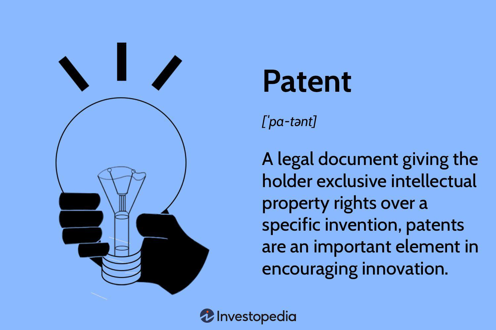

Algorithmic trading, commonly known as algo trading, represents an advanced approach to trade execution within financial markets using pre-programmed software strategies. This method has revolutionized the trading landscape by replacing manual trade processes with high-speed, automated decision-making. This article provides a comprehensive overview of various aspects of algorithmic trading. A particular focus will be placed on understanding the right-hand side (RHS) price in forex trading, along with examples of how algorithmic strategies can be implemented effectively.

Algo trading leverages complex mathematical models and sophisticated software to execute buy and sell orders based on pre-defined criteria, which might include timing, price, quantity, or any mathematical model. This approach allows for swift and efficient transactions that are often impossible to achieve with manual trading methods. A notable advantage is its potential to remove emotional biases from trading decisions, therefore aligning every execution with predetermined strategic rules.



One critical concept in forex trading is the right-hand side (RHS) of a currency pair quote, which represents the offer price. Understanding this side of the forex quote is essential as it indicates the lowest price at which a seller is willing to sell the base currency. This comprehension aids traders in making better-informed decisions on trade entries and exits, thus optimizing their trading strategy.

Throughout this article, we will thoroughly explore the basics of algorithmic trading, its numerous advantages, necessary tools, and common strategies. These strategies encompass methods like trend following, mean reversion, and arbitrage, each serving unique trading objectives and conditions.

Ultimately, the goal is to provide you with a robust understanding of algorithmic trading, equipping you with the knowledge required to navigate its complexities and benefits effectively.

## Table of Contents

## Understanding the Right Hand Side (RHS) in Forex Trading

The right-hand side (RHS) of a forex quote is a crucial component for traders as it represents the offer price, which is the minimum price at which a seller is willing to part with a base currency. Understanding this concept is essential for making informed trading decisions in the forex market. In every forex quote, two prices are typically displayed: the bid price, which appears on the left, and the offer price, shown on the RHS. This layout offers a transparent view of the prices at which market participants are willing to buy and sell, providing clarity on transaction costs and potential trading opportunities.

For instance, consider a currency pair like EUR/USD quoted as 1.1050/1.1052. Here, 1.1050 is the bid price, while 1.1052 is the offer price. The spread, or the difference between the bid and offer prices, is 0.0002, or 2 pips. This spread is indicative of the [liquidity](/wiki/liquidity-risk-premium) and [volatility](/wiki/volatility-trading-strategies) of the currency pair; narrower spreads suggest higher liquidity and lower volatility, whereas wider spreads can indicate the opposite.

Understanding the RHS helps traders in several ways:

1. **Cost Management**: Knowing the offer price helps traders calculate the transaction cost associated with buying a currency pair, allowing for more precise financial planning and risk management.

2. **Market Timing**: By observing changes in the RHS, traders can infer market sentiment and timing. Sudden shifts may suggest increased buying pressure or a shift in supply and demand dynamics.

3. **Strategy Implementation**: For traders utilizing algorithmic strategies, precise knowledge of the offer price is essential for executing trades that rely on fine margins and quick market movements. An algorithm might be set to execute a buy order if the RHS falls below a certain threshold, indicating a favorable buying condition.

4. **Price Forecasting**: Understanding the movement of bid and offer prices helps in developing models for price forecasting. For instance, traders may use historical RHS data to anticipate future market trends.

In Python, analyzing real-time [forex](/wiki/forex-system) quote data, including the RHS, can be automated using libraries such as `pandas` for data manipulation and `matplotlib` for visualization. Here’s a simple example demonstrating how to track offer prices over time:

```python
import pandas as pd
import matplotlib.pyplot as plt

# Sample data: timestamps and offer prices for EUR/USD
data = {
    'Timestamp': ['2023-01-01 00:00', '2023-01-01 01:00', '2023-01-01 02:00'],
    'Offer_Price': [1.1052, 1.1054, 1.1056]
}

# Create DataFrame
df = pd.DataFrame(data)
df['Timestamp'] = pd.to_datetime(df['Timestamp'])

# Plot offer prices over time
plt.plot(df['Timestamp'], df['Offer_Price'], marker='o')
plt.title('EUR/USD Offer Price Over Time')
plt.xlabel('Timestamp')
plt.ylabel('Offer Price')
plt.grid(True)
plt.show()
```

This script visualizes changes in the offer price, aiding traders in monitoring market conditions efficiently. Understanding the RHS is essential for making well-informed trading choices, optimizing strategies, and managing financial risk.

## What is Algorithmic Trading?

Algorithmic trading, often called algo trading, involves the use of automated software to execute trades in financial markets. This method is based on pre-set rules and strategies designed to reduce the need for human intervention and to optimize trading outcomes. The fundamental advantage of [algorithmic trading](/wiki/algorithmic-trading) is its ability to execute orders with high speed and efficiency, far surpassing the capabilities of human traders. 

At its core, algorithmic trading leverages technological innovation to enhance traditional trading strategies. The implementation starts with formulating a trading strategy that can be expressed in a rule-based format. These strategies can cover diverse forms, from simple moving averages to complex statistical models and [machine learning](/wiki/machine-learning) algorithms. Once a strategy is established, it is converted into code that the trading software can process. Python is a popular language for developing these trading algorithms due to its simplicity and the availability of robust libraries such as NumPy, pandas, and scikit-learn. 

A typical algorithmic trading system consists of four key components: 

1. **Price and Market Data Input**: This involves acquiring real-time data from financial markets, including current prices, market depth, and trading volumes.

2. **Signal Generation**: Based on the input data and the predefined algorithmic strategy, the system generates buy or sell signals.

3. **Risk Management**: This component ensures that the trades are within acceptable risk levels, incorporating limits on trade size and ensuring compliance with risk management procedures.

4. **Execution**: The algorithm executes trades, interfacing with exchange systems to carry out the buy or sell orders as dictated by the trading signals.

The high-speed execution capability of algorithmic trading systems is attributable to their ability to process large volumes of data and execute complex mathematical models in fractions of a second. This speed is particularly beneficial for exploiting short-lived market opportunities and for high-frequency trading ([HFT](/wiki/high-frequency-trading-strategies)), where success is often measured in milliseconds.

Algorithmic trading also offers several other advantages. By automating the trading process, it reduces emotional decision-making, which can lead to suboptimal trades. It facilitates the [backtesting](/wiki/backtesting) of trading strategies through historical data analysis, allowing traders to validate their strategies before deploying them in real markets. Additionally, algorithmic trading enables diversification by running multiple strategies across different asset classes and markets simultaneously.

In essence, algorithmic trading is revolutionizing the financial markets by combining the precision of mathematics and the power of computers to improve trading efficiency and effectiveness.

## Advantages of Algorithmic Trading

Algorithmic trading provides numerous advantages that can enhance the efficacy of trading strategies significantly. One of the primary benefits is the speed at which trades can be executed. Human traders are limited by the speed at which they can observe the market and place trades, whereas algorithms can process vast quantities of data and execute trades in milliseconds. This high-speed execution ensures that traders can capitalize on even the smallest price movements, which is particularly beneficial in high-frequency trading environments.

Efficiency is another key advantage, as algorithmic trading systems can monitor and analyze multiple markets and securities simultaneously. This provides the ability to track various trading opportunities across different markets, enabling traders to exploit [arbitrage](/wiki/arbitrage) opportunities and other profitable conditions which might be missed by manual trading.

A significant benefit of algorithmic trading is the reduction of emotional biases. Human traders often fall victim to emotions such as fear and greed, which can lead to suboptimal decision-making. Algorithms, in contrast, follow pre-defined rules and logic without the influence of emotions, which results in more rational and consistent trading decisions. 

Precise order execution is an additional advantage, where algorithms can optimize the timing and size of trades to minimize market impact, thus reducing transaction costs. They can divide a large trade into smaller orders and execute at different times or through different venues to prevent moving the market price.

Algorithmic trading also enables backtesting, where trading strategies can be tested against historical market data to ascertain their viability before deploying them in live markets. This robust framework for performance evaluation allows traders to refine and enhance their strategies based on past data, increasing the likelihood of future success.

Automating trading strategies aids in diversification and improved risk management as well. By automating processes, traders can implement complex strategies across multiple asset classes and markets efficiently. This helps in spreading risk and reducing the potential impact of adverse price movements on the overall portfolio.

Overall, the integration of algorithmic trading in the financial markets has given traders the tools to execute strategies with speed and precision while mitigating human errors and biases. As technology advances, the capabilities of algorithmic trading are likely to expand, offering even greater opportunities for traders.

## Common Algorithmic Trading Strategies

Algorithmic trading strategies have become integral components of modern financial markets, leveraging computational power to optimize trading decisions. Among the most prevalent strategies are Trend Following, Mean Reversion, and Arbitrage, each exploiting different aspects of market dynamics.

**Trend Following**

Trend Following strategies aim to capitalize on the sustained movement of prices in one direction. The fundamental principle is that an asset that has been rising or falling will continue to do so for some time. This strategy typically relies on technical indicators such as moving averages and [momentum](/wiki/momentum) indicators. For example, a simple moving average crossover system could be implemented in Python as follows:

```python
import pandas as pd

def moving_average_crossover(data, short_window, long_window):
    data['short_ma'] = data['Close'].rolling(window=short_window, min_periods=1).mean()
    data['long_ma'] = data['Close'].rolling(window=long_window, min_periods=1).mean()
    data['signal'] = 0
    data['signal'][short_window:] = np.where(data['short_ma'][short_window:] 
                                              > data['long_ma'][short_window:], 1, -1)
    return data

# Example usage:
# data = pd.DataFrame(...)  # Load your price data here
# signals = moving_average_crossover(data, short_window=40, long_window=100)
```

**Mean Reversion**

Mean Reversion strategies are based on the hypothesis that asset prices tend to return to their historical averages over time. This approach assumes that extreme price movements are temporary and will revert to the mean. A commonly used method for mean reversion is Bollinger Bands, which plot a range based on the standard deviation of an asset's price. When prices move outside the bands, a reversion trade may be initiated.

```python
def bollinger_bands(data, window, num_std_dev):
    data['mid_band'] = data['Close'].rolling(window=window).mean()
    data['band_std'] = data['Close'].rolling(window=window).std()
    data['upper_band'] = data['mid_band'] + (data['band_std'] * num_std_dev)
    data['lower_band'] = data['mid_band'] - (data['band_std'] * num_std_dev)
    data['signal'] = 0
    data['signal'][data['Close'] > data['upper_band']] = -1  # Sell signal
    data['signal'][data['Close'] < data['lower_band']] = 1   # Buy signal
    return data

# Example usage:
# data = pd.DataFrame(...)  # Load your price data here
# bollinger_signals = bollinger_bands(data, window=20, num_std_dev=2)
```

**Arbitrage**

Arbitrage involves exploiting price discrepancies of the same asset across different markets or forms. The two primary forms of arbitrage are [statistical arbitrage](/wiki/statistical-arbitrage) and risk arbitrage. Statistical arbitrage uses mathematical models to identify pricing inefficiencies. For example, pairs trading is a type of statistical arbitrage where two historically correlated assets are traded when their prices diverge.

An example of implementing a pairs trading strategy might be:

```python
def pairs_trading_strategy(asset1, asset2):
    spread = asset1 - asset2
    mean_spread = spread.mean()
    std_spread = spread.std()

    buy_signals = spread < (mean_spread - std_spread)
    sell_signals = spread > (mean_spread + std_spread)

    return buy_signals, sell_signals

# Example usage:
# asset1 and asset2 are time-aligned pandas Series or DataFrames of prices
# buy, sell = pairs_trading_strategy(asset1['Close'], asset2['Close'])
```

Each of these strategies showcases the diverse landscape of algorithmic trading, where mathematics, [statistics](/wiki/bayesian-statistics), and technology converge to provide traders with tools to manage and exploit various market conditions. However, implementing these strategies effectively requires robust data analysis, regular validation, and adaptation to evolving market dynamics.

## Implementing Algorithmic Trading: Tools and Resources

Successful implementation of algorithmic trading demands the use of reliable software platforms and access to comprehensive data sources, which are essential elements for executing trades efficiently and effectively.

### Platforms for Algorithmic Trading
TradeStation and MultiCharts are notable platforms that facilitate algorithmic trading by providing user-friendly interfaces and robust toolkits. TradeStation, for example, is renowned for its powerful strategy development tools and its EasyLanguage programming language, which allows traders to design and test their trading algorithms seamlessly. MultiCharts also offers a comprehensive suite of features, enabling traders to implement and optimize strategies across multiple markets. These platforms typically provide integrated development environments (IDEs) that support the creation of custom indicators and strategies, alongside extensive backtesting capabilities.

### Data Feeds and APIs
High-quality data feeds are pivotal for real-time decision-making in algorithmic trading. Access to reliable market data allows traders to analyze trends, monitor market conditions, and execute trades with precision. APIs (Application Programming Interfaces) such as those provided by financial data providers like Bloomberg or Reuters, are crucial for integrating real-time data into trading algorithms. These APIs facilitate the seamless retrieval of historical and current market data, which can be processed in real-time to inform trading decisions.

### Example Python Code for Data Access
Here's an example of how Python can be used to access market data via an API:

```python
import requests

def fetch_market_data(api_url, params):
    response = requests.get(api_url, params=params)
    if response.status_code == 200:
        return response.json()
    else:
        raise Exception("API request failed with status code: {}".format(response.status_code))

# Example usage
api_url = "https://api.example.com/market_data"
params = {
    'symbol': 'EUR/USD',
    'interval': '1min'
}

market_data = fetch_market_data(api_url, params)
print(market_data)
```

This example demonstrates how an API can be leveraged to fetch real-time market data, which is critical for implementing and testing trading strategies.

### Importance of Technology Infrastructure
Successful algorithmic trading does not only depend on sophisticated software and data feeds but also requires a robust technology infrastructure. High-performance computing systems, reliable network connections, and the ability to scale are all critical components that ensure algorithms can run efficiently and handle large volumes of data without latency issues. Traders often employ cloud-based solutions to enhance scalability and ensure their systems can process data swiftly during periods of high market activity.

By integrating these tools and resources effectively, traders can optimize their algorithmic trading strategies, reduce latency, and improve the precision of order execution, thereby enhancing overall trading performance. Leveraging these technological advancements is essential for gaining a competitive edge in the fast-paced world of algorithmic trading.

## Risks and Challenges in Algorithmic Trading

Algorithmic trading, while advantageous for its speed and efficiency, also comes with several risks and challenges that traders must navigate. One significant challenge is market volatility. Algorithms can exacerbate market swings by executing large volumes of trades in a short period. This rapid trading can lead to flash crashes, where the market prices plummet quickly before recovering. An example is the May 2010 Flash Crash, where the Dow Jones Industrial Average plunged nearly 1,000 points in minutes, primarily due to algorithmic trades.

Technology risks further complicate algorithmic trading. These include hardware malfunctions, software bugs, and connectivity issues with trading platforms. Any disruption can lead to missed trading opportunities or erroneous trades, impacting investment outcomes. For instance, a glitch in the code used by Knight Capital in 2012 resulted in a $440 million loss within 45 minutes.

System failures present another risk, particularly during high-frequency trading. Systems must handle large volumes of trades without failure. Redundancies and fail-safes are crucial to minimize the impact of any unforeseen technical issues.

To effectively manage these risks, traders should implement robust risk management strategies. This includes setting stop-loss orders to cap potential losses and developing diversified portfolios to spread risk. Regular system audits and real-time monitoring can identify and address vulnerabilities swiftly. Algorithm backtesting against historical data helps anticipate how strategies might perform under varying market conditions.

Additionally, stringent validation processes should be employed during algorithm development to minimize bugs and errors. Utilizing simulation environments can aid in testing algorithms under controlled scenarios before live deployment.

In summary, while algorithmic trading offers substantial advantages, it necessitates comprehensive risk management practices to navigate potential volatility, technology risks, and system failures. By preparing for these challenges, traders can better safeguard their investments and enhance trading outcomes.

## Conclusion

Algorithmic trading is a powerful tool that can significantly improve trading outcomes when harnessed effectively. By automating execution processes and leveraging quantitative models, traders can achieve faster and more precise trades, minimizing human errors and emotional biases. The advantages of algorithmic trading extend beyond mere execution; they offer enhanced capabilities for diversification, risk management, and strategic adaptation.

Continued education is paramount in this fast-evolving field. As technology advances, traders must stay updated with the latest algorithmic strategies and tools. Engaging in ongoing learning through online courses, workshops, and industry conferences can provide traders with the necessary skills and insights to refine their approaches and maintain a competitive edge.

Practice is equally vital. Developing a deep understanding of how algorithms operate requires continual trial and error. Backtesting strategies against historical data, for instance, can help traders evaluate the effectiveness of their algorithms before applying them in live markets. Additionally, simulated trading environments offer a risk-free platform for testing and refining strategies, ensuring traders are well-prepared for real-world scenarios.

Adaptation is another critical [factor](/wiki/factor-investing) for success in algorithmic trading. Financial markets are dynamic and influenced by countless variables; thus, rigidity in strategy can lead to suboptimal outcomes. Traders must be prepared to tweak their algorithms in response to new market conditions, economic indicators, and technological advancements. Flexibility in strategy design and implementation ensures that traders can swiftly adjust to changes, maximizing their profitability and mitigating risks.

As technology and markets evolve, staying informed is crucial. The integration of advanced technologies such as [artificial intelligence](/wiki/ai-artificial-intelligence) and machine learning is reshaping the algorithmic trading landscape. By keeping abreast of these developments, traders can incorporate innovative techniques into their strategies, further enhancing their trading performance.

In summary, while algorithmic trading presents opportunities for substantial gains, realizing its full potential requires a commitment to education, practice, and adaptability. As traders master these elements, they can mitigate risks and capitalize on the efficiencies and capabilities that algorithmic trading offers. The future of algorithmic trading rests in the hands of those who are willing to learn, adapt, and innovate continuously.

## References & Further Reading

[1]: Bergstra, J., Bardenet, R., Bengio, Y., & Kégl, B. (2011). ["Algorithms for Hyper-Parameter Optimization."](https://dl.acm.org/doi/10.5555/2986459.2986743) Advances in Neural Information Processing Systems 24.

[2]: ["Advances in Financial Machine Learning"](https://www.amazon.com/Advances-Financial-Machine-Learning-Marcos/dp/1119482089) by Marcos Lopez de Prado

[3]: ["Evidence-Based Technical Analysis: Applying the Scientific Method and Statistical Inference to Trading Signals"](https://www.amazon.com/Evidence-Based-Technical-Analysis-Scientific-Statistical/dp/0470008741) by David Aronson

[4]: ["Machine Learning for Algorithmic Trading"](https://github.com/stefan-jansen/machine-learning-for-trading) by Stefan Jansen

[5]: ["Quantitative Trading: How to Build Your Own Algorithmic Trading Business"](https://www.amazon.com/Quantitative-Trading-Build-Algorithmic-Business/dp/1119800064) by Ernest P. Chan