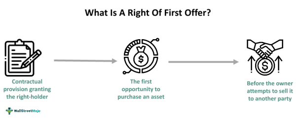

Offer Agreements and the Right of First Offer (ROFO) are critical components in a variety of business transactions, providing mechanisms through which parties can secure preferential terms and maintain strategic advantages. ROFO offers buyers the opportunity to be the first to express interest in an asset or a stake, necessitating the seller to present the offer to the buyer before other potential purchasers. This contractual clause is particularly advantageous in market sectors where collaboration and competition are intricately linked. 

Algorithmic trading is characterized by the use of computer programs to execute trades at speeds and frequencies beyond the capability of human traders. At its core, algorithmic trading relies on mathematical models and formulas to determine trading decisions, automate the process of buying or selling stocks, and reduce transaction costs. The integration of offer agreements, specifically ROFO clauses, in algorithmic trading strategies, allows firms to optimize their transactions by potentially securing more favorable entry and exit points. This can lead to enhanced returns on investment due to the reduced competition for assets once an ROFO is in place.



In the context of real estate and business partnerships, ROFO clauses play a significant role in ensuring that collaborators and investors have first dibs on new opportunities or expanded stakes. For instance, in real estate, tenants often secure ROFO rights in lease agreements, ensuring they can purchase the property at a predetermined price before the landlord offers it to other potential buyers. This arrangement could be beneficial for tenants seeking stability and control over their premises. In business partnerships, ROFO agreements enable firms to maintain strategic control over ownership changes, allowing them to vet potential new shareholders or partners thoroughly.

Furthermore, the inclusion of ROFO in automated investing can streamline processes and enhance investment outcomes. By embedding ROFO clauses within algorithmic frameworks, firms can automate decision-making processes based on pre-set criteria, ensuring efficiency while adhering to strategic priorities. Such implementation can be instrumental in maintaining competitive advantages in rapidly evolving financial markets.

In summary, Offer Agreements and the Right of First Offer are instrumental in securing transaction advantages across various fields. Their integration into algorithmic trading and other investment strategies allows businesses to capitalize on strategic opportunities, enhance decision-making, and protect their interests in competitive environments.

## Table of Contents

## Understanding Right of First Offer (ROFO)

The Right of First Offer (ROFO) is a contractual mechanism that grants a party the opportunity to negotiate a transaction, typically involving property or assets, before the owner offers it to others. In essence, when an owner decides to sell an asset, the party with ROFO rights has the initial opportunity to make an offer to purchase it. This agreement is often embedded in various business contracts to ensure that certain stakeholders or parties maintain preferential negotiation rights.

**Comparison Between Right of First Offer and Right of First Refusal**

The Right of First Offer and Right of First Refusal (ROFR) are often confused but differ in their operational mechanisms and strategic implications. A ROFO requires the owner to allow the holder to make an offer before any third-party negotiations occur. Conversely, a ROFR allows the holder to match any third-party offer that the owner intends to accept. The strategic difference lies in the negotiation control: ROFO holders potentially negotiate directly with the owner without external competitive pressure, whereas ROFR holders must respond to pre-existing offers from others.

**Key Advantages of Implementing ROFO in Business Transactions**

Implementing ROFO in business transactions provides several advantages. Firstly, it offers holders the power to preempt market competition, allowing them to secure desired assets or opportunities at potentially favorable terms. This pre-emptive right is particularly beneficial in sectors like real estate, where market conditions can rapidly influence asset valuations.

Secondly, ROFO fosters long-term partnership stability and trust by aligning incentives between involved parties. It encourages investment and interest in maintaining and potentially enhancing the value of assets, knowing there is a structured process during potential sales.

Furthermore, ROFO can positively impact financial planning and strategic decision-making. Parties with ROFO rights may align their financial strategies and asset management plans knowing their preferential negotiation status. This can lead to more targeted and efficient capital allocation, reducing the uncertainty associated with competitive bidding processes.

In summary, while both ROFO and ROFR offer certain contractual advantages, ROFO's proactive negotiation stance provides strategic benefits and clarity in asset transactions. Implementing ROFO clauses thoughtfully can enhance business relations and secure favorable conditions for negotiating parties.

## The Role of ROFO in Algorithmic Trading

The Right of First Offer (ROFO) in [algorithmic trading](/wiki/algorithmic-trading) represents an innovative intersection between legal contracts and automated financial strategies. This concept involves granting a party, usually an investor or trader, the right to be offered a security or an asset before it is offered to others. In automated trading, ROFO can be strategically utilized to gain early access to desirable securities, optimize trade executions, and maintain a competitive edge.

### How ROFO Can Be Used in Automated Trading Strategies

In algorithmic trading, ROFO agreements can be encoded into trading algorithms to automate the process of exercising these rights. By integrating ROFO clauses, algorithms can be programmed to automatically respond when an asset meets predefined conditions, such as price or [volatility](/wiki/volatility-trading-strategies) thresholds. This automatic responsiveness ensures that algorithmic traders can swiftly execute their right to purchase assets, reducing the lag time typically associated with manual decision-making processes.

For example, consider an algorithm designed to monitor real-time stock prices. If a specific stock becomes available through a ROFO clause, the algorithm triggers a series of actions—evaluating the asking price against predicted future values, analyzing recent market trends, and cross-referencing the trader's existing portfolio strategy. If the asset aligns with the trader's goals, the algorithm can automatically execute a purchase order.

### Benefits of Integrating ROFO Agreements in Trading Algorithms

1. **Speed and Efficiency**: Automated trading systems equipped with ROFO clauses can operate significantly faster than human traders, providing near-instantaneous responses to market opportunities.

2. **Strategic Advantage**: By securing the option to purchase securities before they are publicly offered, traders can gain a strategic upper hand, accessing potential high-return investments.

3. **Risk Management**: Automated algorithms can incorporate analytics to assess risk factors associated with exercising ROFO, facilitating more informed decision-making and mitigating potential downsides.

4. **Cost Reduction**: Automation reduces the need for constant human oversight and the associated costs, allowing for more efficient deployment of resources and capital.

### Examples of Algorithmic Trading Scenarios Involving ROFO Clauses

1. **High-frequency trading (HFT)**: In HFT, speed is crucial. Algorithms with ROFO capabilities can secure favorable positions on new stock issuances, leveraging anticipated price movements in milliseconds.

2. **Quantitative Trading Strategies**: Algorithms employing quantitative strategies can use ROFO clauses to cherry-pick stocks or assets that align with historical data patterns, enhancing the probability of profitable outcomes.

3. **Arbitrage Opportunities**: In scenarios where slight price discrepancies exist across different markets, ROFO clauses can provide a means to secure arbitrage positions before prices converge, maximizing profit margins.

The integration of ROFO clauses within algorithmic trading algorithms exemplifies the synergy between technology and traditional contractual rights. The ability to automate the exercise of these rights creates a dynamic trading environment where speed, efficiency, and strategic foresight culminate in enhanced market performance.

## Legal and Financial Implications

Legal and financial considerations play a crucial role in the drafting and implementation of Right of First Offer (ROFO) agreements. Ensuring that these agreements align with legal norms and financial objectives is essential to preserve their enforceability and effectiveness.

### Legal Considerations in Drafting ROFO Agreements

When crafting ROFO agreements, it is imperative to clearly define the terms and conditions surrounding the right. Ambiguity in language can lead to dispute and litigation. The agreement should specify the procedures for offering and acceptance, deadlines, and any contingencies or conditions that might apply. Including comprehensive definitions and clarifications can mitigate risks of misinterpretation.

To ensure compliance with applicable laws, ROFO agreements should be drafted with an awareness of federal, state, and local regulations. Legal frameworks can vary, particularly in real estate, where zoning laws and property rights differ significantly by jurisdiction. Engaging legal counsel with expertise in the specific area of interest is advisable to avoid contraventions.

### Financial Impact and Valuation

ROFO clauses have significant implications on the valuation of assets. When a ROFO is in place, potential buyers must consider the likelihood and capability of the holder executing their right. This can impact the market value of shares, properties, or business interests, as it might deter competition or depress bidding prices. Financial models might incorporate a conditional discount or premium, depending on the perceived strength of the ROFO clause.

The valuation processes must account for the conditions under which the right can be exercised. For instance, if the right is contingent upon certain financial metrics or market conditions, valuation models should include these variables to produce a range of potential valuations.

### Aligning ROFO Clauses with Corporate Governance

Corporate governance frameworks must be considered to ensure that ROFO agreements align with the strategic objectives and risk management policies of the organization. ROFO clauses can influence corporate control dynamics, particularly in shareholder agreements. They can be used strategically to consolidate ownership or to prevent unwanted dilution of control.

It is important for corporate boards and executives to consider how ROFO clauses might affect strategic decision-making and shareholder relations. Transparency in communicating the intent and structure of ROFO agreements to stakeholders can foster trust and align interests.

In summary, when drafting ROFO agreements, careful legal, financial, and governance considerations must be taken into account. Properly structured, these agreements can provide significant strategic benefits, though they require careful planning and execution to realize their potential.

## Practical Examples and Use Cases

### Practical Examples and Use Cases

**Real Estate Scenarios: Safeguarding Tenant Interests with ROFO**

In the real estate sector, Right of First Offer (ROFO) clauses are instrumental for tenants who wish to have the first opportunity to purchase property before the owner can offer it to third parties. This clause is particularly beneficial in high-demand markets where property values are volatile, providing tenants with a measure of security and potential investment growth.

For example, if a commercial tenant is leasing office space in a rapidly developing urban area, a ROFO agreement integrated into their lease would enable them to offer to purchase the property if the landlord decides to sell. This opportunity helps the tenant secure their business location against market fluctuations. By holding a ROFO, tenants may negotiate more effectively with landlords, potentially purchasing property at a rate lower than market value if the selling environment is favorable.

**Corporate Finance Applications: Ensuring Control in Shareholder Agreements**

In corporate finance, ROFO clauses serve as a mechanism for shareholders to maintain control over their company's ownership structure. When a shareholder intends to sell their shares, a ROFO can obligate them to first offer these shares to existing shareholders before approaching external buyers. This gives current shareholders the chance to preserve their relative ownership and prevent unwanted or hostile takeovers.

Consider a scenario where a technology startup with a few key investors is seeking to retain strategic control while raising capital. Implementing a ROFO clause provides each investor the opportunity to purchase additional shares as they become available, thereby preserving the balance of power and potentially aligning the company’s strategic goals with shareholder interests. 

**Algorithmic Trading Examples: Optimizing Deal Execution with ROFO**

In algorithmic trading, incorporating ROFO clauses into contracts can streamline and enhance trade execution strategies. Trading systems hinge on speed and precision, and ROFO agreements can be a critical tool for ensuring that proprietary trading algorithms have access to specific assets or deals first, thus maximizing profit potential.

For instance, an algorithmic trading firm engaged in high-frequency trading ([HFT](/wiki/high-frequency-trading-strategies)) may utilize a ROFO agreement to gain preliminary access to asset offerings. This advantage allows the firm to quickly capitalize on short-lived market inefficiencies. The integration of ROFO into trading algorithms can ensure optimal trade execution by prioritizing transactions according to the firm's strategic preferences and market conditions.

Python can aid in operationalizing these strategies by automating the recognition and execution of ROFO-related opportunities. Below is a simplified Python example that demonstrates how a trading algorithm might handle assets under a ROFO clause:

```python
def execute_trades(offers, available_capital):
    for offer in offers:
        if offer['rofo'] and offer['price'] <= available_capital:
            purchase(offer)
            available_capital -= offer['price']
        else:
            continue

def purchase(asset_offer):
    print(f"Purchasing asset: {asset_offer['asset_name']} at price: {asset_offer['price']}")

offers = [
    {'asset_name': 'Stock_A', 'price': 500, 'rofo': True},
    {'asset_name': 'Stock_B', 'price': 700, 'rofo': False},
    {'asset_name': 'Stock_C', 'price': 300, 'rofo': True},
]

available_capital = 1000
execute_trades(offers, available_capital)
```

This code snippet evaluates asset offers based on available capital and the presence of a ROFO clause, executing purchases accordingly. By automating such processes, trading firms enhance their ability to implement strategic acquisitions efficiently.

## Best Practices for Drafting ROFO Agreements

When drafting a Right of First Offer (ROFO) agreement, several critical components must be included to ensure clarity and enforceability. At the core, a well-defined ROFO clause should specify the triggering event, which dictates when the right is activated. Additionally, it should detail the process by which the offer will be made, including timelines for response and any specific conditions attached to the offer.

Key elements include:

1. **Offer Procedure**: Clearly define the procedure for making and responding to the offer. This includes stipulating a reasonable timeframe for the right holder to act upon receiving the offer and the method of how the offer should be communicated (e.g., written notice).

2. **Terms of Sale**: The agreement should outline what constitutes a bona fide offer. This involves setting preliminary terms and assurances about the offer's authenticity, potentially requiring the offeror to provide evidence of the offer's legitimacy, such as a third-party appraisal.

3. **Exclusions and Exceptions**: Identify any scenarios where the ROFO does not apply, such as transfers to affiliates or during specific corporate restructuring scenarios. 

4. **Valuation Parameters**: Incorporating a formula or mechanism for asset valuation can preempt disputes over fair pricing. This might involve references to market value assessments or stipulated pricing benchmarks.

Negotiation strategies play a crucial role in maximizing the benefits of a ROFO. Parties should aim for a balance that protects the holder's interests without imposing undue restrictions on the seller. Effective negotiation can lead to compromises, such as revisiting the offer terms if no satisfactory third-party bid emerges.

Case studies provide practical insights into successful ROFO implementations. For instance:

- **Real Estate**: A commercial lease agreement might include a ROFO to allow a tenant the option to purchase the property before the owner offers it to third parties. This not only protects the tenant’s interests but also potentially secures a favorable purchase price.

- **Corporate Transactions**: In shareholder agreements, ROFO clauses can be crucial. For example, consider a startup company where major shareholders have a ROFO on each other’s shares. This ensures control remains within the original group, making it easier to maintain strategic direction.

These best practices and examples underscore the importance of meticulously drafting ROFO agreements to align with business objectives and provide strategic advantages.

## Challenges and Solutions

Implementing Right of First Offer (ROFO) clauses in business agreements presents a unique set of challenges and demands thoughtful solutions to maximize their effectiveness. Two of the most prevalent issues include ambiguity in the contract language and balancing flexibility with control during negotiations.

### Addressing Ambiguity and Enforcement Issues

**Ambiguity** in ROFO agreements often arises from vague language that leaves room for interpretation. This can lead to disputes between parties about the intentions and obligations set out in the clause. To counter this, it is essential to:

1. **Draft Clear and Precise Language**: Ensure the terms and conditions of the ROFO are articulated with precision. The agreement should clearly define key aspects such as what triggers the ROFO, the timeline for exercising the right, and the method for determining the offer price.

2. **Integrate Legal Frameworks**: Utilize established legal principles and terminology to minimize potential misinterpretations. This involves adhering to the jurisdiction’s statutory requirements where the agreement is enforced.

3. **Seek Legal Advice**: Consultation with legal professionals during the drafting phase can help identify potential ambiguities and provide alternative formulations to solidify the intent of the agreement.

4. **Develop Mechanisms for Dispute Resolution**: Include provisions for mediation or arbitration to expeditiously address disputes regarding the ROFO terms. This approach helps maintain business relationships while resolving issues outside of court.

### Balancing Flexibility and Control

**Flexibility** and **control** are crucial yet competing aspects when negotiating ROFO clauses. The challenge lies in allowing sufficient flexibility for unforeseen circumstances while maintaining the control necessary to secure strategic interests.

1. **Flexible Pricing Models**: Implement pricing mechanisms adaptable to market conditions. For instance, instead of setting a fixed price, the agreement could link the offer to market indices or appraised values, allowing the price to adjust with market fluctuations.

2. **Conditional Offer Terms**: Introduce conditional terms that allow parties to adjust obligations based on specific triggers or performance metrics. This can include scenarios where the ROFO holder can waive their right under predefined conditions.

3. **Time-Bound Clauses**: Ensure that the duration within which a ROFO must be exercised is reasonable and reflects the nature of the transaction. A well-considered timeline allows the ROFO holder sufficient time to make an informed decision without unduly stalling potential sales or partnerships.

4. **Contingency Planning**: Incorporate well-defined exit strategies and contingency plans within the agreement to address scenarios where exercising the ROFO is not feasible. This could involve secondary rights or fallback options that protect both parties’ interests.

By addressing the challenges related to ambiguity and balancing flexibility and control, businesses can enhance the effectiveness of ROFO clauses, ensuring they serve their intended purpose in safeguarding strategic interests.

## Conclusion

Right of First Offer (ROFO) agreements have carved a significant niche in both algorithmic trading and broader business dealings. These clauses provide a structured platform for parties to negotiate, ensuring that potential dealings can be executed with prioritized offers. In algorithmic trading, the integration of ROFO has opened a new avenue for optimizing trade execution strategies. These agreements help create scenarios where the trader or investing entity receives initial insights into an asset's availability, integrating seamless decision-making processes within automated strategies. This interplay can lead to more informed investment decisions, enhancing both trading efficiency and potential return on investments.

The future prospects for ROFO clauses in the domain of automated trading are promising. As algorithmic trading systems evolve with advanced [machine learning](/wiki/machine-learning) and improved computational models, the incorporation of ROFO can serve as a foundational layer for creating strategic opportunities. Algorithms can be designed to anticipate and react to the nuances of these clauses, potentially providing a competitive edge by predicting asset availability and strategic offer positioning.

Businesses are also encouraged to leverage ROFO agreements to secure strategic advantages. By incorporating these clauses into their contractual frameworks, companies can foster environments that preemptively safeguard their interests and promote sustainable partnerships. Whether in real estate, corporate finance, or investment ventures, the strategic application of ROFO can lead to beneficial outcomes, such as securing favorable terms and maintaining control over crucial transactions.

Overall, ROFO agreements represent a powerful tool for enhancing both strategic planning and execution in business transactions and algorithmic trading. By carefully implementing and aligning these clauses within their operations, businesses and traders alike can harness significant advantages, paving the way for more secure and profitable engagements.

## References & Further Reading

[1]: Gomez, R., Noguera, M., & Ongena, S. (2019). ["Right of First Refusal: Theory and Evidence."](https://papers.ssrn.com/sol3/papers.cfm?abstract_id=2877771) Journal of Financial Economics.

[2]: Ibikunle, G., & Gregoriou, A. (2015). ["Emergence of Algorithmic Trading in Global Financial Markets."](https://www.pure.ed.ac.uk/ws/files/22161953/Ibikunle_et_al._2015_Revised.pdf) Strategic Change.

[3]: Hendershott, T., Jones, C. M., & Menkveld, A. J. (2011). ["Does Algorithmic Trading Improve Liquidity?"](https://onlinelibrary.wiley.com/doi/full/10.1111/j.1540-6261.2010.01624.x) The Review of Financial Studies, 24(3), 512-560.

[4]: Hasbrouck, J., & Saar, G. (2013). ["Low-Latency Trading."](https://www.sciencedirect.com/science/article/abs/pii/S1386418113000165) The Review of Financial Studies, 26(9), 2561-2594.

[5]: Singal, A. (2011). ["Beyond the Random Walk: A Guide to Stock Market Anomalies and Low-Risk Investing."](https://academic.oup.com/book/54648) Oxford University Press.