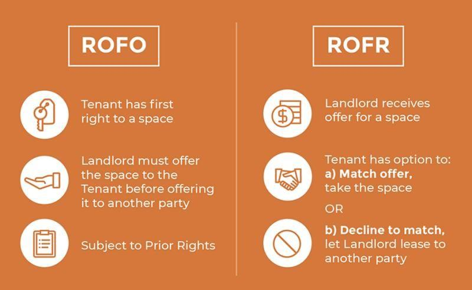

## Table of Contents

## What is the basic definition of a Right of First Offer (ROFO)?

A Right of First Offer (ROFO) is a contract that gives a specific person or company the first chance to buy something before it is offered to others. Imagine you own a house and you want to sell it. If you have a ROFO agreement with your friend, you must offer the house to your friend before you can offer it to anyone else.

This type of agreement is often used in business deals, real estate, and partnerships. It helps to keep important assets within a group of people or companies who have a prior relationship. If the person with the ROFO decides not to buy, then the owner can offer it to others. This way, everyone gets a fair chance, but the person with the ROFO gets the first opportunity.

## How does a Right of First Offer differ from a Right of First Refusal?

A Right of First Offer (ROFO) and a Right of First Refusal (ROFR) are similar but work a bit differently. With a ROFO, the owner must first offer the item to the person who has the right before offering it to anyone else. If that person says no, then the owner can sell it to someone else. It's like giving someone the first chance to buy something before you look for other buyers.

On the other hand, a Right of First Refusal (ROFR) means the owner can find a buyer and negotiate a deal, but before finalizing the sale, they must offer it to the person with the ROFR at the same terms. If the person with the ROFR says no, then the owner can go ahead and sell it to the original buyer. So, with a ROFR, the person with the right gets to match an offer that's already on the table, while with a ROFO, they get the first chance to make an offer before anyone else does.

## In what types of transactions is a Right of First Offer commonly used?

A Right of First Offer is often used in real estate deals. For example, if someone wants to sell their house, they might have a ROFO agreement with a neighbor or a family member. This means they have to offer the house to that person first before they can offer it to anyone else. This helps keep properties within families or neighborhoods and gives the person with the ROFO a special chance to buy the property before it goes on the open market.

ROFOs are also common in business transactions, especially in partnerships or joint ventures. If a company wants to sell its shares or assets, it might have a ROFO agreement with its partners or shareholders. This means the company has to offer the shares or assets to these partners first. This can help maintain control within the existing group and prevent outsiders from buying in without the partners getting a chance to keep the business within their circle.

## What are the key elements that should be included in a ROFO agreement?

A ROFO agreement needs to clearly say who has the right of first offer. This could be a person, a company, or a group. The agreement should also describe exactly what is being offered, like a house, shares in a company, or other assets. It's important to be specific so everyone knows what they are talking about.

The agreement should also explain how the offer should be made. This includes how much time the person with the ROFO has to decide if they want to buy. It should say if the offer needs to be in writing and how long the offer stays open. If the person with the ROFO says no, the agreement should say what happens next, like if the owner can then offer it to someone else. Having all these details clear helps avoid confusion and makes sure everyone understands the rules.

## How is the process of exercising a Right of First Offer typically initiated?

The process of exercising a Right of First Offer usually starts when the owner of the asset decides to sell. They need to let the person with the ROFO know that they want to sell. This is often done by sending a written notice, like a letter or an email. The notice should clearly say what is being offered and any other important details, like the price or any conditions of the sale.

Once the person with the ROFO gets the notice, they have a certain amount of time to decide if they want to buy the asset. This time period is usually set in the ROFO agreement. If they decide to buy, they need to let the owner know before the time runs out. If they say no or don't respond in time, the owner can then offer the asset to someone else.

## What are the potential benefits of a Right of First Offer for the holder?

Having a Right of First Offer can be really helpful for the person who has it. It gives them a special chance to buy something before anyone else can. This means they might be able to get a good deal on a house, shares in a company, or other things they want. It's like getting the first pick at something important, which can be a big advantage.

Also, a ROFO can help keep important things within a group of people who already know each other. For example, if you have a ROFO on your family's home, it means you can keep the home in the family instead of it going to someone outside. This can make things easier and keep relationships strong within the group.

## What are the possible drawbacks or risks associated with a ROFO for the holder?

Having a Right of First Offer can sometimes be tricky for the person who has it. One big problem is that they might feel pressured to buy something even if they're not sure they want it. If they say no, they might miss out on a good chance, but if they say yes, they might end up with something they don't really need or can't afford. It's like having to make a quick decision without enough time to think it over.

Another risk is that the person with the ROFO might not know the real value of what they're being offered. The owner might set a high price, and the person with the ROFO has to decide if they want to pay that much without knowing if it's a fair deal. This can lead to spending more money than they should or missing out on a good deal because they didn't have enough information.

## How might a Right of First Offer impact the seller or the property owner?

A Right of First Offer can make things a bit tricky for the seller or property owner. They have to offer the property to the person with the ROFO before they can sell it to anyone else. This means they might have to wait longer to sell the property, especially if the person with the ROFO takes a long time to decide. It can also be hard for the owner if they need to sell quickly but the person with the ROFO isn't ready to buy.

On the other hand, having a ROFO agreement can sometimes help the seller. If the person with the ROFO decides to buy, it can make the selling process easier and faster because they don't have to look for other buyers. But if the person with the ROFO says no, the owner might have to start all over again, which can be frustrating and take more time. So, while a ROFO can help keep things within a certain group, it can also add some extra steps and delays for the seller.

## Can a Right of First Offer be negotiated or modified, and if so, how?

Yes, a Right of First Offer can be negotiated or changed. When people agree to a ROFO, they can talk about the details and make changes to fit what they need. For example, they might change how long the person with the ROFO has to decide, or they might set a different price for the offer. If both the owner and the person with the ROFO agree, they can write these changes into the agreement.

Changing a ROFO can happen at different times. Sometimes, people might want to change the agreement right when they're making it, before anyone signs anything. Other times, they might want to change it later, after the agreement is already in place. To do this, they need to talk to each other and agree on the new terms. Then, they should write down the changes and both sign the updated agreement to make sure everyone understands and agrees to the new rules.

## What legal considerations should be taken into account when drafting a ROFO?

When drafting a Right of First Offer agreement, it's important to make sure it follows the law. The agreement should be clear and specific about who has the ROFO, what is being offered, and how the offer should be made. It's a good idea to have a lawyer look at the agreement to make sure it's legal and covers everything it needs to. The agreement should also say what happens if someone doesn't follow the rules, like if the owner tries to sell the property to someone else without offering it to the person with the ROFO first.

Another thing to think about is how the ROFO might affect other legal rights or agreements. For example, if the property is part of a bigger deal or if there are other people who might have a say in what happens to it, the ROFO agreement needs to fit with those other rules. It's also important to think about how long the ROFO lasts and what happens if the person with the ROFO can't or doesn't want to buy the property. Making sure all these details are clear and legal can help avoid problems later on.

## How do courts typically interpret and enforce Right of First Offer agreements?

Courts usually look at the exact words in the ROFO agreement to figure out what it means. They want to make sure everyone follows the rules that were written down. If the agreement is clear and specific, courts will usually enforce it the way it's written. They check if the owner offered the property to the person with the ROFO before anyone else and if they gave them enough time to decide. If the owner didn't follow these rules, the court might stop them from selling the property to someone else.

Sometimes, if the agreement isn't clear, courts might have to decide what the people meant when they made the agreement. They look at things like how long the person with the ROFO had to decide and if the offer was fair. Courts want to make sure the agreement is fair to everyone involved. If the person with the ROFO thinks the owner didn't follow the rules, they can go to court to ask for help. The court will then decide if the owner broke the agreement and what should happen next.

## What are some advanced strategies for leveraging a Right of First Offer in complex transactions?

In complex transactions, having a Right of First Offer can be a powerful tool if used smartly. One advanced strategy is to use the ROFO to gain more time for due diligence. When you get the offer, you can take the time allowed in the agreement to thoroughly check the value and condition of the asset. This can help you make a better decision on whether to buy it or not. You might also use this time to negotiate better terms with the seller, like a lower price or different payment options, because you have the first chance to buy.

Another strategy is to use the ROFO to keep important assets within a certain group or to maintain control over a business. For example, if you're part of a partnership and you have a ROFO on shares, you can use it to stop outsiders from buying into the company. This can help keep the business's direction in line with the original group's goals. By having the first chance to buy, you can decide if you want to keep the shares within the group or if you're okay with someone else buying them. This way, you can protect your interests and the company's future.

## References & Further Reading

[1]: Gomez, R., Noguera, M., & Ongena, S. (2019). ["Right of First Refusal: Theory and Evidence."](https://papers.ssrn.com/sol3/papers.cfm?abstract_id=2877771) Journal of Financial Economics.

[2]: Ibikunle, G., & Gregoriou, A. (2015). ["Emergence of Algorithmic Trading in Global Financial Markets."](https://www.pure.ed.ac.uk/ws/files/22161953/Ibikunle_et_al._2015_Revised.pdf) Strategic Change.

[3]: Hendershott, T., Jones, C. M., & Menkveld, A. J. (2011). ["Does Algorithmic Trading Improve Liquidity?"](https://onlinelibrary.wiley.com/doi/full/10.1111/j.1540-6261.2010.01624.x) The Review of Financial Studies, 24(3), 512-560.

[4]: Hasbrouck, J., & Saar, G. (2013). ["Low-Latency Trading."](https://www.sciencedirect.com/science/article/abs/pii/S1386418113000165) The Review of Financial Studies, 26(9), 2561-2594.

[5]: Singal, A. (2011). ["Beyond the Random Walk: A Guide to Stock Market Anomalies and Low-Risk Investing."](https://academic.oup.com/book/54648) Oxford University Press.