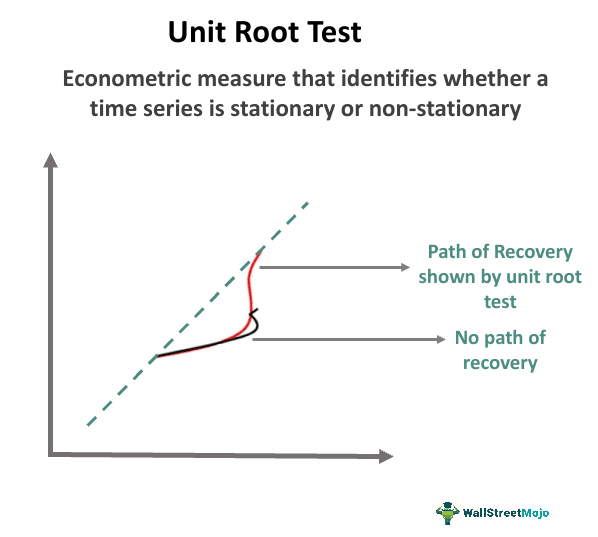

In the world of algorithmic trading, data analysis and statistical testing play a crucial role in formulating strategies and managing risks. Among the myriad tools available to traders, unit-root tests are pivotal for understanding the time-series properties of financial datasets. These tests help determine whether a time series is stationary, meaning its statistical properties like mean and variance are constant over time, or whether it has a unit root, indicating non-stationary behavior. This distinction is critical in financial markets where assets often exhibit trends, cycles, and other non-stationary behaviors.

Traditional unit-root tests, such as the Augmented Dickey-Fuller (ADF) test, primarily focus on detecting a unit root on the left tail of the distribution. This traditional approach assesses whether time series data is stationary by examining the null hypothesis of a unit root presence. However, recent developments have introduced right-tail unit-root tests, providing a novel perspective on analyzing time series data. These tests are designed to detect explosive behaviors by focusing on the right side of the distribution, making them particularly useful for identifying asset bubbles and episodes of financial exuberance.



Understanding right-tail unit-root tests is valuable for algorithmic traders seeking to enhance their trading strategies. These tests offer insights into pricing anomalies that may indicate overvaluation or speculative behavior in the market. By incorporating right-tail tests into their analyses, traders can better anticipate potential market disruptions or price corrections. This improved understanding can lead to more effective trading strategies by enabling traders to adjust their positions and refine risk management practices accordingly.

This article explores the differences between right-tail unit-root tests and traditional approaches, examining their implications for financial markets. The integration of these advanced statistical methods into trading frameworks presents opportunities for traders to gain a competitive edge in increasingly complex markets.

## Table of Contents

## Understanding Unit Root Tests

Unit-root tests are essential statistical tools used to assess whether a time series is stationary—meaning it has a constant mean and variance—or contains a unit root, indicating non-stationary behavior. In financial markets, numerous time series, such as stock prices, exhibit non-stationary characteristics due to their inherent trends and [volatility](/wiki/volatility-trading-strategies). Identifying whether a time series is stationary or non-stationary is crucial for developing robust financial models and forecasting strategies.

A time series $\{y_t\}$ is considered stationary if its statistical properties do not change over time. Formally, a stationary process satisfies:

$$

E(y_t) = \mu 
$$

$$

\text{Var}(y_t) = \sigma^2 
$$

where $\mu$ is the constant mean, and $\sigma^2$ is the constant variance. Conversely, a non-stationary series often reflects external influences or intrinsic changes over time that affect these properties.

Traditional unit-root tests, such as the Augmented Dickey-Fuller (ADF) test, are designed to examine the null hypothesis that a unit root exists in the series, which usually implies non-stationarity. The ADF test involves estimating the regression:

$$

\Delta y_t = \alpha + \beta t + \gamma y_{t-1} + \sum_{i=1}^{p} \delta_i \Delta y_{t-i} + \epsilon_t 
$$

where $\Delta y_t$ is the first difference of the series, $t$ is the time trend, and $\epsilon_t$ is the error term. The core focus of traditional unit-root tests like the ADF is on the left-tail, assessing whether the series is stationary around a trend or a constant level.

However, right-tail unit-root tests emerged to address scenarios involving explosive behaviors, such as asset price bubbles. These tests focus on the right side of the statistical distribution, seeking to detect periods when prices deviate exponentially from their fundamental values. This approach is vital in [algorithmic trading](/wiki/algorithmic-trading) for anticipating and responding to rapid price increases indicative of speculative excess or market exuberance. By identifying these explosive phases, traders can better manage their portfolios and mitigate risks associated with market bubbles.

## The Significance of Right-Tail Unit-Root Tests in Trading

Right-tail unit-root tests have emerged as valuable tools in the domain of trading, providing critical insights into the behavior of financial markets. These tests are particularly beneficial for identifying asset bubbles and periods of financial exuberance. Unlike traditional unit-root tests that focus on mean-reverting properties, right-tail tests are adept at detecting explosive behaviors within asset price series. This ability is crucial because it allows traders to anticipate whether pricing anomalies such as rapid price increases may deflate or continue to escalate.

The strategic importance of right-tail unit-root tests lies in their capacity to fine-tune trading decisions. By understanding potential overvaluation and speculative behaviors, traders can adjust their positions more effectively. This involves recalibrating risk management strategies to protect against sharp market corrections or to take advantage of accelerating price trends driven by exuberance. For instance, an algorithmic trading system might reduce exposure to an asset detected as a bubble or enhancing short-selling strategies, depending on the insights gained from the right-tail unit-root test results.

Furthermore, the application of these tests can significantly enhance the development and optimization of trading algorithms. Traders can incorporate metrics derived from right-tail unit-root tests to refine entry and [exit](/wiki/exit-strategy) points in trading models. This process involves integrating data on volatility clustering, [momentum](/wiki/momentum) ignition, and other statistical signals indicative of non-linear market movements. The result is a more comprehensive and nuanced approach to trading, aligning decision-making frameworks with the intricate dynamics of financial markets.

In summary, right-tail unit-root tests provide an analytical edge in understanding and reacting to market inefficiencies. By leveraging these advanced statistical methods, traders are better positioned to navigate complex market conditions, ultimately leading to more resilient and adaptable trading strategies.

## Implementing Right-Tail Unit-Root Tests in Algorithms

Implementing right-tail unit-root tests in algorithmic trading systems involves integrating specialized statistical tools and methods into trading software. This process begins with selecting an appropriate programming environment. Python and R are popular choices among algorithmic traders due to their robust libraries and extensive community support. In Python, packages such as `statsmodels` and `scipy` provide tools for time series analysis, including unit-root tests. Meanwhile, R boasts the `urca` package, offering similar functionalities.

After selecting a programming language and installing the necessary libraries, traders must define the parameters and thresholds relevant to their trading strategies. This involves setting the confidence levels and criteria for identifying statistically significant right-tail unit-root results. For instance, one may choose a 5% significance level to identify explosive behaviors that signal potential asset bubbles.

```python
import numpy as np
from statsmodels.tsa.stattools import adfuller

def right_tail_unit_root_test(series, critical_value=0.05):
    result = adfuller(series)
    if result[1] > critical_value:  # P-value comparison for right-tail behavior
        return "Explosive behavior detected"
    else:
        return "Series is stationary or random walk"

# Example usage
data_series = np.random.randn(100)  # Example data
print(right_tail_unit_root_test(data_series))
```

Traders need to continuously update and validate their models as new market data becomes available. This dynamic adaptation is crucial due to the non-static nature of financial markets—economic conditions, investor sentiment, and other external factors can rapidly alter market dynamics. Regular updating ensures that the models remain relevant and capable of accurately identifying financial exuberance.

The application of right-tail unit-root tests can be demonstrated through case studies. For example, during periods of rapid price escalation in housing markets, these tests can be used to detect potential bubbles before market corrections occur. By identifying these trends early, traders can adjust their risk management strategies to mitigate potential losses from market downturns.

Incorporating right-tail unit-root tests into trading algorithms requires not only technical proficiency but also an understanding of market behavior. The interplay between model results and market conditions must be carefully managed to enhance decision-making processes. This iterative process of calibration, testing, and refinement in real trading scenarios ensures the robustness and efficacy of trading strategies.

Ultimately, the successful implementation of right-tail unit-root tests broadens a trader's analytical capabilities, enabling them to navigate complex market environments with greater confidence and precision.

## Challenges and Considerations

A significant challenge when applying right-tail unit-root tests in trading is the risk of false positives. These occur when tests incorrectly signal the presence of an asset bubble, which can lead to misguided trading decisions. False positives can create unnecessary alarms, causing traders to exit profitable positions prematurely or refrain from entering potentially lucrative trades. This risk underscores the importance of careful interpretation of the test results and the necessity of complementing these tests with additional market analysis and data sources to corroborate findings.

Traders must also consider the potential impact of transaction costs and [liquidity](/wiki/liquidity-risk-premium) constraints. High transaction costs can erode the predicted returns from trading strategies based on right-tail unit-root tests. Similarly, liquidity constraints can make it difficult to execute trades at favorable prices, particularly in volatile markets where the detection of bubbles is most critical. As such, implementing these tests requires a thorough analysis of the trading environment, including an assessment of market liquidity and cost structures.

Another important consideration involves the choice of model parameters and the robustness of the statistical approach. The accuracy of right-tail unit-root tests heavily depends on the selected model parameters, such as the lag length and significance levels. Inappropriate parameter selection can lead to unreliable results. Hence, extensive testing and validation of these parameters are necessary to ensure the model's reliability. Robustness can often be improved by combining multiple models or incorporating parameter sensitivity analyses to assess the potential range of outcomes.

Integrating right-tail unit-root tests into a broader trading system necessitates careful calibration and a comprehensive understanding of market dynamics. Calibration involves adjusting the model settings to align with the specific characteristics of the trading strategy and the asset class. This process requires a deep understanding of both the statistical properties of the tests and the idiosyncrasies of the market, including factors like news events, economic indicators, and behavioral biases that may influence price movements.

Regular back-testing and adaptation are key to ensuring the robustness of trading strategies leveraging right-tail unit-root tests. Back-testing involves simulating the strategy on historical data to evaluate its performance and risk profile. Continuous adaptation is needed to account for evolving market conditions, structural changes, and the possibility of model degradation over time. By maintaining a rigorously tested and adaptable strategy, traders can better position themselves to capitalize on the insights provided by right-tail unit-root tests while minimizing potential weaknesses.

## Conclusion

Right-tail unit-root tests offer valuable insights into the non-linear behaviors observed in financial markets by providing a sophisticated means to detect explosive trends and pricing anomalies. These tests enable algorithmic traders to better understand and react to market inefficiencies by identifying asset bubbles and speculative behavior with greater accuracy. By incorporating right-tail unit-root tests, traders can refine their decision-making frameworks, allowing for more precise adjustment of trading strategies in response to dynamic market conditions.

The integration of right-tail tests into algorithmic trading strategies can lead to more robust and adaptive systems. These tests serve as crucial tools that enhance the predictive capabilities of trading algorithms, particularly in markets prone to rapid changes or irregular price movements. This advanced statistical approach offers a layer of sophistication that complements traditional methods, thus facilitating a comprehensive analysis of market behaviors.

As financial markets continue to evolve, right-tail unit-root tests will become increasingly important for maintaining a competitive edge. The ability to swiftly identify and respond to anomalies not only mitigates the risk associated with potential market bubbles but also capitalizes on opportunities for strategic gains. Consequently, the adoption of these methods is likely to expand, reinforcing their role in the development of resilient and adaptive trading systems.

## References & Further Reading

[1]: Phillips, P. C. B., & Shi, Z. (2018). ["Financial bubble implosion and reverse regression."](https://www.jstor.org/stable/26613585) Journal of Applied Econometrics, 33(3), 450-471.

[2]: Philips, P. C. B., Shi, S., & Yu, J. (2015). ["Testing for multiple bubbles: Historical episodes of exuberance and collapse in the S&P 500."](http://korora.econ.yale.edu/phillips/pubs/art/p1498.pdf) International Economic Review, 56(4), 1043-1078.

[3]: Homm, U., & Breitung, J. (2012). ["Testing for Speculative Bubbles in Stock Markets: A Comparison of Alternative Methods."](https://academic.oup.com/jfec/article-abstract/10/1/198/757787) Journal of Financial Econometrics, 10(1), 198-231.

[4]: Bhargava, A. (1986). ["On the theory of testing for unit roots in observed time series."](https://www.jstor.org/stable/2297634) The Review of Economic Studies, 53(3), 369-384.

[5]: Dickey, D. A., & Fuller, W. A. (1979). ["Distribution of the estimators for autoregressive time series with a unit root."](https://www.jstor.org/stable/pdf/2286348.pdf) Journal of the American Statistical Association, 74(366a), 427-431.

[6]: Lopez de Prado, M. (2018). ["Advances in Financial Machine Learning."](https://www.amazon.com/Advances-Financial-Machine-Learning-Marcos/dp/1119482089) Wiley.

[7]: Chan, E. P. (2009). ["Quantitative Trading: How to Build Your Own Algorithmic Trading Business."](https://github.com/ftvision/quant_trading_echan_book) John Wiley & Sons.