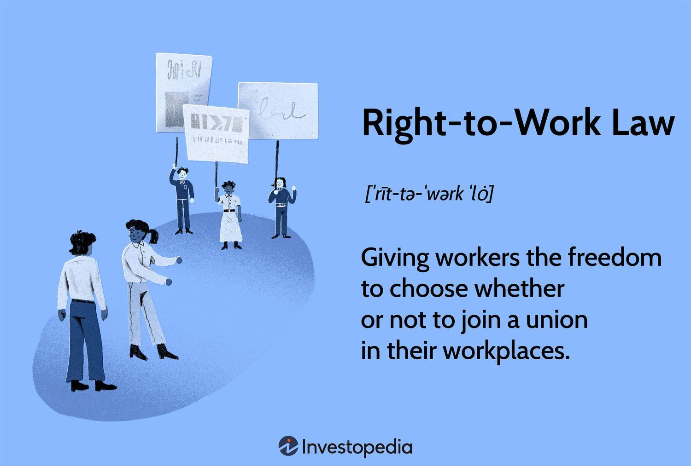

Labor policies are critical components in defining and safeguarding employment rights, thereby shaping the workplace environment across various industries. These policies determine the fundamental standards by which employment conditions are assessed, ensuring that workers are afforded necessary protections such as minimum wage laws, workplace safety regulations, and measures against discrimination. Central to these labor policies is the concept of right-to-work laws. These laws, prevalent in several U.S. states, are designed to govern the relationship between union membership and employment, often allowing individuals the choice to work without compulsory union membership or dues.

The impact of right-to-work laws on employment can be profound, influencing factors such as wage levels, union strength, and overall economic growth. Proponents argue that such laws enhance individual freedom and encourage economic development by making regions more attractive to businesses. Critics, however, assert that they may undermine collective bargaining power, reduce job security, and potentially depress wages and benefits.

In addition to traditional fields, emerging sectors like algorithmic trading (algo trading) are increasingly influenced by labor policies. Algo trading, which utilizes complex algorithms and high-speed computer networks to execute trading strategies, represents a growing segment in the financial industry. The rapid advancement in financial technologies highlights the need to assess how existing and evolving labor policies affect the rights and working conditions of employees in these technologically driven roles.

The purpose of this article is to explore the intersection of labor policy, employment rights, and right-to-work laws, specifically examining their implications on the algo trading sector. In today's job market, characterized by technological innovations and shifting economic landscapes, understanding these interactions has never been more relevant. As industries evolve and new employment sectors emerge, it is crucial to evaluate how contemporary labor laws meet the challenges posed by these changes and what future adaptations might be necessary to ensure fair labor practices.

This discussion is pivotal not only for policymakers and businesses but also for workers seeking to navigate the complexities of employment rights within modern economic frameworks. Engaging with these topics encourages informed dialogue and advocacy for effective labor practices that safeguard employee welfare while accommodating economic and technological advancements.

## Table of Contents

## Understanding Labor Policy and Employment Rights

Labor policies are vital frameworks that regulate employment standards to ensure fair treatment, safety, and equity in the workplace. These policies encompass a broad array of regulations and guidelines that govern how employers and employees interact, establishing conditions for employment that both parties must adhere to. They play a crucial role in ensuring that workplaces function smoothly and are conducive to the health, safety, and well-being of their employees.

### Key Employment Rights

Among the most critical employment rights are the provisions for minimum wage, workplace safety, and anti-discrimination. The minimum wage law sets the lowest hourly wage that an employer can pay an employee, designed to protect workers from exploitation and ensure a basic standard of living. In the United States, the federal minimum wage is mandated by the Fair Labor Standards Act (FLSA), though states may set higher standards.

Workplace safety is primarily governed by regulations established by the Occupational Safety and Health Administration (OSHA), which implements standards to prevent workplace injuries and illnesses. These standards require employers to maintain a hazard-free environment and provide training and safety equipment to employees.

Anti-discrimination laws, such as the Civil Rights Act of 1964 and the Americans with Disabilities Act (ADA), safeguard workers against discrimination based on race, gender, religion, national origin, or disability. These laws help promote diversity and equality in hiring practices and workplace policies.

### Role of Government and Unions

The government plays an instrumental role in enforcing labor policies through various agencies and legislations. These agencies conduct inspections, impose penalties for non-compliance, and offer resources for dispute resolution. Additionally, labor unions are pivotal in advocating for workers' rights and negotiating collective bargaining agreements that enhance employment terms beyond the statutory minimums.

Unions act as intermediaries between employees and employers, helping secure better wages, benefits, and working conditions. Through organized efforts, unions can exert pressure on employers and influence legislative changes, bolstering the rights of workers.

### Recent Changes and Trends

Recent trends in labor policy have been significantly influenced by technological advancements, globalization, and shifts in socio-economic conditions. There is an increasing recognition of gig and platform workers, prompting discussions on how to extend labor protections to these non-traditional employment forms. Moreover, there have been moves towards raising the minimum wage in various jurisdictions to align with the cost of living increases.

Another notable trend is the focus on enhancing workplace diversity and inclusion. Policies are evolving to address implicit biases and promote equal opportunities, reflecting growing societal awareness and demand for equity.

### Case Studies

One illustrative case study can be seen in the gradual raising of the minimum wage in cities like Seattle. The city implemented a phased plan to increase the minimum wage to $15 per hour for all workers, which has been analyzed extensively for its economic impacts and effects on workers' quality of life.

Another example is the impact of OSHA regulations on industries with high injury rates, such as construction and manufacturing. Studies have shown that comprehensive safety training and stringent enforcement of safety standards have led to significant reductions in workplace accidents and fatalities.

In conclusion, labor policies are fundamental to structuring fair and equitable work environments. They address critical issues such as wage protection, safety, and discrimination, while the government and unions play key roles in their enforcement and progression. As labor markets continue to evolve, policies must adapt to accommodate new work models and ensure that all workers enjoy the rights and protections they deserve.

## Right-to-Work Laws: Pros and Cons

Right-to-work laws are pivotal legislative measures in the United States that influence the employment landscape by regulating union membership and dues payment requirements. These laws, essentially, prohibit compulsory union membership as a condition of employment, allowing individuals to work in unionized fields without being obligated to join the union or pay dues. The intention is to uphold individual freedom by giving workers the choice to associate with a union or not.

Historically, right-to-work laws emerged in the mid-20th century, with the Taft-Hartley Act of 1947 marking a critical point in their evolution. This federal legislation amended the National Labor Relations Act of 1935 and allowed states to pass right-to-work laws, asserting that states can determine whether union security agreements are permissible. The backdrop of this legislative change was the post-World War II period, characterized by strong union influence, which prompted a push for ensuring that union membership and fee mandates were not prerequisites for employment. Over time, debates regarding these laws have evolved, capturing varying economic and social contexts.

Proponents of right-to-work laws argue that these measures enhance economic growth by attracting businesses to states that implement them. They cite the flexibility these laws offer to workers, allowing individuals to choose whether to support union activities financially. This purportedly leads to a more dynamic labor market and potentially greater job creation as employers find such environments more appealing.

Conversely, critics assert that right-to-work laws can undermine unions by diluting their financial resources and bargaining power. Without compulsory dues, unions may struggle to effectively negotiate for better wages and benefits, potentially leading to lower compensation and weaker protections for workers. This diminution of union strength may inadvertently harm workers, as unions play a critical role in advocating for employee rights and working conditions.

As of today, right-to-work laws are in effect in 27 states across the U.S., predominantly in the South and Midwest regions. These laws vary in specifics but collectively aim to reduce union influence in the employment sector. States like Michigan and Wisconsin have relatively recent laws, which reflect ongoing political and economic debates. In contrast, states like Georgia and Texas have long-standing right-to-work statutes, showcasing regional differences in legislative priorities and labor market dynamics.

Overall, right-to-work laws remain a contentious issue, with ongoing discussions about their implications for economic growth, worker rights, and union strength. The discourse surrounding these laws continues to evolve, shaped by broader economic conditions and varying political ideologies across regions.

## The Intersection of Labor Policy and Algo Trading

Algorithmic trading, often referred to as algo trading, has become a significant component of the financial sector. It involves the use of computer algorithms to execute trades at lightning-fast speeds, often without human intervention. This method leverages mathematical models and complex computations to make trading decisions, offering advantages in terms of speed, efficiency, and the ability to execute multiple trades simultaneously. According to a report by the European Securities and Markets Authority (ESMA), [algorithmic trading](/wiki/algorithmic-trading) accounts for a significant proportion of trading [volume](/wiki/volume-trading-strategy) in equity markets, contributing to market [liquidity](/wiki/liquidity-risk-premium) and price efficiency.

Labor policies play a critical role in shaping the working conditions of professionals involved in algorithmic trading. These policies encompass a range of employment standards, including working hours, conditions of employment, and rights to job security. A distinct feature of algo trading is its reliance on highly skilled labor, often involving atypical work arrangements such as remote working or non-standard hours, which traditional labor laws may inadequately address.

One of the key challenges that algo traders face is the inflexibility of existing labor laws, which may not cater to the unique work arrangements characteristic of the technology-driven financial sector. For instance, traditional definitions of working hours may not align with the flexible and often unpredictable working patterns required in algorithmic trading. As such, there is a potential mismatch between current labor standards and the realities faced by workers in this sector.

Data privacy and intellectual property rights are of paramount importance in algorithmic trading. The algorithms developed by traders or financial institutions are proprietary and often constitute the competitive edge of the firms deploying them. Existing labor policies may not sufficiently safeguard the intellectual property rights of algo traders, especially in cases where there is a lack of clear agreements between employers and employees. Moreover, data privacy concerns arise due to the vast amounts of sensitive data processed during trading; ensuring these are adequately protected under labor and employment regulations is crucial.

Currently, labor laws may fall short in providing comprehensive protection for algo traders. The rapidly evolving nature of technology and trading means that existing regulations can become obsolete quickly. There is a growing need for enhancements in labor policy that specifically address the issues arising from technological advancements in the financial sector. This may include provisions for flexible working conditions, clearer definitions of intellectual property rights, and robust data privacy protections.

To better accommodate the needs of algo traders, lawmakers and industry stakeholders should consider formulating new or revised regulations that reflect the realities of modern trading environments. Collaborative efforts between policymakers, financial institutions, and technology experts could pave the way for more responsive labor policies. These improved frameworks should aim to protect the rights of workers while fostering innovation and maintaining competitiveness in the financial markets.

## Future Implications and Trends

Emerging trends in labor policies are increasingly relevant as they are influenced by rapid technological advancements and shifts in the economic landscape. The integration of automation and [artificial intelligence](/wiki/ai-artificial-intelligence) into various sectors, including finance, necessitates a reassessment of existing labor regulations. As algorithmic trading grows, traditional labor standards may face challenges in addressing the unique needs of this evolving workforce. The fast-paced nature of algo trading, driven by complex algorithms and data analysis, requires labor policies that can adapt to these technological changes while ensuring that employment rights are maintained.

Right-to-work laws, which allow employees to choose whether to join or financially support a union, could see transformations as the workforce moves towards more gig-based and remote models. These laws are subject to political and economic forces that may either reinforce their presence or call for their reevaluation. The future trajectory of right-to-work laws might involve balancing individual choice with the need to protect collective bargaining rights. Such laws could impact union density and, consequently, workers' negotiating power concerning wages and benefits, particularly in rapidly evolving sectors like tech and finance.

Technological advances and the digital economy highlight the necessity for new regulations that consider data privacy, cybersecurity, and intellectual property rights. Algo trading, for instance, hinges on the secure and ethical use of data. Legislators may need to develop policies that safeguard data privacy while promoting innovation and growth. Furthermore, protecting intellectual property in software and algorithms is crucial to encourage creativity and entrepreneurship within digital industries.

International labor standards increasingly influence domestic policies, as globalization necessitates a coordinated approach to labor rights. Organizations like the International Labour Organization (ILO) provide frameworks that can guide nations in establishing fair labor practices. These standards can help ensure that workers in emerging industries, such as algo trading, receive consistent protections across borders. By aligning domestic policies with international norms, nations can enhance their competitiveness and foster equitable working conditions.

In preparation for these changes, stakeholders, including policymakers, businesses, and employees, need to remain agile and proactive. Engaging in dialogue and collaboration is essential to develop labor policies that are both forward-thinking and inclusive. Anticipating the impact of technological and economic changes can enable stakeholders to create a resilient labor force that benefits from advances while safeguarding fundamental employment rights. As the landscape continues to evolve, staying informed and adaptable will be key to navigating the future of work effectively.

## Conclusion

Labor policies are fundamental in shaping employment rights and workplace environments, serving as the backbone for ensuring that workers are treated fairly and justly. These regulations govern key aspects such as minimum wage, workplace safety, and anti-discrimination, setting the standards for what employees can reasonably expect from their employers. Understanding these policies is crucial, as they directly influence not only individual rights but also the overall economic health of a society.

The discussion of right-to-work laws highlights their significant impact on both employees and businesses. Advocates assert that such laws promote economic growth and individual freedom, while critics argue they can weaken union power and negatively affect wages and benefits. The complex interplay between these laws and employment rights underscores the need for balanced labor policies that protect workers while fostering economic development.

In industries like algorithmic trading, labor policies hold particular significance. This growing field, which relies heavily on digital infrastructure and intellectual property, faces unique challenges under existing labor laws. Ensuring that algo traders' rights are protected necessitates a robust legal framework that addresses concerns about data privacy and intellectual property, while accommodating the rapid technological advancements that characterize this sector.

Given the dynamic nature of the job market and the economy, it is imperative for policymakers, businesses, and employees to maintain an active dialogue. Such engagement can facilitate the development of labor practices that are not only fair and effective but also adaptable to future changes. Staying informed about labor rights issues and participating in these conversations is essential for shaping policies that ensure equitable conditions for all stakeholders.

As we navigate the evolving landscape of labor laws, especially with potential shifts in right-to-work legislation and the rise of the digital economy, all parties involved must remain vigilant and proactive. By doing so, we can work towards a future where labor policies not only protect but also empower the workforce.

## References & Further Reading

[1]: Moore, W. J., & Newman, R. J. (1988). "The Effects of Right-to-Work Laws: A Review of the Literature." *Journal of Labor Research, 9*(1), 45-68. [Link](https://journals.sagepub.com/doi/10.1177/001979398503800404)

[2]: Hanson, G. H., & Slaughter, M. J. (2002). "Labor Market Adjustments in Open Economies: Evidence from U.S. States." *Journal of International Economics, 57*(1), 3-29. [Link](https://isiarticles.com/bundles/Article/pre/pdf/17878.pdf)

[3]: Gleason, J. M., & Lee, C. M. C. (1999). "Analyst Forecast Revisions and Market Price Reactions." *Journal of Accounting Research, 37*(1), 13-37. [Link](https://www.jstor.org/stable/3203301)

[4]: Barker, T. (2021). ["Right-to-Work and Incomes in the United States."](https://www.nber.org/digest/202208/impacts-right-work-laws-unionization-and-wages) Employment Policies Institute.

[5]: Silbey, S. S. (1988). *"A Sociological Interpretation of the Relationship Between Law and the Economy."* In: Zey-Ferrell, M. & Aiken, M. (Eds.), *Complex Organizations in America*. McGraw Hill. 

[6]: Hall, B. J., & Murphy, K. J. (2003). "The Trouble with Stock Options." *Journal of Economic Perspectives, 17*(3), 49-70. [Link](https://www.nber.org/papers/w9784)