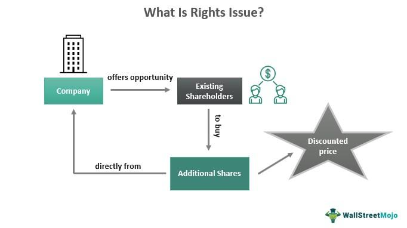

In finance, understanding mechanisms such as stock offerings, rights issues, equity financing, and algorithmic trading is essential for both investors and companies. These concepts form the backbone of capital markets, influencing how corporations raise funds and how investors make decisions. Stock offerings, including Initial Public Offerings (IPOs) and secondary offerings, enable companies to generate capital by issuing shares to the public. This influx of capital is critical for business expansion, debt management, and other strategic initiatives.

Rights issues grant current shareholders the opportunity to acquire additional shares at a reduced price, allowing companies to harness their existing shareholder base to raise funds. This can be particularly advantageous for firms seeking to strengthen their financial position without incurring additional debt.

Equity financing offers an alternative to debt financing by allowing companies to sell ownership stakes in exchange for capital. This method does not impose repayment obligations, making it attractive for businesses aiming to maintain liquidity while pursuing growth objectives.

Algorithmic trading represents a significant development in the trading landscape, leveraging computer algorithms to execute trades at speeds and volumes beyond human capability. This technology impacts stock offerings and equity financing by influencing liquidity, market efficiency, and price discovery. As trading strategies become increasingly sophisticated, understanding algorithmic trading's role becomes crucial for market participants.

For investors and companies alike, navigating these financial instruments effectively is imperative for making informed decisions. This article aims to explore these concepts, elucidating their significance and impact on the market, to empower readers with the knowledge needed to thrive in finance.

## Table of Contents

## Stock Offerings

Stock offerings involve companies issuing new shares to investors with the primary aim of raising capital to fund various corporate objectives, like business expansion and debt repayment. They are crucial in providing companies with the necessary funds to pursue strategic goals without increasing short-term debt. 

An Initial Public Offering (IPO) is the first time a company offers its shares to the public. Going public through an IPO allows a company to access virtually unlimited capital from the public market. This process often includes several stages, including selecting underwriters, applying regulatory compliance, and a roadshow to attract potential investors. For instance, IPOs are typically priced after discussions between the company and its underwriters, who gauge the interest of institutional investors.

Subsequent offerings, also called follow-on offerings, occur when a company that has already gone public issues more shares to raise additional funds. There are two types of follow-on offerings: dilutive and non-dilutive. In a dilutive offering, new shares are created and sold to existing or new investors, increasing the total share count and diluting the ownership of existing shareholders. A non-dilutive offering involves insiders selling shares they already own, meaning the total number of shares does not change, and such offerings generally aim to provide [liquidity](/wiki/liquidity-risk-premium) for early investors or company insiders.

When issuing stock, firms must consider market conditions, investor appetite, and the offering's impact on existing shareholder value. Generally, companies aim to time their stock offerings when market conditions are favorable to maximize the capital raised and minimize issuance expenses.

The implications for existing shareholders can vary. In situations like a dilutive offering, the increased number of shares may lead to a decrease in earnings per share (EPS), potentially affecting stock prices negatively. However, if capital raised is used efficiently to generate growth, any initial dilution effect can be counterbalanced by increased future earnings potential.

For companies, offering stock is an opportunity to secure growth without incurring additional debt, reducing financial strain. However, they must carefully manage shareholder relations and market expectations to prevent adverse market reactions due to perceived dilution or other reasons.

External references:
- Securities and Exchange Commission (SEC) - Provides oversight and regulation of IPOs and public companies.
- Investopedia - Offers definitions and detailed explanations of financial terms like IPO and stock offering.
- Nasdaq - Lists practical cases and statistics related to stock offerings and market performance.

## Understanding Rights Issues

Rights issues are a strategic method by which companies allow existing shareholders to purchase additional shares, typically at a discounted price. This mechanism serves as an alternative to other financing methods, enabling companies to raise additional capital by rallying support from their already vested shareholder base. In essence, it involves offering current shareholders the opportunity to buy more shares in proportion to their existing holdings, often presented as a ratio such as 1:5 or 1:10, indicating the number of additional shares one can purchase per number of shares already owned.

### Benefits for Companies
The primary advantage of rights issues for companies is the ability to efficiently raise capital without incurring the debt that would necessitate interest payments. This can be particularly beneficial when a company is seeking to fund expansion projects, undertake new ventures, or stabilize its balance sheet. Since the offer is made to existing shareholders, it can be a quicker and potentially less expensive process than other forms of equity financing. Moreover, by offering shares at a discounted rate, companies can incentivize participation, increasing the likelihood of a successful capital infusion.

### Benefits for Investors
For investors, rights issues can present an opportunity to increase their holdings at a potentially lower cost than market value. This not only offers a chance for portfolio growth but also helps in maintaining their proportional ownership and influence in the company. Furthermore, if the company's value increases post-rights issue as a result of the capital raised, investors stand to benefit from capital appreciation.

### Drawbacks for Companies
On the downside, while rights issues can provide much-needed capital, they also come with the risk of share dilution. If shareholders choose not to exercise their rights, their proportional ownership in the company will decrease. Additionally, if a rights issue is perceived as a sign of financial distress, it might negatively impact the company's stock price and investor confidence.

### Drawbacks for Investors
For investors, declining a rights issue can result in dilution of their existing shares, reducing their voting power and ownership percentage. Even if they participate, there's a risk that the market price could fall below the discounted price offered in the rights issue shortly thereafter, resulting in a financial loss. Investors must also weigh the opportunity cost, assessing whether committing additional capital to a single entity is prudent versus diversifying their investment portfolio.

In conclusion, rights issues serve as a critical financial strategy for companies seeking to raise capital through their current shareholder base. While offering several advantages, such as [capital raising](/wiki/hedge-fund-capital-raising) without debt, they also present challenges and risks, primarily associated with share dilution and market perception. Both companies and investors must carefully consider these factors when contemplating participation in rights issues.

## Equity Financing Explained

Equity financing is a fundamental financial strategy whereby companies raise capital by issuing shares to investors. Unlike debt financing, which involves borrowing money and repaying it with interest, equity financing allows businesses to secure funds without incurring debt. This characteristic makes it an attractive option for companies, especially those in the growth phase or those with high leverage, as they can improve their balance sheets by reducing debt levels.

Companies opt for equity financing for several reasons. Primarily, it provides access to capital that can be utilized for various purposes, such as expanding operations, funding research and development, or entering new markets. By issuing shares, a company can achieve these objectives without the burden of regular interest payments associated with debt. Additionally, equity financing can enhance a company's credibility and visibility in the market, potentially attracting more investors and boosting the stock price.

For shareholders, equity financing can have significant implications. On the positive side, it can lead to an increase in the stock's liquidity and market presence, potentially raising the value of their investment. However, issuing new shares often results in dilution of existing shares, meaning that current shareholders own a smaller percentage of the company than they did prior to the new issuance. This dilution can adversely affect the voting power and earnings per share (EPS) of existing shareholders.

The decision to engage in equity financing involves weighing the pros and cons. From a company’s perspective, the trade-off between gaining capital without interest obligations and the potential dilution of ownership must be carefully considered. For investors, understanding the broader impact of equity financing on their investments is crucial for making informed decisions. By analyzing how equity financing affects company performance and shareholder value, both parties can navigate these financial mechanisms to their advantage.

## The Role of Algorithmic Trading

Algorithmic trading employs sophisticated computer algorithms to facilitate rapid and efficient trading operations based on pre-defined criteria such as timing, price, or [volume](/wiki/volume-trading-strategy). This approach to trading has seen substantial growth, primarily due to its ability to enhance market efficiency and liquidity. Algorithmic trading is particularly impactful in stock offerings and equity financing, where it helps manage large trades with minimal market disruption.

### Impact on Stock Offerings and Equity Financing

Algorithmic trading plays a critical role in stock offerings by enabling underwriters to manage and execute large transactions efficiently. During an Initial Public Offering (IPO) or subsequent stock releases, algorithms can automate the buying process, minimizing the time taken to match sellers with interested buyers. This efficient execution can lead to more stable pricing, as trading algorithms can adapt quickly to market fluctuations and ensure adequate liquidity.

In equity financing, [algorithmic trading](/wiki/algorithmic-trading) can assist institutional investors in acquiring large blocks of shares without significant market impact. Algorithms can break down large trades into smaller orders, strategically timing these executions to avoid signaling risks or drastic price changes. This aspect is essential for maintaining market stability, especially during large capital-raising activities when [volatility](/wiki/volatility-trading-strategies) needs to be minimized.

### Advantages of Algorithmic Trading

1. **Efficiency**: Algorithms can process vast amounts of financial data at high speed, allowing for rapid decision-making and execution. This capability enables traders to capitalize on short-lived market opportunities that are usually inaccessible to manual trading methods.

2. **Reduced Transaction Costs**: By optimizing order execution and minimizing market impact costs, algorithmic trading can significantly reduce transaction expenses. The automation process eliminates the need for manual intervention, further cutting costs associated with human errors.

3. **Enhanced Accuracy**: Algorithms operate based on pre-set rules, reducing the probability of errors arising from human emotions or judgment. This precision ensures consistency in execution, aligning with predefined trading strategies.

### Challenges in Algorithmic Trading

Despite its advantages, algorithmic trading poses several challenges:

1. **Market Flash Crashes**: The speed and volume of trades executed by algorithms can sometimes lead to market anomalies, such as flash crashes. These incidents occur when trading algorithms react to market conditions by executing a large number of trades in a short time, leading to extreme market volatility.

2. **Regulatory Concerns**: As algorithmic trading grows, so does the scrutiny from regulators. Ensuring compliance with trading regulations and maintaining transparency in algorithm operations is vital. Regulators are increasingly focused on understanding these algorithms to prevent market abuse and ensure fair trading.

3. **Technological Failures**: Reliance on complex technology makes algorithmic trading susceptible to system failures. Ensuring robust risk management strategies and backup systems are crucial to mitigate the effects of potential technological malfunctions.

In conclusion, algorithmic trading continues to revolutionize the ways stock offerings and equity financing are conducted, providing significant benefits to market participants while presenting unique challenges that require careful management. As the technology evolves, both the advantages and the risks associated with algorithmic trading will continue to shape the financial landscape.

## Understanding the Risks and Rewards

Understanding the interplay of risks and rewards is crucial when engaging in stock offerings and rights issues. These financial mechanisms, while offering opportunities for capital growth, also present inherent risks that require careful evaluation by investors.

**Assessing Risks**
Investing in stock offerings and rights issues involves several risks. Market volatility is a prominent [factor](/wiki/factor-investing); share prices can fluctuate significantly due to macroeconomic changes or company-specific factors. Additionally, there is a risk of dilution for existing shareholders in rights issues if they choose not to exercise their rights, potentially leading to a decrease in their ownership percentage and influence within the company.

The financial health of the issuing company is another vital consideration. Companies undertaking stock offerings might do so because they are in a challenging financial position. Investors must analyze financial statements and understand the reasons behind the capital raise to ensure that they are not investing in a distressed entity with poor growth prospects.

**Evaluating Rewards**
Conversely, stock offerings and rights issues can provide substantial rewards. They serve as opportunities for investors to acquire shares potentially at a lower price, particularly in rights issues where shares are offered at a discount. If the company's valuation increases post-offering due to successful utilization of the raised capital, investors can reap significant capital gains. Furthermore, participating in these offerings allows investors to maintain or increase their ownership stake, preserving their voting power and influence over corporate decisions.

**Risk Management and Reward Maximization**
Investors can manage risks through diversification—spreading investments across different sectors and asset classes to mitigate the impact of any single adverse event. Conducting thorough due diligence is essential, involving an analysis of the company's management, competitive position, and growth strategy. This can be supplemented with quantitative methods, such as evaluating the company's price-to-earnings ratio (P/E ratio) compared to industry averages, to gauge investment viability.

To maximize rewards, investors should consider the timing of their investment. Engaging in stock offerings and rights issues during bullish market conditions can enhance the likelihood of capital appreciation. Additionally, leveraging insider insights, when legally permissible, and keeping abreast of industry trends can inform strategic investment decisions.

In summary, while stock offerings and rights issues present both risks and opportunities, investors can navigate these by conducting comprehensive analyses and strategic planning. Understanding the nuances of these processes allows for informed decision-making, enabling investors to harness potential rewards while mitigating associated risks.

## Conclusion

In the intricate landscape of modern finance, stock offerings, rights issues, equity financing, and algorithmic trading are crucial elements that shape the way companies and investors interact with the market. Each of these components plays a significant role in determining the flow of capital, investment strategies, and overall market dynamics. 

Stock offerings, whether through Initial Public Offerings (IPOs) or secondary offerings, provide companies with a vital mechanism to raise capital necessary for expansion, innovation, and maintaining competitiveness. They offer opportunities for investors to participate in the company's growth, potentially yielding substantial returns. Rights issues, on the other hand, enable existing shareholders to increase their stake, often at a reduced price, fostering a sense of ownership while simultaneously supporting the company's financial needs.

Equity financing presents a viable alternative to debt, liberating companies from the obligations of interest repayments and allowing them to leverage investor capital for growth initiatives. This mode of financing not only diversifies the company's capital structure but also distributes potential risks and rewards among a wider investor base.

Algorithmic trading has revolutionized how trades are executed, offering speed and precision that manual trading cannot match. This technology influences stock offerings by affecting pricing and liquidity, thereby impacting how companies and investors approach market participation. The analytical power of algorithms can assess vast datasets, streamline decision-making processes, and identify investment opportunities with greater efficiency.

For investors and companies alike, a robust understanding of these financial mechanisms is essential. Well-informed decisions can enhance portfolio performance, optimize capital structures, and harness market opportunities effectively. Engaging with these elements requires continuous learning and adaptation to the rapidly evolving financial environment. Staying informed and educated about these mechanisms is not just beneficial but imperative for achieving success and sustainability in the financial sector.

## References & Further Reading

[1]: ["Algorithmic Trading and DMA: An Introduction to Direct Access Trading Strategies"](https://www.amazon.com/Algorithmic-Trading-DMA-introduction-strategies/dp/0956399207) by Barry Johnson

[2]: ["The Intelligent Investor"](https://www.amazon.com/Intelligent-Investor-Definitive-Investing-Essentials/dp/0060555661) by Benjamin Graham

[3]: ["The Little Book of Common Sense Investing: The Only Way to Guarantee Your Fair Share of Stock Market Returns"](https://www.amazon.com/Little-Book-Common-Sense-Investing/dp/1119404509) by John C. Bogle

[4]: ["Security Analysis"](https://www.amazon.com/Security-Analysis-Foreword-Buffett-Editions/dp/0071592539) by Benjamin Graham and David L. Dodd

[5]: Securities and Exchange Commission (SEC). [Initial Public Offerings (IPOs)](https://www.sec.gov/files/33-11265-fact-sheet.pdf)

[6]: Nasdaq. [Stock Market Statistics](https://www.nasdaq.com/) 

[7]: Ehrman, D. S. (2006). ["The Handbook of Pairs Trading: Strategies Using Equities, Options, and Futures."](https://www.semanticscholar.org/paper/The-Handbook-of-Pairs-Trading%3A-Strategies-Using-and-Ehrman/a7fd7a390e577c6b47ff44cfe123f590df407896) 

[8]: Chuvakin, A., & Williams, D. (2011). ["Using Advances in Algorithmic Trading."](https://www.researchgate.net/publication/308586496_PCI_compliance_Understand_and_implement_effective_PCI_data_security_standard_compliance_fourth_edition)