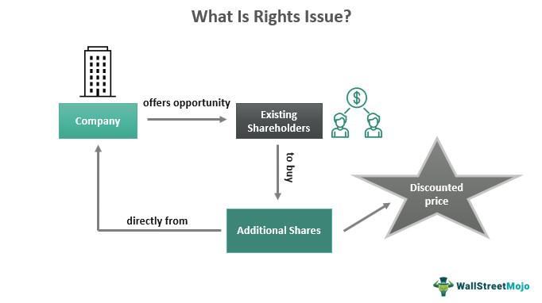

## Table of Contents

## What is a rights issue in finance?

A rights issue in finance is when a company offers its current shareholders the chance to buy more shares, usually at a lower price than the market value. This is done to raise more money for the company. The company gives each shareholder a certain number of rights based on how many shares they already own. These rights allow the shareholder to buy new shares at a special price.

Companies might do a rights issue when they need money for things like expanding their business, paying off debts, or funding new projects. It's a way to get cash without taking on more debt. However, it can also mean that the value of each share might go down because there are more shares now. Shareholders need to decide if they want to buy the new shares or sell their rights to someone else who wants to buy them.

## Why do companies issue rights?

Companies issue rights because they need money to grow or to fix their financial problems. When a company wants to expand its business, start a new project, or pay off debts, it needs cash. Instead of borrowing money from a bank, which can be expensive and risky, the company can ask its current shareholders to buy more shares. This is called a rights issue. By doing this, the company can raise the money it needs without having to pay back a loan with interest.

However, issuing rights can also change the value of the company's shares. When more shares are created and sold, each share might be worth less because the company's total value is now spread over more shares. This is called dilution. Shareholders need to think carefully about whether they want to buy the new shares at the lower price or sell their rights to someone else. If they don't do anything, they might end up owning a smaller piece of the company.

## How does a rights issue affect current shareholders?

When a company does a rights issue, it gives its current shareholders the chance to buy more shares at a lower price than what they are worth on the market. This can be good for shareholders because they can buy more shares for less money. If they believe in the company and think it will do well, they might want to buy more shares to increase their investment. They can also sell their rights to someone else if they don't want to buy the new shares themselves.

However, a rights issue can also make each share worth less. This happens because the company's total value is now spread over more shares. This is called dilution. If shareholders don't buy the new shares, their ownership in the company will be smaller because there are more shares now. So, they need to think carefully about what to do with their rights. If they do nothing, they might end up with a smaller piece of the company.

## What are the key terms associated with a rights issue?

When a company does a rights issue, it uses some key terms that shareholders should know. One of these is the "rights ratio," which tells shareholders how many new shares they can buy for each share they already own. For example, a 1:2 ratio means for every two shares a shareholder owns, they can buy one new share. Another term is the "subscription price," which is the special lower price at which shareholders can buy the new shares. This price is usually less than what the shares are worth on the market, making it a good deal for shareholders.

Another important term is "ex-rights date," which is the date when the shares start trading without the rights attached. If shareholders buy shares after this date, they won't get the rights to buy new shares. The "record date" is also key; it's the date when the company checks who owns the shares to see who gets the rights. Finally, there's the term "renounceable rights," which means shareholders can sell their rights to someone else if they don't want to buy the new shares themselves. Understanding these terms helps shareholders make smart choices about what to do with their rights.

## How can an investor participate in a rights issue?

When a company decides to do a rights issue, it gives its current shareholders a chance to buy more shares at a lower price. To take part, an investor needs to look at the rights ratio and the subscription price. The rights ratio tells the investor how many new shares they can buy for each share they already own. The subscription price is the special lower price for the new shares. If an investor wants to buy the new shares, they need to fill out a form and send money to the company by a certain date.

If an investor doesn't want to buy the new shares, they can still do something with their rights. They can sell their rights to someone else who wants to buy the new shares. This is called a renounceable right. The investor needs to check if the rights are renounceable and follow the company's rules for selling them. If the investor does nothing, they might end up owning a smaller part of the company because there will be more shares now. So, it's important for investors to think about what they want to do with their rights and act before the deadline.

## What are the potential benefits of participating in a rights issue?

Participating in a rights issue can be good for investors. If they believe in the company and think it will do well, they can buy more shares at a lower price than what they are worth on the market. This means they can increase their investment without spending as much money. If the company grows and the share price goes up, the investor can make more money from their bigger investment.

Another benefit is that by buying the new shares, investors can keep their ownership in the company the same. When a company does a rights issue, it creates more shares. If investors don't buy the new shares, their part of the company gets smaller because there are more shares now. By participating, investors can avoid this and keep their ownership the same or even increase it.

## What are the risks associated with rights issues?

When a company does a rights issue, there are some risks for investors. One big risk is that the value of each share might go down. This happens because the company's total value is spread over more shares. If the company doesn't use the new money to grow or improve, the share price might not go up, and investors could lose money. Also, if investors don't buy the new shares, their ownership in the company will be smaller. This can make their investment less valuable if the company does well in the future.

Another risk is that the company might be doing a rights issue because it is in trouble and needs money fast. If the company is struggling, the rights issue might not fix its problems. Investors might buy more shares in a company that is not doing well, which can lead to more losses. It's important for investors to look at why the company is doing a rights issue and if it has a good plan for the new money. If the company doesn't have a strong plan, the rights issue might not help, and investors could end up losing money.

## How does a rights issue impact a company's stock price?

When a company does a rights issue, it can make the stock price go down right away. This happens because the company is making more shares. When there are more shares, the value of each share can go down because the company's total value is spread over more pieces. This is called dilution. Investors might see the stock price drop when the rights issue is announced because they know there will be more shares soon.

But the long-term impact on the stock price depends on what the company does with the new money. If the company uses the money well to grow or fix problems, the stock price might go up later. But if the company doesn't use the money well, the stock price might stay low or even go down more. So, it's important for investors to look at the company's plans and decide if the rights issue is a good idea or not.

## Can rights issues be used as a tool for financial restructuring?

Yes, rights issues can be used as a tool for financial restructuring. When a company is in financial trouble and needs money to fix its problems, it can do a rights issue to raise cash. Instead of borrowing money from a bank, which can be hard and expensive, the company can ask its current shareholders to buy more shares. This gives the company the money it needs to pay off debts, invest in new projects, or make other changes to improve its financial health.

However, using a rights issue for financial restructuring has risks. If the company doesn't use the new money well, it might not fix its problems, and the value of the shares could go down. Shareholders need to think carefully about whether the company has a good plan for the money and if the rights issue is a smart move. If the company can turn things around with the new money, the rights issue can be a good way to restructure and get back on track.

## What are the regulatory requirements for conducting a rights issue?

When a company wants to do a rights issue, it has to follow some rules set by the government and financial regulators. These rules are there to make sure the company is honest with its shareholders and that everyone gets a fair chance to buy the new shares. The company has to tell everyone about the rights issue in a clear way, usually by sending a document called a prospectus. This document explains why the company is doing the rights issue, how many new shares it is offering, and at what price. The company also has to tell shareholders about important dates, like when they need to decide if they want to buy the new shares or sell their rights.

Regulators also want to make sure the company is not doing anything wrong. So, the company might need to get approval from a financial authority before it can go ahead with the rights issue. This can take some time and involve a lot of paperwork. The company has to show that it is following all the rules and that the rights issue is fair to everyone. If the company does everything right, it can go ahead with the rights issue and raise the money it needs.

## How do rights issues differ across various global markets?

Rights issues can be different in different countries because each place has its own rules and ways of doing things. In the United States, companies usually have to follow rules set by the Securities and Exchange Commission (SEC). They need to give a lot of information to shareholders and the public about the rights issue. In Europe, the rules can be different from one country to another, but many countries follow the rules set by the European Union. Some countries might make it easier for companies to do rights issues, while others might have stricter rules.

In Asia, countries like Japan and India have their own ways of handling rights issues. In Japan, companies often use rights issues to raise money, and the process can be quick and straightforward. In India, the rules are set by the Securities and Exchange Board of India (SEBI), and companies need to follow strict guidelines to make sure everything is fair. No matter where a rights issue happens, the basic idea is the same: the company offers its shareholders a chance to buy more shares at a lower price. But the details and rules can change a lot from one country to another.

## What advanced strategies can investors use to maximize returns from rights issues?

Investors can use some smart strategies to make more money from rights issues. One way is to buy more rights from other shareholders who don't want them. If an investor believes the company will do well, they can buy extra rights at a lower price and then use them to buy more shares. This can help the investor own a bigger part of the company and make more money if the share price goes up. Another strategy is to look at the timing of the rights issue. If an investor thinks the market will go up soon, they might want to buy the new shares quickly to take advantage of the lower price before the share price rises.

Another advanced strategy is to use the rights issue as part of a bigger investment plan. For example, an investor might use the money they make from selling their rights to buy shares in another company that they think will do better. This way, they can still make money from the rights issue even if they don't want to buy more shares in the company doing the rights issue. Also, investors can use financial tools like options and futures to bet on where they think the share price will go after the rights issue. By using these tools, investors can try to make money no matter if the share price goes up or down.

## References & Further Reading

[1]: ["Understanding Stock Dilution: What It Is, How It Works, And Why It Matters"](https://www.marketbeat.com/learn/stock-dilution-what-it-is-how-it-works-and-examples/) from Investopedia.

[2]: ["Algorithmic Trading: Pros and Cons"](https://www.investopedia.com/terms/a/algorithmictrading.asp) by the Commodity Futures Trading Commission (CFTC).

[3]: Lintner, John (1965). ["The Valuation of Risk Assets and the Selection of Risky Investments in Stock Portfolios and Capital Budgets"](https://www.jstor.org/stable/1924119). The Review of Economics and Statistics.

[4]: ["Rights Issue"](https://www.investopedia.com/investing/understanding-rights-issues/) by the London Stock Exchange.

[5]: Hasbrouck, Joel (2007). ["Empirical Market Microstructure: The Institutions, Economics, and Econometrics of Securities Trading"](https://academic.oup.com/book/52241) Oxford University Press.

[6]: Narang, Rishi K. (2012). ["Inside the Black Box: The Simple Truth About Quantitative Trading"](https://www.amazon.com/Inside-Black-Box-Quantitative-Trading/dp/0470432063) Wiley.