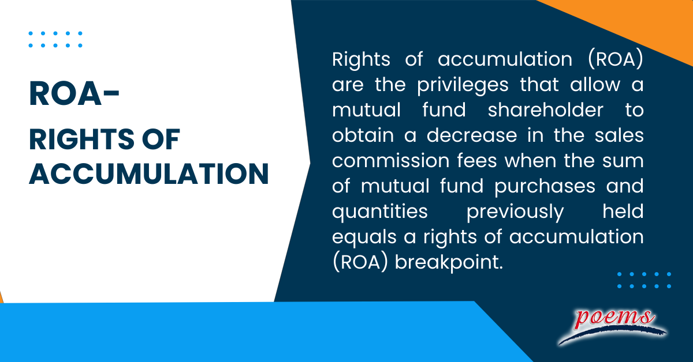

## Table of Contents

## What are Rights of Accumulation?

Rights of Accumulation, often called ROA, are a way to help investors save money on sales charges when they buy mutual funds. If you keep buying more shares of the same mutual fund over time, ROA lets you pay a lower sales charge. This happens because the more you invest, the bigger your total investment becomes. Once your total investment reaches certain levels, you get to pay a lower sales charge on future purchases.

For example, if you start with a small investment and keep adding to it, your total investment grows. When it grows enough to reach a new level set by the mutual fund company, your next purchase will have a lower sales charge. This makes it easier and cheaper for you to keep investing in the same fund. ROA is a great way to reward loyal investors by reducing the costs of buying more shares over time.

## How do breakpoints work in the context of Rights of Accumulation?

Breakpoints in the context of Rights of Accumulation are specific investment levels that, when reached, allow you to pay a lower sales charge on your mutual fund purchases. Think of breakpoints like steps on a ladder. Each step represents a higher amount of money you've invested in total. When your total investment climbs to a new step, you get to pay less for the sales charge on your next purchase.

For example, if a mutual fund has breakpoints at $10,000, $25,000, and $50,000, once your total investment reaches $10,000, you'll pay a lower sales charge than before. If you keep investing and your total reaches $25,000, you'll pay an even lower sales charge. This system encourages you to keep investing in the same fund because the more you invest, the less you pay in sales charges.

## Can you provide a simple example of how Rights of Accumulation are applied?

Imagine you want to invest in a mutual fund that has a sales charge. The fund has breakpoints at $10,000, $25,000, and $50,000. You start by investing $5,000, and the sales charge is 5%. A few months later, you add another $3,000. Now, your total investment is $8,000, but you're still paying the 5% sales charge because you haven't reached the first breakpoint.

A year later, you decide to invest an additional $3,000. This brings your total investment to $11,000, which is past the $10,000 breakpoint. Now, when you buy more shares, you'll only pay a 4% sales charge instead of 5%. This is how Rights of Accumulation help you save money on sales charges as your total investment grows over time.

## What are the benefits of using Rights of Accumulation for investors?

Rights of Accumulation help investors save money on sales charges when they keep investing in the same mutual fund. As your total investment grows, you reach certain levels called breakpoints. When you hit these breakpoints, the sales charge you pay on new purchases goes down. This means you get to keep more of your money in the fund, which can grow over time. It's like getting a discount for being a loyal investor.

This system encourages people to keep investing in the same fund because they know they'll pay less in fees as their investment gets bigger. It's especially helpful for people who can't invest a lot of money all at once but can add to their investment over time. By using Rights of Accumulation, investors can slowly build up their investment and enjoy lower costs, making it easier to reach their financial goals.

## How do different investment firms calculate breakpoints?

Different investment firms might have their own ways of calculating breakpoints for Rights of Accumulation. Some firms might count only the money you have put into their specific mutual funds. For example, if you invest in Fund A and Fund B from the same company, they might add up the money from both to see if you reach a breakpoint. Other firms might be stricter and only count the money you put into one specific fund, so if you want to reach a breakpoint, all your money has to go into that one fund.

Sometimes, firms also look at how long you have been investing. They might say you need to keep your money in the fund for a certain amount of time before they count it towards a breakpoint. This is to make sure people don't just move money in and out quickly to get the lower sales charge. So, it's important to know how each firm does it because it can affect how much you pay in sales charges and how you plan your investments.

## What documentation is required to prove eligibility for Rights of Accumulation?

To prove you can use Rights of Accumulation, you usually need to show records of your past investments in the same mutual fund. This can include account statements or trade confirmations that show how much money you have put into the fund over time. These documents help the investment firm see that your total investment has reached a breakpoint, which means you can pay a lower sales charge on your next purchase.

Sometimes, the investment firm might ask for more information, like your account number or personal details, to make sure the records are yours. It's important to keep all your investment papers organized and up-to-date, so you can easily show you are eligible for the lower sales charge when you want to add more money to your investment.

## Are there any common pitfalls or mistakes investors make with Rights of Accumulation?

One common mistake investors make with Rights of Accumulation is not keeping good records of their investments. If you don't have all your account statements and trade confirmations organized, it can be hard to prove you've reached a breakpoint. This means you might end up paying a higher sales charge than you should. It's important to keep all your papers in order so you can show the investment firm how much you've invested over time.

Another pitfall is not understanding how different investment firms calculate breakpoints. Some firms might count all your money in their funds, while others might only count money in one specific fund. If you don't know the rules, you might miss out on a lower sales charge. Always check with the investment firm to see how they do it, so you can plan your investments the right way and save money on fees.

## How do Rights of Accumulation affect the fee structure in mutual funds?

Rights of Accumulation change how much you pay in fees when you buy more shares of a mutual fund. As you keep investing more money, your total investment grows. When it reaches certain levels, called breakpoints, you get to pay less in sales charges for your next purchase. This means you can save money on fees as your investment gets bigger. It's like getting a reward for staying loyal to the same fund.

The way Rights of Accumulation affect fees can be different depending on the investment firm. Some firms might count all the money you put into their funds to see if you reach a breakpoint, while others might only look at the money you put into one specific fund. It's important to know how each firm does it because it can change how much you pay in fees. By understanding these rules, you can plan your investments better and keep more of your money working for you in the fund.

## Can Rights of Accumulation be combined with other discounts or benefits?

Yes, Rights of Accumulation can sometimes be combined with other discounts or benefits, but it depends on the rules of the investment firm. For example, some firms let you use Rights of Accumulation along with a Letter of Intent, which is a promise to invest a certain amount of money over a set time. This can help you reach breakpoints faster and save even more on sales charges.

However, not all firms allow you to combine these benefits. It's important to check with the investment firm to see what they allow. Knowing the rules can help you plan your investments better and take advantage of all the discounts and benefits available to you.

## What are the regulatory considerations for Rights of Accumulation?

When it comes to Rights of Accumulation, there are rules that investment firms have to follow. These rules come from places like the Securities and Exchange Commission (SEC) in the United States. The SEC makes sure that investment firms are fair and clear about how they handle Rights of Accumulation. They have to tell investors about the breakpoints and how to reach them. This helps investors know what they need to do to get the lower sales charges.

Investment firms also have to keep good records and make sure they are following their own rules about Rights of Accumulation. If they don't, they could get in trouble with the regulators. It's important for firms to be honest and clear with investors about how they calculate breakpoints and what documents are needed to prove eligibility. This way, investors can trust that they are getting the discounts they deserve as their investments grow.

## How do Rights of Accumulation strategies differ for institutional versus retail investors?

Rights of Accumulation strategies can be different for institutional and retail investors because they often have different investment sizes and goals. Institutional investors, like big companies or pension funds, usually have a lot more money to invest than retail investors, who are everyday people saving for their future. Because of this, institutional investors might reach breakpoints faster and get bigger discounts on sales charges. They might also have special agreements with investment firms that let them combine their investments across different funds to reach breakpoints more easily.

Retail investors, on the other hand, might need to work harder to reach breakpoints because they usually start with smaller investments. They might use strategies like setting up a Letter of Intent to promise more investment over time, which can help them get to the next breakpoint faster. Retail investors need to be careful to keep good records of their investments to prove they are eligible for Rights of Accumulation. Both types of investors need to understand how their investment firm calculates breakpoints and what documents are needed to take advantage of these discounts.

## What advanced strategies can be employed to maximize the benefits of Rights of Accumulation?

One advanced strategy to maximize the benefits of Rights of Accumulation is to use a Letter of Intent. This is a promise you make to the investment firm that you will invest a certain amount of money over a set time, usually 13 months. By doing this, you can reach breakpoints faster and start paying lower sales charges sooner. It's like telling the firm, "I'm going to invest more money soon," so they give you the discount now. Just make sure you can keep your promise, or you might have to pay back the difference in sales charges.

Another strategy is to carefully plan your investments across different funds from the same firm. Some firms let you combine your investments in different funds to reach breakpoints. So, if you spread your money across a few funds instead of just one, you might hit a breakpoint quicker and save on fees. It's important to check with the firm to see if they allow this and how they calculate breakpoints. By understanding these rules, you can make smart choices about where to put your money and get the most out of Rights of Accumulation.

## References & Further Reading

[1]: ["Algorithms for Hyper-Parameter Optimization"](https://dl.acm.org/doi/10.5555/2986459.2986743) by Bergstra, J., Bardenet, R., Bengio, Y., & Kégl, B. Advances in Neural Information Processing Systems 24, 2011.

[2]: ["Advances in Financial Machine Learning"](https://www.amazon.com/Advances-Financial-Machine-Learning-Marcos/dp/1119482089) by Marcos Lopez de Prado, Wiley, 2018.

[3]: ["Evidence-Based Technical Analysis: Applying the Scientific Method and Statistical Inference to Trading Signals"](https://www.amazon.com/Evidence-Based-Technical-Analysis-Scientific-Statistical/dp/0470008741) by David Aronson, Wiley, 2006.

[4]: ["Machine Learning for Algorithmic Trading"](https://github.com/stefan-jansen/machine-learning-for-trading) by Stefan Jansen, Packt Publishing, 2020.

[5]: ["Quantitative Trading: How to Build Your Own Algorithmic Trading Business"](https://www.amazon.com/Quantitative-Trading-Build-Algorithmic-Business/dp/1119800064) by Ernest P. Chan, Wiley, 2008.