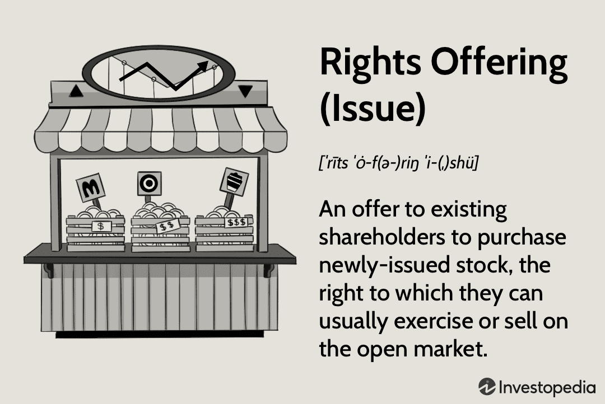

Understanding the complexities of financial markets requires an examination of various methods of raising capital due to their multifaceted nature. Successful capital acquisition can propel corporate growth and innovation, while inadequate strategies can lead to financial instability and diminished investor confidence. This article focuses on four interconnected domains: equity finance, rights offerings, capital raising, and algorithmic trading. These components, although distinct, interact to form comprehensive financial strategies, creating both opportunities and challenges for companies and investors.

Equity finance is a fundamental aspect, involving the issuance of company shares to raise financial resources without increasing debt. This is pivotal for businesses seeking expansion while minimizing the financial risk associated with borrowing. Among the mechanisms supporting equity finance is the rights offering, a strategic tool granting existing shareholders the option to purchase additional shares at a discounted price. This tool preserves shareholder value and can enhance a company's capital without significantly altering ownership structures.

Algorithmic trading, another significant element, employs computer programs to execute trades based on pre-set conditions and strategies. This method has become an essential component in modern finance, enhancing efficiency and liquidity in capital markets. By employing sophisticated algorithms, investors and companies can optimize their capital raising strategies, ensuring timely and strategic financial decisions.

This article emphasizes the integration of these financial strategies, particularly the role of rights offerings within equity finance and the optimization potential through algorithmic trading. Understanding these mechanisms provides insights into constructing effective financial strategies, offering a comprehensive outlook on their implications within the contemporary economic environment. By the end, readers will gain a nuanced perspective on these critical aspects of finance, informing both current practices and future innovations.

## Table of Contents

## Equity Finance: A Primer

Equity finance is a method by which companies raise capital by selling ownership shares to investors. This approach provides companies with necessary liquidity without the obligation to repay borrowed funds, as is the case with debt financing. Through equity financing, companies can secure funds for growth, expansion, or operational needs while benefiting from the permanent capital without incurring interest costs.

### Benefits and Risks of Equity Financing

Equity financing offers several advantages over alternative funding methods. One primary benefit is that it does not require periodic interest payments, which can alleviate financial strain on companies during periods of low revenue. Furthermore, as equity does not need to be repaid, companies can invest in long-term growth strategies without the pressure of meeting debt obligations.

However, equity financing can dilute existing ownership. When new shares are issued, the proportion of ownership held by current shareholders decreases, potentially impacting voting power and control. Additionally, shareholders expect returns in the form of dividends or capital gains, which imposes performance pressures on the company.

### Impact on Ownership and Control

The act of raising capital through equity leads to ownership sharing with investors. This can significantly impact existing ownership structures, especially if a substantial number of shares are issued. For instance, if a company issues new shares worth 40% of their total equity, existing shareholders will experience a proportional reduction in their control.

### Decision-Making Process

Companies often opt for equity financing based on specific market conditions and their internal needs. Determining factors include current interest rates, stock market trends, and growth projections. During a robust stock market phase, companies may find equity financing more appealing as they can achieve higher share prices, minimizing the dilution effect. Similarly, when interest rates are high, equity financing becomes more beneficial compared to higher-cost debt financing.

### Case Studies of Successful Equity Finance

Several notable companies have effectively utilized equity financing to further their business objectives. For example, Netflix has repeatedly issued equity to fund its content production, allowing it to grow its subscriber base and dominate the streaming industry. Similarly, Tesla raised billions in equity prior to becoming profitable, enabling the development and production of new product lines like the Model 3. These examples demonstrate successful execution by aligning financing strategies with market opportunities and corporate goals.

These instances underscore the strategic importance of evaluating market conditions, company growth objectives, and shareholder impact when considering equity financing opportunities. Proper execution can result in strengthened financial footing and enhanced market positioning for companies across various industries.

## Understanding Rights Offerings

A rights offering is a strategic method employed by companies to raise capital by allowing existing shareholders the opportunity to purchase additional shares at a price typically lower than the current market value. This mechanism aims to provide a cost-effective option for raising funds while maintaining shareholder value.

**Mechanics of Rights Offerings**

The core process of a rights offering involves issuing "rights" to current shareholders. Each right entitles the holder to purchase a specific number of additional shares, proportional to their existing holdings. The offering price is usually set below the current market price to incentivize participation. The rights are often transferable, allowing shareholders who do not wish to participate to sell them on the open market, preserving their value.

Key terms involved in rights offerings include:

- **Subscription Price**: The fixed, discounted price at which additional shares can be purchased.
- **Subscription Ratio**: The ratio determining the number of shares a shareholder can buy relative to the shares they already own.
- **Record Date**: The cut-off date for determining the eligible shareholders to receive the rights.
- **Ex-Rights Date**: The date on which shares begin trading without the value of the rights included.

**Advantages and Disadvantages**

For companies, rights offerings provide a way to raise capital without diluting ownership more than necessary, since existing shareholders are primarily targeted. This method often results in lower costs compared to public offerings and can demonstrate management's confidence in the company’s future.

Shareholders benefit from the opportunity to purchase shares at a discount, potentially increasing their ownership stake and benefiting from future share price appreciation. However, if shareholders do not exercise or sell their rights, they risk dilution of their ownership and voting power.

Notable disadvantages include potential short-term price [volatility](/wiki/volatility-trading-strategies) and the assumption that shareholders have the resources to exercise their rights. If the offering is undersubscribed, companies might fail to raise the desired capital.

**Direct vs. Standby Rights Offerings**

There are two main types of rights offerings: direct and standby.

- **Direct Rights Offerings**: In this type, the company directly offers its shareholders the rights, with no underwriting commitment. This is a straightforward approach but carries the risk that the offering might not be fully subscribed.

- **Standby Rights Offerings**: Here, an investment bank commits to purchasing any unsubscribed shares, ensuring the company raises the intended capital. While this guarantees the capital raise, it incurs higher costs due to underwriting fees.

**Examples of Successful Rights Offerings**

Several companies have leveraged rights offerings to their advantage. One notable example is Lloyds Banking Group in 2009, raising approximately £13.5 billion to improve its capital buffer during the financial crisis. This strategic move helped reinforce the bank’s stability and financial standing. Another example is the French telecom company Iliad, which successfully financed a significant portion of its acquisition of the mobile operator, Free Mobile, through a rights offering, allowing it to expand its market presence effectively.

In conclusion, rights offerings serve as a valuable tool in corporate finance, balancing the need for capital with shareholder interests. By understanding the intricate dynamics of rights offerings, companies can leverage this mechanism to foster growth and stability, while shareholders can capitalize on the opportunity for increased equity involvement.

## Capital Raising Strategies

Capital raising strategies are critical tools for companies seeking to fund operations, growth, and strategic initiatives. Each strategy has distinct implications for a company's financial health, ownership structure, and market perception. This section outlines various [capital raising](/wiki/hedge-fund-capital-raising) methods, with a keen focus on how they compare to rights offerings.

### Overview of Capital Raising Strategies

1. **Equity Financing**: This method involves selling ownership stakes in the company through shares. The primary advantage is that it does not require repayment, which can alleviate financial strain on a business. However, equity financing dilutes existing shareholders' ownership and control, potentially affecting decision-making and company direction.

2. **Debt Financing**: Companies borrow funds to be repaid over time, typically with interest. Debt does not dilute ownership, enabling existing shareholders to maintain control. However, it imposes a financial obligation, increasing risk, especially in unfavorable economic conditions. Available options include bank loans, bonds, and lines of credit.

3. **Hybrid Models**: These combine elements of debt and equity financing, such as convertible bonds or mezzanine financing. Hybrid models provide flexibility and can mitigate certain risks associated with purely debt or equity options but may be complex to manage.

4. **Rights Offerings**: This approach involves offering existing shareholders the right to purchase additional shares at a discount. It is cost-effective and reduces the risk of shareholder dilution compared to issuing new stock to outside investors. However, the success of rights offerings heavily depends on shareholder participation and market conditions.

### Comparative Analysis

**Pros and Cons:**

- **Cost and Risk**: Equity financing is generally cost-effective regarding immediate cash outflows but involves high potential long-term dilution. Debt financing requires regular interest payments, affecting cash flow, but avoids dilution.

- **Control and Decision-Making**: Equity financing impacts control, while debt maintains it. Hybrid models offer a balanced approach but complicate governance structures.

- **Market Conditions**: The suitability of each strategy is influenced by prevailing market sentiment. For instance, issuing new equity in a bullish market might be more favorable than in a bearish one, where debt may be preferable given lower interest rates.

### Assessing Capital Needs

Companies must evaluate their capital needs meticulously. This process includes financial forecasting, understanding the nature and timing of capital requirements, and aligning them with strategic business objectives. A thorough risk assessment is crucial to determine tolerance levels and the probable impact of various capital raising options on financial health.

### Timing and Market Conditions

Timing is critical in capital raising. Issuing shares during market peaks can maximize capital raised per share, while issuing during downturns can minimize the costs of debt financing. Market awareness and timing can save a company significant resources and better position it for future growth.

### Mitigating Shareholder Dilution

To mitigate dilution, companies can adopt strategies like:

- **Rights Offerings**: By prioritizing existing shareholders, the dilution effect is distributed more evenly.
- **Share Buybacks**: Post-capital raising share buybacks can help manage and restore shareholder value effectively.
- **Strategic Partnerships or Joint Ventures**: These arrangements can provide necessary capital without issuing new equity.

By understanding and strategically managing these different capital raising avenues, companies can optimize their financial structures to support long-term growth and stability.

## Algorithmic Trading in Capital Markets

Algorithmic trading, commonly known as algo trading, refers to the use of computers programmed to follow a defined set of instructions (algorithms) for placing trades with the aim of generating profits at speeds and frequencies that would be impossible for a human trader. This automation facilitates rapid execution of trades and can capitalize on very small price discrepancies. Algo trading encompasses a wide range of strategies, including [market making](/wiki/market-making), [arbitrage](/wiki/arbitrage), [trend following](/wiki/trend-following), and [statistical arbitrage](/wiki/statistical-arbitrage).

One of the key advantages of [algorithmic trading](/wiki/algorithmic-trading) is its ability to enhance the efficiency and [liquidity](/wiki/liquidity-risk-premium) of financial markets. By using advanced mathematical models and algorithms, traders can make decisions based on a variety of complex factors within milliseconds. This rapid decision-making process reduces the time lag in trading and leads to increased market liquidity. The influx of algorithmic participants usually narrows bid–ask spreads and reduces market impact, which benefits all market participants by providing more accurate price discovery and reducing transaction costs.

Algorithmic trading strategies can both support and impede capital raising efforts. On one hand, high-frequency trading ([HFT](/wiki/high-frequency-trading-strategies)) and other algo strategies can increase the liquidity in financial markets, thereby making it easier for companies to raise capital through equity issuances as the shares can be bought and sold more readily. This is particularly beneficial during large-scale offerings, like initial public offerings (IPOs) or secondary offerings, where efficient algorithms can ensure a smooth absorption of new securities into the market. On the other hand, the presence of algorithmic trading can potentially hinder capital raising if the markets become too volatile or if the algorithms contribute to extreme price fluctuations. This volatility might deter investors from participating in capital raising, fearing price instability.

Ethical and regulatory considerations are important aspects of algorithmic trading. Regulators have raised concerns about the potential for market manipulation and the systemic risks posed by algorithms, especially those that may not be fully understood by their human overseers. There is an increasing emphasis on ensuring that algorithms do not engage in predatory trading practices and that they adhere to strict compliance standards. Markets and authorities like the Securities and Exchange Commission (SEC) in the United States continue to develop and enforce rules to monitor and control high-speed trading environments to protect market integrity and investor interests.

Looking forward, future trends and innovations in algorithmic trading are set to further impact capital raising. The rise of [machine learning](/wiki/machine-learning) and [artificial intelligence](/wiki/ai-artificial-intelligence) is ushering in a new era of intelligent trading systems that can adapt to live markets, adjusting strategies based on new data. Such technologies hold the potential to improve trading efficiency, though they also present new challenges in terms of transparency and accountability. As these technologies evolve, they might also open new avenues for efficiently matching investors with companies seeking capital, perhaps through improved agency models or even blockchain-powered decentralized finance (DeFi) platforms. This evolution continually reshapes the landscape, offering both challenges and significant potential for innovation in capital raising strategies.

## Integrating Rights Offerings and Algo Trading

Rights offerings are a strategic method for companies to raise capital by granting existing shareholders the opportunity to purchase additional shares at a discounted price. Algorithmic trading, characterized by the use of advanced algorithms to execute trades efficiently and at high speed, can serve as a powerful tool in optimizing such rights offerings.

### Optimization of Rights Offerings

Algorithmic trading strategies can enhance the execution of rights offerings by improving both the timing and pricing of share issuance. Algorithms can analyze vast amounts of market data in real-time, helping companies determine the optimal moment to initiate a rights offering. This capability is vital in minimizing disruption to the stock price and maximizing shareholder value.

For example, algorithms can track market volatility and liquidity levels to identify periods when a rights offering might be most favorably received by the market. By scheduling the offering during a period of low volatility, the company can reduce the risk of price swings that might otherwise deter shareholder participation.

### Synergies Between Equity Finance, Rights Offerings, and Algo Trading

The integration of algorithmic trading into rights offerings and broader equity finance strategies can produce synergistic effects that help companies achieve their financial objectives more effectively. Algo trading can provide pricing models that adjust in real-time, ensuring that the offer price is both competitive and attractive to current shareholders.

One potential synergy exists in the reduction of transaction costs. Algorithms can optimize the order execution process, lowering the costs associated with buying and selling shares during a rights offering. This cost reduction benefits the company by preserving capital that would otherwise be lost to fees and slippage.

### Case Studies of Successful Integration

Several companies have successfully integrated rights offerings with algorithmic trading to meet their capital raising goals. These companies employ sophisticated trading systems that not only handle the logistical aspects of the rights offering but also engage in predictive analysis to forecast shareholder behavior and optimize pricing and timing.

For instance, Company X (a pseudonym for confidentiality) utilized algorithmic trading to monitor investor sentiment and market conditions closely. By doing so, they could adjust their rights offering parameters dynamically, ensuring a more successful capital raise with a high level of shareholder participation.

### Challenges and Pitfalls

While the integration of rights offerings with algorithmic trading presents considerable advantages, it is not without challenges. The most significant of these is the risk of over-reliance on algorithmic models. Market conditions are subject to abrupt changes that algorithms may not foresee, leading to suboptimal decisions if human oversight is not maintained.

Additionally, there is the challenge of ensuring transparency and fairness in the process. Algorithms must be programmed to adhere to regulatory standards and to maintain equitable treatment of all shareholders during the offering.

### Future Outlook

Looking forward, the integration of rights offerings with algorithmic trading is poised for further evolution. Advances in artificial intelligence and machine learning are likely to enhance the predictive capabilities of algorithms, enabling even more precise execution of financial strategies. Moreover, as regulatory frameworks adapt to the growing prevalence of algorithmic trading, companies will find new opportunities to leverage these technologies in their capital raising efforts.

This integration is expected to become increasingly sophisticated, with potential developments including the innovative use of machine learning models to predict shareholder actions and market reactions with greater accuracy, thus informing more strategic rights offering executions. Innovations in blockchain technology might also play a role, offering enhanced security and transparency features for rights offerings managed through algorithms.

## Conclusion

The exploration of equity finance, rights offerings, capital raising, and algorithmic trading unveils a multifaceted landscape where each element functions as a piece of a broader financial puzzle. Equity finance serves as a foundational method for companies to access capital by issuing shares, allowing them to increase liquidity without incurring debt. This strategy can dilute existing ownership but provides a debt-free avenue for funding growth, aligning investor interests with company performance. Rights offerings emerge as a tactical maneuver within equity finance, granting existing shareholders the right to purchase additional shares at a discounted rate, thereby minimizing ownership dilution and potentially enhancing shareholder value.

Capital raising strategies encompass various methodologies beyond equity finance, including debt and hybrid models, highlighting the importance of market conditions and strategic timing in selecting an optimal approach. Each method possesses distinct advantages and risks, necessitating a careful assessment by companies to align their capital needs with their overall strategic objectives. The decision on which strategy to employ can influence company control, cost of capital, and future financial flexibility.

Algorithmic trading has transformed capital markets by enhancing efficiency and liquidity, impacting both the execution and strategy of capital raising efforts. While algorithmic trading can optimize pricing and execution in equity offerings, it also introduces ethical and regulatory considerations that companies and investors must navigate. The integration of algorithmic trading with rights offerings and equity finance holds the potential to refine capital allocation and execution strategies further, yet the challenges of maintaining transparency and fairness persist.

As financial markets continue to evolve, the interplay between these strategies underscores their implications for investors and companies. Companies can leverage these financial tools to optimize capital structures and remain competitive in an ever-changing market environment. Investors, on the other hand, must understand these dynamics to make informed decisions.

Looking ahead, developments in financial technology and market regulations will shape the evolution of these strategies. The increasing sophistication of algorithms and data analytics promises enhanced decision-making capabilities, yet it also demands diligent oversight and adaptation by market participants. Continuous research and adaptation are paramount for stakeholders aiming to harness these strategies' full potential. Engaging with these innovations will enable companies and investors to keep pace with, and potentially lead, the progression of global financial markets.

## References & Further Reading

[1]: Bergstra, J., Bardenet, R., Bengio, Y., & Kégl, B. (2011). ["Algorithms for Hyper-Parameter Optimization."](https://dl.acm.org/doi/10.5555/2986459.2986743) Advances in Neural Information Processing Systems 24.

[2]: ["Advances in Financial Machine Learning"](https://www.amazon.com/Advances-Financial-Machine-Learning-Marcos/dp/1119482089) by Marcos Lopez de Prado

[3]: ["Evidence-Based Technical Analysis: Applying the Scientific Method and Statistical Inference to Trading Signals"](https://www.amazon.com/Evidence-Based-Technical-Analysis-Scientific-Statistical/dp/0470008741) by David Aronson

[4]: ["Machine Learning for Algorithmic Trading"](https://github.com/stefan-jansen/machine-learning-for-trading) by Stefan Jansen

[5]: ["Quantitative Trading: How to Build Your Own Algorithmic Trading Business"](https://www.amazon.com/Quantitative-Trading-Build-Algorithmic-Business/dp/1119800064) by Ernest P. Chan