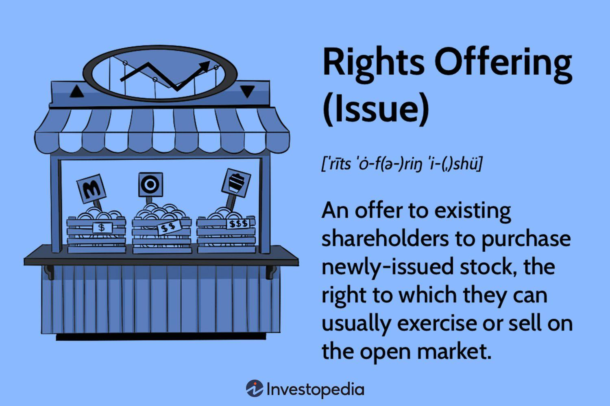

## Table of Contents

## What is a rights offering?

A rights offering is when a company gives its current shareholders the chance to buy more shares at a lower price than what the shares are currently worth. This is like a special deal for people who already own part of the company. The company does this to raise more money, which it can use for things like expanding the business or paying off debts.

Shareholders get a "right" for each share they own, which allows them to buy new shares. They can either use these rights to buy more shares or sell the rights to someone else if they don't want to buy more shares themselves. This way, everyone has a chance to keep their ownership percentage in the company the same if they choose to participate in the offering.

## How does a rights offering work?

When a company decides to do a rights offering, it gives its current shareholders a special chance to buy more shares at a cheaper price than what they're worth on the market. Each shareholder gets one right for each share they already own. These rights let them buy new shares at a lower price. The company sets a time limit for how long shareholders have to decide if they want to use their rights to buy more shares. This time is usually a few weeks.

If shareholders decide they want to buy more shares, they use their rights during the set time period. They pay the lower price for each new share they buy. If they don't want to buy more shares, they can sell their rights to someone else who might want to buy the new shares. This way, shareholders can still get some money from the rights even if they don't want to buy more shares themselves. By doing a rights offering, the company can raise more money to use for things like growing the business or paying off debts, and shareholders have the chance to keep their ownership percentage the same if they choose to participate.

## What are the different types of rights offerings?

There are mainly two types of rights offerings: renounceable rights offerings and non-renounceable rights offerings. A renounceable rights offering lets shareholders sell their rights to someone else if they don't want to buy more shares themselves. This means if you don't want to use your rights, you can still get some money by selling them to another person who might want to buy the new shares. On the other hand, a non-renounceable rights offering doesn't allow shareholders to sell their rights. If you don't use your rights to buy more shares, you can't get any money from them because you can't sell them to anyone else.

Both types of rights offerings are used by companies to raise money, but they work a bit differently. In a renounceable rights offering, the market for the rights can make things more complicated because people can buy and sell the rights. This can be good for shareholders because they have more options, but it can also be more work to figure out what to do with the rights. In a non-renounceable rights offering, things are simpler because you can only use the rights to buy more shares or let them expire without doing anything. Companies might choose one type over the other based on what they think will work best for their shareholders and their need to raise money.

## What are the advantages of participating in a rights offering?

Participating in a rights offering can be good for shareholders because it lets them buy more shares at a lower price than what they're worth on the market. This means they can get more shares without spending as much money as they would if they bought them at the regular price. This can be a great chance for shareholders to increase their ownership in the company without paying a lot. Plus, if the company does well in the future, the value of their shares could go up, making their investment worth more.

Another advantage is that shareholders can keep their ownership percentage the same. When a company issues new shares, it can dilute the ownership of current shareholders if they don't buy more shares. By participating in the rights offering, shareholders can buy enough new shares to keep their ownership percentage from going down. This way, they don't lose their influence in the company and can still have a say in how it's run. If shareholders believe in the company's future, participating in the rights offering helps them stay invested and potentially benefit from the company's growth.

## What are the disadvantages of participating in a rights offering?

Participating in a rights offering means you need to spend more money to buy new shares. Even though the price is lower than the market price, it's still extra money you need to come up with. If you don't have the extra money, you might not be able to buy the new shares, and your ownership in the company could go down if other people buy them instead. This can be a problem if you really want to keep your ownership percentage the same.

Another disadvantage is that the value of the new shares might not go up as much as you hope. Sometimes, the reason a company does a rights offering is because it needs money and might be struggling. If the company doesn't do well after the rights offering, the value of your new shares could go down, and you could lose money. It's important to think about whether the company has a good plan for using the money it raises and if it's likely to succeed in the future before deciding to participate in the rights offering.

## Who is eligible to participate in a rights offering?

People who can take part in a rights offering are those who own shares in the company on a certain date that the company picks. This date is called the record date. If you own shares on the record date, you get rights that let you buy new shares at a lower price. The company tells everyone the record date ahead of time, so you know if you'll be able to join the rights offering.

Sometimes, the rights offering might not be open to everyone who owns shares. For example, if you live in a country where the rights offering isn't allowed, you might not be able to take part. Also, if you own shares through a special kind of account or investment fund, there might be rules that stop you from using your rights. It's a good idea to check the company's rules and any laws that might affect you before deciding to join the rights offering.

## How can shareholders exercise their rights in a rights offering?

Shareholders can exercise their rights in a rights offering by buying new shares at the lower price the company offers. They need to do this within the time period the company sets, which is usually a few weeks. To buy the new shares, shareholders need to fill out a form that the company gives them and send it back with the money for the shares. They can usually do this through their bank or broker, who will help them with the paperwork and make sure everything is done right.

If shareholders don't want to buy more shares, they have another option in a renounceable rights offering. They can sell their rights to someone else who might want to buy the new shares. This way, they can still get some money even if they don't want to buy more shares themselves. But if it's a non-renounceable rights offering, they can't sell their rights. In that case, if they don't use their rights to buy more shares, the rights will just expire and they won't get any money from them.

## What is the impact of a rights offering on a company's stock price?

When a company does a rights offering, it can affect the stock price in different ways. Right after the company announces the rights offering, the stock price might go down. This happens because the market might think the company needs money and could be in trouble. Also, when new shares are added, it can make each share worth less because the company's total value is spread out over more shares. This is called dilution.

But the impact on the stock price isn't always bad. If investors think the company will use the money from the rights offering well, like to grow the business or pay off debts, the stock price might go up over time. It depends on what investors think about the company's future. If they believe in the company's plans, the stock price could recover and even go higher than before the rights offering.

## How does a rights offering affect existing shareholders' ownership?

When a company does a rights offering, it gives current shareholders the chance to buy more shares at a lower price. If shareholders choose to buy these new shares, their ownership in the company stays the same. This is because they are buying enough new shares to keep their percentage of the company from going down. So, if they participate, they can keep their ownership level the same.

But if shareholders don't buy the new shares, their ownership in the company will go down. This is called dilution. When the company issues new shares, the total number of shares goes up, and if shareholders don't buy any of the new shares, their piece of the company becomes smaller. So, it's important for shareholders to decide if they want to keep their ownership the same by buying the new shares or if they're okay with owning a smaller part of the company.

## What are the tax implications of participating in a rights offering?

When you participate in a rights offering, there can be tax effects that you need to think about. If you buy new shares using your rights, you won't have to pay taxes right away. But when you sell those shares later, you might have to pay capital gains tax. The tax depends on how much the shares are worth when you sell them compared to what you paid for them. If the shares go up in value, you'll pay tax on the profit. If you sell the shares for less than you paid, you might be able to use the loss to lower your taxes.

If you decide to sell your rights instead of using them to buy new shares, you might have to pay taxes on the money you get from selling the rights. This money is usually seen as a capital gain, and you'll have to pay tax on it. The tax rules can be different depending on where you live, so it's a good idea to talk to a tax expert to understand exactly how participating in a rights offering could affect your taxes.

## How can a company structure a rights offering to maximize participation?

A company can make more people want to join a rights offering by setting the price of the new shares at a big discount from what they're worth on the market. This makes the offer more attractive because shareholders can buy more shares without spending a lot of money. The company can also give shareholders more time to decide if they want to buy the new shares. This way, people have enough time to think about it and get the money ready if they want to join in.

Another way to get more people to participate is by making the rights offering easy to understand and use. The company can send clear instructions and forms that are simple to fill out. They can also work with banks and brokers to help shareholders with the process. By making everything easy and clear, more people might feel comfortable joining the rights offering. Plus, if the company shares a good plan for how they will use the money, it can make shareholders more excited to participate because they can see how it might help the company grow.

## What are some real-world examples of successful rights offerings?

One good example of a successful rights offering is when Ford Motor Company did one in 2020. Ford offered its shareholders the chance to buy new shares at a lower price to raise money during the tough times of the COVID-19 pandemic. The rights offering was a big success because a lot of shareholders joined in. Ford used the money to keep the business going and even to invest in new electric vehicle projects. This helped Ford stay strong and grow, which made the shareholders happy because their investment in the company was safe and could grow in the future.

Another example is when Tesla did a rights offering in 2020. Tesla let its shareholders buy more shares at a discount to help fund the company's growth plans. A lot of people joined in because they believed in Tesla's future, especially in making electric cars and renewable energy. The rights offering helped Tesla raise a lot of money, which they used to build new factories and develop new products. This made Tesla even more successful, and the shareholders who participated in the rights offering saw their investment grow as Tesla's stock price went up.

## References & Further Reading

[1]: Bergstra, J., Bardenet, R., Bengio, Y., & Kégl, B. (2011). ["Algorithms for Hyper-Parameter Optimization."](https://dl.acm.org/doi/10.5555/2986459.2986743) Advances in Neural Information Processing Systems 24.

[2]: ["Advances in Financial Machine Learning"](https://www.amazon.com/Advances-Financial-Machine-Learning-Marcos/dp/1119482089) by Marcos Lopez de Prado

[3]: ["Evidence-Based Technical Analysis: Applying the Scientific Method and Statistical Inference to Trading Signals"](https://www.amazon.com/Evidence-Based-Technical-Analysis-Scientific-Statistical/dp/0470008741) by David Aronson

[4]: ["Machine Learning for Algorithmic Trading"](https://github.com/stefan-jansen/machine-learning-for-trading) by Stefan Jansen

[5]: ["Quantitative Trading: How to Build Your Own Algorithmic Trading Business"](https://www.amazon.com/Quantitative-Trading-Build-Algorithmic-Business/dp/1119800064) by Ernest P. Chan