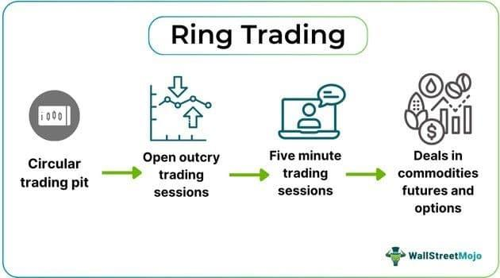

Financial markets have evolved dramatically with technological advancements, leading to substantial changes in how trades are conducted and markets are structured. Historically, trading involved direct human interaction in physical spaces, but the rise of digital technology has revolutionized these traditional methods. Ring trading and algorithmic trading (algo trading) are two critical mechanisms that reflect this transformation, each having a distinct impact on modern trading environments.

Ring trading, often associated with the London Metal Exchange, represents one of the oldest forms of trade execution in financial markets. It involves traders gathered in a circular pit where transactions occur through open outcry, emphasizing the human element of trading. This traditional mechanism relies on physical presence, verbal communication, and specific trading intervals, and it underscores the tactile and personal nature of financial exchanges.



Conversely, algorithmic trading has emerged as a product of technological progress. It utilizes predefined algorithms to automatically execute trades, fundamentally altering how transactions are initiated and completed. This form of trading leverages speed and computational efficiency, eliminating the need for human presence in physical trading environments. By transitioning trades from pits to electronic platforms, algo trading caters to the modern market's demands for rapid execution and extensive data processing.

This article examines these two trading methods, focusing on their mechanisms and impacts within the broader context of financial market evolution. Understanding these mechanisms is crucial for gaining insights into how financial markets operate today and how they might continue to evolve with ongoing technological advancements.

## Table of Contents

## Understanding Ring Trading

Ring trading is a traditional method of executing trades, predominantly associated with the London Metal Exchange (LME). This system is characterized by its distinct trading environment, a circular trading pit known as the ring, where transactions are conducted through an open outcry system. The physical structure of the ring enables traders to communicate and negotiate prices vocally, creating a dynamic and interactive trading environment.

A unique aspect of ring trading is its adherence to specific time intervals, known as "ring sessions." Each session is allotted a fixed duration during which particular commodities or financial instruments are traded. This scheduling ensures that all participating traders have equal opportunities to engage in buying and selling activities within the designated timeframe. These sessions are meticulously planned to facilitate orderly trading and to ensure that traders can allocate their resources and focus effectively.

The structured physical environment of the ring contributes to a distinctive trading atmosphere. Traders have designated positions within the ring, which are often based on seniority or specific trading roles. This structured arrangement is crucial for maintaining order during trading sessions, as it minimizes confusion and allows for effective communication. Verbal exchanges between traders, alongside visual signals, play a pivotal role in the execution of trades, highlighting the importance of physical presence and interpersonal interaction in this trading mechanism.

Overall, ring trading represents a traditional but significant approach to financial trading, where the physicality of the trading pit and the vocal transactions differentiate it from modern electronic trading systems.

## Mechanics of Ring Trading

Ring trading, a traditional method of executing trades, is primarily associated with the London Metal Exchange (LME) and is characterized by a distinct and highly structured process. It takes place within a circular trading pit known as "the ring," where traders physically gather to engage in transactions. This gathering occurs during specific time intervals, designated as trading sessions, which are pre-established for particular commodities or financial instruments.

Each participant in the ring has a designated position to facilitate the order execution process. This arrangement is strategic, serving to organize the flow of communication and maintain an orderly system amidst the bustling activity. The physical presence of traders in the ring is crucial, as it ensures direct and immediate interaction, which is a cornerstone of this trading method. Verbal communication is the primary means of conducting transactions, often referred to as "open outcry."

Open outcry is a vocal and gestural method of trading where traders shout and use hand signals to convey buy and sell orders. This approach not only accommodates rapid decision-making but also leverages human intuition and personal judgment, which are essential elements in responding swiftly to market fluctuations and negotiating trade terms.

The defined sessions during which ring trading occurs are categorized by specific times when particular commodities are traded. This scheduling is meticulously orchestrated to allow for focused and efficient trading opportunities for each commodity, while also permitting market participants to prepare and strategize for these concentrated periods.

In summary, ring trading depends heavily on the physical presence and verbal interactions of traders, organized within a strategically designed environment. The method underscores the significance of human roles and real-time communication in the execution of trades, contrasting sharply with the automated processes found in [algorithmic trading](/wiki/algorithmic-trading) platforms.

## The Transition to Algorithmic Trading

Technological advancements have significantly transformed trading practices, leading to the increasing prevalence of algorithmic trading. Unlike traditional methods like ring trading, which depend on manual intervention and open outcry systems, algorithmic trading uses sophisticated algorithms for automating trading processes. These algorithms leverage computational speed and efficiency to execute trades, minimizing the time and effort required for manual transactions.

Algorithmic trading, often abbreviated as algo trading, involves the use of computer programs to follow a defined set of instructions for placing trades. This automation allows for the rapid execution of trade orders that would be difficult to achieve through manual means. A key advantage of algo trading is its ability to process a vast amount of market data in real time and [carry](/wiki/carry-trading) out trades based on this data analysis, often within milliseconds. The primary goal is to capitalize on favorable market conditions, aiming to optimize returns while minimizing risk.

One of the hallmark characteristics of algorithmic trading is its shift from physical trading environments, such as the circular pits used in ring trading, to electronic trading platforms. This transition to digital platforms is driven by the need for increased efficiency, transparency, and access to a broader spectrum of global markets. The infrastructure supporting algorithmic trading incorporates various technologies, including high-frequency trading systems and [machine learning](/wiki/machine-learning) algorithms, to further enhance decision-making capabilities and execution speed.

For instance, a simple algorithmic trading strategy in Python could be implemented as follows:

```python
import yfinance as yf  # For more datasets, visit: https://paperswithbacktest.com/datasets
import numpy as np

# Fetch historical data for a given stock
data = yf.download('AAPL', start='2020-01-01', end='2022-01-01')

# Calculate the moving average
data['20DMA'] = data['Close'].rolling(window=20).mean()

# Define a simple moving average strategy
def simple_moving_average(data):
    signals = np.zeros(len(data))
    for i in range(1, len(data)):
        if data['Close'][i] > data['20DMA'][i] and data['Close'][i-1] <= data['20DMA'][i-1]:
            signals[i] = 1  # Buy signal
        elif data['Close'][i] < data['20DMA'][i] and data['Close'][i-1] >= data['20DMA'][i-1]:
            signals[i] = -1 # Sell signal
    return signals

# Generate trading signals
signals = simple_moving_average(data)
```

This code snippet demonstrates a basic algorithm, where trading signals are generated based on a 20-day moving average. It highlights how algo trading can automate decision-making processes that would traditionally require human judgment and intervention.

Overall, the transition to algorithmic trading marks a significant shift in trading paradigms, characterized by enhanced speed, reduced transaction costs, and the potential for improved accuracy in market predictions. As technology continues to advance, the adaptability and sophistication of algorithmic trading strategies are expected to grow, further reshaping the future of financial markets.

## Types and Strategies in Algorithmic Trading

Algorithmic trading employs a multitude of strategies to capitalize on market inefficiencies, applying mathematical models and computer programs to automate and optimize the trading process. Among the most prevalent strategies are [trend following](/wiki/trend-following), mean reversion, and [arbitrage](/wiki/arbitrage).

Trend following strategies identify and exploit persistent directional movements in asset prices. Traders employ algorithms to detect trends by analyzing moving averages, [momentum](/wiki/momentum) indicators, and other technical analysis tools. The strategy's core principle is that assets that have been appreciating will likely continue to do so, at least in the short term. A simple example of a trend-following algorithm in Python might involve using moving averages to generate buy and sell signals:

```python
import pandas as pd

def moving_average_strategy(data, short_window=40, long_window=100):
    signals = pd.DataFrame(index=data.index)
    signals['price'] = data['Close']
    signals['short_mavg'] = data['Close'].rolling(window=short_window, min_periods=1).mean()
    signals['long_mavg'] = data['Close'].rolling(window=long_window, min_periods=1).mean()
    signals['signal'] = 0.0
    signals['signal'][short_window:] = np.where(signals['short_mavg'][short_window:] > signals['long_mavg'][short_window:], 1.0, 0.0)
    signals['position'] = signals['signal'].diff()
    return signals
```

Mean reversion strategies are based on the assumption that asset prices will revert to their historical mean over time. These strategies typically involve identifying assets that have deviated significantly from their average price and predicting their return to average. The statistical properties of price data, such as variance and correlation, are often analyzed to develop these strategies. For instance, the Ornstein–Uhlenbeck process is a popular stochastic model used to represent mean-reverting behavior mathematically.

Arbitrage involves exploiting price differentials of the same asset across different markets or related assets within the same market. This strategy is predicated on the ability to simultaneously purchase and sell assets to capture profit without risk. Statistical arbitrage extends this concept by using quantitative models to identify opportunities based on statistical analysis rather than pure price discrepancy. For example, pairs trading is a form of [statistical arbitrage](/wiki/statistical-arbitrage) that involves trading two correlated securities based on their price spread.

High-frequency trading ([HFT](/wiki/high-frequency-trading-strategies)) and statistical arbitrage have gained prominence due to their ability to execute a large number of trades at extremely high speeds. HFT algorithms transact in fractions of a second, aiming to capitalize on small price discrepancies. Their reliance on speed means they require sophisticated technology infrastructure to minimize latency. Similarly, statistical arbitrage strategies extensively utilize machine learning and big data analytics to identify pricing anomalies and inefficiencies.

These algorithmic strategies are powered by complex algorithms that not only process extensive data streams but also execute trades automatically, considerably enhancing trading precision and efficiency. Utilization of technologies like [artificial intelligence](/wiki/ai-artificial-intelligence) and machine learning further amplifies the capability of these strategies to adapt to rapidly changing market conditions. As financial markets continue to evolve, these algorithmic strategies are anticipated to become progressively sophisticated, continuously adjusting to new information and technological advancements.

## Benefits and Challenges of Algo Trading

Algorithmic trading, commonly known as algo trading, has revolutionized financial markets by offering significant advantages over traditional trading methods. One of the primary benefits of algo trading is speed. Algorithms can execute orders in fractions of a second, far surpassing human capabilities. This rapid execution is essential in markets where price fluctuations can occur within milliseconds. Moreover, the precision provided by algo trading minimizes the risk of human error, ensuring that trades are executed at the optimal price point, thus improving efficiency and profitability.

Another notable advantage is the ability to handle large volumes of data and execute numerous trades simultaneously. Algorithms are designed to analyze vast datasets and use pre-defined criteria to make trading decisions, enabling traders to capitalize on multiple opportunities that may arise simultaneously. This capability is especially beneficial in high-frequency trading (HFT), where traders aim to exploit small price differentials at high speeds.

Despite its numerous benefits, algorithmic trading also presents several challenges. A significant risk involves technical failures, where errors in the algorithm or IT infrastructure can lead to substantial financial losses. For instance, a programming bug or server outage can result in unintended trades, impacting market positions adversely. Therefore, robust infrastructure and continuous monitoring are critical to mitigate these risks.

The market impact of algo trading is another concern. High-frequency and large-[volume](/wiki/volume-trading-strategy) trades can exacerbate price [volatility](/wiki/volatility-trading-strategies), affecting market stability. The "flash crash" of 2010, where the US stock market plummeted and then recovered within minutes, highlights the potential consequences of unregulated algo trading.

Regulatory and ethical considerations play an increasingly vital role in algo trading. Regulatory bodies are tasked with ensuring fair practices and market integrity, implementing measures such as order-to-trade ratios and circuit breakers to manage excessive volatility. Ethical considerations revolve around the use of algorithms that could potentially manipulate market conditions or disadvantage certain market participants.

In conclusion, while algorithmic trading offers numerous advantages in speed, precision, and efficiency, it simultaneously poses challenges that require technological robustness and appropriate regulatory frameworks. The balance between leveraging technology and maintaining market integrity remains a crucial focus in the evolving landscape of financial markets.

## Comparison: Ring Trading vs. Algo Trading

Ring trading, historically associated with the London Metal Exchange, presents a traditional and tangible approach to trading. It involves traders physically congregating in a circular pit, where transactions occur through open outcry. This setup fosters an environment where human intuition and the ability to interpret market sentiment play pivotal roles. Traders rely on verbal communication and non-verbal cues, such as gestures, to execute trades, which can sometimes bypass formal electronic systems.

On the other hand, algorithmic trading represents a significant shift towards modern efficiency in financial markets. It utilizes pre-defined algorithms to automate the process of trade execution, enabling lightning-fast transactions and the ability to manage vast volumes of data. Algorithms can instantly process information and react to market changes, thus catering to the need for speed and volume processing that characterizes contemporary trading environments.

While ring trading underscores the importance of human interaction and judgment, algo trading offers the advantage of precision and reduced human error, as decisions are based on systematic data analysis rather than intuition. Algorithmic trading is less influenced by emotions or fatigue, factors that can sometimes impact performance in a physical trading pit. 

Both methods hold unique positions within financial markets. Ring trading offers a sense of tradition and personal interaction that some market participants value. In contrast, algo trading aligns with the technological advancement that's driving today’s financial ecosystem, enabling new strategies like high-frequency trading and real-time arbitrage.

Despite their differences, each method contributes distinct advantages. Ring trading facilitates an environment where human skills are tested, whereas algo trading creates opportunities for leveraging computational power. The ongoing evolution in trading practices highlights the complementary nature of these approaches, with technology enhancing the scope and capabilities of market engagement.

## Conclusion

The transition from ring trading to algorithmic trading signifies a pivotal transformation in the financial markets. This evolution encapsulates the shift from traditional, manual methods to highly efficient, technology-driven processes. Ring trading, with its audible negotiations and physical presence within trading pits, epitomizes the historical foundations of market operations. It relies heavily on human interaction and intuition, offering a palpable sense of trading dynamics.

In contrast, algorithmic trading embodies the rapid technological advancements that have revolutionized market activities. By harnessing sophisticated algorithms, traders can execute orders at unprecedented speed and precision, far beyond human capabilities. This shift not only enhances operational efficiency but also broadens the capacity for handling voluminous transactions with minimal error.

Understanding these trading mechanisms provides critical insights into emerging market trends and the broader technological impacts on financial markets. The integration of algorithms into trading practices has facilitated sophisticated data analysis, allowing market participants to exploit quantitative patterns and inefficiencies.

Looking forward, continuous technological advancements are anticipated to further reshape trading practices and market structures. Innovations in machine learning, artificial intelligence, and data analytics are poised to enhance algorithmic strategies, offering even more refined tools for market analysis and execution. The ongoing evolution in trading technology will likely sustain the dynamic nature of financial markets, continually introducing new paradigms and challenges while expanding the avenues for strategic financial engagement.

## References & Further Reading

[1]: ["Advances in Financial Machine Learning"](https://www.amazon.com/Advances-Financial-Machine-Learning-Marcos/dp/1119482089) by Marcos Lopez de Prado

[2]: ["Quantitative Trading: How to Build Your Own Algorithmic Trading Business"](https://www.amazon.com/Quantitative-Trading-Build-Algorithmic-Business/dp/1119800064) by Ernest P. Chan

[3]: Bergstra, J., Bardenet, R., Bengio, Y., & Kégl, B. (2011). ["Algorithms for Hyper-Parameter Optimization."](https://dl.acm.org/doi/10.5555/2986459.2986743) Advances in Neural Information Processing Systems 24.

[4]: ["Evidence-Based Technical Analysis: Applying the Scientific Method and Statistical Inference to Trading Signals"](https://www.amazon.com/Evidence-Based-Technical-Analysis-Scientific-Statistical/dp/0470008741) by David Aronson

[5]: ["Machine Learning for Algorithmic Trading"](https://github.com/stefan-jansen/machine-learning-for-trading) by Stefan Jansen