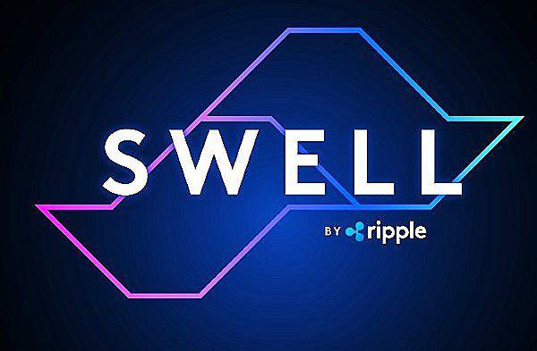

Ripple Swell is a pivotal annual event in the world of cryptocurrency and blockchain technology, garnering attention as a notable fixture on the crypto calendar. Hosted by Ripple Labs, the conference underscores the company's significant influence on the cryptographic landscape. Ripple Labs, known for its payment protocol and the XRP Ledger, plays a vital role in shaping the conversation around blockchain technology and digital currencies. The Ripple Swell conference stands as Ripple Labs' flagship event, drawing industry leaders, financial experts, and tech innovators from around the globe to discuss the future of financial technologies.

The conference serves as a springboard for advancing discussions on blockchain technology, crypto regulation, and financial technology innovations. By gathering a diverse group of stakeholders, Ripple Swell facilitates a comprehensive exchange of ideas, proposing solutions and exploring the potential implications of blockchain advancements. Attendees engage in discussions on various aspects of the crypto space, with a specific emphasis on emerging trends and the regulatory landscape that could shape the future of the industry.

Notably, Ripple Swell places particular focus on automation and algorithmic trading within its agenda. These elements have become increasingly important as they enable more efficient and accurate trading in the fast-paced cryptocurrency markets. Algorithmic trading employs advanced mathematical models and automated systems to execute trades at optimal speeds and prices, providing traders with a competitive edge. It is a theme of increasing relevance as the industry seeks to integrate sophisticated technological tools to enhance market operations and ensure greater transparency.

Consequently, Ripple Swell is more than just a conference; it is a dynamic forum for innovation and collaboration, fostering dialogue on key issues that drive the evolution of the financial technology sector. By facilitating these critical conversations, Ripple Swell contributes meaningfully to the ongoing development and adoption of blockchain technologies, ultimately influencing the broader cryptocurrency ecosystem.

## Table of Contents

## What Is Ripple Swell?

Ripple Swell is an annual conference organized by Ripple Labs Inc., a prominent company in the blockchain and cryptocurrency sector. Since its inception in 2017, the event has become a pivotal platform for discussions and developments concerning Ripple’s technologies. One of the primary objectives of Ripple Swell is to showcase these technologies, particularly the Ripple Payments protocol, XRP Ledger, and XRP, which are integral components of Ripple's contribution to financial technology innovation.

The Ripple Payments protocol is designed to enable secure, instant, and nearly free global financial transactions of any size with no chargebacks. It leverages the open-source XRPLedger, which employs distributed ledger technology to facilitate the seamless transfer of digital assets, including XRP, Ripple's native cryptocurrency. XRP is utilized within the ecosystem primarily for liquidity provisioning and reducing cross-border transaction costs and time.

Ripple Swell is characterized by its exclusive nature, with invites typically extended to Ripple’s key customers, prospects, and strategic partners. This targeted approach ensures that the discussions and engagements remain highly relevant and beneficial to the stakeholders who are most significantly impacted by the technological advancements and strategic directions outlined during the conference. Furthermore, the event serves as a networking forum, fostering collaborations and partnerships among participants who are at the forefront of financial technology and blockchain innovation.

## The Evolution of Ripple Swell

Ripple Swell has evolved as a pivotal event in the [cryptocurrency](/wiki/cryptocurrency) landscape since its inception in 2017. Hosted by Ripple Labs Inc., the conference was conceived as a platform to demonstrate and promote Ripple's innovative technologies such as the Ripple Payments protocol, the XRP Ledger, and XRP cryptocurrency. Initially, Ripple Swell started as a physical event, designed to engage Ripple's customers, prospects, and partners in discussions about advancements in blockchain and financial technologies.

The conference gained traction for featuring eminent speakers from both the financial and blockchain sectors. Notable appearances include former Federal Reserve Chairman Ben Bernanke and former U.S. President Bill Clinton, who provided insights on the broad implications of blockchain technologies. These high-profile speakers underscored the conference's commitment to fostering a dialogue between traditional financial systems and emerging blockchain ecosystems.

A significant shift occurred during the COVID-19 pandemic, prompting Ripple Swell 2020 to adopt a virtual format. This adaptation allowed for continued dialogue even amidst global travel restrictions, illustrating the event's resilience and flexibility. The transition to a virtual model expanded its accessibility, allowing a broader audience to participate and engage with cutting-edge discussions on blockchain innovations, regulation, and the future of digital finance.

Over the years, Ripple Swell has witnessed substantial growth in attendance, reflecting its increasing importance and impact on a global scale. Each iteration of the conference has been marked by significant announcements and initiatives, such as partnerships with major financial institutions and advancements in RippleNet integration. These milestones not only demonstrate the continuous evolution of Ripple's technological solutions but also highlight Ripple Swell's role as a catalyst for collaboration and innovation in the cryptocurrency and blockchain industries. As the conference continues to expand its reach, it reinforces Ripple's position as a leader in shaping the dialogue and future of financial technology.

## Focus Areas of Ripple Swell 2024

Ripple Swell 2024 promises a comprehensive agenda addressing key aspects of the cryptocurrency and blockchain sphere. One of the cornerstone topics is industry trends and the future trajectory of cryptocurrencies. This includes dissecting current market dynamics, emerging technologies, and potential disruptions poised to redefine global economic landscapes. Sessions on regulation are front-and-center, acknowledging the shifting global legal frameworks affecting blockchain technology and cryptocurrencies. Thought leaders and policymakers will engage in discussions to provide insights into regulatory adaptations necessary for fostering innovation while ensuring investor protection.

A significant portion of Ripple Swell 2024 is dedicated to advancements in blockchain technology and their ramifications for global payments. These sessions aim to showcase the evolution of blockchain beyond its foundational aspects, including scalability improvements, security enhancements, and interoperability between different blockchain systems. Such advancements are critical as they underpin the potential for seamless international transactions, reducing costs, and improving transaction speeds.

Algorithmic trading and automation within crypto markets represent another pivotal focus area. These discussions are essential, reflecting the growing influence of sophisticated trading strategies facilitated by algorithms. These mechanisms rely on complex mathematical models and real-time data processing to execute trades at speeds and efficiencies unachievable by humans alone. Industry experts will analyze these strategies' effectiveness in capitalizing on market opportunities and mitigating risks, exploring how they might reshape traditional trading paradigms.

Overall, with its focus on technology, regulation, and market innovations, Ripple Swell 2024 sets the stage for meaningful dialogue and idea exchange among stakeholders poised to influence the future of the cryptocurrency sector.

## The Role of Algo Trading in Cryptocurrency

Algorithmic trading, often known as algo trading, employs complex mathematical models and formulas to execute trades at high speeds and frequencies. This approach allows traders to utilize pre-programmed automated processes to take advantage of various market conditions, minimizing human error and emotional decision-making. In cryptocurrency markets, [algorithmic trading](/wiki/algorithmic-trading) plays an increasingly critical role due to the volatile and decentralized nature of digital asset exchanges, which operate 24/7 and hold varying [liquidity](/wiki/liquidity-risk-premium) across different platforms. By using algorithmic strategies, traders can efficiently execute trades, optimize their portfolios, and reduce transaction costs.

Ripple Swell integrates discussions on algorithmic trading within its agenda to highlight its growing importance in the cryptocurrency sector. The conference serves as a platform for industry leaders to exchange insights on the advancements in automated trading technologies. These discussions address how such innovations can enhance market efficiency and improve liquidity, while simultaneously tackling associated risks, such as market manipulation and technical vulnerabilities.

Key insights shared by industry experts at Ripple Swell underscore the future trajectory of algorithmic trading in cryptocurrencies. These professionals emphasize the necessity for robust algorithmic systems capable of handling the rapidly changing market landscapes and the role of [machine learning](/wiki/machine-learning) and [artificial intelligence](/wiki/ai-artificial-intelligence) in refining trading strategies. For instance, integrating AI can help in pattern recognition and predictive analytics, improving trading accuracy and outcomes.

Ripple Swell not only focuses on the technological advancements in algo trading but also debates the ethical and regulatory frameworks required to foster a fair and transparent trading environment. Experts discuss the need for global regulatory standards to govern algorithmic trading activities, ensuring market integrity and protecting investor interests.

In summary, Ripple Swell positions itself as a crucial forum for exploring the transformative impact of algorithmic trading on the cryptocurrency landscape. By spotlighting the latest advancements and providing a venue for critical dialogue, the conference helps shape the future of automated investing in digital assets, aligning technological progress with broader financial objectives.

## Keynote Highlights and Influential Speakers

Ripple Swell 2024 served as a platform where visionaries from the blockchain and financial sectors shared their insights and foresights, significantly contributing to the evolving dialogue on cryptocurrencies and distributed ledger technologies. Notably, Brad Garlinghouse, CEO of Ripple Labs, delivered a pivotal keynote speech that encapsulated the conference’s theme of innovation and strategic foresight. His address highlighted Ripple's ongoing commitment to bridging the gap between traditional finance and digital assets, underlining the role of XRP in facilitating cross-border transactions with reduced costs and increased efficiency. Garlinghouse also emphasized the necessity of regulatory clarity to foster further growth and stability in the cryptocurrency industry.

Apart from Garlinghouse, the conference featured several other influential speakers who enriched discussions with diverse perspectives. These included prominent economists, policymakers, and leaders from major financial institutions, each bringing unique viewpoints on blockchain scalability, sustainability, and integration into existing economic systems. For instance, some speakers explored the strategic implementation of blockchain in enhancing transparency and security in financial transactions, while others projected the long-term economic implications of widespread cryptocurrency adoption.

The impact of these keynote addresses was profound, fostering a deeper understanding of the inherent opportunities and challenges posed by blockchain technologies. These insights are anticipated to influence future financial strategies, enhancing blockchain integration while supporting robust regulatory frameworks. The dialogues catalyzed at Ripple Swell 2024 are expected to guide the trajectory of ongoing advancements in digital currencies and blockchain applications, ultimately contributing to the maturation of the global financial landscape.

## Discussions on Regulation and Policy

## Discussions on Regulation and Policy

The Ripple Swell conference has consistently emphasized the pivotal role of regulation and policy in the evolution of cryptocurrency and blockchain technology. During the Ripple Swell 2024, speakers underscored the need for a balanced regulatory framework that fosters innovation while ensuring financial stability and security. There was a consensus among participants that regulation presents both challenges and opportunities for the industry, as it strives to legitimize and integrate into the traditional financial system.

Key insights highlighted the varying global regulatory trends that continue to shape the blockchain and cryptocurrency landscape. For example, the European Union's Markets in Crypto-Assets Regulation (MiCA) was frequently cited as a comprehensive framework that could serve as a global model for cryptocurrency regulation. There was considerable discussion regarding the impact of differing regulatory approaches, such as the contrast between the relatively permissive environment in Singapore and the more cautionary stance adopted by countries like India and China. 

Regulatory figures attending the conference shared valuable perspectives on the ongoing dialogue between the cryptocurrency industry and regulatory bodies. A prominent attendee, Caroline Pham, a commissioner of the U.S. Commodity Futures Trading Commission (CFTC), emphasized the necessity for regulatory clarity to protect investors and facilitate fair market practices. She highlighted the potential of blockchain technology in improving transparency and reducing fraud but also warned against its misuse. 

In a similar vein, representatives from other regulatory institutions, such as the Financial Conduct Authority (FCA) of the United Kingdom, provided insights into the growing importance of international cooperation in regulating digital assets. Their discussions pointed to a future where cross-border regulatory frameworks could streamline compliance efforts for blockchain enterprises operating globally.

Throughout the event, the sentiment was clear: effective regulation is crucial in building trust and credibility for the crypto industry. Ripple Swell 2024's focus on these issues reflects an ongoing effort to influence regulatory policy and support the responsible adoption of blockchain technologies across the globe.

## The Bottom Line: Ripple Swell’s Impact

Ripple Swell has established itself as a pivotal event in the sphere of cryptocurrency and blockchain technology. Since its inception, the conference has continually influenced innovation, adoption, and conversation around financial technologies, acting as a catalyst for progress in the industry. By bringing together leaders from financial institutions, regulatory agencies, and technology companies, Ripple Swell fosters an environment conducive to the exchange of progressive ideas and strategic partnerships, further solidifying the maturity and integration of blockchain solutions into existing financial paradigms.

The conference’s role as a melting pot of technological discourse cannot be understated. Through a series of keynote speeches, panel discussions, and interactive sessions, Ripple Swell consistently propels forward-thinking dialogue surrounding the evolution of blockchain technology, especially in the domains of cross-border payments and decentralized finance. This platform has played a crucial role in challenging existing financial systems, advocating for more efficient, secure, and inclusive payment solutions.

As Ripple Swell garners attention and participation from a diverse group of stakeholders, the potential outcomes from its discussions become increasingly significant. The insights gained and connections made during the conference have the capacity to inspire new product developments, strategic collaborations, and regulatory advancements that can reshape the future of cryptocurrency and financial technologies. One of the anticipated outcomes is the advancement of regulatory frameworks that can accommodate the fast-paced evolution of digital assets while ensuring consumer protection and market stability.

Looking ahead, Ripple Swell is likely to continue its trajectory as a driving force behind blockchain innovation. The dialogues that take place at this conference are expected to spark new ideas and projects that enhance blockchain’s interoperability, scalability, and accessibility. Furthermore, the continued focus on emerging technologies like algorithmic trading is set to redefine investment strategies, offering a glimpse into the future of automated financial services.

In essence, Ripple Swell not only impacts its immediate stakeholders but also leaves an indelible mark on the broader cryptocurrency and blockchain landscape. The conference’s emphasis on innovation and strategic foresight is instrumental in shaping the ongoing transformation of global financial systems, pointing towards a more interconnected and technologically enriched future.

## FAQs

**Question 1: What is Ripple Swell, and why is it important?**

Ripple Swell is an annual conference organized by Ripple Labs Inc., designed to gather industry leaders, partners, and stakeholders in the cryptocurrency and blockchain sectors. First held in 2017, the event showcases Ripple’s technological advancements and encourages dialogue on critical topics such as cryptocurrency regulation, financial technology innovations, and the future of global payments. The conference plays a crucial role in shaping discussions and strategies related to blockchain and digital finance, making it a significant event for those interested in the evolution of cryptocurrency technologies.

**Question 2: What are the objectives of Ripple Swell?**

The primary objectives of Ripple Swell are to share insights into Ripple’s technological developments, including the Ripple Payments protocol, XRP Ledger, and XRP. It aims to bring together customers, prospects, and partners to discuss pressing issues in the industry, including regulatory landscapes, advancements in blockchain technology, and innovations in crypto markets such as algorithmic trading. The conference serves as a platform for fostering collaboration, sharing knowledge, and exploring new opportunities in the digital finance arena.

**Question 3: How does Ripple Swell impact the market for XRP?**

Ripple Swell impacts the XRP market by highlighting Ripple’s ongoing projects and partnerships that utilize XRP and its underlying technologies. By discussing significant advancements and use cases for XRP in cross-border payments and liquidity management, the conference can influence market perception and investor confidence. Presentations and keynotes from industry leaders and Ripple executives provide insights into the strategic importance of XRP, potentially affecting its market valuation and adoption. Enhanced focus on regulatory clarity around digital assets discussed during Swell also aids in creating a more favorable environment for XRP’s growth.

## References & Further Reading

[1]: Sugimoto, Mia. ["The Future of Financial Innovation: Exploring Blockchain and Cryptocurrency Trends at Ripple Swell 2023."](https://jfin-swufe.springeropen.com/articles/10.1186/s40854-022-00420-y) Finextra, November 2023.

[2]: Cheng, Evelyn. ["How Ripple's Partnership with Major Banks is Revolutionizing Cross-Border Payments."](https://ripple.com/insights/ripple-and-r3-team-up-with-12-banks-to-trial-xrp-for-cross-border-payments/) CNBC, September 2023.

[3]: Julian, Julia. ["Understanding the Impact of MiCA Regulation on the Cryptocurrency Market."](https://www.coindesk.com/learn/mica-eus-comprehensive-new-crypto-regulation-explained/) Coindesk, October 2023.

[4]: Lastweek, Eliot. ["Will Algorithmic Trading Shape the Future of Cryptocurrency?"](https://www.quodfinancial.com/future-of-algorithmic-trading/) Forbes, August 2023.

[5]: ["Cryptocurrency and Blockchain Regulation: What is MiCA and How Will It Affect the Market?"](https://www.coindesk.com/learn/mica-eus-comprehensive-new-crypto-regulation-explained/) European Commission, July 2023.