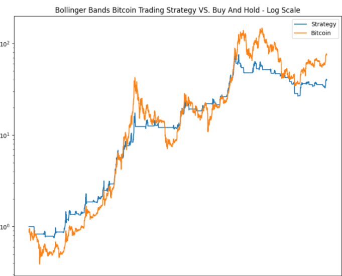

Blockchain technology has revolutionized the digital currency landscape by providing a decentralized and secure method for recording transactions. By distributing data across a network of computers, blockchain eliminates the need for centralized control, thus enhancing transparency and reducing the potential for fraud. This technological innovation serves as the foundation for cryptocurrencies, a class of digital assets that have gained substantial attention in recent years. Bitcoin, the first and most well-known cryptocurrency, demonstrated blockchain's potential to facilitate secure, peer-to-peer transactions without intermediaries. However, the impact of blockchain extends far beyond Bitcoin, influencing a broad spectrum of applications within and outside the cryptocurrency world.

Ripple emerges as a distinctive player in the evolving cryptocurrency market with its unique blockchain implementation. Unlike traditional blockchains that employ proof-of-work or proof-of-stake mechanisms, Ripple uses a consensus protocol known as the Ripple Protocol Consensus Algorithm (RPCA). This protocol enables faster and more energy-efficient transactions, making Ripple particularly appealing for cross-border payments. Ripple's native currency, XRP, acts as a bridge currency in these transactions, providing liquidity and minimizing exchange fees. Through strategic partnerships with financial institutions, Ripple is poised to transform the way international transactions are conducted, presenting significant efficiencies over traditional banking networks.



Algorithmic trading has become a critical component of modern finance, allowing traders to execute orders with precision and speed. This approach relies on complex algorithms to assess market data, identify trading opportunities, and automatically place orders with minimal human intervention. In the cryptocurrency market, algorithmic trading is pivotal due to the market's high volatility and 24/7 operational nature. Traders leverage these algorithms to implement strategies such as arbitrage, trend following, and market making, capitalizing on rapid market movements that would be challenging to manage manually.

Combining blockchain technology, Ripple, and algorithmic trading presents unprecedented opportunities for optimizing trading efficiency and maximizing profits. This integration can enhance the liquidity of Ripple, improve transaction speeds, and facilitate more sophisticated trading strategies. As traders increasingly adopt algorithmic techniques, Ripple's fast and low-cost transaction capabilities could position it as an attractive asset for algorithmic traders.

The purpose of this article is to explore these intersecting technologies and their implications for the future of finance. We will provide an overview of blockchain technology, delve into Ripple's unique features, and discuss the significance of algorithmic trading within this context. The article will further examine how these elements can be combined to create new financial opportunities and address the challenges that arise from their integration. Through this exploration, the article aims to offer insights for investors and traders looking to navigate the rapidly changing landscape of cryptocurrency trading.

## Table of Contents

## Understanding Blockchain Technology

Blockchain technology is a decentralized digital ledger that records transactions across a network of computers, ensuring that the transaction data is secure and immutable. Each transaction added to this public ledger is referred to as a "block," and these blocks are linked together through cryptographic elements called "hashes," forming a complete "chain" of records. This architectural design enables blockchain to maintain transparent, tamper-proof transaction data accessible to all network participants.

The principle of decentralization is fundamental to blockchain technology. Unlike traditional centralized systems where a single authority controls the entire database, blockchain operates on a distributed network of nodes. Each node holds a copy of the blockchain, which increases the system's security and reliability. This decentralized structure minimizes the risk of data manipulation and enhances trust among users, as no single point of failure or risk of central authority abuse exists.

Security in blockchain is primarily ensured through cryptographic techniques and consensus mechanisms. Each transaction is secured using cryptographic hash functions that convert input data into a fixed-sized string of characters, which is unique to the original data. Furthermore, the use of public and private keys in blockchain ensures that only authorized parties can initiate and approve transactions.

Consensus mechanisms play a vital role in ensuring that all participants in the network agree on the blockchain's current state. Popular consensus algorithms include Proof of Work (PoW) and Proof of Stake (PoS). PoW requires network participants to perform complex computational tasks to validate transactions, making it resource-intensive but highly secure. PoS, on the other hand, selects validators based on their stake or share of the [cryptocurrency](/wiki/cryptocurrency), reducing energy consumption while maintaining network security.

Blockchain technology underpins various cryptocurrencies, with Bitcoin being the most well-known example. Beyond cryptocurrencies, popular blockchains such as Ethereum serve broader applications by enabling smart contracts—self-executing agreements with terms directly written into code. This feature has fostered the development of decentralized finance (DeFi) and non-fungible tokens (NFTs), revolutionizing how contracts and assets are managed across sectors.

Ripple is another cryptocurrency supported by blockchain technology. It uses the Ripple Protocol Consensus Algorithm (RPCA), distinct from traditional blockchains. Instead of miners validating transactions, independent validators achieve consensus to update the ledger, increasing transaction speed and reducing costs. Ripple's native cryptocurrency, XRP, facilitates cross-border transactions by providing [liquidity](/wiki/liquidity-risk-premium) in environments traditionally dominated by slow processes and high fees.

In summary, blockchain technology introduces a decentralized, secure system crucial for supporting cryptographic currencies, including Ripple. Its advancement continues to impact a range of sectors through improved transparency, security, and efficiency.

## Exploring Ripple: A Unique Cryptocurrency

Ripple is a distinctive player in the cryptocurrency ecosystem, primarily known for its digital payment protocol and native cryptocurrency, XRP. The concept of Ripple was developed by Ryan Fugger in 2004 with the aim of creating a decentralized monetary system that allowed individuals to create their own money. However, it was not until 2012, when Chris Larsen and Jed McCaleb took over the project, that Ripple Labs was officially founded, leading to the creation of the Ripple Transaction Protocol (RTXP) and the introduction of XRP as a bridge currency for liquidity in cross-border payments.

One of Ripple's defining features is its consensus mechanism, which deviates significantly from the traditional proof-of-work (PoW) or proof-of-stake (PoS) models employed by most blockchains like Bitcoin and Ethereum. Instead, Ripple employs a unique consensus algorithm, which relies on a network of independent validators to ensure transaction integrity. These validators agree on the order and outcome of XRP transactions in a manner that requires minimal energy and offers high transaction throughput. This significantly reduces the confirmation times compared to PoW systems while maintaining robust security and preventing double-spending.

Ripple's native cryptocurrency, XRP, plays a central role in its mission to streamline cross-border transactions. Established financial networks often face delays and high costs, partly due to intermediaries and currency conversion fees. XRP facilitates instant liquidity by serving as a bridge currency between different fiat currencies, thereby enabling faster settlements and lower transaction fees. For instance, if a financial institution wants to transfer money from, say, USD to EUR, XRP can be used as an intermediary to convert USD to XRP and then XRP to EUR, all within seconds.

Central to Ripple's strategy has been its partnerships with major financial institutions. By collaborating with banks and payment providers, Ripple seeks to leverage its technology to overhaul and enhance existing financial infrastructures for faster and more cost-efficient international money transfers. Notable partners have included Santander, American Express, and SBI Holdings, among others. These alliances not only validate Ripple’s utility but also extend its reach across global markets, cementing its position as a viable alternative to traditional banking systems.

Nonetheless, Ripple has not been without challenges and controversies. The centralized nature of its validator network has often been critiqued, raising concerns about decentralization—a core tenet of cryptocurrency philosophy. Furthermore, Ripple Labs' substantial ownership of XRP tokens has led to debates about potential manipulation of XRP's market supply. Regulatory scrutiny, particularly in the United States, has also posed significant challenges for Ripple. The ongoing legal battle with the U.S. Securities and Exchange Commission (SEC), which alleges that XRP is an unregistered security, has created considerable uncertainty regarding Ripple’s future operations and legal status.

Despite these challenges, Ripple continues to innovate and adapt, aiming to revolutionize the financial ecosystem by providing efficient, scalable, and low-cost cross-border payment solutions powered by its blockchain technology and digital currency, XRP.

## Algorithmic Trading in the Cryptocurrency Market

Algorithmic trading refers to the use of computer algorithms to automate the process of trading financial instruments, making decisions about buying or selling assets at speeds and frequencies that are impossible for a human trader to achieve. This type of trading has evolved significantly since its inception in the early 1970s, driven largely by advancements in computing technology and the proliferation of financial markets operating on electronic platforms.

In the cryptocurrency market, [algorithmic trading](/wiki/algorithmic-trading) offers distinct advantages. The decentralized and volatile nature of digital currencies creates opportunities for algorithms to capitalize on price discrepancies, execute trades rapidly, and manage large volumes of data. By removing human emotions from the trading process, algorithmic systems can maintain consistency and potentially enhance profitability.

Several common strategies are utilized in crypto algorithmic trading. Arbitrage involves exploiting price differences of a cryptocurrency on different exchanges. For instance, if Bitcoin is priced differently on two platforms, an algorithm can buy low on one and sell high on another, securing a profit. Market making involves placing both buy and sell orders on an exchange, profiting from the bid-ask spread. Trend following, another strategy, uses algorithms to identify and trade in the direction of significant market trends.

Implementing algorithmic trading requires robust tools and platforms. Various software solutions provide the necessary infrastructure for developing and deploying trading algorithms. Python, for example, is a popular programming language for algorithmic traders due to its simplicity and the availability of diverse libraries like NumPy, pandas, and TA-Lib for data analysis and technical indicators. Platforms such as QuantConnect and TradingView offer rich environments for testing and executing blockchain-related trading strategies.

However, algorithmic trading is not without risks. Market conditions can change rapidly, posing challenges for algorithms tuned for historical data patterns. Software malfunctions can lead to unintended consequences, such as executing incorrect or unintended trades. To mitigate these risks, traders should implement thorough [backtesting](/wiki/backtesting) on historical data and use stop-loss limits to guard against significant losses. Monitoring real-time market conditions and maintaining rigorous algorithm performance evaluations are also essential.

Algorithmic trading in the cryptocurrency market is a dynamic field, promising profitable opportunities and posing unique challenges. With continued technological development and increasing market sophistication, algorithmic trading remains an essential tool for modern traders aiming to succeed in the rapidly evolving financial landscape.

## Implementing Algo Trading with Ripple

Algorithmic trading refers to the use of computer algorithms to execute trading strategies in financial markets, including the cryptocurrency market. Applied specifically to Ripple (XRP), algorithmic trading can take advantage of the digital asset's unique liquidity and [volatility](/wiki/volatility-trading-strategies) characteristics to optimize trading outcomes.

### Liquidity and Volatility of Ripple for Algo Traders

Ripple (XRP) is among the most liquid cryptocurrencies due to its high [volume](/wiki/volume-trading-strategy) of transactions and wide acceptance across numerous exchanges. Liquidity is crucial in algorithmic trading because it allows for the rapid buying and selling of large volumes without significantly impacting the market price. Volatility, the degree to which the price of XRP tends to fluctuate over a given period, presents both opportunities and risks for algorithmic traders. Volatile markets can lead to profitable trades if algorithms are designed to capitalize on price swings efficiently. 

### Case Studies or Examples of Successful Algo Trading Strategies with Ripple

One illustrative example of a successful algorithmic strategy with Ripple is the use of **[arbitrage](/wiki/arbitrage)** trading. This strategy exploits price differences for XRP across different exchanges or markets to generate profit. An arbitrage trading algorithm automatically identifies and acts on these price discrepancies, ensuring rapid execution that manual trading would not permit.

Another strategy is **[market making](/wiki/market-making)**, where traders provide liquidity by placing both buy and sell orders for XRP. The algorithm continuously adjusts these orders based on market conditions, profiting from the bid-ask spread. Successful implementation relies on the algorithm's ability to process real-time data and adjust to volatility.

### Technical Requirements and Setup for Trading Algorithmically with Ripple

To trade Ripple algorithmically, traders need a robust technical setup that includes:

- **Access to Trading APIs**: Platforms like Binance, Bitstamp, and Kraken offer APIs that allow developers to integrate algorithmic trading programs. These APIs provide critical market data and order execution capabilities.

- **Reliable Data Sources**: Access to real-time and historical market data is essential for developing and testing trading algorithms. Services like CoinMarketCap and CryptoCompare can be useful.

- **High-Speed Internet Connection and Hardware**: Low latency is crucial for executing trades quickly, especially in volatile markets. Traders often use dedicated servers to ensure minimal downtime and faster order execution.

- **Programming Skills**: Knowledge of programming languages such as Python is beneficial. For example, a simple algorithm to fetch XRP prices using an API in Python might look like this:

  ```python
  import requests

  def get_xrp_price():
      url = "https://api.exchange.com/v1/ticker/xrp"
      response = requests.get(url)
      data = response.json()
      return data['price']

  print(get_xrp_price())
  ```

### Future Prospects of Algo Trading with Ripple and Potential Market Trends

As the cryptocurrency market continues to mature, algorithmic trading with Ripple is expected to grow significantly. Enhancements in AI and [machine learning](/wiki/machine-learning) can lead to more sophisticated algorithms capable of analyzing vast amounts of data to predict market trends accurately. Additionally, as regulatory frameworks evolve, increased transparency and more data availability will potentially enhance algorithmic strategies.

Algorithmic trading can also benefit from advancements in blockchain interoperability, allowing algorithms to operate across multiple chains and markets efficiently. This capability could lead to more integrated and impactful trading strategies that harness the full potential of Ripple's network and beyond.

Overall, the fusion of algorithmic trading with Ripple offers compelling opportunities for traders seeking to capitalize on the dynamic nature of cryptocurrency markets. The ongoing technological advancements and expanding institutional interest lay a promising foundation for future growth and innovation in this sector.

## Challenges and Future Prospects

Integrating blockchain technology, Ripple (XRP), and algorithmic trading involves several challenges and future prospects that are critical to consider for their successful adoption in the financial markets.

**Challenges in Integration**

One of the primary challenges is the regulatory environment surrounding cryptocurrencies and blockchain technologies. Cryptocurrencies like Ripple face varying regulatory frameworks globally, which can affect their trading and adoption. For instance, in the United States, the Securities and Exchange Commission (SEC) has taken stringent measures against some cryptocurrencies, arguing they qualify as securities. These regulatory hurdles can lead to compliance challenges, potential fines, and restrictions that hinder the seamless operation of algorithmic trading systems.

Further, the nature of blockchain technology, which prioritizes security and decentralization, can complicate algorithmic trading. Typical challenges include scalability issues and the speed of transaction processing. Blockchain's consensus mechanisms, like proof-of-work or proof-of-stake, can introduce inefficiencies that might not align with the high-speed requirements of algorithmic trading.

**Technological Advancements**

Technological advancements could play a crucial role in enhancing the integration. Innovations in blockchain scalability solutions, such as sharding or layer two technologies, offer promising routes to improve transaction speeds and throughput. Similarly, advancements in machine learning and [artificial intelligence](/wiki/ai-artificial-intelligence) are expected to refine algorithmic strategies, allowing for more sophisticated analysis and prediction models in cryptocurrency markets.

Ripple itself continues to evolve with technological improvements aimed at increasing transaction speed and security. The Interledger Protocol is one example that facilitates seamless cross-ledger transactions. These advancements not only augment the functionality of Ripple but also enhance its appeal to algorithmic traders looking for efficiency and reliability.

**Future Developments and Predictions**

The future of Ripple, blockchain, and algorithmic trading lies in their ongoing evolution and integration. Ripple's potential developments could include increased adoption by financial institutions, further establishing its position as a facilitator of cross-border transactions. Enhanced security features and compliance tools could also emerge, tailored to meet strict regulatory requirements while ensuring robust trading environments.

Algorithmic trading techniques will likely progress with the introduction of quantum computing, which could provide unprecedented computational power and accuracy. This would greatly impact trading strategies, enabling superior analysis and decision-making capabilities.

**Predictions for Future Financial Systems**

In future financial systems, Ripple and blockchain technology could redefine transaction transparency and efficiency. With a robust legal framework and technological advancements, Ripple may become a cornerstone in global finance for conducting swift, low-cost international transactions. Blockchain's potential to provide immutable and transparent records will likely enhance trust and reduce counterparty risks in numerous financial applications.

Overall, while the integration of blockchain, Ripple, and algorithmic trading presents significant challenges, technological and regulatory advancements offer optimistic prospects. Their successful convergence could lead to more efficient, secure, and transparent financial systems benefitting traders and institutions alike.

## Conclusion

In this article, we explored the intricate world of blockchain technology, Ripple, and algorithmic trading, focusing on their synergistic potential to transform modern financial landscapes. A comprehensive understanding of these concepts is essential for investors aiming to navigate the rapidly evolving cryptocurrency markets. Blockchain technology provides the foundational infrastructure for decentralized and secure digital transactions. Ripple, with its unique consensus mechanism, offers a distinct approach to facilitating cross-border financial transactions, challenging traditional financial systems. Algorithmic trading, meanwhile, represents a sophisticated method of executing trades, leveraging speed and data analysis to maximize returns.

For investors and traders, familiarizing themselves with these technologies can unlock valuable opportunities. Blockchain's security and efficiency, combined with Ripple's strategic partnerships and the precision of algorithmic strategies, present a compelling case for those considering an entry into the crypto markets. The rise of algorithmic trading within the cryptocurrency space, especially with Ripple's XRP, highlights the increasing sophistication and maturation of financial systems that incorporate digital assets.

As the cryptocurrency market continues to evolve, staying informed and proactive is crucial. Investors should continue to explore and educate themselves about technological advancements and market dynamics. This knowledge can empower them to make informed decisions, positioning themselves advantageously amidst technological disruptions. Ultimately, the interplay between blockchain, Ripple, and algorithmic trading signifies an exhilarating advancement in finance, promising substantial opportunities for those prepared to embrace these innovations.

In conclusion, readers who are considering delving deeper into cryptocurrency trading should remain vigilant, adaptive, and informed. The future of finance may well be shaped by these technologies, and proactive engagement with them is highly recommended.

## References & Further Reading

[1]: Antonopoulos, A. M. (2017). ["Mastering Bitcoin: Unlocking Digital Cryptocurrencies."](https://books.google.com/books/about/Mastering_Bitcoin.html?id=IXmrBQAAQBAJ) O'Reilly Media.

[2]: Narayanan, A., Bonneau, J., Felten, E., Miller, A., & Goldfeder, S. (2016). ["Bitcoin and Cryptocurrency Technologies."](https://press.princeton.edu/books/hardcover/9780691171692/bitcoin-and-cryptocurrency-technologies) Princeton University Press.

[3]: Schwartz, D., Youngs, N., & Britto, A. (2018). ["The Ripple Protocol Consensus Algorithm."](https://www.semanticscholar.org/paper/The-Ripple-Protocol-Consensus-Algorithm-Schwartz-Youngs/bff4ecdd2c40bb67abab8d49e99c81287a7b2810) Ripple Labs.

[4]: Lopez de Prado, M. (2018). ["Advances in Financial Machine Learning."](https://www.amazon.com/Advances-Financial-Machine-Learning-Marcos/dp/1119482089) Wiley Finance.

[5]: Jansen, S. (2020). ["Machine Learning for Algorithmic Trading: Predictive models to extract signals from market and alternative data."](https://www.amazon.com/Machine-Learning-Algorithmic-Trading-alternative/dp/1839217715) Packt Publishing.

[6]: Gupta, M., & Gupta, S. (2017). ["Blockchain Technology: Concepts and Applications."](https://worldscientific.com/doi/pdf/10.1142/9789811225079_0001?download=true) Research Gate.

[7]: Hull, J. (2018). ["Options, Futures, and Other Derivatives."](https://www.semanticscholar.org/paper/Options%2C-Futures%2C-and-Other-Derivatives-Hull/89bdee500c8623864fc9eb7a471546aa713acc44) Pearson.