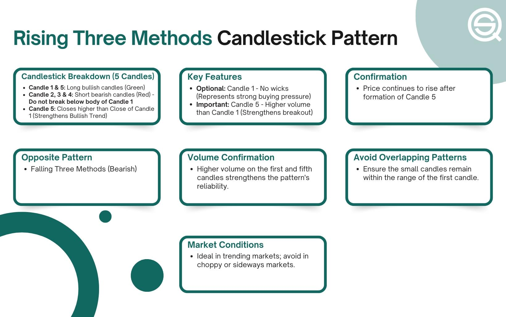

## Table of Contents

## What are the Rising Three Methods in technical analysis?

The Rising Three Methods is a bullish candlestick pattern used in technical analysis to predict the continuation of an uptrend. It appears during an uptrend and consists of a long bullish candlestick followed by a series of three smaller bearish candlesticks. These smaller bearish candlesticks are contained within the range of the first long bullish candlestick, showing that the bears are trying to take control but are not strong enough to push the price below the low of the first bullish candlestick.

After the three smaller bearish candlesticks, the pattern is completed with another long bullish candlestick that closes above the high of the first bullish candlestick. This final bullish candlestick confirms that the bulls are still in control and the uptrend is likely to continue. Traders often use this pattern to enter long positions or to add to existing long positions, anticipating that the price will continue to rise.

## How do the Rising Three Methods form on a price chart?

The Rising Three Methods pattern starts during an uptrend on a price chart. It begins with a long bullish candlestick, which means the price goes up a lot in one day. After this, you see three smaller bearish candlesticks. These smaller candlesticks show that the price is going down a little bit, but not enough to go below the low point of the first big bullish candlestick. The three smaller bearish candlesticks stay within the high and low of the first bullish candlestick, showing that the bears are trying to push the price down but are not strong enough.

After the three smaller bearish candlesticks, the pattern finishes with another long bullish candlestick. This final bullish candlestick goes above the high of the first bullish candlestick. It shows that the bulls are back in control and the price is likely to keep going up. Traders look for this pattern to decide when to buy or add to their investments, expecting the price to continue rising.

## What does the Rising Three Methods pattern signify in market trends?

The Rising Three Methods pattern is a sign that an uptrend in the market is likely to keep going. It shows up when the market is already going up. The pattern starts with a big green candle, which means the price went up a lot in one day. Then, there are three smaller red candles. These red candles show that the price is trying to go down a little, but it doesn't go below the bottom of the first big green candle. This means the sellers are trying to take control but they are not strong enough.

After the three smaller red candles, the pattern ends with another big green candle. This last green candle goes above the top of the first green candle. It shows that the buyers are back in control and the price is likely to keep going up. Traders see this pattern as a good time to buy or add to their investments because they think the price will continue to rise.

## Can you explain the structure and components of the Rising Three Methods pattern?

The Rising Three Methods pattern happens during a time when the market is going up. It starts with a big green candle, which means the price went up a lot in one day. This first big green candle is important because it shows that the buyers are strong. After this, there are three smaller red candles. These red candles show that the price is trying to go down a little bit, but they don't go below the bottom of the first big green candle. This means the sellers are trying to take control, but they are not strong enough to push the price down much.

After the three smaller red candles, the pattern finishes with another big green candle. This last green candle is important because it goes above the top of the first big green candle. It shows that the buyers are back in control and the price is likely to keep going up. Traders look for this pattern because it tells them that the uptrend is probably going to continue. They might decide to buy or add to their investments when they see this pattern, expecting the price to rise more.

## How reliable is the Rising Three Methods pattern for predicting price movements?

The Rising Three Methods pattern is considered a reliable indicator for predicting that an uptrend will continue, but it's not perfect. It works well when the market is already going up and the pattern shows that the buyers are still in control. Traders look for this pattern because it often means the price will keep going up. But, like all patterns in trading, it doesn't work every time. Sometimes the market can do something unexpected, and the pattern might not lead to the expected price increase.

The reliability of the Rising Three Methods pattern can also depend on other things, like how strong the overall market trend is and what other indicators are saying. If the market is very strong and other signs also point to an uptrend, the pattern might be more reliable. But if the market is not so clear or other indicators are mixed, the pattern might not be as trustworthy. So, it's a good idea for traders to use the Rising Three Methods pattern along with other tools and not rely on it alone.

## What are the key differences between the Rising Three Methods and other continuation patterns?

The Rising Three Methods pattern is different from other continuation patterns because it has a very specific look. It starts with a big green candle, followed by three smaller red candles, and ends with another big green candle. This pattern shows that the price is trying to go down but not enough to change the overall uptrend. Other continuation patterns, like the Bullish Flag or the Cup and Handle, don't have this exact structure. The Bullish Flag, for example, looks like a small rectangle that forms after a big price move up, and the Cup and Handle looks like a cup shape with a small dip at the end.

Another difference is how the Rising Three Methods pattern shows the balance between buyers and sellers. The three small red candles in the middle of the pattern are completely inside the range of the first big green candle. This means the sellers are trying to take control but can't push the price down much. In other patterns, like the Bullish Pennant, the price might move in a tighter and tighter range, but it doesn't show this specific struggle between buyers and sellers. The Rising Three Methods pattern gives a clear signal that the buyers are still in control, which can help traders decide when to buy or add to their investments.

## How should traders confirm the Rising Three Methods pattern before making a trade?

Traders should use other tools and signs to make sure the Rising Three Methods pattern is real before they make a trade. They can look at things like moving averages, which help show the overall direction of the market. If the moving averages are going up, it can support the idea that the uptrend will keep going. Traders can also check the trading [volume](/wiki/volume-trading-strategy). If the volume is high when the last big green candle in the pattern forms, it can mean that a lot of people are buying, which makes the pattern more reliable.

Another way to confirm the Rising Three Methods pattern is by looking at other chart patterns or indicators. For example, if the Relative Strength Index (RSI) is not too high and shows the market is not overbought, it can add more confidence that the price will keep going up. Traders can also wait for the price to break above the high of the last big green candle in the pattern before they make a trade. This [breakout](/wiki/breakout-trading) can be a strong sign that the uptrend is continuing, and it can help traders feel more sure about their decision to buy or add to their investments.

## What are the best practices for setting stop-loss orders when trading with the Rising Three Methods?

When trading with the Rising Three Methods pattern, setting a stop-loss order is important to manage risk. A good place to set the stop-loss is just below the low of the three smaller red candles in the middle of the pattern. This is because if the price goes below this low, it might mean the pattern is not working and the uptrend is not continuing. By setting the stop-loss here, traders can limit how much money they might lose if the trade does not go as planned.

Another best practice is to adjust the stop-loss as the price moves up. After entering the trade when the last big green candle forms, traders can move the stop-loss up to just below the low of this last big green candle. This way, they can protect some of the profit they have made if the price keeps going up. It's also a good idea to keep an eye on the market and be ready to move the stop-loss higher as the price rises, to lock in more gains and reduce risk.

## How does volume play a role in validating the Rising Three Methods pattern?

Volume is really important when traders are trying to figure out if the Rising Three Methods pattern is real. When the first big green candle forms, it's good to see a lot of volume. This means a lot of people are buying, which shows that the buyers are strong. During the three smaller red candles, the volume should be lower. This shows that the sellers are not as strong and they can't push the price down much. If the volume is low during these red candles, it makes the pattern more trustworthy because it shows the sellers are not in control.

When the last big green candle forms, it's also good to see high volume again. This high volume means a lot of people are buying again, which supports the idea that the uptrend will keep going. If the volume is high when this last green candle forms, it gives traders more confidence that the pattern is real and the price will keep going up. So, watching the volume can help traders decide if the Rising Three Methods pattern is a good sign to buy or add to their investments.

## Can the Rising Three Methods be effectively used in different time frames, and if so, how?

Yes, the Rising Three Methods pattern can be used in different time frames, like daily, hourly, or even minute charts. The key is to look for the same structure in the pattern no matter the time frame. On a daily chart, the pattern might take a few days to form, with the first big green candle showing a strong up day, followed by three smaller red candles over the next few days, and then another big green candle to finish the pattern. On an hourly chart, the pattern might form within a few hours, with each candle representing an hour of trading. The important thing is that the pattern looks the same, showing that the buyers are still in control and the price is likely to keep going up.

Using the Rising Three Methods pattern on different time frames can help traders make decisions based on their trading style. For example, a long-term investor might look at the pattern on a daily or weekly chart to decide when to buy or add to their investments. They might see the pattern over several days or weeks and use it to confirm that the uptrend is strong. On the other hand, a day trader might use the pattern on a 15-minute or hourly chart to make quick trades. They would look for the pattern to form within a few hours and use it to enter a trade, expecting the price to rise in the short term. No matter the time frame, the pattern can be a useful tool if traders also use other indicators to confirm it.

## What are some common mistakes traders make when using the Rising Three Methods?

One common mistake traders make when using the Rising Three Methods pattern is not waiting for the pattern to fully form before making a trade. They might see the first big green candle and the three smaller red candles, but jump into the trade too early, before the last big green candle confirms the pattern. This can lead to losses if the pattern doesn't finish as expected and the price doesn't keep going up.

Another mistake is not using other tools to confirm the pattern. Traders might see the Rising Three Methods pattern and think it's a sure sign to buy, but they forget to check things like moving averages or trading volume. If the volume is low when the last big green candle forms, or if other indicators don't support an uptrend, the pattern might not be reliable. It's important to use the Rising Three Methods pattern along with other signs to make better trading decisions.

## How can advanced traders combine the Rising Three Methods with other technical indicators for improved analysis?

Advanced traders can combine the Rising Three Methods pattern with other technical indicators to get a better idea of whether the pattern is reliable and the uptrend will continue. One way to do this is by looking at moving averages. If the price is above a rising moving average, like the 50-day or 200-day moving average, it can support the idea that the uptrend is strong. Traders can also check the Relative Strength Index (RSI). If the RSI is not in overbought territory, it can mean the price still has room to go up, making the Rising Three Methods pattern more trustworthy. Another useful indicator is the trading volume. High volume during the first and last big green candles of the pattern shows that a lot of people are buying, which can make the pattern more reliable.

In addition to these indicators, advanced traders might use chart patterns like support and resistance levels to confirm the Rising Three Methods pattern. If the price breaks above a key resistance level when the last big green candle forms, it can be a strong sign that the uptrend is continuing. Traders can also look at other continuation patterns, like the Bullish Flag or the Cup and Handle, to see if they appear along with the Rising Three Methods pattern. If multiple patterns and indicators all point to an uptrend, it can give traders more confidence to make a trade. By combining the Rising Three Methods with other tools, traders can make more informed decisions and improve their chances of success.

## References & Further Reading

[1]: Nison, S. (2001). ["Japanese Candlestick Charting Techniques."](https://drive.google.com/file/d/0B_CADMk621uLNDEyZTEzZjYtMmZjOS00ZmUyLTlhYmYtN2E1YTViOWRiOTdi/view) Prentice Hall Press.

[2]: Murphy, J.J. (1999). ["Technical Analysis of the Financial Markets: A Comprehensive Guide to Trading Methods and Applications."](https://archive.org/details/technicalanalysi0000murp) New York Institute of Finance.

[3]: Bulkowski, T.N. (2021). ["Encyclopedia of Chart Patterns."](https://www.wiley.com/en-us/Encyclopedia+of+Chart+Patterns,+3rd+Edition-p-9781119739685) Wiley.

[4]: Rhoads, R. (2011). ["Candlestick Charting For Dummies."](https://www.amazon.com/Candlestick-Charting-Dummies-Business-Personal/dp/1119869951) For Dummies.

[5]: Jansen, S. (2020). ["Machine Learning for Algorithmic Trading."](https://github.com/stefan-jansen/machine-learning-for-trading) Packt Publishing.

[6]: de Prado, M.L. (2018). ["Advances in Financial Machine Learning."](https://www.amazon.com/Advances-Financial-Machine-Learning-Marcos/dp/1119482089) Wiley.

[7]: Chan, E.P. (2009). ["Quantitative Trading: How to Build Your Own Algorithmic Trading Business."](https://github.com/ftvision/quant_trading_echan_book) Wiley.

[8]: Aronson, D.R. (2007). ["Evidence-Based Technical Analysis: Applying the Scientific Method and Statistical Inference to Trading Signals."](https://onlinelibrary.wiley.com/doi/book/10.1002/9781118268315) Wiley.