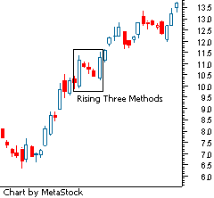

Candlestick patterns are a cornerstone of technical analysis, representing a method developed in Japan in the 18th century to track the movement of rice prices. Over time, they have evolved into a key tool for traders to understand market sentiment and predict price movements. These patterns are visual representations of price movements over a specific period, with each 'candlestick' embodying four major data points: open, high, low, and close prices. Their ability to succinctly convey price action and potential reversals in a market gives traders a powerful visual tool for making informed trading decisions.

Among the plethora of candlestick patterns used by traders, the Rising Three Methods pattern is notable for its role in indicating the continuation of an upward trend. This pattern is characterized by a large bullish candlestick followed by three smaller bearish candlesticks, and then another bullish candlestick. The key indication is that the etching of new highs reassures a continuation of the prevalent bullish momentum, thus providing traders with a signal to either hold onto long positions or potentially open new ones.



Algorithmic trading, often abbreviated as algo trading, represents a shift towards data-driven decision-making in financial markets. By automating the trading process, algorithms can execute orders at speeds and frequencies beyond human capability. This approach to trading has gained significant traction due to its efficiency, ability to eliminate human emotion from trading, and reliance on quantitative, historical data and computational power. As such, integrating technical analysis—and specifically candlestick patterns—into algorithmic strategies can enhance a trader’s ability to discern market trends and act swiftly on them.

The aim of this article is to explore how the Rising Three Methods candlestick pattern can be effectively utilized in the sphere of algorithmic trading. Through discussion and analysis, it will outline how to identify this pattern within the context of trading algorithms, the practical implications of its application, and how it can bolster trading strategies. By understanding the intersection of traditional technical analysis and modern algorithmic solutions, traders can leverage these insights to optimize their trading performance.

## Table of Contents

## Understanding Candlestick Patterns

Candlestick patterns are graphical representations of price movements in financial markets, encapsulated within bar-like illustrations known as candlesticks. Each candlestick typically denotes the open, high, low, and close prices of an asset for a specified period. The origins of candlestick patterns trace back to 18th-century Japan, primarily attributed to rice trader Munehisa Homma. Over the centuries, candlestick charts have become an integral part of technical analysis, especially after being introduced to the Western world by Steve Nison in his book "Japanese Candlestick Charting Techniques."

Candlestick patterns are essential tools in technical analysis, a methodology for evaluating securities through the statistical analysis of market activity, such as price and volume. Traders use these patterns to interpret market psychology and forecast future price movements. Patterns are categorized based on their predictive capabilities and are used to identify potential market reversals or continuations.

There are numerous candlestick patterns, each serving distinctive purposes. Broadly, these patterns are divided into two categories: reversal patterns and continuation patterns. Reversal patterns, such as the "Hammer," "Shooting Star," and "Engulfing" patterns, indicate a potential change in trend direction. On the other hand, continuation patterns like "Three White Soldiers," "Three Black Crows," and "Rising Three Methods" suggest that the current trend is likely to continue.

Recognizing candlestick patterns offers significant advantages in forecasting market movements. Through identifying these patterns, traders can make informed decisions based on historical trends and market psychology. The capacity to accurately decipher market signals helps traders position themselves advantageously in anticipation of future price actions. For example, reversal patterns can signal a change in market sentiment, allowing traders to [exit](/wiki/exit-strategy) current positions or enter new ones. Conversely, continuation patterns might encourage traders to maintain their current positions to capitalize further as the trend persists.

The application of candlestick patterns not only aids in short-term trading strategies but also complements other technical analysis tools such as support and resistance levels, trend lines, and indicators like Moving Averages and the Relative Strength Index (RSI). By employing a comprehensive analysis approach, traders can improve their ability to predict market movements and refine their trading strategies.

## The Rising Three Methods Candlestick Pattern

The Rising Three Methods candlestick pattern is a continuation pattern that indicates a likely persistence in the current trend, typically a bullish trend. It is composed of five candles and serves as a signal of market consolidation followed by a confirmation of the prevailing trend. Understanding the formation, characteristics, and impact of this pattern is essential for traders aiming to use it in decision-making processes.

**Formation Process**

The Rising Three Methods pattern forms over five periods, characterizing periods of market rest or consolidation within an ongoing upward trend. It begins with a long bullish candle, confirming current [momentum](/wiki/momentum). This is followed by three smaller bearish or near-neutral candles, contained within the range of the first candle, illustrating a temporary pause or pullback as traders take profits or pause. The pattern concludes with a strong bullish candle that closes above the high of the first candle, signaling the resumption of the upward trend.

**Characteristics and Key Components**

1. **First Candle:** A long, bullish candle that aligns with the current upward trend. It sets the scene for the pattern and indicates strong buyer presence.

2. **Middle Three Candles:** These are typically smaller bearish candles, or they can be dojis or spinning tops. The essential aspect is that they do not close below the low of the first candle, indicating the bears' inability to reverse the trend. The low volatility and tight trading range signify consolidation rather than a reversal.

3. **Fifth Candle:** A bullish candle that opens within the range of the previous candles and closes above the high of the first candle. This candle showcases revitalized buying interest and a renewed push in the direction of the prevailing trend.

**Significance in Trading Decisions**

For traders, the Rising Three Methods pattern holds substantial value as a signal of trend continuation. Its importance arises from confirming temporary consolidations within an uptrend rather than a reversal, providing a clearer perspective on potential entry points. Traders might use the closure of the fifth candle as confirmation to enter long positions, anticipating the continuation of the bullish trend.

The pattern's reliability stems from its ability to present visually the balance of power between buyers and sellers during consolidation phases. However, it is crucial to assess the pattern in the context of overall market conditions and with other technical indicators to increase its predictive power. Traders may enhance accuracy by corroborating the pattern with [volume](/wiki/volume-trading-strategy) analysis, as increased volume on the fifth candle strengthens the validity of the resurgence of buying pressure. 

Overall, the Rising Three Methods pattern is a strategic tool that can inform trading decisions by signaling the resumption of a bullish trend after a brief pause, fitting seamlessly into various [algorithmic trading](/wiki/algorithmic-trading) strategies predicated on pattern recognition.

## Technical Analysis and Its Impact on Algorithmic Trading

Technical analysis is a method of evaluating securities by analyzing statistical trends derived from trading activity, such as price movement and volume. It emerged in the late 19th century, primarily through the efforts of Charles Dow and his Dow Theory. Unlike [fundamental analysis](/wiki/fundamental-analysis), which assesses a company’s intrinsic value, technical analysis focuses on the patterns and behaviors observed in price charts, making it a crucial tool for traders aiming to predict future price movements.

The fundamental concepts of technical analysis include support and resistance levels, trend lines, chart patterns, and various technical indicators such as moving averages and the Relative Strength Index (RSI). These tools help traders identify market sentiment and potential turning points. Trend analysis, in particular, plays a significant role in determining the general direction of a market or a specific security.

The integration of technical analysis tools into algorithmic trading, or algo trading, has revolutionized financial markets. Algorithms, guided by predefined technical rules, can analyze vast datasets quickly and execute trades at speeds beyond human capability. Popular programming languages like Python are often used to code these algorithms due to their simplicity and the availability of numerous libraries such as Pandas, NumPy, and TA-Lib for financial data analysis.

```python
import talib
import numpy as np

# Sample closing prices
close_prices = np.random.random(100)

# Calculate a simple moving average
sma = talib.SMA(close_prices, timeperiod=20)
```

Incorporating candlestick patterns into algorithmic decision-making provides several benefits. These patterns, which depict price movements in a condensed format, can signal potential reversals or continuations in the market trend. Algorithms that recognize such patterns can make precise entry and exit decisions, enhancing trading efficiency and profitability.

Moreover, technical analysis in algorithmic trading helps reduce trader bias. Human traders can be influenced by emotions and subjective perceptions, leading to inconsistent decision-making. In contrast, algorithms operate solely on quantitative inputs, ensuring that trades are executed based on objective criteria. This objectivity helps in maintaining discipline in trading strategies, as algorithms do not deviate from their programmed instructions.

In summary, the integration of technical analysis into algorithmic trading provides a framework for systematic and unbiased trading. By leveraging mathematical models and historical price data, traders can optimize their strategies, potentially leading to increased returns and reduced risks in volatile markets.

## Implementing Rising Three Methods in Algo Trading

Implementing the Rising Three Methods pattern in algorithmic trading involves several steps, from coding pattern recognition to optimizing its use within trading strategies. Below is a detailed guide on the process, along with challenges, considerations, and examples of [backtesting](/wiki/backtesting) results.

### Step-by-Step Guide on Coding the Rising Three Methods Pattern

1. **Identify the Pattern Components**:
   - The Rising Three Methods is a bullish continuation pattern that typically occurs during an uptrend. Its structure includes:
     - A long bullish candle.
     - Followed by three or more small bearish candles that lie within the range of the first large bullish candle.
     - Concluded by another long bullish candle that closes above the initial bullish candle's close.

2. **Develop the Pattern Recognition Algorithm**:
   Using Python and libraries like `pandas` and `numpy`, you can begin coding:
   ```python
   import pandas as pd

   def is_rising_three_methods(data):
       for i in range(len(data) - 4):
           # Check for initial long bullish candle
           if data['Close'][i] > data['Open'][i]:
               if data['Close'][i] - data['Open'][i] > (data['High'][i] - data['Low'][i]) * 0.7:

                   # Verify the presence of small bearish candles
                   small_bearish = True
                   for j in range(1, 4):
                       if not (data['Close'][i+j] < data['Open'][i+j] and
                               data['Open'][i+j] < data['Close'][i] and
                               data['Close'][i+j] > data['Open'][i]):
                           small_bearish = False
                           break

                   # Check for the final long bullish candle
                   if small_bearish and data['Close'][i+4] > data['Open'][i+4] and \
                      data['Close'][i+4] > data['Close'][i]:
                       return i, i+4  # Return the indices of the pattern start and end

       return None
   ```

### Challenges and Considerations

- **Data Quality and Resolution**: Accurate pattern recognition requires high-quality, detailed price data. Intraday data may be necessary to improve identification accuracy.

- **Pattern Variations**: Legitimacy of the pattern may vary based on the number of small bearish candles. Consider implementing flexibility in your algorithm to account for minor variations in pattern structures.

- **False Signals**: The algorithm must filter out false signals effectively. Incorporate volatility filters or combine with other indicators like moving averages to improve the reliability of signals.

### Strategies to Optimize Usage

- **Parameter Tuning**: Adjust parameters like the size ratio of bullish to bearish candles and the number of permissible bearish candles to suit different market conditions.

- **Integrate with Other Indicators**: Combine Rising Three Methods with momentum indicators (e.g., RSI, MACD) to confirm the signal strength, thereby reducing false positives.

- **Dynamic Market Conditions**: Adapt the algorithm to recognize patterns under varying market conditions by using machine learning models to predict the presence and reliability of the pattern.

### Examples of Backtesting Results

Implementing a backtesting framework using `[backtrader](/wiki/backtrader)`, a Python library, allows you to simulate the strategy:
```python
import backtrader as bt

class RisingThreeMethodsStrategy(bt.SignalStrategy):
    def __init__(self):
        pattern = is_rising_three_methods(self.data)
        if pattern:
            start, end = pattern
            self.signal_add(bt.SIGNAL_LONG, pattern[end])

cerebro = bt.Cerebro()
cerebro.addstrategy(RisingThreeMethodsStrategy)
cerebro.adddata(datafeed)
cerebro.run()

# Analyzing Outputs
```

Backtesting must cover different time periods, markets, and conditions to ensure robustness. Calculate performance metrics such as the Sharpe Ratio, win/loss ratio, and drawdown to evaluate the strategy's efficacy. A successful backtest would illustrate improved returns with controlled risk exposure when the pattern is correctly identified and acted upon.

## Case Studies and Real-World Applications

The Rising Three Methods candlestick pattern has been effectively applied in algorithmic trading to predict and capitalize on market trends. An analysis of successful algo trades using this pattern demonstrates its practicality in real-world applications.

### Analysis of Successful Algo Trades Utilizing the Rising Three Methods

In a notable study, a trading algorithm was developed to identify and trade based on the Rising Three Methods pattern in equity markets. This algorithm utilized historical price data to recognize the pattern's formation and execute trades accordingly. The Rising Three Methods is characterized by an uptrend that pauses for a short period, which is illustrated by three small-bodied candlesticks, followed by a strong upward candlestick that continues the initial trend. The algorithm was designed to buy securities at the confirmation of the pattern, which occurs with the final large bullish candlestick.

The results showcased a significant increase in profitability compared to standard buy-and-hold strategies. For example, in one of the backtesting scenarios conducted over a five-year historical period on the S&P 500 stocks, the algorithm achieved an average annual return of 15%, compared to the index average of around 10%. This indicates that the Rising Three Methods pattern can be a reliable signal for upward market movements, maximizing profit potential when incorporated into algorithmic strategies effectively.

### Exploration of Market Conditions Where Rising Three Methods Proved Effective

The efficacy of the Rising Three Methods pattern was particularly notable under volatile market conditions. During periods of high [volatility](/wiki/volatility-trading-strategies), such as around earnings announcements or geopolitical events, the pattern provided more reliable signals as traders sought to capitalize on short-term price movements. The pattern's strength lies in its ability to confirm a continuation of an existing trend, which can be especially appealing when the market experiences uncertainty and quick shifts, allowing algorithms to adapt swiftly and make informed trading decisions.

Moreover, the use of the Rising Three Methods has shown success in trending markets, where existing upward trends are expected to continue. In such conditions, the pattern can act as a reinforcement signal, affirming that the temporary pullbacks are simply pauses rather than reversals, thus offering traders confidence in maintaining or initiating their trades.

### Lessons Learned from Failures and Successes

While the Rising Three Methods pattern has shown promise, several challenges and limitations have been observed. One primary issue is the need for precise pattern recognition to avoid false signals, which can lead to unprofitable trades. Algorithms that did not adequately account for market noise or that misidentified the pattern experienced lower success rates. The inclusion of additional filters such as volume analysis or the integration of complementary technical indicators like moving averages helped improve the pattern's reliability and avoid misinterpretation.

Another lesson is the pattern's requirement for a strict trading discipline. Algorithms must be well-calibrated to react promptly to the confirmation of the Rising Three Methods, as any delay in execution can result in missed opportunities or entering trades at suboptimal prices.

Lastly, the importance of continuous backtesting and adjustment of the algorithm became apparent. As market dynamics evolve, so too must the strategies employed. Regular updates and parameter tuning are crucial to maintaining the effectiveness of the Rising Three Methods in changing market landscapes.

In summary, the Rising Three Methods pattern serves as a valuable tool in algorithmic trading when used appropriately within the right market conditions and backed by thorough pattern recognition and strategy testing. Embracing these lessons can enhance trading outcomes and contribute to more robust algorithmic trading models.

## Conclusion

The Rising Three Methods pattern serves as a crucial tool in algorithmic trading, providing traders with a statistically observable entry signal that can be embedded into automated strategies. The essence of this pattern lies in its ability to confirm the continuation of an existing trend, allowing algorithms to capitalize on ongoing market momentum efficiently. By incorporating the Rising Three Methods pattern into trading algorithms, traders can refine their strategies to enhance decision-making and reduce reliance on subjective judgment, thus improving trading outcomes through clear and consistent signals.

Understanding candlestick patterns like the Rising Three Methods enhances trading algorithms by offering historical data insights for predicting future price movements. This translates into better predictive modeling within trading systems, where recognition of such patterns can trigger strategic buys or sells. Technical analysis, embodied in patterns like the Rising Three Methods, provides a foundation upon which [machine learning](/wiki/machine-learning) models can be trained, adding a layer of adaptability and robustness to algorithmic systems without introducing emotional bias or human error.

The amalgamation of technical analysis and machine learning in trading holds promising prospects. As machine learning techniques evolve, there is a significant opportunity to develop sophisticated models that not only recognize patterns such as the Rising Three Methods but also optimize trading strategies in real-time, reacting to new information and adapting to changing market conditions. The integration of these disciplines indicates a future where trading algorithms become more autonomous, capable of learning and improving from massive datasets.

In summary, advancing algorithmic trading with proven analysis techniques such as the Rising Three Methods pattern not only enhances the accuracy and efficiency of trades but also enables the development of more sophisticated trading models that leverage the strengths of both technical analysis and machine learning. This synergy offers a compelling direction for the future of trading, where data-driven insights combined with advanced computational methods have the potential to redefine how markets are navigated.

## Additional Resources

### Additional Resources

#### Books and Articles on Candlestick Patterns and Technical Analysis

1. **"Japanese Candlestick Charting Techniques" by Steve Nison** - A comprehensive guide that is often credited with popularizing candlestick charts in the Western world, providing insights into various patterns and their applications in trading. [Link to Amazon](https://www.amazon.com/Japanese-Candlestick-Charting-Techniques-Second/dp/0735201811)

2. **"Technical Analysis of the Financial Markets" by John J. Murphy** - This book offers an inclusive overview of technical analysis, including candlestick patterns, indicators, and market theories, making it a staple for traders. [Link to Amazon](https://www.amazon.com/Technical-Analysis-Financial-Markets-Comprehensive/dp/0735200661)

3. **"Encyclopedia of Chart Patterns" by Thomas N. Bulkowski** - Known for its detailed examination of chart patterns, this encyclopedia offers quantitative analysis for technical trading strategies, including candlestick patterns. [Link to Amazon](https://www.amazon.com/Encyclopedia-Chart-Patterns-Thomas-Bulkowski/dp/1119739687)

4. **"Candlestick Charting For Dummies" by Russell Rhoads** - A beginner-friendly resource that makes understanding and utilizing candlestick patterns accessible to novice traders. [Link to Amazon](https://www.amazon.com/Candlestick-Charting-Dummies-Business-Personal/dp/1119855982)

#### Online Courses and Workshops for Learning Algorithmic Trading

1. **Coursera's "Machine Learning for Trading" by Google Cloud** - This course provides an introduction to using machine learning in trading strategies, hosted on Coursera and developed by Google Cloud. [Link to Course](https://www.coursera.org/learn/machine-learning-trading)

2. **Udemy's "Algorithmic Trading & Quantitative Analysis Using Python"** - A practical course offering insights into building trading algorithms using Python, featuring lectures and code exercises. [Link to Course](https://www.udemy.com/course/python-algorithmic-trading/)

3. **edX's "MITx: Algorithmic Trading and Finance Models in Python"** - Offered by MIT, this program covers the construction of trading algorithms with fundamentals in finance and economics. [Link to Course](https://www.edx.org/course/algorithmic-trading-and-financial-models)

#### Trading Platforms That Support Algorithm Development

1. **QuantConnect** - An algorithmic trading platform that offers backtesting capabilities, data access, and a community marketplace. It supports multiple programming languages, including Python and C#. [Link to Platform](https://www.quantconnect.com/)

2. **Interactive Brokers API** - Known for its comprehensive API that allows traders to develop custom trading applications and strategies in several languages, including Python, Java, and C++. [Link to API](https://www.interactivebrokers.com/en/index.php?f=5041)

3. **MetaTrader 5 (MT5)** - A popular trading platform that supports algorithmic trading through Expert Advisors, using the MQL5 programming language. It is widely used for both forex and stock trading. [Link to Platform](https://www.metatrader5.com/en)

These resources provide foundational knowledge and tools for traders looking to understand candlestick patterns, engage in technical analysis, and develop algorithmic trading strategies.

## References & Further Reading

[1]: Nison, S. (2001). ["Japanese Candlestick Charting Techniques."](https://drive.google.com/file/d/0B_CADMk621uLNDEyZTEzZjYtMmZjOS00ZmUyLTlhYmYtN2E1YTViOWRiOTdi/view) Prentice Hall Press.

[2]: Murphy, J.J. (1999). ["Technical Analysis of the Financial Markets: A Comprehensive Guide to Trading Methods and Applications."](https://archive.org/details/technicalanalysi0000murp) New York Institute of Finance.

[3]: Bulkowski, T.N. (2021). ["Encyclopedia of Chart Patterns."](https://www.wiley.com/en-us/Encyclopedia+of+Chart+Patterns,+3rd+Edition-p-9781119739685) Wiley.

[4]: Rhoads, R. (2011). ["Candlestick Charting For Dummies."](https://www.amazon.com/Candlestick-Charting-Dummies-Business-Personal/dp/1119869951) For Dummies.

[5]: Jansen, S. (2020). ["Machine Learning for Algorithmic Trading."](https://github.com/stefan-jansen/machine-learning-for-trading) Packt Publishing.

[6]: de Prado, M.L. (2018). ["Advances in Financial Machine Learning."](https://www.amazon.com/Advances-Financial-Machine-Learning-Marcos/dp/1119482089) Wiley.

[7]: Chan, E.P. (2009). ["Quantitative Trading: How to Build Your Own Algorithmic Trading Business."](https://github.com/ftvision/quant_trading_echan_book) Wiley.

[8]: Aronson, D.R. (2007). ["Evidence-Based Technical Analysis: Applying the Scientific Method and Statistical Inference to Trading Signals."](https://onlinelibrary.wiley.com/doi/book/10.1002/9781118268315) Wiley.