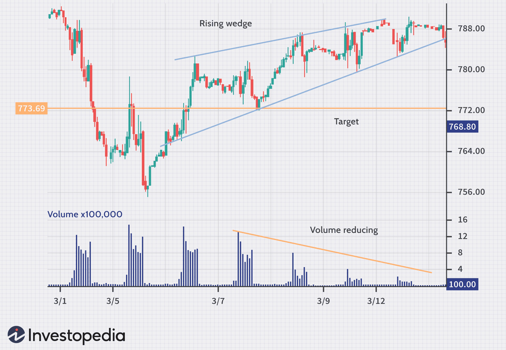

## Table of Contents

## What is a Rising Wedge pattern in technical analysis?

A Rising Wedge pattern is a type of chart pattern used in technical analysis to predict future price movements. It is formed when the price of an asset creates a series of higher highs and higher lows, but the slope of the trend lines connecting these highs and lows converges, creating a narrowing shape that looks like a wedge. This pattern typically indicates that a bearish reversal is coming, meaning the price is likely to go down after the pattern completes.

The Rising Wedge pattern can be seen in both uptrends and downtrends, but it is more reliable as a bearish signal when it appears during an uptrend. Traders watch for a break below the lower trend line of the wedge as a confirmation that the pattern is complete and the price is likely to fall. The length of the wedge and the distance from the breakout point can help traders estimate how far the price might drop after the breakout.

## How can you identify a Rising Wedge pattern on a price chart?

To spot a Rising Wedge pattern on a price chart, you need to look for two main things. First, you'll see that the price is making higher highs and higher lows over time. This means each peak is higher than the last peak, and each bottom is higher than the last bottom. Second, you'll notice that the lines connecting these highs and lows are getting closer together. These lines form the sides of the wedge and they slope upwards but at different angles, causing them to converge.

Once you see these two things happening, you can start to draw the trend lines. Draw one line along the higher highs and another line along the higher lows. If these lines are both going up but getting closer to each other, you've got a Rising Wedge. Keep an eye on the price because if it breaks down below the lower trend line, it's a sign that the price might start to fall soon.

## What are the key components of a Rising Wedge pattern?

A Rising Wedge pattern has two main parts that you need to see on a price chart. The first part is that the price makes higher highs and higher lows. This means that each time the price goes up, it reaches a higher point than before, and each time it goes down, it doesn't go as low as the last time. The second part is that the lines connecting these highs and lows start to come closer together. These lines are called trend lines, and they both go up but at different angles, making them get closer and closer until they meet at a point.

When you see these two things happening on a chart, you can draw the trend lines to see the Rising Wedge more clearly. Draw one line along the higher highs and another line along the higher lows. If these lines are both going up but getting closer to each other, you've spotted a Rising Wedge. It's important to watch the price because if it breaks down below the lower trend line, it's a signal that the price might start to fall soon. This pattern often means that a bearish reversal is coming, so it's something traders pay close attention to.

## Can you explain the difference between a Rising Wedge and a Falling Wedge?

A Rising Wedge and a Falling Wedge are two chart patterns that traders look at to guess where the price might go next. A Rising Wedge happens when the price keeps making higher highs and higher lows, but the lines connecting these highs and lows are getting closer together. Both lines go up, but one goes up faster than the other, making them look like they will meet at the top. This pattern usually means that the price might start to go down soon, which is called a bearish reversal.

On the other hand, a Falling Wedge is the opposite. It shows up when the price makes lower highs and lower lows, but the lines connecting these points are also getting closer together. Both lines go down, but one goes down slower than the other, so they look like they will meet at the bottom. This pattern usually means that the price might start to go up soon, which is called a bullish reversal. So, while a Rising Wedge warns of a possible drop in price, a Falling Wedge suggests a possible rise in price.

## What does a Rising Wedge pattern indicate about future price movements?

A Rising Wedge pattern on a price chart usually means that the price might start to go down soon. This pattern happens when the price keeps making higher highs and higher lows, but the lines connecting these highs and lows start to get closer together. Both lines go up, but one goes up faster than the other, making them look like they will meet at the top. Traders see this pattern as a warning sign that the price might reverse and start to fall.

This pattern is most reliable when it shows up during a time when the price has been going up for a while. If the price breaks down below the lower line of the wedge, it's a strong sign that the price is about to drop. Traders use this information to make decisions about when to sell or short sell the asset. So, if you see a Rising Wedge on a chart, it's a good idea to be ready for a possible price drop.

## How reliable is the Rising Wedge pattern as a trading signal?

The Rising Wedge pattern is pretty good at telling traders when a price might start to go down, but it's not perfect. Traders find it most useful when it shows up during a time when the price has been going up for a while. If the price breaks down below the lower line of the wedge, it's a strong sign that the price might drop soon. But, like any pattern, it doesn't work every time. Sometimes the price might not go down like expected, so it's important to use other tools and signals to make better trading choices.

Even though the Rising Wedge can be a helpful signal, it's always good to look at other things too. Traders often use things like other chart patterns, technical indicators, and even news about the company to make sure they're making the best decision. By combining different pieces of information, traders can feel more confident in their choices and maybe avoid some big mistakes. So, while the Rising Wedge can be a good clue, it's best used as part of a bigger plan.

## What are the best practices for trading a Rising Wedge pattern?

When trading a Rising Wedge pattern, it's important to wait for the price to break below the lower trend line before making a move. This break is a strong sign that the price might start to go down. Once you see this happen, you can think about selling or short selling the asset. It's also a good idea to look at how long the wedge took to form and how far the price moved during that time. This can help you guess how far the price might drop after the break.

But, don't just rely on the Rising Wedge pattern alone. It's smart to use other tools and signals to make sure you're making a good choice. Look at other chart patterns, use technical indicators, and keep an eye on any news that might affect the price. By combining different pieces of information, you can feel more confident in your trading decisions. Remember, no pattern works perfectly every time, so always be ready for the price to do something unexpected.

## How can volume be used to confirm a Rising Wedge pattern?

Volume can help you make sure a Rising Wedge pattern is real. As the price goes up inside the wedge, you might see the [volume](/wiki/volume-trading-strategy) getting smaller. This means fewer people are buying the asset as it goes up, which can be a warning sign that the price might start to go down soon. When the price finally breaks down below the lower trend line of the wedge, you want to see a big jump in volume. This big volume tells you that a lot of people are now selling, which makes the break more believable and likely to keep going.

So, when you're looking at a Rising Wedge, pay attention to the volume. If it's going down as the price goes up inside the wedge, and then it goes way up when the price breaks down, that's a good sign the pattern is working. Using volume like this can help you make better trading choices and feel more sure about what the price might do next.

## What are common mistakes traders make when interpreting a Rising Wedge pattern?

One common mistake traders make when looking at a Rising Wedge pattern is jumping into a trade too early. They see the wedge forming and get excited, but they don't wait for the price to break below the lower trend line. It's important to be patient and wait for that break because it's the sign that the price might really start to go down. Without waiting for the break, traders might end up losing money if the price doesn't do what they expect.

Another mistake is not paying attention to volume. Volume can tell you a lot about whether the Rising Wedge pattern is real or not. If the volume is going down as the price goes up inside the wedge, and then it jumps up when the price breaks down, that's a good sign. But if traders ignore volume, they might miss important clues about what the price will do next. It's always a good idea to use volume along with the pattern to make better trading choices.

Lastly, some traders rely too much on the Rising Wedge pattern without looking at other things. They might not check other chart patterns, technical indicators, or news that could affect the price. Using the Rising Wedge alone can be risky because no pattern works perfectly every time. It's better to use it as part of a bigger plan, combining different pieces of information to feel more confident in your trading decisions.

## How does the duration of a Rising Wedge pattern affect its predictive power?

The length of time a Rising Wedge pattern takes to form can change how well it works at predicting where the price might go next. If a Rising Wedge takes a long time to form, like weeks or months, it might be a stronger sign that the price will go down soon. This is because the longer the pattern lasts, the more people have had time to see it and get ready to sell when the price breaks down. On the other hand, if the wedge forms quickly, in just a few days, it might not be as reliable. A quick-forming wedge might just be a small hiccup in the price and not a big warning sign.

It's also important to think about how the length of the Rising Wedge fits with the bigger picture of the market. If the wedge takes a long time to form during a big uptrend, it can be a really strong signal that the trend might be about to change. But if the market is moving fast and the wedge forms quickly, it might not mean as much. So, when you're looking at a Rising Wedge, think about how long it took to form and what's happening in the bigger market to get a better idea of what might happen next.

## Can you discuss any notable examples of a Rising Wedge pattern in historical market data?

One famous example of a Rising Wedge pattern happened in the stock market with Apple Inc. in 2015. From April to July, the price of Apple's stock kept making higher highs and higher lows, but the lines connecting these points were getting closer together. This formed a clear Rising Wedge pattern. In late July, the price broke down below the lower trend line of the wedge, and the volume jumped up a lot. This confirmed the pattern, and the stock price started to go down. Traders who noticed this pattern and waited for the break could have made good trades by selling or short selling Apple's stock at that time.

Another good example is the EUR/USD currency pair in 2018. From January to March, the price of the euro against the dollar formed a Rising Wedge. The price was making higher highs and higher lows, but the trend lines were converging. In early April, the price broke down below the lower trend line with a big increase in volume, confirming the bearish reversal. After the break, the EUR/USD pair started to drop. Traders who used the Rising Wedge pattern as a signal could have made smart trades by selling or short selling the EUR/USD at that time. Both of these examples show how a Rising Wedge can be a useful tool for predicting price movements if you know what to look for.

## How do different market conditions impact the effectiveness of a Rising Wedge pattern?

The effectiveness of a Rising Wedge pattern can change depending on what's happening in the market. When the market is going up a lot and the price has been rising for a while, a Rising Wedge can be a strong sign that the price might start to go down soon. This is because many people are watching the market, and they might see the wedge and get ready to sell when the price breaks down. But, if the market is moving around a lot and not following a clear trend, the Rising Wedge might not be as reliable. In a choppy market, the price might break out of the wedge but then quickly go back up, making it hard to trust the pattern.

Also, the type of market can make a difference. In a stock market where lots of people are trading, a Rising Wedge might work better because there are more eyes on the charts and more people ready to act on the pattern. But in a less busy market, like some smaller currency pairs or commodities, the pattern might not be as powerful. Fewer traders might notice the wedge, so the price might not react as strongly when it breaks down. So, when you're looking at a Rising Wedge, it's good to think about the bigger picture of the market to guess how well the pattern might work.

## Is a Rising Wedge considered a Continuation Pattern?

A rising wedge as a continuation pattern occurs within the context of an established downtrend and typically serves as a brief consolidation phase before the primary trend resumes. This pattern is characterized by two upward-sloping and converging trend lines, with the lower trend line steeper than the upper. The key to its identification lies in recognizing the temporary nature of its bullish appearance amid an otherwise bearish market environment.

During the development of this pattern, the price action often reflects waning bullish [momentum](/wiki/momentum) as it struggles to surpass prior highs. The pattern forms against the backdrop of declining volume, underscoring diminishing trading interest, which further belies the apparent upward movement. The structural attributes of the rising wedge are best understood through analysis of the slope of the trend lines, with the lower line rising faster than the upper line.

Mathematically, one could model the price movement $P(t)$ within the wedge using linear functions for the support line $L_s$ and resistance line $L_r$:

$$
L_s(t) = m_s \cdot t + c_s
$$
$$
L_r(t) = m_r \cdot t + c_r
$$

where $m_s > m_r$ indicating the steeper ascent of the lower trend line.

Upon completion of the pattern, a [breakout](/wiki/breakout-trading) typically occurs to the downside, signaling the continuation of the primary downtrend. Recognizing this breakout point is critical for traders aiming to capitalize on the resumption of bearish market conditions. The strategic advantage lies in anticipating this [exit](/wiki/exit-strategy) point from the wedge before it transpires, providing a refined entry opportunity aligned with the prevailing trend.

Algorithmic traders can particularly benefit from automated detection of rising wedges using pattern recognition algorithms, which enhance precision in recognizing these consolidation phases. A Python approach may involve using libraries like NumPy or pandas to parse historical data and identify trend lines by fitting linear regressions. Here's a simplified example:

```python
import numpy as np
import pandas as pd
from sklearn.linear_model import LinearRegression

# Assume `prices` is a pandas DataFrame of historical price data with date and price columns
prices['returns'] = prices['price'].pct_change()

# Simplified trend identification logic
def identify_rising_wedge(df):
    x = np.arange(len(df)).reshape(-1, 1)
    y = df['price'].values.reshape(-1, 1)
    regression = LinearRegression().fit(x, y)
    slope = regression.coef_[0]
    return slope  # This value helps to identify if lower trend line is steeper

# Use the function to determine trend characteristics
slope_value = identify_rising_wedge(prices)
```

This code segment provides a basic framework to detect slope values, aiding in the identification of the pattern as it evolves. When traders recognize a rising wedge as a continuation pattern amidst a downtrend, it allows them to strategically place trades anticipating the trend's continuation, ultimately enhancing their trading efficacy.

## References & Further Reading

[1]: Bulkowski, T. (2005). ["Encyclopedia of Chart Patterns (Wiley Trading)."](https://www.amazon.com/Encyclopedia-Chart-Patterns-Wiley-Trading/dp/1119739683) Wiley.

[2]: Pring, M. J. (2014). ["Technical Analysis Explained: The Successful Investor's Guide to Spotting Investment Trends and Turning Points."](https://www.amazon.com/Technical-Analysis-Explained-Fifth-Successful/dp/0071825177) McGraw-Hill Education.

[3]: Murphy, J. J. (1999). ["Technical Analysis of the Financial Markets: A Comprehensive Guide to Trading Methods and Applications."](https://archive.org/details/technicalanalysi0000murp) New York Institute of Finance.

[4]: Schwager, J. D. (1995). ["Getting Started in Technical Analysis."](https://books.google.com/books/about/Getting_Started_in_Technical_Analysis.html?id=dm6EvSzLYNAC) Wiley.

[5]: Elder, A. (1993). ["Trading for a Living: Psychology, Trading Tactics, Money Management."](https://www.amazon.com/Trading-Living-Psychology-Tactics-Management/dp/0471592242) John Wiley & Sons.

[6]: "Rising Wedge: Definition, Identification, and Trading Strategies." [Investopedia](https://www.investopedia.com/broadcom-q4-fy-2024-earnings-8758941)

[7]: Jansen, S. (2020). ["Machine Learning for Algorithmic Trading."](https://github.com/stefan-jansen/machine-learning-for-trading) Packt Publishing.

[8]: Chan, E. P. (2009). ["Quantitative Trading: How to Build Your Own Algorithmic Trading Business."](https://github.com/ftvision/quant_trading_echan_book) Wiley.