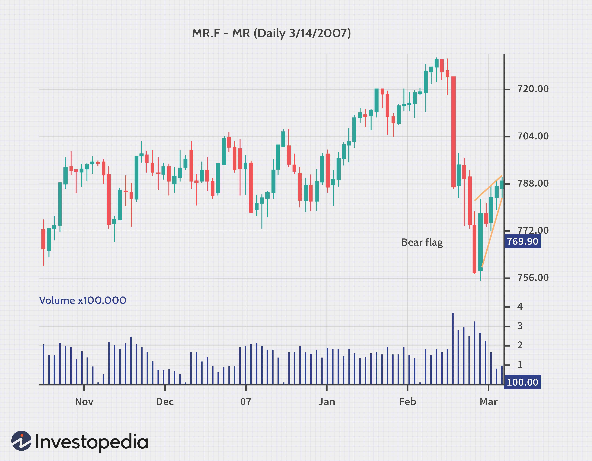

Understanding the intricacies of chart patterns is pivotal for traders seeking to predict market movements accurately. Chart patterns, graphical representations of past trades on a price chart, offer insights into future price movements by illustrating potential reversal or continuation signals. Among these patterns, the rising wedge stands out because of its frequent occurrence and the clear signals it provides. The rising wedge is a technical chart pattern that signifies a potential change in market direction, often providing traders with the foresight necessary to adapt their strategies effectively.

The significance of the rising wedge in technical analysis lies in its ability to signal shifts in market trends. Characterized by two upward-sloping converging lines, this pattern typically exhibits a tapering formation. It suggests a reduction in buying momentum, which can foreshadow a potential bearish market reversal. Recognizing these patterns early allows traders to position themselves advantageously, potentially capitalizing on anticipated movements.



In addition to manual trading, the rising wedge pattern can be effectively leveraged in algorithmic trading. Algorithms that identify the geometry of rising wedges across various asset classes and time frames enable traders to enhance their precision in entry and exit strategies. The integration of this pattern into automated trading systems not only facilitates faster decision-making but also optimizes trading efficiency by analyzing vast amounts of data swiftly. Understanding the rising wedge pattern and its application in algorithmic trading provides traders with a significant edge in navigating complex market environments.

## Table of Contents

## What is a Rising Wedge Pattern?

A rising wedge pattern is a technical chart formation characterized by two ascending, converging trendlines. These lines illustrate the price movements of an asset over time. The formation of a rising wedge pattern begins with a significant uptrend. As the pattern progresses, price fluctuations become narrower, leading to a convergence of the support and resistance lines. 

This pattern is particularly important for traders because it is often indicative of a reversal. Recognizing it early can be crucial for making informed trading decisions. In technical analysis, a rising wedge is predominantly considered a bearish pattern. It suggests that the asset is losing upward momentum and may soon reverse its direction. This slowdown in buying momentum is reflected in smaller price movements as the pattern develops, indicating potential exhaustion of buyers.

The bearish breakout is signaled when the price falls below the lower boundary of the wedge. Traders often see this breakout as an opportunity to enter short positions, anticipating a decline in asset price. While the rising wedge can also appear in continuation settings, its primary implication is of a reversal, necessitating keen observation from traders to capitalize effectively.

## Key Features of the Rising Wedge

A rising wedge pattern is characterized by two converging trendlines that slope upwards, with the lower line being steeper than the upper one. This configuration signifies a gradual narrowing of the price movement range, often indicating an impending shift in the prevailing trend. The pattern develops as the rate of price increases decelerates, reflecting a weakening in buyer strength relative to sellers. 

In technical analysis, the significance of this pattern is further underscored by its association with declining trading [volume](/wiki/volume-trading-strategy) as it forms. This decrease in volume suggests diminished market enthusiasm and interest, potentially foreshadowing a market reversal or continuation. 

The rising wedge pattern is versatile, acting as both a reversal and a continuation pattern based on the broader market context. When it emerges at the end of an uptrend, it frequently signals a bearish reversal, as diminishing volume and converging trendlines highlight weakening bullish sentiment. Conversely, during a downtrend, a rising wedge might represent a temporary consolidation phase before the original downtrend resumes, thereby functioning as a continuation pattern.

Accurate identification of rising wedges relies on noticing these subtle shifts in trendline convergence and volume trends, offering traders pivotal insights into potential market strategies.

## Rising Wedge as a Reversal Pattern

A rising wedge pattern commonly manifests at the culmination of an uptrend, serving as an indicator of a potential bearish reversal. This formation is defined by two converging upward-sloping trend lines, with the lower trend line being steeper than the upper, reflecting a deceleration in the upward [momentum](/wiki/momentum). The confirmation of diminishing buying power within the market is often evidenced by volume contraction, which frequently accompanies this pattern. Such a decline in trading volume reinforces the hypothesis that market interest is waning, thereby increasing the likelihood of a forthcoming price decline.

The critical aspect of the rising wedge as a reversal pattern is the [breakout](/wiki/breakout-trading) that occurs below the lower trend line. This breakout is a pivotal event, effectively signaling traders to consider entering short positions. The rationale behind this trading maneuver stems from the expectation that the upward momentum has exhausted itself, paving the way for downward price movement. To construct a robust trading strategy around this occurrence, traders often employ additional technical indicators or volume analysis to authenticate the breakout's validity. 

A mathematical representation of breakout dynamics might involve calculating the angle of divergence between the two lines and changes in volume. However, at a fundamental level, traders focus on the breakout point as a decision-making trigger. Implementing a Python script could aid in automating the detection of such breakouts:

```python
import pandas as pd

def detect_rising_wedge(prices, volume):
    support_line = get_support_line(prices)
    resistance_line = get_resistance_line(prices)
    volume_decline = check_volume_decline(volume)

    if support_line < resistance_line and volume_decline:
        breakout_point = prices[-1]  # Last point in series, assumed as breakout
        if prices[-1] < support_line:  # Simple check if breakout happened 
            return breakout_point, True

    return None, False
```

In this hypothetical script, functions like `get_support_line()` and `get_resistance_line()` are expected to compute trend lines based on historical price data, while `check_volume_decline()` ascertains whether volume has decreased. Traders leveraging such scripts can systematically identify and respond to rising wedge reversals, optimizing their trading strategies.

## Rising Wedge as a Continuation Pattern

A rising wedge as a continuation pattern occurs within the context of an established downtrend and typically serves as a brief consolidation phase before the primary trend resumes. This pattern is characterized by two upward-sloping and converging trend lines, with the lower trend line steeper than the upper. The key to its identification lies in recognizing the temporary nature of its bullish appearance amid an otherwise bearish market environment.

During the development of this pattern, the price action often reflects waning bullish momentum as it struggles to surpass prior highs. The pattern forms against the backdrop of declining volume, underscoring diminishing trading interest, which further belies the apparent upward movement. The structural attributes of the rising wedge are best understood through analysis of the slope of the trend lines, with the lower line rising faster than the upper line.

Mathematically, one could model the price movement $P(t)$ within the wedge using linear functions for the support line $L_s$ and resistance line $L_r$:

$$
L_s(t) = m_s \cdot t + c_s
$$
$$
L_r(t) = m_r \cdot t + c_r
$$

where $m_s > m_r$ indicating the steeper ascent of the lower trend line.

Upon completion of the pattern, a breakout typically occurs to the downside, signaling the continuation of the primary downtrend. Recognizing this breakout point is critical for traders aiming to capitalize on the resumption of bearish market conditions. The strategic advantage lies in anticipating this [exit](/wiki/exit-strategy) point from the wedge before it transpires, providing a refined entry opportunity aligned with the prevailing trend.

Algorithmic traders can particularly benefit from automated detection of rising wedges using pattern recognition algorithms, which enhance precision in recognizing these consolidation phases. A Python approach may involve using libraries like NumPy or pandas to parse historical data and identify trend lines by fitting linear regressions. Here's a simplified example:

```python
import numpy as np
import pandas as pd
from sklearn.linear_model import LinearRegression

# Assume `prices` is a pandas DataFrame of historical price data with date and price columns
prices['returns'] = prices['price'].pct_change()

# Simplified trend identification logic
def identify_rising_wedge(df):
    x = np.arange(len(df)).reshape(-1, 1)
    y = df['price'].values.reshape(-1, 1)
    regression = LinearRegression().fit(x, y)
    slope = regression.coef_[0]
    return slope  # This value helps to identify if lower trend line is steeper

# Use the function to determine trend characteristics
slope_value = identify_rising_wedge(prices)
```

This code segment provides a basic framework to detect slope values, aiding in the identification of the pattern as it evolves. When traders recognize a rising wedge as a continuation pattern amidst a downtrend, it allows them to strategically place trades anticipating the trend's continuation, ultimately enhancing their trading efficacy.

## Algorithmic Trading and the Rising Wedge

Incorporating the rising wedge pattern into [algorithmic trading](/wiki/algorithmic-trading) systems significantly enhances the precision of both entry and exit points for trading strategies. This pattern, characterized by two converging upward sloping lines, signals a potential trend reversal or continuation, providing critical insights for automated decision-making processes.

Algorithms excel in swiftly identifying the rising wedge pattern across various asset classes and time frames, which is crucial given the dynamic nature of financial markets. The ability to process vast amounts of data simultaneously empowers these systems to detect patterns much faster than manual observation. By implementing precise technical indicators and pattern recognition algorithms, trading systems can monitor price movements, volume trends, and other relevant market factors that contribute to the formation of a rising wedge.

For instance, a Python-based algorithm could be designed to identify a rising wedge using libraries such as pandas for data manipulation and NumPy for numerical operations. Here's a simple example illustrating the beginning of such an implementation:

```python
import pandas as pd
import numpy as np

def detect_rising_wedge(data):
    # Assuming `data` is a DataFrame with columns 'High', 'Low', 'Volume'

    # Calculate moving averages to smooth out price data
    data['SMA_High'] = data['High'].rolling(window=5).mean()
    data['SMA_Low'] = data['Low'].rolling(window=5).mean()

    # Identify potential rising wedge
    potential_wedge = (data['SMA_High'] < data['High'].shift(1)) & \
                      (data['SMA_Low'] > data['Low'].shift(1))

    return data[potential_wedge]

# Example usage with hypothetical price data
price_data = pd.DataFrame({
    'Date': pd.date_range(start='1/1/2023', periods=50),
    'High': np.random.random(50) + 100,  # Random data mimicking real price data
    'Low': np.random.random(50) + 99,
    'Volume': np.random.randint(100, 500, 50)
})

rising_wedges = detect_rising_wedge(price_data)
print(rising_wedges)
```

Using rising wedge identification, algorithms can execute trades with a higher degree of confidence. For example, upon confirming a rising wedge breakout, an algorithm can automatically place a sell order to capitalize on an anticipated downward move, or it may prepare to buy during a detected continuation phase when market conditions are favorable.

Furthermore, integrating rising wedge detection with other technical indicators such as volume oscillators and momentum indices can enhance the robustness and accuracy of algorithmic trading decisions. Enhanced decision-making capabilities arising from these integrated systems lead to improved trading efficiency, helping to ensure that automated strategies align closely with market conditions.

By incorporating these sophisticated pattern recognition techniques within trading algorithms, traders can attain a strategic advantage, optimizing their approach to financial markets through the tactical use of rising wedge patterns.

## Trading Strategies for Rising Wedges

Incorporating volume indicators when trading rising wedges plays a crucial role in confirming the strength of a breakout. Volume serves as a key metric to evaluate market sentiment and the conviction behind price movements. In a typical scenario, when a rising wedge pattern develops, traders often observe a decline in volume as the pattern progresses. This decrease signifies waning buying interest. However, a genuine breakout, particularly a bearish one, is generally accompanied by a noticeable increase in volume, suggesting strong selling pressure and validating the breakout direction.

Setting stop-loss orders is an essential risk management strategy when trading rising wedges. Given the inherent [volatility](/wiki/volatility-trading-strategies) associated with pattern breakouts, traders are advised to place stop-loss orders just above the recent highs within the pattern. This strategic placement helps mitigate potential losses if the market moves contrary to the anticipated breakout. The stop-loss acts as a safety net, ensuring that losses are contained while enabling traders to stay positioned for potential gains.

Determining the target price for trades based on the rising wedge pattern involves calculating the pattern's height. The height is the vertical distance between the highest and lowest points within the wedge. Once a breakout occurs, this height is projected downwards from the breakout point to estimate the target price. For instance, if the height of the wedge is $10, and the breakout occurs at a price of $50, the target price would be set around $40. This method offers a systematic approach to setting achievable profit targets, aligning expected returns with calculated risk.

Utilizing these strategies—combining volume analysis, precise stop-loss placement, and target projections—enables traders to effectively harness the potential of the rising wedge pattern to optimize their trading outcomes.

## Examples and Case Studies

Analyzing historical occurrences of the rising wedge pattern across various financial markets reveals its strong predictive capabilities. One noteworthy example is the occurrence of a rising wedge in the NASDAQ Composite in the early 2000s. Technical analysts observed the formation of a rising wedge just before the market downturn during the dot-com bubble burst. The pattern, characterized by upward converging trendlines and diminishing volume, signaled an impending bearish reversal. Traders who identified this pattern capitalized on the subsequent downturn by shorting NASDAQ stocks, resulting in profitable trades as the index plummeted.

Another case study highlighting the effectiveness of the rising wedge pattern occurred in the [cryptocurrency](/wiki/cryptocurrency) market with Bitcoin during the spring of 2021. As Bitcoin approached its all-time high, traders noticed a rising wedge pattern on the daily charts. The characteristic narrowing of price swings amidst declining volume was evident, suggesting reduced buying enthusiasm. Consequently, when Bitcoin broke below the lower trendline of the wedge, traders who acted on this signal positioned themselves advantageously by taking short positions or exiting long ones, profiting as Bitcoin's price experienced a significant correction thereafter.

In Forex markets, the EUR/USD pair displayed a rising wedge pattern in late 2018, just before a sharp decline. Volume analysis showed waning momentum, reinforcing the impending bearish breakout. Traders leveraging this pattern could strategically place stop-loss orders just above the wedge while targeting a profit equal to the height of the pattern projected downwards. This disciplined approach enabled traders to manage risk effectively and seize opportunities as the market turned in their favor.

These case studies demonstrate the significance of recognizing and acting on the rising wedge pattern. Leveraging past data and analyzing market conditions allow traders to make informed decisions, enhancing their trading performance. Understanding the nuances of this pattern can provide a competitive edge, with the potential for improved profitability through careful application in diverse trading environments.

## Conclusion

The rising wedge pattern remains a potent tool for both manual and algorithmic trading, offering traders a structured approach to anticipating potential market reversals or continuations. Recognizing this pattern involves examining price movements that form converging trendlines inclined upwards, which typically heralds a reduction in buying momentum and often precedes a bearish breakout. By effectively identifying and interpreting a rising wedge, traders can significantly enhance their market analysis strategies, making more informed decisions on the timing and direction of their trades.

Integrating the rising wedge pattern into algorithmic trading systems enhances the efficiency and accuracy of trade executions. Algorithms can swiftly detect these patterns across various markets and time frames, allowing for real-time analysis and response to evolving market conditions. Automated systems can incorporate additional indicators, such as volume analysis, to confirm pattern validity and to ascertain breakout strength. This integration supports traders in establishing precise entry and exit points, thereby augmenting the effectiveness of trading strategies.

Ongoing research and adaptation are crucial for traders seeking to maintain an edge with technical analysis techniques. As market dynamics evolve, continuous learning and adaptation to new patterns and technologies are essential for success. This iterative process involves back-testing trading strategies, recalibrating algorithms, and staying abreast of market trends and developments. By committing to this adaptive approach, traders can refine their skills in recognizing and exploiting the rising wedge pattern, ensuring they remain competitive in the ever-changing financial markets.

## References & Further Reading

[1]: Bulkowski, T. (2005). ["Encyclopedia of Chart Patterns (Wiley Trading)."](https://www.amazon.com/Encyclopedia-Chart-Patterns-Wiley-Trading/dp/1119739683) Wiley.

[2]: Pring, M. J. (2014). ["Technical Analysis Explained: The Successful Investor's Guide to Spotting Investment Trends and Turning Points."](https://www.amazon.com/Technical-Analysis-Explained-Fifth-Successful/dp/0071825177) McGraw-Hill Education.

[3]: Murphy, J. J. (1999). ["Technical Analysis of the Financial Markets: A Comprehensive Guide to Trading Methods and Applications."](https://archive.org/details/technicalanalysi0000murp) New York Institute of Finance.

[4]: Schwager, J. D. (1995). ["Getting Started in Technical Analysis."](https://books.google.com/books/about/Getting_Started_in_Technical_Analysis.html?id=dm6EvSzLYNAC) Wiley.

[5]: Elder, A. (1993). ["Trading for a Living: Psychology, Trading Tactics, Money Management."](https://www.amazon.com/Trading-Living-Psychology-Tactics-Management/dp/0471592242) John Wiley & Sons.

[6]: "Rising Wedge: Definition, Identification, and Trading Strategies." [Investopedia](https://www.investopedia.com/broadcom-q4-fy-2024-earnings-8758941)

[7]: Jansen, S. (2020). ["Machine Learning for Algorithmic Trading."](https://github.com/stefan-jansen/machine-learning-for-trading) Packt Publishing.

[8]: Chan, E. P. (2009). ["Quantitative Trading: How to Build Your Own Algorithmic Trading Business."](https://github.com/ftvision/quant_trading_echan_book) Wiley.