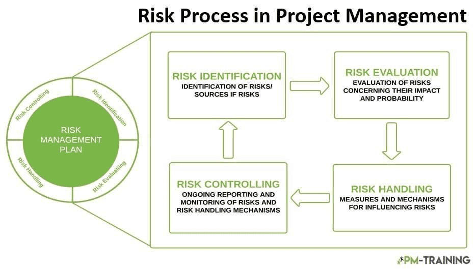

## Table of Contents

## What is risk acceptance?

Risk acceptance is when a person or a company decides that they are okay with a certain risk and choose not to do anything about it. They know the risk is there, but they think it's not a big problem or it's too costly to fix. For example, a small business might know that their computer system could be hacked, but they decide not to buy expensive security software because they think the chance of a hack is low.

This decision is made after looking at how likely the risk is to happen and how bad it would be if it did happen. If the risk is small and the cost to fix it is high, a company might choose to accept it. But, it's important to keep checking these risks because what might be okay today could become a bigger problem tomorrow.

## Why is risk management important in business?

Risk management is important in business because it helps companies spot problems before they happen. By looking at what could go wrong, businesses can plan ahead to stop these problems or make them less harmful. This can save a lot of money and keep the business running smoothly. For example, if a company knows that a big storm could damage their warehouse, they can buy insurance or move important things to a safer place.

Also, good risk management makes customers and partners trust the business more. When a company shows it can handle risks well, people feel safer working with them. This can lead to more business and better relationships. Plus, managing risks well can make the business stronger and more able to deal with surprises, like sudden changes in the market or new laws.

## What are the different types of risks that businesses face?

Businesses face many different kinds of risks. One big type is financial risk, which can come from things like changes in interest rates, currency values, or not being able to pay back loans. Another type is operational risk, which includes problems with how the business runs every day, like if machines break down or if there's a mistake in the work process. There's also strategic risk, which happens when a business makes bad choices about its goals or how it wants to grow. For example, if a company decides to sell a product that no one wants, that's a strategic risk.

Another important type of risk is compliance risk, which means the business might not follow laws or rules. This can lead to fines or legal trouble. Market risk is also a big deal, and it comes from changes in what customers want or from new competitors coming into the market. Then there's reputational risk, which can hurt a business if people start thinking badly about it, maybe because of a scandal or bad customer service. Each of these risks can affect a business in different ways, and it's important for companies to think about all of them.

Lastly, there are external risks, which come from things outside the business that it can't control, like natural disasters or political changes. Cybersecurity risk is another big one, where hackers might steal information or mess with the company's computer systems. Understanding all these different risks helps businesses prepare better and keep things running smoothly even when problems come up.

## How does risk acceptance differ from risk mitigation?

Risk acceptance and risk mitigation are two different ways businesses can deal with risks. Risk acceptance means a business knows about a risk but decides to do nothing about it. They might think the risk is small or that fixing it would cost too much. For example, a small shop might know that their website could be hacked, but they choose not to buy expensive security software because they think it's unlikely to happen.

On the other hand, risk mitigation means a business takes steps to make the risk smaller or less harmful. They might buy insurance, change how they do things, or put in new safety measures. For instance, if a factory knows that a machine might break down, they might decide to do regular checks and repairs to keep it working well. This way, they are actively trying to lower the chance of the risk happening or making it less bad if it does.

Both risk acceptance and risk mitigation are important parts of risk management. A business might use both strategies, depending on the situation. They might accept some small risks but work hard to mitigate bigger ones. The key is to always keep an eye on the risks and be ready to change the plan if things change.

## What are the steps involved in the risk management process?

The risk management process starts with identifying risks. This means looking at everything the business does to find out what could go wrong. It's like making a list of all the things that might cause problems. Once the risks are identified, the next step is to analyze them. This means figuring out how likely each risk is to happen and how bad it would be if it did. Businesses often use charts or numbers to help them understand this better.

After analyzing the risks, the business needs to decide what to do about them. They might choose to avoid the risk by stopping the activity that causes it, or they might decide to reduce the risk by taking steps to make it less likely or less harmful. Sometimes, they might transfer the risk, like by buying insurance, or they might choose to accept the risk if it's small enough. The last step is to keep checking on the risks and the plan to deal with them. This is called monitoring and reviewing. Things change all the time, so businesses need to keep an eye on their risks and be ready to change their plan if needed.

This whole process helps businesses stay safe and keep running smoothly. By knowing what could go wrong and having a plan to deal with it, they can avoid big problems and be ready for surprises. It's like having a map and a compass for the business journey, making sure they don't get lost or stuck along the way.

## Can you explain the concept of risk appetite in the context of risk acceptance?

Risk appetite is like how much risk a business is willing to take on. It's about figuring out what level of risk is okay for the business, kind of like deciding how much spice you want in your food. When a business knows its risk appetite, it helps them decide if they should accept a certain risk or not. If a risk is bigger than what the business is comfortable with, they might choose to do something else to handle it, like buying insurance or changing how they do things.

In the context of risk acceptance, risk appetite is really important. It's like a guide that helps the business decide when it's okay to just accept a risk and not do anything about it. If a risk is small and fits within the business's risk appetite, they might choose to accept it. But if the risk is too big, they'll look for other ways to deal with it. Knowing the risk appetite helps the business make smart choices about which risks to accept and which ones to handle differently.

## What tools and techniques are used for identifying and assessing risks?

To find and understand risks, businesses use different tools and techniques. One common way is to do a SWOT analysis, which looks at the strengths, weaknesses, opportunities, and threats of the business. This helps them see what could go wrong and what they need to watch out for. Another tool is a risk assessment matrix, which is like a chart that shows how likely a risk is to happen and how bad it would be if it did. This helps businesses see which risks are the biggest problems. They also use brainstorming sessions where people from different parts of the business talk about what could go wrong and share their ideas.

Another technique is to use checklists and questionnaires to make sure they don't miss any risks. These can be about safety, money, or how the business runs every day. Businesses also look at past data and records to see if there are patterns or things that have caused problems before. This can help them predict what might happen in the future. Sometimes, they use software programs that help them keep track of risks and see them all in one place. These tools make it easier to see the big picture and decide what to do about each risk.

Finally, businesses often use interviews and surveys to get information from employees, customers, and other people who know about the business. This can give them new ideas about risks they might not have thought of before. They also might hire experts or consultants who know a lot about risk to help them find and understand the risks better. All these tools and techniques help businesses see the risks clearly so they can make good plans to deal with them.

## How do organizations decide which risks to accept and which to mitigate?

Organizations decide which risks to accept and which to mitigate by first figuring out how likely each risk is to happen and how bad it would be if it did. They use tools like risk assessment matrices to help them see this clearly. If a risk is small and won't cause much harm, the organization might choose to accept it. This means they know the risk is there, but they decide not to do anything about it because fixing it would cost too much or take too much time. They also think about their risk appetite, which is how much risk they are okay with. If a risk is within their risk appetite, they might accept it.

For bigger risks, or risks that could cause a lot of harm, organizations usually choose to mitigate them. This means they take steps to make the risk smaller or less harmful. They might buy insurance, change how they do things, or put in new safety measures. The decision to mitigate a risk comes from understanding that the cost of dealing with the risk is worth it compared to the potential damage. Organizations also look at their resources and what they can do to lower the risk. By comparing all these factors, they can make smart choices about which risks to accept and which ones to actively work on reducing.

## What are the potential consequences of accepting certain risks?

When a business decides to accept a risk, it means they are okay with whatever might happen if that risk turns into a problem. If the risk is small, like a minor chance of a machine breaking down, accepting it might not cause big trouble. The business can keep running normally, and if the problem does happen, they can handle it without too much harm. But, if they accept a bigger risk without a good plan, things can go wrong. For example, if they know their computer system could be hacked but choose not to fix it, they might lose important information or money, which can hurt the business a lot.

Sometimes, accepting a risk can also affect how people see the business. If customers or partners find out that the business is taking big risks without doing anything about them, they might lose trust. This can lead to fewer customers, less business, and a bad reputation. It's important for a business to think carefully about which risks to accept and to always keep an eye on those risks. If a risk starts to grow or if the business's situation changes, what was okay to accept before might need to be dealt with differently now.

## How can risk acceptance be integrated into strategic planning?

Risk acceptance can be part of a business's big plan by first figuring out what risks are okay to live with. When making the big plan, the business looks at all the things that could go wrong and decides which ones are small enough to just accept. This helps them focus on the big risks and use their time and money wisely. For example, if a small shop knows that their website might go down sometimes but it won't hurt them much, they might decide to accept that risk instead of spending a lot of money on a perfect solution.

By knowing what risks they are okay with, a business can make better choices about where to put their effort. They can plan to grow and try new things without worrying too much about every little risk. But, they need to keep checking these risks because what's okay today might not be okay tomorrow. If something changes, like the business getting bigger or new laws coming in, they might need to change their plan and deal with the risk differently. This way, risk acceptance helps the business stay safe while still moving forward.

## What are advanced risk management frameworks and how do they facilitate risk acceptance?

Advanced risk management frameworks are like big plans that help businesses understand and deal with risks in a smart way. These frameworks often use special tools and steps to look at risks from all sides. They help businesses see which risks are small and which ones are big, so they can decide what to do about them. One popular framework is called ISO 31000, which gives a lot of advice on how to manage risks well. Another one is COSO ERM, which focuses on how risks can affect the whole business and helps them plan for the future. These frameworks make it easier for businesses to figure out which risks they can just accept and which ones they need to do something about.

These frameworks help with risk acceptance by making sure businesses really understand their risks. They use things like risk assessments and charts to show how likely a risk is to happen and how bad it would be if it did. If a risk is small and won't cause much harm, the framework can help the business see that it's okay to accept it. But, these frameworks also say it's important to keep watching these risks. If something changes, like the business getting bigger or new laws coming in, the business might need to change their mind and deal with the risk differently. By using these advanced frameworks, businesses can make smart choices about which risks to accept and feel more confident in their plans.

## How do regulatory requirements influence risk acceptance and management strategies?

Regulatory requirements are rules that businesses have to follow. These rules can change how a business thinks about risks and what they decide to do about them. If a law says a business must do something to keep people safe or protect the environment, they can't just accept the risk of not following that law. They have to find a way to follow the rule, which might mean spending money or changing how they do things. This can make businesses more careful about accepting risks because breaking the rules can lead to fines or other problems.

On the other hand, regulatory requirements can also help businesses know which risks are important to focus on. When a business knows what the rules are, they can plan better to meet those rules and manage their risks. For example, if there's a new law about data protection, a business might decide to accept some small risks but work hard to fix bigger ones that could break the law. By understanding the rules, businesses can make smarter choices about which risks to accept and how to manage the ones they can't accept.

## How can one implement effective risk management techniques?

In [algorithmic trading](/wiki/algorithmic-trading), effective risk management techniques are crucial for minimizing potential losses and optimizing trading outcomes. Among these techniques, stop-loss orders, dynamic position sizing, and quantitative risk assessments hold significant importance.

Stop-loss orders are a fundamental tool in risk management, designed to automatically sell a security when it reaches a predetermined price level. This mechanism limits potential losses by ensuring that the trading system exits a losing position before it deteriorates further. By setting a stop-loss at a strategic point, traders can protect their capital from significant market downturns. For instance, if a stock is purchased at $50, placing a stop-loss order at $45 ensures that the maximum loss is contained within a manageable 10%. This strategy not only curtails potential losses but also eliminates emotional decision-making during volatile market conditions.

Dynamic position sizing is another critical technique. It involves adjusting the size of a position in a security based on the trader's account size and the perceived risk of the trade. The principle behind dynamic position sizing is that the amount of capital exposed to a single trade should vary with the level of risk involved. A common approach is the fixed percentage risk model, where a trader risks a set percentage of their total capital on a single trade, calculated as:

$$
\text{Position Size} = \frac{\text{Total Capital} \times \text{Risk per Trade}}{\text{Trade Risk}}
$$

where "Trade Risk" represents the difference between the entry and the stop-loss price. This strategy helps in minimizing risk during adverse market conditions and capitalizing on favorable trends.

Quantitative risk assessments involve using statistical methods to evaluate and manage the risks inherent in trading strategies. By assessing historical data and [volatility](/wiki/volatility-trading-strategies) patterns, traders can predict potential adverse movements and adjust their strategies accordingly. Techniques such as Value at Risk (VaR), Conditional Value at Risk (CVaR), and Monte Carlo simulations are often employed to quantify risk exposure and inform decision-making processes. These assessments help traders to identify and mitigate risks before they affect their portfolios significantly.

Regular monitoring and adaptation are pivotal in maintaining the efficacy of these risk management techniques. Markets are dynamic, with volatility and conditions that can shift rapidly. Therefore, traders need to continually reassess their risk management strategies to ensure they remain effective under changing market circumstances. This involves analyzing performance metrics, reviewing the effectiveness of stop-loss levels, recalibrating position sizes, and updating quantitative models to reflect the latest market data.

By implementing these risk management techniques and maintaining a proactive approach to adapting strategies in response to market changes, algorithmic traders can better safeguard their investments and enhance their potential for long-term success in the financial markets. Continuous learning and refinement of risk management practices remain essential in navigating the complexities of algorithmic trading.

## References & Further Reading

[1]: Bergstra, J., Bardenet, R., Bengio, Y., & Kégl, B. (2011). ["Algorithms for Hyper-Parameter Optimization."](https://proceedings.neurips.cc/paper/2011/file/86e8f7ab32cfd12577bc2619bc635690-Paper.pdf) Advances in Neural Information Processing Systems 24.

[2]: ["Advances in Financial Machine Learning"](https://www.amazon.com/Advances-Financial-Machine-Learning-Marcos/dp/1119482089) by Marcos Lopez de Prado

[3]: ["Evidence-Based Technical Analysis: Applying the Scientific Method and Statistical Inference to Trading Signals"](https://www.amazon.com/Evidence-Based-Technical-Analysis-Scientific-Statistical/dp/0470008741) by David Aronson

[4]: ["Machine Learning for Algorithmic Trading"](https://github.com/stefan-jansen/machine-learning-for-trading) by Stefan Jansen

[5]: ["Quantitative Trading: How to Build Your Own Algorithmic Trading Business"](https://www.amazon.com/Quantitative-Trading-Build-Algorithmic-Business/dp/1119800064) by Ernest P. Chan