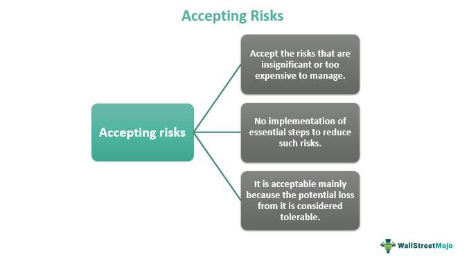

In the dynamic world of algorithmic trading, striking a balance between profitability and robust risk management is essential for sustained success. Algorithmic trading involves the use of pre-programmed models that execute trades at high speed and frequency, leveraging mathematical formulas and statistical analysis. While this technology-driven approach to trading offers the potential for significant profits, it also introduces a spectrum of risks that traders must navigate carefully. 

At the core of optimizing algorithmic trading strategies is a clear understanding of three key components: risk acceptance, risk management strategies, and risk alternatives. Risk acceptance entails recognizing the inevitability of certain risks within the trading environment, while choosing not to mitigate them actively due to their low impact or likelihood. It requires a strategic evaluation of which risks can be tolerated without compromising the overall objectives.

Risk management strategies are implemented to prevent substantial financial losses and maintain the stability of trading operations. These strategies encompass various techniques such as setting stop-loss orders, diversifying portfolios to spread risk, and employing hedging tactics to counteract adverse market movements. Effective risk management is not just about defense; it is a proactive measure that protects trading capital and adapts to changing market conditions.

Furthermore, exploring risk alternatives, such as risk avoidance, transfer, and mitigation, gives traders additional tools to manage uncertainties effectively. Understanding how these concepts interplay in algorithmic trading allows traders to refine their approaches, aligning risk tolerance with financial goals to enhance overall trading performance. As we navigate through this article, these elements will be unpacked to provide insights into leveraging risk management techniques to optimize algorithmic trading strategies.

## Table of Contents

## What is Risk Acceptance in Algorithmic Trading?

Risk acceptance in algorithmic trading is a decision-making strategy where traders recognize certain risks inherent to the trading process without implementing measures to mitigate them. This approach is grounded on evaluating both the potential impact and the likelihood of these risks materializing. In many trading scenarios, the associated risks may be considered insignificant in comparison to the cost or complexity of mitigating them, thus justifying their acceptance.

In algorithmic trading, the risks accepted are often those deemed minor, such as minor market fluctuations or temporary [liquidity](/wiki/liquidity-risk-premium) issues, which are unlikely to substantially impact trading outcomes. For instance, a trader might accept the risk of marginal slippage—where a trade is executed at a slightly different price than expected—especially in highly liquid markets where the impact is minimal. This acceptance is done with the understanding that implementing precautionary measures for such negligible risks could be more costly and could reduce trading efficiency.

The balance between risk acceptance and proactive risk management is crucial. Traders must carefully evaluate which risks are trivial enough to be accepted and which necessitate active management. This decision often depends on a comprehensive risk assessment process, factoring in the probability of risk occurrence and the extent of its potential impact. For example, while a trader may accept minor technical glitches as part and parcel of [algorithmic trading](/wiki/algorithmic-trading), major software failures that could halt trading operations should be proactively addressed with backup systems and rigorous testing protocols.

Furthermore, traders should continuously revisit their risk acceptance criteria as market conditions change or as their trading strategies evolve. This reassessment helps ensure that the acceptance of certain risks remains aligned with the overall strategy and goals of the trading operation. By doing so, traders can optimize their strategies, maintaining a balance between efficiency and security in their trading activities.

## The Importance of Risk Management in Algo Trading

Risk management is essential in algorithmic trading to prevent financial losses and maintain consistent trading performance. It provides a structured approach to identifying, assessing, and addressing risks that can potentially disrupt trading activities.

One of the fundamental techniques in risk management is the use of stop-loss orders. These orders automatically sell a security when it reaches a predetermined price, offering protection against significant market downturns. By setting a stop-loss order, traders can limit potential losses, ensuring that they do not exceed a certain percentage of the trade value. This strategy helps maintain the overall health of a trading portfolio by capping losses.

Another vital aspect of risk management is portfolio diversification. Diversifying a portfolio involves spreading investments across various financial instruments, sectors, or geographical regions. The underlying principle is that a well-diversified portfolio is less susceptible to the adverse impacts of a single asset's poor performance. By reducing reliance on any one investment, traders can achieve a more stable return profile and diminish the risk of significant losses.

Hedging is also a critical risk management technique. It involves taking offsetting positions in related instruments to protect against price fluctuations in the primary asset. For example, a trader might use options or futures contracts to hedge against adverse price movements. Through hedging, traders can secure their capital against market [volatility](/wiki/volatility-trading-strategies), allowing them to focus on long-term strategic goals.

Effective risk management also involves continuously monitoring and adapting to changes in market conditions. This proactive approach ensures that risk management strategies remain robust and relevant. Adaptation might include adjusting risk parameters, such as stop-loss levels, or reevaluating portfolio allocations in response to changing risk profiles or market dynamics.

In summary, risk management is pivotal in safeguarding capital and ensuring the sustainable performance of algorithmic trading strategies. By employing techniques like stop-loss orders, portfolio diversification, and hedging, traders can mitigate potential losses and build a resilient trading framework that can adapt to market changes. This emphasis on risk management ultimately contributes to consistent trading success and longevity in the financial markets.

## Types of Risks in Algorithmic Trading

Algorithmic trading involves the use of complex mathematical models and automated platforms to execute trades at optimal prices. However, this sophisticated approach to trading is not impervious to various risks that can affect performance and lead to significant financial losses. Understanding and addressing these risks is crucial for achieving sustainable trading success.

### Market Risk
Market risk refers to the possibility of an investor experiencing losses due to factors that affect the overall performance of the financial markets. This type of risk includes shifts in market trends, price volatility, and economic events that influence asset prices unpredictably. For instance, unexpected geopolitical events can lead to market swings that algorithmic models may not be equipped to handle. 

To mitigate market risk, algo traders can implement strategies such as stop-loss orders, which automatically sell a security when it reaches a certain price, thus limiting potential losses. Additionally, diversification across multiple asset classes can spread risk, ensuring that underperformance in one sector is offset by gains in another.

### Technical Risks
Technical risks arise from malfunctions or failures in the technological infrastructure used for algorithmic trading. This includes software bugs, server downtime, and latency issues. Such failures can disrupt trading operations, cause erroneous trades, or result in missed opportunities. In extreme cases, they can lead to substantial financial losses if the algorithms are executing trades based on inaccurate or outdated data.

To address technical risks, robust testing and regular maintenance of trading systems are imperative. Implementing fail-safes and redundancies, such as backup servers and data feeds, can also ensure continuity in trading operations. Moreover, traders may use error-handling algorithms to detect and rectify anomalies swiftly.

### Operational Risks
Operational risks are associated with internal processes, systems, and people involved in algorithmic trading. These risks stem from human errors, misconfigurations, or oversight in managing trading systems. Given that algorithmic trading is often fully automated, any lapses in operational controls can have a magnified impact.

To mitigate operational risks, establishing comprehensive operational protocols and conducting regular audits are effective strategies. Proper training for the personnel involved and employing checks and balances can reduce the likelihood of human error. Additionally, using automated monitoring tools to oversee trading activities can help identify and correct operational issues in real-time.

### Behavioral Risks
Behavioral risks pertain to the psychological factors that may influence trading decisions, such as market sentiment, trader biases, and emotional reactions to market fluctuations. Even in algorithmic trading, the parameters and models used are developed and adjusted by humans, who can introduce biases unintentionally.

Managing behavioral risks involves ensuring that algorithms are based on robust, objective data, and constantly tested for biases. Employing [machine learning](/wiki/machine-learning) techniques can help adapt and optimize algorithms dynamically in response to changing market conditions. Furthermore, continuously reviewing and refining trading strategies can eliminate potential biases that may have been incorporated during model development.

By recognizing these diverse types of risks and employing targeted strategies to mitigate them, algorithmic traders can protect their investments and enhance trading performance. It is essential for traders to maintain a proactive approach to risk management, ensuring adaptability and resilience in the fast-paced world of financial markets.

## Risk Alternatives: Strategies for Managing Risk

Risk management in algorithmic trading is crucial for minimizing exposure to potentially volatile market conditions. Alternative strategies for managing risk, such as risk avoidance, transfer, and mitigation, are essential tools for traders seeking to preserve capital and ensure the longevity of their trading activities. 

### Risk Avoidance

Risk avoidance involves completely bypassing activities or decisions that could lead to exposure. In algorithmic trading, this might mean refraining from entering the market during highly volatile conditions or avoiding particular asset classes deemed too risky. For instance, traders sometimes steer clear of trading during major economic announcements when markets are prone to unpredictable swings. Although risk avoidance is not always feasible, selectively deploying this strategy can protect traders from significant losses during unusually turbulent periods.

### Risk Transfer

Risk transfer occurs when a trader shifts the potential consequences of a risk to a third party. This can be achieved through instruments such as options contracts, where the risk of adverse price movements is transferred to the option writer. For example, a trader might purchase a put option to hedge against potential declines in an asset's price, thereby capping potential losses at the premium paid for the option.

Another form of risk transfer in financial markets is through third-party insurance services. For traders, specialized insurance products are available that protect against unexpected losses caused by system failures or cyber-attacks. These insurance products offer a critical safety net, ensuring that traders can recover quickly from technical disruptions.

### Risk Mitigation

Risk mitigation aims to reduce the impact or probability of adverse outcomes. Strategies for risk mitigation include diversification, where investments are spread across various asset classes or market sectors to minimize the impact of a downturn in any single area. 

In algorithmic trading, diversification can be implemented by developing multiple trading strategies that react differently to market conditions. By creating a balanced strategy portfolio, traders can mitigate the risk associated with any single approach underperforming.

### Self-Insurance and Third-Party Insurance

Self-insurance entails setting aside a portion of trading profits to cover potential future losses. Traders might allocate a risk reserve fund that acts as a financial buffer during drawdowns, ensuring operational continuity without the need to prematurely liquidate positions.

Third-party insurance, on the other hand, provides a broader safety net. Insurance products tailored to algorithmic trading often cover risks not typically addressed by self-insurance, such as indemnity against software malfunctions or regulatory infractions. By integrating third-party insurance, traders gain access to additional layers of protection, allowing them to focus on strategy optimization rather than potential disruptions.

These risk management strategies form a comprehensive framework that helps traders manage uncertainties and capitalize on market opportunities while safeguarding their investments. Adopting a multi-faceted approach to risk management ensures adaptability and resilience in the ever-evolving landscape of algorithmic trading.

## Implementing Effective Risk Management Techniques

In algorithmic trading, effective risk management techniques are crucial for minimizing potential losses and optimizing trading outcomes. Among these techniques, stop-loss orders, dynamic position sizing, and quantitative risk assessments hold significant importance.

Stop-loss orders are a fundamental tool in risk management, designed to automatically sell a security when it reaches a predetermined price level. This mechanism limits potential losses by ensuring that the trading system exits a losing position before it deteriorates further. By setting a stop-loss at a strategic point, traders can protect their capital from significant market downturns. For instance, if a stock is purchased at $50, placing a stop-loss order at $45 ensures that the maximum loss is contained within a manageable 10%. This strategy not only curtails potential losses but also eliminates emotional decision-making during volatile market conditions.

Dynamic position sizing is another critical technique. It involves adjusting the size of a position in a security based on the trader's account size and the perceived risk of the trade. The principle behind dynamic position sizing is that the amount of capital exposed to a single trade should vary with the level of risk involved. A common approach is the fixed percentage risk model, where a trader risks a set percentage of their total capital on a single trade, calculated as:

$$
\text{Position Size} = \frac{\text{Total Capital} \times \text{Risk per Trade}}{\text{Trade Risk}}
$$

where "Trade Risk" represents the difference between the entry and the stop-loss price. This strategy helps in minimizing risk during adverse market conditions and capitalizing on favorable trends.

Quantitative risk assessments involve using statistical methods to evaluate and manage the risks inherent in trading strategies. By assessing historical data and volatility patterns, traders can predict potential adverse movements and adjust their strategies accordingly. Techniques such as Value at Risk (VaR), Conditional Value at Risk (CVaR), and Monte Carlo simulations are often employed to quantify risk exposure and inform decision-making processes. These assessments help traders to identify and mitigate risks before they affect their portfolios significantly.

Regular monitoring and adaptation are pivotal in maintaining the efficacy of these risk management techniques. Markets are dynamic, with volatility and conditions that can shift rapidly. Therefore, traders need to continually reassess their risk management strategies to ensure they remain effective under changing market circumstances. This involves analyzing performance metrics, reviewing the effectiveness of stop-loss levels, recalibrating position sizes, and updating quantitative models to reflect the latest market data.

By implementing these risk management techniques and maintaining a proactive approach to adapting strategies in response to market changes, algorithmic traders can better safeguard their investments and enhance their potential for long-term success in the financial markets. Continuous learning and refinement of risk management practices remain essential in navigating the complexities of algorithmic trading.

## Conclusion

In the field of algorithmic trading, effectively managing risk is crucial for achieving long-term success. While risk acceptance allows traders to tolerate certain risks when the potential impact is deemed minimal, risk management provides a framework for addressing more significant threats that could adversely affect trading outcomes. Together, they form the foundation of a robust trading strategy that seeks to balance potential gains with the inevitable uncertainties of financial markets.

Traders must be proactive in their approach to managing risks, as market conditions can fluctuate rapidly and unpredictably. By employing a comprehensive suite of risk management techniques—such as stop-loss orders, portfolio diversification, and dynamic position sizing—traders can limit their exposure to adverse market movements and protect their capital. Furthermore, continuously monitoring trading models and strategies is essential. This vigilance allows for timely adjustments that can mitigate potential losses and exploit emerging opportunities.

The complexity of financial markets requires traders to maintain a commitment to continuous learning and adaptation. As new risks emerge and existing ones evolve, keeping abreast of the latest risk management strategies is vital for sustaining trading success. By embracing this dynamic approach to risk management, traders not only shield their portfolios from potential downturns but also position themselves advantageously in a competitive landscape.

Ultimately, the interplay of risk acceptance and management serves as a pivotal element in algorithmic trading. Integrating these strategies empowers traders to navigate market complexities with confidence, enhancing their resilience against uncertainties while capitalizing on market opportunities for profit maximization.

## References & Further Reading

[1]: Bergstra, J., Bardenet, R., Bengio, Y., & Kégl, B. (2011). ["Algorithms for Hyper-Parameter Optimization."](https://proceedings.neurips.cc/paper/2011/file/86e8f7ab32cfd12577bc2619bc635690-Paper.pdf) Advances in Neural Information Processing Systems 24.

[2]: ["Advances in Financial Machine Learning"](https://www.amazon.com/Advances-Financial-Machine-Learning-Marcos/dp/1119482089) by Marcos Lopez de Prado

[3]: ["Evidence-Based Technical Analysis: Applying the Scientific Method and Statistical Inference to Trading Signals"](https://www.amazon.com/Evidence-Based-Technical-Analysis-Scientific-Statistical/dp/0470008741) by David Aronson

[4]: ["Machine Learning for Algorithmic Trading"](https://github.com/stefan-jansen/machine-learning-for-trading) by Stefan Jansen

[5]: ["Quantitative Trading: How to Build Your Own Algorithmic Trading Business"](https://www.amazon.com/Quantitative-Trading-Build-Algorithmic-Business/dp/1119800064) by Ernest P. Chan