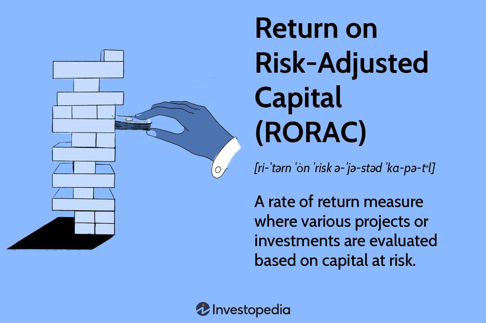

The integration of technology and automation is transforming financial analysis, highlighting the significance of the risk-adjusted capital ratio, particularly in algorithmic trading. This metric is essential for understanding the financial stability of institutions and assessing the effectiveness of trading strategies. It measures how well institutions can withstand economic fluctuations, which is pivotal for both investors and financial entities aiming to enhance economic resilience.

The risk-adjusted capital ratio is a tool for evaluating the performance and stability of trading algorithms, particularly in varying economic environments. It allows analysts to gauge the risks associated with trading strategies and determine their capacity to manage market volatility effectively. Algorithmic trading, driven by complex algorithms and large data sets, benefits from this analysis by aligning trading strategies with risk management objectives.

This article aims to guide investors and financial institutions in making informed decisions about trading strategies and economic resilience by exploring the relationship between risk-adjusted capital ratios and algorithmic trading. Understanding this relationship is crucial for optimizing trading strategies and ensuring their robustness against market shifts. The focus is on providing insights into how risk-adjusted ratios can improve the management of market volatility, enabling more stable and profitable trading outcomes.

## Table of Contents

## Understanding Risk-Adjusted Capital Ratio

The risk-adjusted capital ratio serves as a pivotal metric for assessing the financial robustness of an institution, especially when facing economic adversities. This ratio is calculated by juxtaposing an institution's total adjusted capital against its risk-weighted assets. This calculation provides deep insights into the institution’s capacity to sustain operational continuity under financial duress.

Total adjusted capital encompasses equity and near-equity instruments that are adjusted according to their equity content. This encompasses common equity, preferred equity, hybrid capital instruments, and retained earnings. Meanwhile, risk-weighted assets account for the likelihood of asset retention by attributing risk weights to various asset classes. For instance, cash typically retains a near 100% value weight, highlighting its security and liquidity. Conversely, riskier assets such as derivatives receive a lower weight due to their volatility and potential devaluation under market stress.

The formula for the risk-adjusted capital ratio is expressed as:

$$
\text{Risk-Adjusted Capital Ratio} = \frac{\text{Total Adjusted Capital}}{\text{Risk-Weighted Assets}}
$$

A higher risk-adjusted capital ratio suggests that an institution is well-positioned to endure economic challenges, offering stakeholders the assurance of its fiscal strategies' resilience.

This metric is instrumental in making cross-comparisons among financial institutions across different regions. Its standardized approach allows financial analysts and traders to evaluate economic resilience on a level playing field. By grasping the intricacies of this ratio and mastering its calculations, analysts can appraise the stability of investment strategies more effectively, ensuring well-informed decision-making in risk management and portfolio optimization.

## Calculating the Risk-Adjusted Capital Ratio

To calculate the risk-adjusted capital ratio, a systematic approach involves several key steps, providing a clear measure of a financial institution's ability to endure economic stress.

The first step is determining the total adjusted capital. Total adjusted capital comprises equity and near-equity instruments, which are adjusted according to their equity content. Equity, which typically includes common stocks and retained earnings, forms the core of the capital base. Near-equity instruments might include preferred stocks or subordinated debt, which are adjusted to reflect their contribution to the total capital as equity-like instruments.

The second step involves quantifying risk-weighted assets (RWA). This requires assigning a risk percentage to each asset based on its risk profile and likelihood of retaining value. For example, cash and government securities are assigned a risk weight near 0%, due to their high [liquidity](/wiki/liquidity-risk-premium) and lower risk, while riskier assets such as derivatives or unsecured loans have higher risk weights. The risk weight for each asset class is generally determined according to regulatory frameworks, such as those provided by the Basel Accords. The formula for calculating risk-weighted assets is:

$$
\text{RWA} = \sum \left( \text{Asset Value} \times \text{Risk Weight} \right)
$$

Finally, the calculation of the risk-adjusted capital ratio (RACR) is achieved by dividing the total adjusted capital by the value of the risk-weighted assets, as detailed below:

$$
\text{RACR} = \frac{\text{Total Adjusted Capital}}{\text{Risk-Weighted Assets}}
$$

A higher RACR indicates enhanced resilience against economic downturns. It reflects the institution's capacity to absorb losses while continuing to operate effectively. A robust RACR reassures investors and stakeholders about the soundness and stability of the institution's financial strategies, serving as a critical indicator for sustaining financial health under varying economic conditions. This ratio is essential for guiding stakeholders when assessing the institution's economic viability and risk management capacity.

## Algorithmic Trading and Financial Analysis

Algorithmic trading utilizes sophisticated algorithms to automate the execution of trading strategies based on set parameters, covering a spectrum from trend analysis to more complex strategies like statistical [arbitrage](/wiki/arbitrage). By leveraging advanced computational resources, [algorithmic trading](/wiki/algorithmic-trading) allows for rapid execution of trades, beneficial in fast-paced financial markets. However, the integration of comprehensive financial metrics, such as the risk-adjusted capital ratio, into these trading algorithms can significantly refine and enhance their robustness and effectiveness.

The incorporation of risk-adjusted capital ratios within trading algorithms serves the purpose of ensuring that these strategies are aligned with the broader risk management frameworks of the financial institution. This alignment is crucial for maintaining balance between achieving attractive returns and mitigating risks. By continuously analyzing the ratio, traders can optimize algorithms to ensure they are not exceeding acceptable risk levels, thus safeguarding the institution's capital during volatile market periods.

Algorithmic trading's ability to process real-time data and evaluate performance continuously is key to its success. This capability allows traders to respond promptly to market changes, reducing the potential adverse impacts of market [volatility](/wiki/volatility-trading-strategies). Real-time analysis ensures that deviations from expected performance can be quickly identified, and strategies can be adjusted to manage emerging risks effectively.

The integration of risk-adjusted capital ratio assessments in trading algorithms supports the optimization of trading strategies for greater financial stability and profitability. For instance, an algorithm could be programmed to reduce exposure to high-risk assets if the risk-adjusted capital ratio falls below a certain threshold. This dynamic adjustment helps in maintaining the financial health of the trading portfolio, especially in shifting market conditions. Employing such measures not only enhances the stability of the trading strategy but also conservatively guides the institution towards sustained profitability and capital preservation.

In summary, the fusion of algorithmic trading with rigorous financial analysis frameworks empowers traders to execute more informed and strategic decisions. This harmonization of technology and financial metrics like the risk-adjusted capital ratio is instrumental in bolstering risk management and fostering sustained profitability in the fluid landscape of financial markets.

## Key Performance Metrics in Algo Trading

Effective algorithmic trading necessitates evaluating various performance metrics to ensure that strategies remain profitable while aligned with risk management objectives. Among these metrics, the Sharpe Ratio, Maximum Drawdown, Win Rate, Profit Factor, and Average Trade are fundamental in assessing an algorithm's success and efficiency in risk-taking.

The **Sharpe Ratio** is crucial for risk-adjusted return evaluation. It calculates the amount of return an investor receives per unit of risk. The Sharpe Ratio is given by:

$$

\text{Sharpe Ratio} = \frac{R_p - R_f}{\sigma_p} 
$$

where $R_p$ is the expected portfolio return, $R_f$ is the risk-free rate, and $\sigma_p$ is the standard deviation of the portfolio return. A higher Sharpe Ratio indicates a more desirable risk-adjusted performance, providing insights into how well the trade-off between risk and return is managed by the strategy.

**Maximum Drawdown (MDD)** measures the largest peak-to-trough decline in a trading account. It quantifies the worst loss experienced by an investment, emphasizing its vulnerability to downturns. This metric is essential for understanding potential losses in volatile markets and ensuring strategies can withstand significant adverse movements.

**Win Rate** represents the percentage of profitable trades relative to the total number of trades executed. While important, this metric is more telling when combined with others, such as the Profit Factor and Average Trade, to present a complete picture of the strategy's success.

The **Profit Factor** is the ratio of gross profits to gross losses. A Profit Factor greater than one indicates a profitable system, with a higher value suggesting greater profitability relative to losses. It is calculated as:

$$

\text{Profit Factor} = \frac{\text{Gross Profit}}{\text{Gross Loss}} 
$$

**Average Trade**, or average profit per trade, refines the understanding of profitability by considering the mean net gain or loss over multiple trading instances. It highlights the robustness of individual trades, encouraging assessment of long-term strategy sustainability.

Combining these metrics reinforces the use of risk-adjusted capital ratios in maintaining robust strategies that resist market upheaval. Each metric complements the others, affording a thorough understanding of both short-term performance and long-term resilience. By leveraging these metrics, traders can optimize their algorithmic strategies, ensuring alignment with broader financial goals and risk management practices.

## Challenges and Considerations

One significant issue in algorithmic trading is overfitting, where strategies are excessively tailored to historical data but may not perform well in future market conditions. Overfitting occurs when a model captures noise in the data rather than the underlying trend, leading to unreliable predictions. Traders and analysts can mitigate this risk by employing techniques such as cross-validation and out-of-sample testing. These methods ensure that the trading strategy has robustly learned the key patterns rather than the idiosyncrasies of specific datasets.

Another complexity arises from transaction costs and market conditions affecting strategy performance. Hidden fees, slippage, and varying liquidity can vastly alter the expected profitability of a trading algorithm. To address these challenges accurately, comprehensive evaluation tools like [backtesting](/wiki/backtesting) and statistical analysis are indispensable. Backtesting allows for the simulation of a trading strategy using historical market data to determine how well it would have performed. However, careful attention must be paid to the accuracy and reliability of the historical data and the assumptions made in the backtest.

The application of a risk-adjusted capital ratio is critical for financial institutions to brace for changing market conditions. This ratio measures a firm's ability to withstand financial stress by comparing capital levels to the risk posed by their assets. Having an adequate risk-adjusted capital ratio ensures that even if certain trading strategies underperform due to unforeseen market changes, the institution can maintain operational stability.

Continuous monitoring and dynamic adjustment of trading algorithms are essential to navigate constantly evolving markets. Financial markets are influenced by numerous unpredictable factors, such as economic policy changes, geopolitical events, and technological advancements, which can all significantly impact market dynamics. Regular algorithm updates and performance reviews help in adapting to new data and conditions, preserving both profitability and risk management standards.

By acknowledging these challenges and implementing appropriate measures, traders and financial institutions can develop more robust algorithmic trading strategies that stand resilient against market unpredictabilities and external disturbances.

## Conclusion

The integration of risk-adjusted capital ratios in financial analysis and algorithmic trading signifies a substantial progression in achieving economic resilience. As traditional financial metrics are combined with innovative trading algorithms, investors and institutions are poised to enhance their capabilities in managing risk effectively. This synergy allows for a more nuanced understanding of financial health, bridging the gap between theoretical capital adequacy and practical trading strategies.

As the financial landscape continues to evolve, the significance of grasping and applying these concepts becomes increasingly critical for the future success of trading and investment strategies. Understanding risk-adjusted capital ratios offers a comprehensive view of potential risks and opportunities, empowering market participants to tailor their approaches to market volatility and uncertainty. This concept serves as a strategic touchstone for financial decision-making, providing both a shield against economic shocks and a tool for capital optimization.

Continuous advancements in technology and analytical tools are expected to amplify the importance of risk-adjusted capital ratios. With algorithms becoming more sophisticated and data analysis reaching unprecedented precision, the role of these ratios will only grow in its influence over financial strategies. This evolving dynamic underscores the potential for risk-adjusted capital ratios to guide institutions toward greater financial prudence and strategic foresight in an ever-changing economic environment.

## References & Further Reading

[1]: ["Basel III: A global regulatory framework for more resilient banks and banking systems"](https://www.bis.org/publ/bcbs189.pdf) by the Bank for International Settlements

[2]: Jorion, P. (2006). ["Value at Risk: The New Benchmark for Managing Financial Risk"](https://books.google.com/books/about/Value_at_Risk_3rd_Ed.html?id=nnblKhI7KP8C). McGraw-Hill.

[3]: Hull, J. C. (2018). ["Risk Management and Financial Institutions"](https://books.google.com/books/about/Risk_Management_and_Financial_Institutio.html?id=1J1QDwAAQBAJ). Wiley.

[4]: Lopez de Prado, M. (2018). ["Advances in Financial Machine Learning"](https://www.amazon.com/Advances-Financial-Machine-Learning-Marcos/dp/1119482089). Wiley.

[5]: Chan, E. P. (2009). ["Quantitative Trading: How to Build Your Own Algorithmic Trading Business"](https://github.com/ftvision/quant_trading_echan_book). Wiley.

[6]: ["Algorithmic Trading & DMA: An Introduction to Direct Access Trading Strategies"](https://archive.org/details/algorithmictradi0000john) by Barry Johnson

[7]: Alexander, C. (2008). ["Market Risk Analysis, Volume IV: Value at Risk Models"](https://pdfs.semanticscholar.org/afba/364297b19e15f646f9964a7f319225984fe9.pdf). Wiley.

[8]: Aronson, D. R. (2006). ["Evidence-Based Technical Analysis: Applying the Scientific Method and Statistical Inference to Trading Signals"](https://www.amazon.com/Evidence-Based-Technical-Analysis-Scientific-Statistical/dp/0470008741). Wiley.