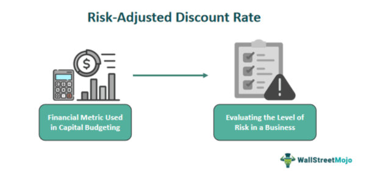

The concept of risk-adjusted discount rates is integral to investment finance and algorithmic trading. These rates are sophisticated tools that help investors evaluate the true economic value of investments by factoring in the inherent risk associated with future cash flows. Traditionally, discount rates are used to convert future cash flows into their present value, facilitating comparison and valuation. However, not all investments carry the same level of risk. This is where risk-adjusted discount rates become crucial, as they modify the discount rate to reflect the risk profile of specific investments or projects.

A firm understanding of risk-adjusted discount rates is essential for anyone making informed investment decisions. These rates offer a nuanced approach that accounts for the volatility and uncertainty linked to expected cash flows. By adjusting the discount rates to account for risk, financial analysts and investors achieve a more accurate valuation, ensuring that their investment decisions align with the risk-return dynamics inherent in different financial assets.



In practice, the calculation of risk-adjusted discount rates often involves models like the Capital Asset Pricing Model (CAPM), which balances the risk-free rate of return with the specific risk of the asset under consideration. This ensures that investors are adequately compensated for taking on additional risk. Such a methodology underscores the importance of estimating the appropriate discount rate to determine the potential success or failure of investment opportunities accurately.

## Table of Contents

## Understanding Risk-Adjusted Discount Rates

A risk-adjusted discount rate is a critical tool that modifies the market discount rate to factor in the specific risk profile of an investment or project. This adjustment accounts for the uncertainties and potential fluctuations in expected cash flows, which are inherent in any investment decision. The concept is grounded in the foundational principle of finance that a higher level of risk necessitates a commensurate potential for return.

The relationship between risk and return is a cornerstone of modern financial theory, encapsulated in the premise that investors are inherently risk-averse. This aversion translates into a demand for higher expected returns to compensate for taking on additional risk. Essentially, risk-adjusted discount rates recognize that the value of money differs depending on the uncertainty associated with future cash flows.

To quantify this, the adjustment typically involves incorporating a risk premium into the discount rate. The risk premium represents the extra return required by investors to hold a risky asset over one deemed risk-free, such as government bonds. Mathematically, the risk-adjusted discount rate $r_a$ can be expressed as:

$$

r_a = r_f + \beta \times (r_m - r_f) 
$$

where:
- $r_f$ is the risk-free rate, representing the theoretical return of an investment with zero risk.
- $r_m$ is the expected market return.
- $\beta$ (beta) is a measure of the investment's volatility relative to the market, highlighting its systematic risk.

This formula embodies the Capital Asset Pricing Model (CAPM), which is frequently employed to calculate risk-adjusted rates. CAPM's utility lies in its ability to link the expected return of an asset to its risk relative to the broader market, providing a structured framework for assessing investment opportunities. By integrating the asset's beta, CAPM adjusts for the expected impact of market-wide movements on the asset's return, offering a precise mechanism for risk compensation.

Investors require this adjustment mechanism as a safeguard against the potential deviations in projected returns caused by market [volatility](/wiki/volatility-trading-strategies) and other risk factors. Understanding why investors demand these higher returns is critical for financial analysts who must ensure that investment valuations adequately reflect the risk-return trade-off. By employing risk-adjusted discount rates, analysts can achieve a more accurate assessment of an investment's worth, aligning expected returns with the underlying risk profile.

## Calculating Risk-Adjusted Discount Rates

Risk-adjusted discount rates are crucial for accurately valuing investments by adequately reflecting the risks associated with them. A widely-used model to calculate these rates is the Capital Asset Pricing Model (CAPM). CAPM is built on the principle that the expected return on an investment needs to compensate investors for the risk-free rate plus an additional premium for taking on extra risk.

$$
E(R_i) = R_f + \beta_i (E(R_m) - R_f)
$$

Where:
- $E(R_i)$ is the expected return of the investment.
- $R_f$ is the risk-free rate, typically the yield on government securities.
- $\beta_i$ (beta) measures the sensitivity of the expected return of the asset to the returns of the market.
- $E(R_m)$ is the expected return of the market.

The beta (β) is a central element in CAPM, capturing an asset's correlation with overall market movements. A beta of 1 implies the asset moves in tandem with the market, while a beta less than 1 suggests less volatility, and a beta greater than 1 indicates more volatility than the market. For instance, a high-tech startup might have a beta higher than 1 due to its sector's inherent risk and volatility, necessitating a higher discount rate to reflect these factors.

The risk-free rate $R_f$ traditionally uses government bonds, reflecting essentially riskless opportunities in the market. In contrast, the market risk premium $E(R_m) - R_f$ accounts for the additional return demanded by investors to compensate for the risk of investing in an uncertain market as opposed to a stable government bond.

CAPM's straightforward assumption is that a higher beta leads to a risk-adjusted discount rate that compensates for the asset's market risk, thus aligning expected returns with the market's required returns. As a result, CAPM allows investors to calculate a suitable discount rate that incorporates the market's broader economic conditions and the asset's idiosyncratic risk profile.

To implement CAPM in Python, one could use a simple script to calculate the expected return for an asset:

```python
def calculate_expected_return(risk_free_rate, beta, expected_market_return):
    market_risk_premium = expected_market_return - risk_free_rate
    expected_return = risk_free_rate + beta * market_risk_premium
    return expected_return

# Example parameters
risk_free_rate = 0.02  # 2% risk-free rate
beta = 1.3            # Asset beta
expected_market_return = 0.08  # 8% expected market return

expected_return = calculate_expected_return(risk_free_rate, beta, expected_market_return)
print(f"The calculated expected return is: {expected_return:.2%}")
```

This simple formula and code demonstrate CAPM's utility in adjusting discount rates by quantifying the risk profile of an asset relative to the broader market. The calculated risk-adjusted discount rate ensures investors can better account for expected future volatility and achieve more precise risk compensation in their financial valuations.

## Factors Influencing Risk-Adjusted Rates

Factors influencing risk-adjusted discount rates are multifaceted and stem from various aspects including macroeconomic conditions, industry-specific risks, and company-specific attributes. These elements are crucial for financial analysts and investors as they calibrate the discount rate to better reflect the risk profile of different investments.

### Macroeconomic Conditions

Macroeconomic variables such as interest rates, inflation, and GDP growth can significantly impact risk-adjusted discount rates. Central banks' monetary policies influence [interest rate](/wiki/interest-rate-trading-strategies) levels, altering the risk-free rate component in models like the Capital Asset Pricing Model (CAPM). For instance, higher interest rates typically increase the discount rate, which can affect the present value of future cash flows. Additionally, inflation expectations can lead to adjustments in discount rates to ensure that future cash flows are appropriately valued in real terms.

### Industry-Specific Risks

Each industry carries unique risk elements that influence risk-adjusted rates. Factors such as regulatory changes, technological advancements, and competitive dynamics contribute to sector-specific risks. For example, technology companies may face rapid obsolescence risks, while energy sectors could be more sensitive to regulatory changes regarding environmental policies. These industry characteristics require adjustments in discount rates to capture the higher risks associated with certain sectors.

### Company-Specific Attributes

The financial health and operational dynamics of a company also play a significant role in determining its risk-adjusted discount rate. Attributes such as the company’s leverage, cash flow stability, and management effectiveness must be considered. A company with higher leverage might necessitate a higher discount rate due to increased financial risk. Conversely, stable cash flows and strong management might mitigate the need for a substantial risk premium.

### Calculation and Adjustment

The interplay of these factors can be mathematically represented and calculated. For example, using the CAPM formula:

$$
\text{Expected Return} = R_f + \beta (R_m - R_f)
$$

Where:
- $R_f$ is the risk-free rate,
- $\beta$ measures the sensitivity of the asset's returns to market returns,
- $R_m$ is the expected market return.

Adjustments can be made to β to reflect industry-specific and company-specific risks not captured by the market as a whole. This requires careful analysis of both qualitative and quantitative data.

```python
# Example Python code to calculate risk-adjusted discount rate
def calculate_expected_return(risk_free_rate, beta, market_return):
    """
    Calculates the expected return using CAPM formula.

    Parameters:
    risk_free_rate (float): The risk-free rate
    beta (float): The asset's beta
    market_return (float): The expected market return

    Returns:
    float: Expected return
    """
    expected_return = risk_free_rate + beta * (market_return - risk_free_rate)
    return expected_return

# Example usage
risk_free_rate = 0.02  # 2% risk-free rate
beta = 1.5  # Hypothetical beta for the asset
market_return = 0.08  # 8% expected market return
expected_return = calculate_expected_return(risk_free_rate, beta, market_return)
```

### Conclusion

Understanding the factors that influence risk-adjusted discount rates is essential for accurate assessments in financial valuations and investment decisions. By considering macroeconomic conditions, industry-specific risks, and company-specific attributes, financial analysts can tailor discount rates to more accurately reflect the true risk associated with future cash flows. This allows for more informed decision-making and strategic investment planning.

## Applications in Investment Finance

Risk-adjusted discount rates find widespread application across various facets of investment finance. One primary application is in capital project evaluation. When corporations consider investing in large infrastructure projects or new product lines, they must account for the potential risks associated with future cash flows. By applying a risk-adjusted discount rate, financial analysts ensure these cash flows are discounted in a manner that reflects the possible variation in returns due to project-specific risks or broader economic conditions.

In portfolio management, risk-adjusted discount rates guide asset allocation decisions. Portfolio managers aim to maximize returns while managing risk, a principle grounded in Modern Portfolio Theory (MPT). Here, assets with differing risk profiles are assessed using risk-adjusted rates, allowing managers to balance portfolios dynamically and optimize the risk-return trade-off. For example, assets with high beta values, indicating greater volatility relative to the market, would require higher discount rates to compensate for their added risk. 

The valuation of businesses in mergers and acquisitions (M&A) is another key area where risk-adjusted discount rates are crucial. In M&A activities, accurate valuation is fundamental, as transactions often involve significant financial commitments. Risk-adjusted rates enable analysts to [factor](/wiki/factor-investing) in uncertainties such as regulatory changes, market trends, and operational risks, leading to a more precise estimation of the target company's present value. This practice ensures that acquiring companies do not overpay for acquisitions, safeguarding investors' interests.

Employing risk-adjusted discount rates also contributes to a more comprehensive understanding of potential returns. By considering uncertainties and varying levels of risk, these rates help financial professionals evaluate investment opportunities with greater precision. This approach results in more robust strategic decisions, aligning investment choices with the investor's risk tolerance and financial goals.

In summary, risk-adjusted discount rates enhance decision-making processes in capital projects, portfolio management, and M&A evaluations. They provide a mechanism to meticulously account for risk, ensuring that potential returns are assessed accurately against their associated uncertainties.

## Integration of Risk-Adjusted Rates in Valuation Models

The integration of risk-adjusted discount rates into valuation models like the Discounted Cash Flow (DCF) analysis significantly enhances their capacity to capture the true economic value of assets. Traditional valuation models often assume a static discount rate that fails to account for the varying levels of risk associated with future cash flows. By incorporating risk-adjusted rates, these models become more dynamic, offering a nuanced view that aligns better with real-world conditions.

Risk-adjusted discount rates refine scenario analysis in DCF models. In traditional DCF analysis, a constant discount rate is applied across all projected cash flows. This approach may not accurately reflect the changing risk profile of an investment over time. By adapting the discount rate to reflect different scenarios—such as varying economic conditions, interest rate changes, or shifts in market dynamics—analysts can provide a more robust valuation. For instance, during periods of economic instability, a higher discount rate might be warranted to account for increased uncertainty and risk.

Moreover, the use of risk-adjusted rates improves the accuracy of relative valuation methods. Traditional methods might not fully capture the risk differences between comparable assets. By employing risk-adjusted rates, these methods incorporate an additional layer of precision, evaluating assets not just on observed financial metrics but also on their risk characteristics.

### Example in Python

To implement a simple risk-adjusted DCF model, consider the following Python code that adjusts the discount rate based on a risk premium:

```python
def risk_adjusted_discount_rate(risk_free_rate, beta, market_risk_premium):
    """
    Calculate the risk-adjusted discount rate using the Capital Asset Pricing Model (CAPM).

    :param risk_free_rate: The risk-free rate in decimal.
    :param beta: The volatility measure relative to the market.
    :param market_risk_premium: The expected market return minus the risk-free rate.
    :return: Risk-adjusted discount rate.
    """
    return risk_free_rate + beta * market_risk_premium

def dcf(cash_flows, discount_rate):
    """
    Calculate the present value of cash flows using DCF.

    :param cash_flows: List of cash flows for each period.
    :param discount_rate: The discount rate used for the present value calculation.
    :return: Present value of cash flows.
    """
    return sum(cf / (1 + discount_rate) ** i for i, cf in enumerate(cash_flows, start=1))

# Example parameters
risk_free_rate = 0.02  # 2%
beta = 1.2
market_risk_premium = 0.05  # 5%
cash_flows = [100, 150, 200, 250, 300]  # Example cash flows

discount_rate = risk_adjusted_discount_rate(risk_free_rate, beta, market_risk_premium)
present_value = dcf(cash_flows, discount_rate)

print(f"Risk-adjusted discount rate: {discount_rate:.2%}")
print(f"Present value of cash flows: ${present_value:.2f}")
```

This code snippet utilizes the Capital Asset Pricing Model (CAPM) to compute a risk-adjusted discount rate. By applying this variable rate in the DCF model, it captures the specific risk profile of the cash flows, ensuring that the valuation reflects true economic conditions.

The transformation brought by integrating risk-adjusted rates in valuation models provides more reliable and insightful analyses, aiding investors and financial analysts in making informed investment decisions. This approach aligns financial valuation practice with the inherent complexities of the market, offering a robust mechanism for assessing investment opportunities.

## Comparison with Traditional Discount Rates

Traditional discount rates serve as a fundamental tool in financial valuation by estimating the present value of future cash flows. These rates often derive from a market-standard, risk-free rate, typically using government bond yields as benchmarks, augmented by a universal risk premium. However, relying solely on traditional discount rates may overlook asset-specific risks and unique market conditions, leading to suboptimal investment choices.

Risk-adjusted discount rates address these limitations by incorporating an additional layer of analysis that factors in the distinct risks associated with individual investments. This tailored approach acknowledges that each investment possesses its own set of uncertainties and volatilities, thereby requiring an adjustment to the generic discount rate to reflect the asset's true risk profile. For instance, two projects with identical cash flow projections but different risk exposures will necessitate different discount rates to accurately reflect their expected returns.

The distinction between traditional and risk-adjusted discount rates can be illustrated through mathematical frameworks such as the Capital Asset Pricing Model (CAPM). The CAPM formula, given as:

$$

r = r_f + \beta (r_m - r_f) 
$$

where:
- $r$ is the expected return of the investment,
- $r_f$ is the risk-free rate,
- $\beta$ is the asset's beta coefficient representing its correlation with market movements,
- $r_m$ is the expected market return,

captures the essence of risk adjustment. In CAPM, the risk-adjusted rate includes the asset's beta coefficient, quantifying its systemic risk relative to the overall market, thus providing a more customized discount rate than the traditional approach.

By integrating risk-adjusted rates, investors and analysts achieve a more nuanced understanding of the investment's risk-return profile. This adaptation results in more informed decision-making and enhances the accuracy of financial evaluations. Strategies employing such detailed risk assessments allow for the differentiation between high-risk, high-return investments and those with lower risk but stable returns, fine-tuning portfolio management and strategic financial planning in dynamic market environments.

## Adjusting for Market Volatility

Market volatility significantly impacts the risk premium embedded in the discount rate, necessitating adjustments to accurately reflect the risk-return tradeoff of investments. During periods of high volatility, the risk premium needs to be increased to compensate investors for the additional uncertainty, whereas in stable market conditions, a lower risk premium may suffice.

To effectively adjust for market volatility, financial analysts and investors often employ statistical models like the Generalized Autoregressive Conditional Heteroskedasticity (GARCH) model. GARCH is particularly useful because it provides a framework for estimating and forecasting volatility, which is crucial for updating discount rates in line with market conditions.

The basic GARCH(1,1) model is represented as follows:

$$
\sigma_t^2 = \omega + \alpha \epsilon_{t-1}^2 + \beta \sigma_{t-1}^2
$$

Where:
- $\sigma_t^2$ is the conditional variance (volatility) at time $t$,
- $\omega$ is a constant,
- $\epsilon_{t-1}^2$ is the squared return shock from the previous period,
- $\alpha$ is the coefficient for past returns which captures the short-term volatility impact,
- $\beta$ is the lagged volatility coefficient which captures the long-term persistence of volatility.

In application, financial analysts use such models to dynamically adjust the discount rates by recalculating the risk premium as the market volatility evolves. Python offers efficient tools and libraries, such as `arch` and `statsmodels`, that facilitate the implementation of GARCH models. The following Python snippet demonstrates how to estimate volatility using GARCH:

```python
from arch import arch_model
import numpy as np

# Simulated returns data
returns = np.random.normal(0, 1, 1000) 

# Fit the GARCH(1,1) model
model = arch_model(returns, vol='Garch', p=1, q=1)
garch_fit = model.fit(disp='off')

# Forecast variance (volatility) for next period
forecast_volatility = garch_fit.forecast(horizon=1).variance.iloc[-1, 0]
print(f"Forecasted Volatility: {forecast_volatility}")
```

Incorporating GARCH-estimated volatility into discount rate adjustments enables financial professionals to maintain robust and resilient valuation methods, which are vital during unpredictable market conditions. Accurately capturing the dynamic nature of risk through these adjustments ensures that investment valuations remain aligned with the current economic environment. This ultimately leads to better-informed financial decisions and strategies that adequately reflect the risk profiles of investments.

## Conclusion

A comprehensive understanding of risk-adjusted discount rates is essential for accurate investment analysis and prudent financial decision-making. These rates account for the variability and uncertainty inherent in investment outcomes, thus providing a clearer picture of the potential risks and rewards associated with an investment. By adjusting discount rates to reflect the particular risk profile of an asset or project, financial analysts can better forecast future cash flows, enhance valuation models, and ensure investments align with risk tolerance levels.

Financial professionals can enhance their investment strategies by incorporating these risk-adjusted rates, improving their ability to gauge the viability of different opportunities under varying market conditions. This approach allows for a customized analysis where the risk-return profile is accurately represented, enabling investors to make informed decisions that balance potential gains against inherent financial risks. By reflecting on the specific risk factors and market dynamics influencing each investment, these rates ensure that evaluations are not only more precise but also align more closely with strategic financial objectives. Utilizing this methodology facilitates stronger financial planning and ultimately can lead to more robust portfolio performance.

## References & Further Reading

[1]: ["Capital Asset Pricing Model (CAPM) as a Robust Predictor of Stock Returns in the Indian Stock Market"](https://www.investopedia.com/terms/c/capm.asp) - Cogent Economics & Finance Journal

[2]: ["The Theory of Corporate Finance"](https://press.princeton.edu/books/hardcover/9780691125565/the-theory-of-corporate-finance) by Jean Tirole

[3]: ["Principles of Corporate Finance"](https://www.mheducation.com/highered/product/Principles-of-Corporate-Finance-Brealey.html) by Richard A. Brealey, Stewart C. Myers, and Franklin Allen

[4]: ["Options, Futures, and Other Derivatives"](https://www.amazon.com/Options-Futures-Other-Derivatives-4th/dp/0130224448) by John C. Hull

[5]: ["Financial Theory and Corporate Policy"](https://www.scribd.com/document/208718447/Financial-Theory-and-Corporate-Policy-3-Edition) by Thomas E. Copeland, J. Fred Weston, and Kuldeep Shastri