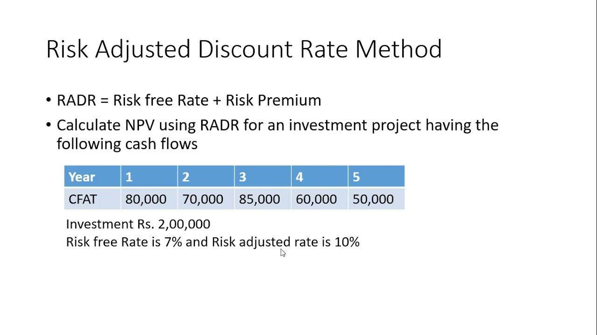

## Table of Contents

## What is a risk-adjusted discount rate?

A risk-adjusted discount rate is a way to figure out how much money you should expect to get back from an investment, considering how risky it is. Imagine you're deciding whether to put your money into a safe bank account or a new, untested business. The riskier the investment, the higher the discount rate you use. This means you expect a bigger reward for taking on more risk.

For example, if you're thinking about investing in a new tech startup, you know it could either make a lot of money or fail completely. Because it's risky, you would use a higher discount rate to calculate the present value of future earnings from that startup. This helps you compare it fairly with safer investments, like government bonds, which have a lower discount rate because they are less risky.

## Why is it important to use a risk-adjusted discount rate in financial analysis?

Using a risk-adjusted discount rate in financial analysis helps you make smarter decisions about where to put your money. It's like wearing glasses that let you see the true value of different investments. By adjusting the discount rate based on risk, you can compare a safe investment, like a savings account, with a risky one, like a new business. This way, you can see which one might give you a better return for the risk you're taking.

Without a risk-adjusted discount rate, you might think a risky investment is better just because it promises high returns. But if you don't account for the risk, you might be surprised when things don't go as planned. By using this method, you get a clearer picture of what your money could be worth in the future, helping you choose investments that match your comfort with risk and your financial goals.

## How does a risk-adjusted discount rate differ from a standard discount rate?

A standard discount rate is like a one-size-fits-all approach to figuring out how much money you'll get back from an investment over time. It's a fixed number that you use to calculate the present value of future cash flows, but it doesn't change based on how risky the investment is. For example, if you're looking at a government bond and a new tech company, a standard discount rate would treat them the same, even though one is much riskier than the other.

A risk-adjusted discount rate, on the other hand, changes depending on the risk of the investment. It's like a custom-fit tool that takes into account how likely it is that you'll actually get the money you're expecting. If an investment is risky, you'll use a higher discount rate to reflect that uncertainty. This means you'll expect a higher return to make up for the risk. So, when comparing a safe government bond to a risky tech startup, a risk-adjusted discount rate will show you a more accurate picture of what your money could be worth, helping you make a better decision.

## What are the common methods used to calculate a risk-adjusted discount rate?

One common way to calculate a risk-adjusted discount rate is by using the Capital Asset Pricing Model (CAPM). This method looks at how much risk an investment has compared to the whole market. It starts with a risk-free rate, like what you'd get from a government bond, and adds a bit more based on how much riskier your investment is. The extra part is called the risk premium, and it depends on how the investment moves with the market. If your investment is very different from the market, you'll add a bigger risk premium to your discount rate.

Another method is the Weighted Average Cost of Capital (WACC). This approach looks at all the ways a company gets money, like loans and stocks, and figures out the cost of each. Then, it mixes these costs together based on how much of each the company uses. The result is a discount rate that shows the overall risk of the company's investments. If the company has a lot of risky projects, the WACC will be higher, making the risk-adjusted discount rate higher too.

Sometimes, people also use the Build-Up Method. This method is like a recipe where you start with a risk-free rate and add different pieces of risk, like the risk of the market, the size of the company, and how easy it is to sell the investment. Each piece adds a bit more to the discount rate, making it higher if the investment is riskier. This method is useful when you want to look at all the different risks that could affect your investment.

## Can you explain the Capital Asset Pricing Model (CAPM) and its role in determining risk-adjusted discount rates?

The Capital Asset Pricing Model (CAPM) is a way to figure out how much extra return you should expect from an investment because of its risk. It starts with something called the risk-free rate, which is the return you'd get from a super safe investment like a government bond. Then, it adds a bit more, called the risk premium, based on how much riskier your investment is compared to the whole market. This risk premium depends on something called beta, which measures how much your investment's price moves with the market. If your investment goes up and down a lot more than the market, it has a high beta, and you'll add a bigger risk premium to your discount rate.

CAPM helps you find a risk-adjusted discount rate by showing you how much extra return you need to make the risk worth it. Let's say you're looking at a new tech startup. It's risky, so it has a high beta. Using CAPM, you'd start with the risk-free rate, then add a big risk premium because of the high beta. This gives you a higher discount rate for the startup than for a safer investment like a government bond. By using this higher discount rate, you can compare the startup's future cash flows to the bond's and see which one might give you a better return for the risk you're taking. This helps you make smarter investment choices.

## How do you incorporate different types of risk into the risk-adjusted discount rate?

To incorporate different types of risk into a risk-adjusted discount rate, you need to think about all the ways your investment could go wrong. For example, there's market risk, which is how much your investment moves with the whole market. If your investment goes up and down a lot more than the market, you'll want to use a higher discount rate. Then there's business risk, which is about how well the company is doing. If the company is new or in a tough industry, you'll add more to your discount rate to account for that risk. There's also financial risk, which comes from how the company pays for things, like with loans or stocks. If the company has a lot of debt, that's riskier, so you'll use a higher discount rate.

You can use different methods to put all these risks into your discount rate. The Capital Asset Pricing Model (CAPM) is one way, where you start with a safe, risk-free rate and then add more based on how your investment moves with the market. This gives you a discount rate that shows the market risk. The Weighted Average Cost of Capital (WACC) looks at all the ways a company gets money and mixes them together to find an overall discount rate that includes business and financial risk. The Build-Up Method is another way, where you start with the risk-free rate and add bits of risk for the market, the company's size, and how easy it is to sell the investment. Each method helps you see all the different risks and adjust your discount rate to match.

## What are the challenges and limitations of using risk-adjusted discount rates?

Using risk-adjusted discount rates can be tricky because it's hard to measure risk perfectly. You have to guess how risky an investment is, and different people might guess differently. For example, one person might think a new tech company is very risky, while another might see it as a great opportunity. This makes it hard to come up with a discount rate that everyone agrees on. Also, the methods we use, like the Capital Asset Pricing Model (CAPM) or the Weighted Average Cost of Capital (WACC), rely on past data and assumptions about the future. If the future turns out different from what we expected, our discount rate might be way off.

Another challenge is that risk-adjusted discount rates can make it hard to compare different types of investments. For instance, if you're looking at a safe government bond and a risky startup, the discount rates for each will be very different. This can make it tough to decide which one is a better choice because the numbers are based on different assumptions about risk. Plus, these methods often don't take into account all the possible risks, like sudden changes in the market or new laws. So, while risk-adjusted discount rates can help, they're not perfect and should be used carefully.

## How does the risk-adjusted discount rate affect the valuation of future cash flows?

The risk-adjusted discount rate helps you figure out what future money is worth today by considering how risky the investment is. Imagine you're expecting to get money from an investment in the future. If the investment is risky, like starting a new business, you'll use a higher discount rate. This means the value of that future money today will be lower because you're taking a bigger chance. On the other hand, if the investment is safe, like a government bond, you'll use a lower discount rate, making the value of that future money higher today.

Using a risk-adjusted discount rate helps you compare different investments fairly. For example, if you're choosing between a safe bank account and a risky new tech company, you need to see what the future money from each is worth today. The risky investment will have a higher discount rate, so its future cash flows will be worth less today. This way, you can see if the potential reward from the risky investment is worth the extra risk you're taking. It's like putting on glasses that let you see the true value of your money, helping you make better choices about where to invest.

## What industries or sectors typically use risk-adjusted discount rates, and why?

Many industries use risk-adjusted discount rates, but it's especially common in finance and investment sectors. Banks, investment firms, and venture capitalists use these rates to decide which projects or companies to invest in. They need to know how much risk they're taking and what kind of return they can expect. For example, a bank might use a risk-adjusted discount rate to compare a loan to a small business with a loan to a big company. The small business loan would have a higher discount rate because it's riskier, helping the bank see if the potential reward is worth it.

Another sector that often uses risk-adjusted discount rates is the energy industry, especially when looking at big projects like building new power plants or oil rigs. These projects are expensive and can be risky because they depend on things like the price of oil or new technology. Companies in this sector use risk-adjusted discount rates to figure out if the future money they expect to make from a project is worth the risk and cost today. It helps them decide whether to go ahead with a project or look for safer investments.

## How can changes in market conditions impact the risk-adjusted discount rate?

Changes in market conditions can make the risk-adjusted discount rate go up or down. If the market gets riskier, like during a big economic downturn or a time when people are unsure about what will happen next, investors will want a bigger reward for putting their money into risky investments. This means they'll use a higher discount rate to figure out what future money is worth today. On the other hand, if the market feels safer, like when the economy is doing well and everyone is confident, investors might be okay with a lower discount rate because they think the risk is smaller.

For example, if there's a sudden drop in stock prices or a big company goes bankrupt, investors might start to think that all investments are riskier. They'll use a higher risk-adjusted discount rate to account for this new uncertainty. This makes the value of future money from investments lower today because they're taking a bigger chance. But if the government steps in with new rules to make the market more stable, or if the economy starts growing again, investors might feel more confident and use a lower discount rate. This means the value of future money would be higher today because the risk seems smaller.

## What advanced techniques can be used to refine the calculation of risk-adjusted discount rates?

One advanced technique to refine the calculation of risk-adjusted discount rates is using Monte Carlo simulations. This method uses a computer to run lots of different scenarios to see how an investment might turn out. It takes into account many possible future events, like changes in the market or the economy, and shows you a range of possible outcomes. By looking at all these different possibilities, you can get a better idea of the risk and choose a discount rate that matches the real uncertainty of the investment. It's like looking at a weather forecast that shows you not just the average temperature but also the chance of rain or sunshine.

Another technique is to use real options analysis. This method treats investment decisions like options in the stock market, where you can choose to do something or wait and see. It's useful for projects where you can make changes as you go along, like deciding to expand a factory if it's doing well or stopping a project if it's not working out. Real options analysis helps you see the value of being able to change your mind and adjust your plans. By including these options in your calculations, you can set a discount rate that reflects not just the risk but also the flexibility you have to manage that risk. It's like playing a game where you can choose different paths depending on what happens.

## How do global economic factors influence the choice of risk-adjusted discount rates in multinational companies?

Global economic factors can really change how multinational companies pick their risk-adjusted discount rates. For example, if a country's economy is doing badly, with high inflation or a weak currency, companies will see that as riskier. They'll use a higher discount rate for investments in that country because they want a bigger reward for the extra risk. On the other hand, if a country's economy is strong and stable, companies might use a lower discount rate because the risk seems smaller. Things like interest rates set by central banks, trade policies, and even political stability can all affect how risky an investment seems and what discount rate a company should use.

Multinational companies also have to think about how different countries are connected. If one big economy, like the U.S. or China, has a problem, it can affect other countries too. This global connection means companies need to look at the big picture and adjust their discount rates based on what's happening all over the world. For instance, if there's a global financial crisis, companies might use higher discount rates everywhere because everything seems riskier. By considering these global factors, multinational companies can make better choices about where to invest their money and what kind of return they should expect.

## What is the understanding of Risk-Adjusted Discount Rates?

A risk-adjusted discount rate is a critical tool that modifies the market discount rate to [factor](/wiki/factor-investing) in the specific risk profile of an investment or project. This adjustment accounts for the uncertainties and potential fluctuations in expected cash flows, which are inherent in any investment decision. The concept is grounded in the foundational principle of finance that a higher level of risk necessitates a commensurate potential for return.

The relationship between risk and return is a cornerstone of modern financial theory, encapsulated in the premise that investors are inherently risk-averse. This aversion translates into a demand for higher expected returns to compensate for taking on additional risk. Essentially, risk-adjusted discount rates recognize that the value of money differs depending on the uncertainty associated with future cash flows.

To quantify this, the adjustment typically involves incorporating a risk premium into the discount rate. The risk premium represents the extra return required by investors to hold a risky asset over one deemed risk-free, such as government bonds. Mathematically, the risk-adjusted discount rate $r_a$ can be expressed as:

$$

r_a = r_f + \beta \times (r_m - r_f) 
$$

where:
- $r_f$ is the risk-free rate, representing the theoretical return of an investment with zero risk.
- $r_m$ is the expected market return.
- $\beta$ (beta) is a measure of the investment's volatility relative to the market, highlighting its systematic risk.

This formula embodies the Capital Asset Pricing Model (CAPM), which is frequently employed to calculate risk-adjusted rates. CAPM's utility lies in its ability to link the expected return of an asset to its risk relative to the broader market, providing a structured framework for assessing investment opportunities. By integrating the asset's beta, CAPM adjusts for the expected impact of market-wide movements on the asset's return, offering a precise mechanism for risk compensation.

Investors require this adjustment mechanism as a safeguard against the potential deviations in projected returns caused by market [volatility](/wiki/volatility-trading-strategies) and other risk factors. Understanding why investors demand these higher returns is critical for financial analysts who must ensure that investment valuations adequately reflect the risk-return trade-off. By employing risk-adjusted discount rates, analysts can achieve a more accurate assessment of an investment's worth, aligning expected returns with the underlying risk profile.

## How do you calculate risk-adjusted discount rates?

Risk-adjusted discount rates are crucial for accurately valuing investments by adequately reflecting the risks associated with them. A widely-used model to calculate these rates is the Capital Asset Pricing Model (CAPM). CAPM is built on the principle that the expected return on an investment needs to compensate investors for the risk-free rate plus an additional premium for taking on extra risk.

$$
E(R_i) = R_f + \beta_i (E(R_m) - R_f)
$$

Where:
- $E(R_i)$ is the expected return of the investment.
- $R_f$ is the risk-free rate, typically the yield on government securities.
- $\beta_i$ (beta) measures the sensitivity of the expected return of the asset to the returns of the market.
- $E(R_m)$ is the expected return of the market.

The beta (β) is a central element in CAPM, capturing an asset's correlation with overall market movements. A beta of 1 implies the asset moves in tandem with the market, while a beta less than 1 suggests less volatility, and a beta greater than 1 indicates more volatility than the market. For instance, a high-tech startup might have a beta higher than 1 due to its sector's inherent risk and volatility, necessitating a higher discount rate to reflect these factors.

The risk-free rate $R_f$ traditionally uses government bonds, reflecting essentially riskless opportunities in the market. In contrast, the market risk premium $E(R_m) - R_f$ accounts for the additional return demanded by investors to compensate for the risk of investing in an uncertain market as opposed to a stable government bond.

CAPM's straightforward assumption is that a higher beta leads to a risk-adjusted discount rate that compensates for the asset's market risk, thus aligning expected returns with the market's required returns. As a result, CAPM allows investors to calculate a suitable discount rate that incorporates the market's broader economic conditions and the asset's idiosyncratic risk profile.

To implement CAPM in Python, one could use a simple script to calculate the expected return for an asset:

```python
def calculate_expected_return(risk_free_rate, beta, expected_market_return):
    market_risk_premium = expected_market_return - risk_free_rate
    expected_return = risk_free_rate + beta * market_risk_premium
    return expected_return

# Example parameters
risk_free_rate = 0.02  # 2% risk-free rate
beta = 1.3            # Asset beta
expected_market_return = 0.08  # 8% expected market return

expected_return = calculate_expected_return(risk_free_rate, beta, expected_market_return)
print(f"The calculated expected return is: {expected_return:.2%}")
```

This simple formula and code demonstrate CAPM's utility in adjusting discount rates by quantifying the risk profile of an asset relative to the broader market. The calculated risk-adjusted discount rate ensures investors can better account for expected future volatility and achieve more precise risk compensation in their financial valuations.

## What are the factors influencing risk-adjusted rates?

Factors influencing risk-adjusted discount rates are multifaceted and stem from various aspects including macroeconomic conditions, industry-specific risks, and company-specific attributes. These elements are crucial for financial analysts and investors as they calibrate the discount rate to better reflect the risk profile of different investments.

### Macroeconomic Conditions

Macroeconomic variables such as interest rates, inflation, and GDP growth can significantly impact risk-adjusted discount rates. Central banks' monetary policies influence [interest rate](/wiki/interest-rate-trading-strategies) levels, altering the risk-free rate component in models like the Capital Asset Pricing Model (CAPM). For instance, higher interest rates typically increase the discount rate, which can affect the present value of future cash flows. Additionally, inflation expectations can lead to adjustments in discount rates to ensure that future cash flows are appropriately valued in real terms.

### Industry-Specific Risks

Each industry carries unique risk elements that influence risk-adjusted rates. Factors such as regulatory changes, technological advancements, and competitive dynamics contribute to sector-specific risks. For example, technology companies may face rapid obsolescence risks, while energy sectors could be more sensitive to regulatory changes regarding environmental policies. These industry characteristics require adjustments in discount rates to capture the higher risks associated with certain sectors.

### Company-Specific Attributes

The financial health and operational dynamics of a company also play a significant role in determining its risk-adjusted discount rate. Attributes such as the company’s leverage, cash flow stability, and management effectiveness must be considered. A company with higher leverage might necessitate a higher discount rate due to increased financial risk. Conversely, stable cash flows and strong management might mitigate the need for a substantial risk premium.

### Calculation and Adjustment

The interplay of these factors can be mathematically represented and calculated. For example, using the CAPM formula:

$$
\text{Expected Return} = R_f + \beta (R_m - R_f)
$$

Where:
- $R_f$ is the risk-free rate,
- $\beta$ measures the sensitivity of the asset's returns to market returns,
- $R_m$ is the expected market return.

Adjustments can be made to β to reflect industry-specific and company-specific risks not captured by the market as a whole. This requires careful analysis of both qualitative and quantitative data.

```python
# Example Python code to calculate risk-adjusted discount rate
def calculate_expected_return(risk_free_rate, beta, market_return):
    """
    Calculates the expected return using CAPM formula.

    Parameters:
    risk_free_rate (float): The risk-free rate
    beta (float): The asset's beta
    market_return (float): The expected market return

    Returns:
    float: Expected return
    """
    expected_return = risk_free_rate + beta * (market_return - risk_free_rate)
    return expected_return

# Example usage
risk_free_rate = 0.02  # 2% risk-free rate
beta = 1.5  # Hypothetical beta for the asset
market_return = 0.08  # 8% expected market return
expected_return = calculate_expected_return(risk_free_rate, beta, market_return)
```

### Conclusion

Understanding the factors that influence risk-adjusted discount rates is essential for accurate assessments in financial valuations and investment decisions. By considering macroeconomic conditions, industry-specific risks, and company-specific attributes, financial analysts can tailor discount rates to more accurately reflect the true risk associated with future cash flows. This allows for more informed decision-making and strategic investment planning.

## How does it compare with traditional discount rates?

Traditional discount rates serve as a fundamental tool in financial valuation by estimating the present value of future cash flows. These rates often derive from a market-standard, risk-free rate, typically using government bond yields as benchmarks, augmented by a universal risk premium. However, relying solely on traditional discount rates may overlook asset-specific risks and unique market conditions, leading to suboptimal investment choices.

Risk-adjusted discount rates address these limitations by incorporating an additional layer of analysis that factors in the distinct risks associated with individual investments. This tailored approach acknowledges that each investment possesses its own set of uncertainties and volatilities, thereby requiring an adjustment to the generic discount rate to reflect the asset's true risk profile. For instance, two projects with identical cash flow projections but different risk exposures will necessitate different discount rates to accurately reflect their expected returns.

The distinction between traditional and risk-adjusted discount rates can be illustrated through mathematical frameworks such as the Capital Asset Pricing Model (CAPM). The CAPM formula, given as:

$$

r = r_f + \beta (r_m - r_f) 
$$

where:
- $r$ is the expected return of the investment,
- $r_f$ is the risk-free rate,
- $\beta$ is the asset's beta coefficient representing its correlation with market movements,
- $r_m$ is the expected market return,

captures the essence of risk adjustment. In CAPM, the risk-adjusted rate includes the asset's beta coefficient, quantifying its systemic risk relative to the overall market, thus providing a more customized discount rate than the traditional approach.

By integrating risk-adjusted rates, investors and analysts achieve a more nuanced understanding of the investment's risk-return profile. This adaptation results in more informed decision-making and enhances the accuracy of financial evaluations. Strategies employing such detailed risk assessments allow for the differentiation between high-risk, high-return investments and those with lower risk but stable returns, fine-tuning portfolio management and strategic financial planning in dynamic market environments.

## How can one adjust for market volatility?

Market volatility significantly impacts the risk premium embedded in the discount rate, necessitating adjustments to accurately reflect the risk-return tradeoff of investments. During periods of high volatility, the risk premium needs to be increased to compensate investors for the additional uncertainty, whereas in stable market conditions, a lower risk premium may suffice.

To effectively adjust for market volatility, financial analysts and investors often employ statistical models like the Generalized Autoregressive Conditional Heteroskedasticity (GARCH) model. GARCH is particularly useful because it provides a framework for estimating and forecasting volatility, which is crucial for updating discount rates in line with market conditions.

The basic GARCH(1,1) model is represented as follows:

$$
\sigma_t^2 = \omega + \alpha \epsilon_{t-1}^2 + \beta \sigma_{t-1}^2
$$

Where:
- $\sigma_t^2$ is the conditional variance (volatility) at time $t$,
- $\omega$ is a constant,
- $\epsilon_{t-1}^2$ is the squared return shock from the previous period,
- $\alpha$ is the coefficient for past returns which captures the short-term volatility impact,
- $\beta$ is the lagged volatility coefficient which captures the long-term persistence of volatility.

In application, financial analysts use such models to dynamically adjust the discount rates by recalculating the risk premium as the market volatility evolves. Python offers efficient tools and libraries, such as `arch` and `statsmodels`, that facilitate the implementation of GARCH models. The following Python snippet demonstrates how to estimate volatility using GARCH:

```python
from arch import arch_model
import numpy as np

# Simulated returns data
returns = np.random.normal(0, 1, 1000) 

# Fit the GARCH(1,1) model
model = arch_model(returns, vol='Garch', p=1, q=1)
garch_fit = model.fit(disp='off')

# Forecast variance (volatility) for next period
forecast_volatility = garch_fit.forecast(horizon=1).variance.iloc[-1, 0]
print(f"Forecasted Volatility: {forecast_volatility}")
```

Incorporating GARCH-estimated volatility into discount rate adjustments enables financial professionals to maintain robust and resilient valuation methods, which are vital during unpredictable market conditions. Accurately capturing the dynamic nature of risk through these adjustments ensures that investment valuations remain aligned with the current economic environment. This ultimately leads to better-informed financial decisions and strategies that adequately reflect the risk profiles of investments.

## References & Further Reading

[1]: ["Capital Asset Pricing Model (CAPM) as a Robust Predictor of Stock Returns in the Indian Stock Market"](https://www.investopedia.com/terms/c/capm.asp) - Cogent Economics & Finance Journal

[2]: ["The Theory of Corporate Finance"](https://press.princeton.edu/books/hardcover/9780691125565/the-theory-of-corporate-finance) by Jean Tirole

[3]: ["Principles of Corporate Finance"](https://www.mheducation.com/highered/product/Principles-of-Corporate-Finance-Brealey.html) by Richard A. Brealey, Stewart C. Myers, and Franklin Allen

[4]: ["Options, Futures, and Other Derivatives"](https://www.amazon.com/Options-Futures-Other-Derivatives-4th/dp/0130224448) by John C. Hull

[5]: ["Financial Theory and Corporate Policy"](https://www.scribd.com/document/208718447/Financial-Theory-and-Corporate-Policy-3-Edition) by Thomas E. Copeland, J. Fred Weston, and Kuldeep Shastri