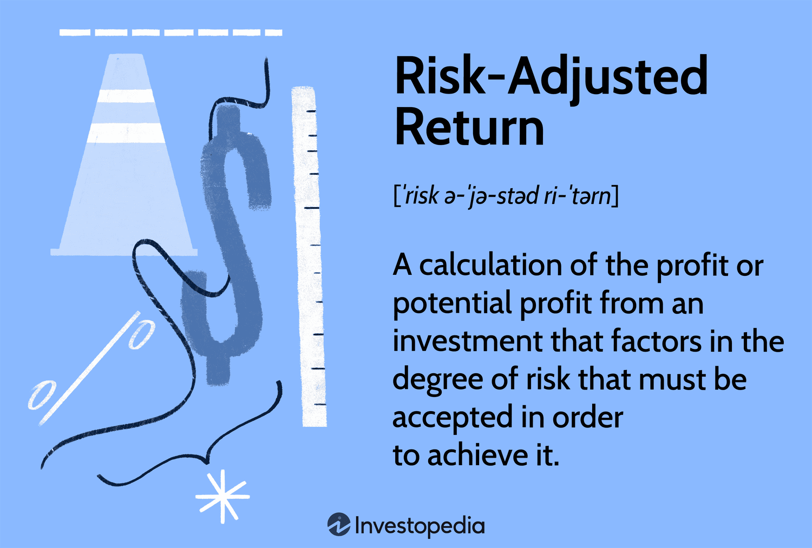

In the fast-paced world of finance, measuring investments accurately is crucial for success. Investors and financial analysts rely on a variety of financial metrics to assess the performance of their investments and to make informed decisions. These metrics provide insights into the risk and potential returns associated with different assets, helping investors to strategically allocate their resources for optimal outcomes.

Risk-adjusted returns have become a fundamental aspect of evaluating investment performance. This concept considers the level of risk involved in achieving certain returns, offering a more comprehensive view than merely assessing raw returns. By accounting for volatility and market fluctuations, risk-adjusted returns help investors understand whether the gains achieved justify the risks taken.



Algorithmic trading, commonly referred to as algo trading, is revolutionizing the application of these financial metrics. By utilizing complex algorithms and high-speed computing, traders can analyze vast quantities of data and execute trades with unprecedented precision and efficiency. This technological advancement has transformed trading strategies, enabling the real-time analysis and implementation of investment decisions based on both traditional and modern financial indicators.

This article covers several essential aspects of modern-day investing, including investment measurement, the utilization of financial metrics, the significance of risk-adjusted return, and the pivotal role of algorithmic trading in today's markets. As technology continues to advance, the integration and application of these concepts are expected to further reshape the financial landscape, necessitating that investors and traders adapt accordingly to harness these sophisticated tools for enhanced investment performance.

## Table of Contents

## Understanding Investment Measurement

Investment measurement entails the systematic evaluation of an investment's performance through various financial metrics. These metrics provide investors with essential insights into both the potential and actual performance of their assets, facilitating informed decision-making and the comparison of different investment opportunities. Key metrics employed in this process include return on investment (ROI), alpha, and beta, among others.

Return on investment (ROI) is one of the most straightforward financial metrics, capturing the profitability of an investment. It is calculated using the formula:

$$
\text{ROI} = \frac{\text{Net Profit}}{\text{Cost of Investment}} \times 100
$$

This metric offers a percentage that reflects the efficiency of an investment, allowing investors to gauge a project's profitability relative to its cost.

Alpha is another critical metric, representing the excess return of an investment relative to a benchmark index. It is expressed as:

$$
\alpha = R_i - (R_f + \beta(R_m - R_f))
$$

where $R_i$ is the portfolio return, $R_f$ is the risk-free rate, $\beta$ is the beta of the investment, and $R_m$ is the market return. A positive alpha indicates that the investment has outperformed the market, while a negative alpha signifies underperformance.

Beta measures an investment's [volatility](/wiki/volatility-trading-strategies) relative to the overall market. It is a component of the Capital Asset Pricing Model (CAPM) and is given by:

$$
\beta = \frac{\text{Cov}(R_i, R_m)}{\text{Var}(R_m)}
$$

where $\text{Cov}$ is the covariance between the investment return and the market return, and $\text{Var}$ is the variance of the market return. A beta greater than 1 indicates that the investment is more volatile than the market, while a beta less than 1 suggests lower volatility.

Investment measurement can be conducted manually, where investors calculate these metrics themselves, or through automated systems, particularly within the context of [algorithmic trading](/wiki/algorithmic-trading). In the latter, technology enables the swift computation and analysis of large volumes of data, thus assisting traders in making rapid and informed investment decisions. As financial markets evolve, the role of investment measurement becomes increasingly vital, ensuring that investors can identify and capitalize on opportunities while effectively managing risk.

## Financial Metrics Used in Investments

Several financial metrics are essential for evaluating investments, providing a quantitative basis to assess potential risks and returns. These metrics help investors understand how well an asset or investment portfolio performs relative to its risk level and market conditions.

The **Sharpe Ratio** is among the most widely used metrics, measuring the risk-adjusted return of an investment. It is calculated as the difference between the investment return and the risk-free rate, divided by the standard deviation of the investment return. The formula is:

$$
\text{Sharpe Ratio} = \frac{R_i - R_f}{\sigma_i}
$$

where $R_i$ is the average return of the investment, $R_f$ is the risk-free rate, and $\sigma_i$ is the standard deviation of the investment returns. A higher Sharpe Ratio indicates more return per unit of risk.

**Alpha** represents an investment's performance relative to a benchmark index. It measures the value that a portfolio manager adds or subtracts from a fund's return. A positive alpha indicates that the investment has outperformed the benchmark, while a negative alpha suggests underperformance. The calculation of alpha is given by:

$$
\alpha = R_i - [R_f + \beta(R_m - R_f)]
$$

where $R_m$ is the market return and $\beta$ is the beta of the investment.

**Beta** assesses an investment's volatility relative to the overall market. A beta of 1 indicates that the investment's price is expected to move with the market. A beta greater than 1 signifies greater volatility, while a beta less than 1 indicates lower volatility. Beta is calculated as:

$$
\beta = \frac{\text{Cov}(R_i, R_m)}{\text{Var}(R_m)}
$$

where $\text{Cov}(R_i, R_m)$ is the covariance between the investment returns and market returns, and $\text{Var}(R_m)$ is the variance of the market returns.

The **Treynor Ratio** is similar to the Sharpe Ratio but considers portfolio beta as the risk measure instead of standard deviation. The formula is:

$$
\text{Treynor Ratio} = \frac{R_i - R_f}{\beta}
$$

This ratio is useful for understanding the returns earned in excess of what could have been earned on a risk-free investment per unit of market risk.

Another metric is the **Sortino Ratio**, which further refines risk assessment by focusing on downside volatility. Unlike the Sharpe Ratio, it penalizes only negative returns, offering a more nuanced view of risk-adjusted performance. The formula for the Sortino Ratio is:

$$
\text{Sortino Ratio} = \frac{R_i - R_f}{\sigma_d}
$$

where $\sigma_d$ is the standard deviation of negative asset returns.

Each of these metrics plays a crucial role in investment decision-making, providing insights into an asset's risk, return, and performance relative to market conditions. Employing these metrics enables investors to optimize portfolio strategies and align investment choices with their risk tolerance and return objectives.

## Risk-Adjusted Return: A Crucial Metric

Risk-adjusted return is a fundamental metric in evaluating the performance of an investment relative to the risk involved. These metrics provide insights into whether the returns generated from an investment adequately compensate for the risk taken. One popular way to gauge this balance is by using the Sharpe Ratio, defined as:

$$
\text{Sharpe Ratio} = \frac{R_p - R_f}{\sigma_p}
$$

where $R_p$ is the expected portfolio return, $R_f$ is the risk-free rate, and $\sigma_p$ is the standard deviation of the portfolio’s excess return. The Sharpe Ratio quantifies the additional return received per unit of risk, serving as a guide to assess if a portfolio's returns are due to smart investment decisions or excessive risk.

Another critical metric is the Treynor Ratio, which, unlike the Sharpe Ratio, uses beta ($\beta$) instead of standard deviation:

$$
\text{Treynor Ratio} = \frac{R_p - R_f}{\beta_p}
$$

where $\beta_p$ represents the portfolio’s beta, indicating its sensitivity to market movements. The Treynor Ratio is particularly useful for investors holding diversified portfolios as it relates returns to market risk.

These metrics become essential when comparing investments with similar return profiles but varying levels of risk. By assessing risk-adjusted returns, investors can determine which option provides better compensation for risk, aiding in the construction of diversified portfolios aimed at optimizing returns without unduly increasing risk exposure.

Risk-adjusted return metrics such as the Sharpe and Treynor Ratios enable investors to systematically evaluate investment opportunities and strategically manage portfolios. Through careful analysis, they lay the groundwork for making informed decisions that balance potential risks and rewards effectively.

## Algorithmic Trading

Algorithmic trading, commonly known as algo trading, utilizes computer algorithms to execute trades based on predetermined criteria. Leveraging the power of computing, these algorithms can analyze large volumes of data and execute trades at speeds unattainable by human traders. This rapid processing capability allows for precise timing and sizing of trades, which is crucial in optimizing investment outcomes. Algorithms are programmed to follow specific rules, such as identifying patterns, executing trades when certain conditions are met, or adjusting investment strategies in response to market changes.

In financial markets where speed and accuracy are paramount, algo trading enhances the application of financial metrics, including risk-adjusted return calculations. By swiftly processing vast datasets, algorithms can facilitate a more efficient use of metrics like the Sharpe Ratio or beta, ensuring that trades align with desired risk-reward profiles. This capability not only aids in better decision-making but also supports risk management strategies by enabling real-time assessments and adjustments.

Algo trading also opens up opportunities for sophisticated techniques involving statistical analysis, quantitative modeling, and [machine learning](/wiki/machine-learning). For instance, Python libraries such as NumPy and pandas can be utilized to develop complex trading models that dynamically adapt to changing market conditions. As algo trading continues to evolve, its influence grows, making it increasingly standard in both institutional and retail trading arenas due to its efficiency and precision.

```python
# Example of a simple moving average crossover strategy in Python
import numpy as np
import pandas as pd

# Function to implement moving average crossover strategy
def moving_average_crossover(prices, short_window=40, long_window=100):
    signals = pd.DataFrame(index=prices.index)
    signals['signal'] = 0.0

    # Create short and long simple moving averages
    signals['short_mavg'] = prices.rolling(window=short_window, min_periods=1, center=False).mean()
    signals['long_mavg'] = prices.rolling(window=long_window, min_periods=1, center=False).mean()

    # Generate trading signals: when short MA surpasses long MA, buy (+1), else sell (-1)
    signals['signal'][short_window:] = np.where(signals['short_mavg'][short_window:] > signals['long_mavg'][short_window:], 1.0, -1.0)

    # Calculate the trading positions
    signals['positions'] = signals['signal'].diff()

    return signals

# Sample usage with a time series of prices
# prices = pd.Series([...])  # Replace with actual price data
# signals = moving_average_crossover(prices)
```

As algo trading becomes more deeply ingrained in financial markets, its practices continue to adapt, leveraging advances in computing to drive ever more efficient markets. This integration of sophisticated algorithms and real-time data processing ensures its continued prevalence and growth.

## Integrating Financial Metrics with Algo Trading

Financial metrics play a critical role in the development and execution of algorithmic trading strategies. By leveraging these metrics, traders design algorithms to enhance risk-adjusted returns, thereby optimizing investment outcomes.

Traders harness key financial indicators, such as the Sharpe Ratio, alpha, and beta, to construct algorithms that aim to improve portfolio performance. For example, the Sharpe Ratio, which assesses the return per unit of risk, can be integrated into algorithms to select assets that maximize returns while minimizing volatility. Python and other programming languages provide ample libraries and frameworks for implementing these metrics into trading algorithms. A simple Python function for calculating the Sharpe Ratio might look like this:

```python
import numpy as np

def sharpe_ratio(returns, risk_free_rate=0):
    excess_returns = returns - risk_free_rate
    return np.mean(excess_returns) / np.std(excess_returns)
```

The ability to process real-time data is a significant benefit of algorithmic trading, allowing for dynamic adjustment of trading strategies as market conditions change. Traders can exploit this capability to respond swiftly to new information, adjusting their algorithms to reduce risks or seize emerging opportunities. Real-time analytics platforms and APIs enable the continuous flow of data, which is essential for algorithms that require up-to-the-second accuracy.

Algorithmic trading also benefits from advancements in [artificial intelligence](/wiki/ai-artificial-intelligence) (AI) and machine learning, increasing the precision of predictive models. These technologies analyze vast datasets to identify patterns not easily discernible by human traders. Machine learning models can continuously learn and improve their predictions, allowing for more sophisticated risk assessments and informed trading decisions.

For instance, AI algorithms can predict price movements by analyzing historical data, incorporating factors such as trading [volume](/wiki/volume-trading-strategy), sentiment analysis from news articles, and macroeconomic indicators. The integration of AI and machine learning into algo trading assists in developing adaptive strategies that evolve with market conditions, enhancing both profitability and risk management.

Effective risk management is intrinsic to maximizing investment performance. Algorithmic trading utilizes financial metrics not only for performance enhancement but also for mitigating potential losses. By continuously evaluating risk-adjusted returns, algorithms can rebalance portfolios, hedge positions, and implement stop-loss orders, ensuring that the risk exposure remains within the trader's threshold.

In summary, integrating financial metrics with algorithmic trading is pivotal for constructing robust trading strategies that maximize risk-adjusted returns, adapt to real-time data, and leverage the computational power of AI and machine learning. As the financial markets advance, these integrative approaches remain indispensable tools for skilled traders aiming to optimize their investment performance.

## Conclusion

Effective investment measurement requires the diligent use of financial metrics, which serve as the backbone for evaluating and optimizing investment performance. Financial metrics enable investors to gauge both the returns and the risk associated with their investment decisions. Among the various metrics, risk-adjusted returns, such as the Sharpe Ratio, provide a comprehensive view by balancing potential gains against the risks assumed. This approach allows investors to ensure that the levels of risk undertaken are justifiable with the returns achieved, thereby facilitating informed decision-making.

Algorithmic trading further enhances the application of these metrics, as it employs computer algorithms designed to execute trades based on predetermined rules and financial data. The precision and efficiency offered by algorithms bolster the decision-making process by enabling timely and data-driven trading actions, maximizing the potential for achieving optimal investment outcomes. Algorithms can be programmed to utilize financial metrics dynamically, adjusting strategies in real time as market conditions fluctuate, thereby maintaining a constant focus on maximizing risk-adjusted returns.

As technology advances, the integration of financial metrics and algorithmic trading will continue to transform financial markets, introducing levels of precision and adaptability hitherto impossible. Investors and traders must stay abreast of these technological developments and incorporate them into their strategies to leverage these advanced tools effectively. The adaptability and meticulous application of financial metrics will be essential to achieving and maintaining optimized investment returns in a fast-evolving market landscape.

To exemplify the application of algorithmic trading, consider a Python script that calculates risk-adjusted returns:

```python
import numpy as np

def calculate_sharpe_ratio(returns, risk_free_rate=0):
    # Assuming returns are in percentage
    returns = np.array(returns) / 100
    excess_returns = returns - risk_free_rate
    return np.mean(excess_returns) / np.std(excess_returns)

# Example usage
historical_returns = [5, 10, -2, 7, 3]  # Example returns in percentage
sharpe_ratio = calculate_sharpe_ratio(historical_returns, risk_free_rate=0.02)
print(f"Sharpe Ratio: {sharpe_ratio}")
```

This simple algorithm demonstrates how risk-adjusted metrics can be programmatically calculated and potentially integrated into a broader trading strategy. Investors and traders must capitalize on these technological capabilities, continuously enhancing their methodologies to ensure competitive and profitable participation in financial markets.

## References & Further Reading

[1]: Bergstra, J., Bardenet, R., Bengio, Y., & Kégl, B. (2011). ["Algorithms for Hyper-Parameter Optimization."](https://papers.nips.cc/paper/4443-algorithms-for-hyper-parameter-optimization) Advances in Neural Information Processing Systems 24.

[2]: ["Advances in Financial Machine Learning"](https://www.amazon.com/Advances-Financial-Machine-Learning-Marcos/dp/1119482089) by Marcos Lopez de Prado

[3]: ["Evidence-Based Technical Analysis: Applying the Scientific Method and Statistical Inference to Trading Signals"](https://www.amazon.com/Evidence-Based-Technical-Analysis-Scientific-Statistical/dp/0470008741) by David Aronson

[4]: ["Machine Learning for Algorithmic Trading"](https://github.com/stefan-jansen/machine-learning-for-trading) by Stefan Jansen

[5]: ["Quantitative Trading: How to Build Your Own Algorithmic Trading Business"](https://www.amazon.com/Quantitative-Trading-Build-Algorithmic-Business/dp/1119800064) by Ernest P. Chan