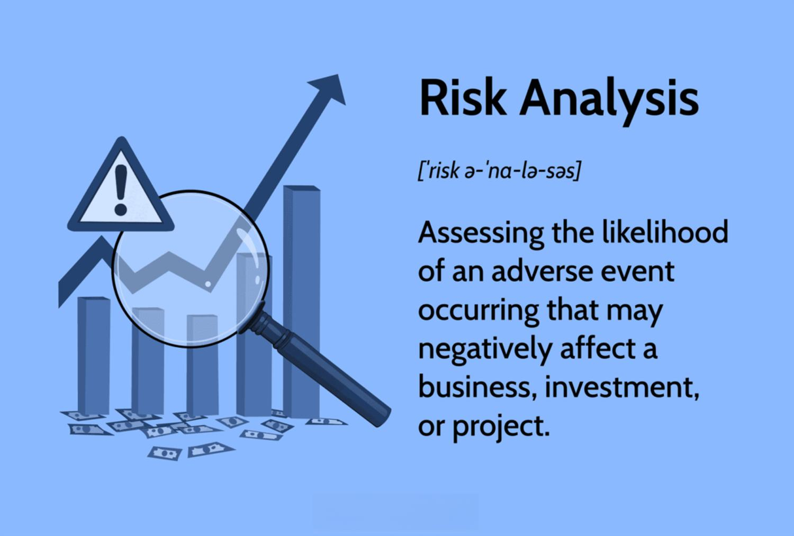

Algorithmic trading has fundamentally transformed the financial markets. By leveraging mathematical models and complex algorithms, it automates trade execution, resulting in faster and more efficient transactions. This technological advancement allows traders to capitalize on fleeting market opportunities that are imperceptible to human traders due to their speed and complexity. However, alongside these advantages, the increased use of algorithms introduces a unique set of challenges, particularly around risk.

Risk analysis and management are integral to the creation and maintenance of successful algorithmic trading strategies. At its core, risk analysis involves identifying potential negative outcomes that could impact investment returns and devising strategies to mitigate such impacts. For algorithmic trading, the scope of risk extends beyond traditional issues faced in manual trading, including market, operational, model, and liquidity risks. Each presents its own complexities and demands specific measures to manage effectively.



The complexity and dynamic nature of financial markets necessitate a robust approach to risk analysis. Historical data, often used as the backbone of risk assessments, can be leveraged to predict future scenarios and inform strategic decisions. Nonetheless, the unpredictable nature of markets means past performance does not always guarantee future results, and risk models need continual updates to remain relevant.

This article will explore the intricacies of risk analysis and management in algorithmic trading, shedding light on the key types of risks involved, the inherent limitations of risk analysis, and the best practices for effective risk management. By examining these elements, traders can better equip themselves to navigate the risks associated with algorithmic trading and enhance their trading algorithms' resilience.

## Table of Contents

## Understanding Risk Analysis

Risk analysis in trading is a critical process aimed at evaluating the potential for negative outcomes that could impact investments or trading strategies. This involves identifying, assessing, and prioritizing risks in order to mitigate potential financial losses. The analysis typically employs both qualitative and quantitative methodologies, each offering distinct advantages and limitations.

Qualitative risk analysis often involves subjective judgment, informed by experience and expert opinion. It assesses risks based on qualitative measures, such as high, medium, or low likelihood and impact. This approach is beneficial in scenarios where precise data may be lacking but can fall short in terms of predictive accuracy due to its subjective nature.

Quantitative risk analysis, on the other hand, involves numerical measures and statistical methods to evaluate risk. This approach calculates risk metrics, such as Value at Risk (VaR), which estimates the maximum potential loss over a given period at a specific confidence interval. Quantitative methods benefit from their objectivity and the ability to handle large datasets, but they require accurate inputs and models to be effective. Additionally, they might not fully capture the complexity of non-linear relationships and rare events.

Risk analysts often use forecasting techniques and historical data analysis to predict and manage potential risks. This involves leveraging time-series analysis and [machine learning](/wiki/machine-learning) algorithms to detect patterns and forecast future market behaviors. For example, analysts might use a historical simulation approach where past market data is used to simulate future risk scenarios.

A basic Python implementation to calculate Value at Risk (VaR) using historical simulation might look like this:

```python
import numpy as np

def historical_var(data, confidence_level=0.95):
    """
    Calculate Value at Risk (VaR) using historical simulation.

    Parameters:
    data (list or np.array): Historical returns of the asset or portfolio.
    confidence_level (float): Confidence level for the VaR.

    Returns:
    float: VaR at the specified confidence level.
    """
    sorted_data = np.sort(data)
    index = int((1 - confidence_level) * len(sorted_data))
    return abs(sorted_data[index])

# Sample usage
historical_returns = np.random.normal(0, 1, 1000)  # Simulated historical returns
var = historical_var(historical_returns, confidence_level=0.95)
print("Value at Risk (VaR):", var)
```

This code snippet demonstrates a simple way to estimate potential losses based on historical returns, providing a foundation for understanding risk exposure.

Risk analysis is indispensable in [algorithmic trading](/wiki/algorithmic-trading), where analysts strive to preemptively identify risks and adapt strategies accordingly. By combining both qualitative insights and quantitative rigor, risk analysts aim to develop robust frameworks that can withstand adverse market conditions, ultimately safeguarding investments and enhancing long-term financial outcomes.

## Key Types of Risks in Algorithmic Trading

Algorithmic trading has transformed financial markets by increasing the speed and efficiency of trade execution. However, the automation and complexity inherent in these algorithms introduce various types of risks that need careful management. Understanding these risks and their implications is crucial for developing robust trading strategies.

**Market Risk**  
Market risk refers to the potential losses due to factors affecting the entire market, such as economic events or political instability. This risk is characterized by price [volatility](/wiki/volatility-trading-strategies), resulting in the fluctuation of asset prices. In algorithmic trading, market risk is particularly significant because algorithms operate continuously and at high speeds, potentially exacerbating the impact of rapid price changes.

**Operational Risk**  
This risk comes from system failures, programming errors, or human mistakes that can disrupt trading operations. In algorithmic trading, operational risk is heightened due to the reliance on complex systems for trade execution. For example, a malfunctioning server or a programming bug can cause significant financial losses if trades are executed incorrectly or not at all. Mitigating operational risk requires robust infrastructure and rigorous testing of algorithms before deployment.

**Model Risk**  
Model risk arises when algorithms make decisions based on flawed assumptions or incorrect model frameworks. This risk is particularly pertinent in algorithmic trading since strategies often depend heavily on mathematical models to predict market movements. A model that fails to accurately capture market dynamics can lead to poor decision-making and financial loss. Managing model risk involves regular [backtesting](/wiki/backtesting) and validation of algorithms using diverse historical data.

**Liquidity Risk**  
Liquidity risk is associated with the difficulty of executing large trades without significantly affecting the market price. In algorithmic trading, this risk becomes more pronounced when dealing with high-frequency trading strategies that require quick entry and [exit](/wiki/exit-strategy) from positions. Insufficient [liquidity](/wiki/liquidity-risk-premium) can lead to slippage, where the security is bought or sold at a price different from expected. To manage liquidity risk, traders must carefully analyze market depth and ensure their strategies are adaptable to varying liquidity conditions.

In summary, market, operational, model, and liquidity risks are critical considerations in algorithmic trading. Addressing these risks involves a combination of robust systems, thorough testing, and adaptive strategies to ensure successful trading outcomes.

## Limitations of Risk Analysis in Algorithmic Trading

Risk analysis in algorithmic trading heavily depends on historical data to create predictive models; however, this reliance can be problematic when predicting unprecedented market conditions. Historical data provides insights into past behaviors, but financial markets are influenced by myriad factors that may not have occurred before, posing significant challenges to risk prediction models. 

Models designed for risk analysis often struggle to accurately gauge the likelihood and impact of high-consequence, low-probability events, commonly known as black swan events. These unpredictable occurrences can have drastic effects on markets, as seen during events like the 2008 financial crisis. Standard risk models typically assume normal market conditions, often failing to include extreme outliers. For example, models might use a normal distribution to assess risk, which inherently downplays the probability of tail events:

$$
P(X > x) \approx \frac{1}{\sqrt{2\pi}\sigma} \int_{x}^{\infty} e^{-\frac{(t-\mu)^2}{2\sigma^2}} dt
$$

In this context, the assumption that market returns follow a normal distribution (with mean $\mu$ and standard deviation $\sigma$) can grossly underestimate the tails of the distribution, leading traders to be underprepared for rare but impactful events.

The dynamic nature of financial markets means that risk metrics require constant updates, a process that can be resource-intensive. Algorithmic trading systems must continuously absorb new information, requiring substantial computational resources to update risk models in real time. This necessity adds complexity and cost, as traders not only need sophisticated computational systems but also a robust framework for continuous model validation and recalibration.

Moreover, implementing these updates introduces the challenge of risk model validation and potential model overfitting, where a model might perform exceptionally well on historical data but poorly under unexpected conditions. The computational demand further strains resources, challenging firms to maintain a balance between accuracy and efficiency in their risk assessments.

In conclusion, while historical data serves as the backbone of risk analysis frameworks, the inability to predict unprecedented conditions, coupled with the need for constant updates, highlights the significant limitations faced by algorithmic trading systems in managing risk effectively. Addressing these issues requires innovative approaches and continuous adaptation of risk management practices to enhance model resilience and accuracy.

## Risk Management Strategies in Algorithmic Trading

Algorithmic trading presents a variety of risk management strategies aimed at reducing exposure to potential market adversities. One fundamental strategy is the implementation of stop-loss orders. These orders automatically sell a security when it reaches a certain price, preventing further loss by limiting the downside. For instance, if a stock is purchased at $100, a stop-loss order might be set at $95, ensuring the maximum loss is capped at 5% of the investment.

Another critical strategy is hedging through options and futures. Hedging involves taking an opposing position in a related security to offset the risk of adverse price movements. Options provide the right, but not the obligation, to buy or sell an asset at a predetermined price, allowing traders to protect against unfavorable movements while retaining the potential for profit. Futures contracts, on the other hand, obligate the purchase or sale of an asset at a future date and price, offering traders a method to lock in prices and mitigate risk.

Machine learning has become increasingly valuable for enhancing risk prediction and conducting real-time data analysis. Algorithms can be trained on vast datasets to identify patterns and predict market movements with greater accuracy. Python, with libraries such as SciKit-learn and TensorFlow, is frequently used to build and deploy these models. For example, a model using historical price data and technical indicators could be structured as follows:

```python
from sklearn.ensemble import RandomForestRegressor
from sklearn.model_selection import train_test_split
from sklearn.metrics import mean_squared_error

# Assuming X is the feature set and y is the target variable
X_train, X_test, y_train, y_test = train_test_split(X, y, test_size=0.2, random_state=42)

# Initialize the model
model = RandomForestRegressor(n_estimators=100, random_state=42)

# Train the model
model.fit(X_train, y_train)

# Predict and evaluate
predictions = model.predict(X_test)
mse = mean_squared_error(y_test, predictions)
print(f'Mean Squared Error: {mse}')
```

Continual backtesting under diverse market conditions is paramount for improving model robustness. Backtesting involves applying trading algorithms to historical data to evaluate their performance. Inconsistencies or failures in past scenarios can provide insights into the necessary adjustments before deployment in live trading environments.

The integration of these strategies in algorithmic trading systems not only enhances the accuracy and precision of trades but also builds resilience against market volatility. By employing a combination of stop-loss orders, hedging, machine learning, and rigorous backtesting, algorithmic traders can develop strategies that are well-equipped to navigate the complex landscape of financial markets.

## The Importance of Stress Testing

Stress testing in algorithmic trading is a crucial methodological practice used to evaluate the resilience of trading algorithms under extreme market conditions. It involves subjecting algorithms to a variety of hypothetical adverse scenarios to identify potential vulnerabilities and ensure that they can withstand financial shocks. This practice is vital for mitigating risks that standard risk management techniques might overlook.

One of the primary approaches to stress testing is scenario analysis. This involves creating simulated environments based on historical crises or hypothetical events to assess how trading algorithms would perform. For instance, traders may simulate events similar to the 2008 financial crisis, sudden [interest rate](/wiki/interest-rate-trading-strategies) hikes, or geopolitical tensions to observe the potential impacts on their trading strategies. Through these simulations, traders can identify weaknesses in their algorithms and adjust their models accordingly to enhance resiliency.

Monte Carlo simulations are another valuable tool for stress testing in algorithmic trading. This statistical method uses repeated random sampling to model the probability of different outcomes in a process that cannot easily be predicted due to the intervention of random variables. In the context of algorithmic trading, Monte Carlo simulations can generate thousands of potential market scenarios, allowing traders to evaluate the potential risk exposures and the expected returns or losses under various conditions. The formula for a simple Monte Carlo simulation might look like:

$$
V = \frac{1}{N} \sum_{i=1}^{N} f(X_i)
$$

where $V$ is the estimated value, $N$ is the number of simulations, and $f(X_i)$ represents the outcome of interest in the $i^{th}$ simulation scenario. In trading, $f(X_i)$ could represent the profit or loss condition of a particular trading strategy under various simulated market scenarios.

Python can be particularly useful for running such simulations, given its powerful libraries like NumPy and pandas for numerical computations and data manipulation. Here is an example of a simple Monte Carlo simulation in Python:

```python
import numpy as np

# Define parameters
num_simulations = 10000
initial_investment = 100000
mean_return = 0.07
volatility = 0.2
time_horizon = 1  # one year

# Run simulations
simulated_returns = np.random.normal(mean_return, volatility, num_simulations)
final_values = initial_investment * (1 + simulated_returns)

# Calculate risk measures
expected_value = np.mean(final_values)
risk_of_loss = np.sum(final_values < initial_investment) / num_simulations

print(f"Expected Value after 1 year: ${expected_value:,.2f}")
print(f"Probability of loss: {risk_of_loss * 100:.2f}%")
```

Incorporating stress testing ensures that algorithms are not only optimized for everyday market conditions but are also robust enough to handle rare but catastrophic events. This proactive approach to risk management enables traders to build more resilient trading systems, ultimately protecting investments from unforeseen adversities in the financial markets.

## Continuous Monitoring and Adaptation

Continuous monitoring and adaptation are critical components in algorithmic trading, ensuring that trading strategies remain robust and responsive to market changes. The core principle of continuous monitoring is the real-time analysis of data to enable swift adjustments to the algorithms deployed in trading. Such surveillance allows traders to respond promptly to various market conditions, which can fluctuate rapidly and unpredictably.

Real-time data analysis is achieved through the integration of advanced computational tools and techniques. These tools process large volumes of data continuously, allowing algorithms to adjust trading parameters dynamically. For instance, latency, defined as the delay before a data packet is transferred following an instruction, can be minimized through optimized network protocols and hardware, ensuring decisions are made based on the most current data available.

Adaptive strategies are essential for maintaining the effectiveness of an algorithm amidst market volatility. These strategies typically include mechanisms for automated decision-making adjustments based on predefined metrics and conditions. For example, a machine learning model could be integrated to predict future price movements, thereby informing the algorithm whether to buy, sell, or hold a security based on anticipated trends.

One approach to adaptive strategies is through [reinforcement learning](/wiki/reinforcement-learning), a subset of machine learning where algorithms learn optimal actions through trial and error. Here is a basic Python example using a hypothetical trading signal:

```python
import numpy as np

def trading_strategy(market_data):
    # Hypothetical reinforcement learning algorithm
    actions = ["buy", "sell", "hold"]
    state = get_market_state(market_data)
    action = choose_optimal_action(state, actions)
    return action

def get_market_state(market_data):
    # Extract features from market data
    return np.random.choice(["bullish", "bearish", "neutral"])

def choose_optimal_action(state, actions):
    # Dummy function for choosing action based on state
    return np.random.choice(actions)

# Simulate real-time market data input
real_time_data = fetch_real_time_market_data()
action = trading_strategy(real_time_data)
```

In this example, `trading_strategy` employs a simplistic model where the choice of action (whether to buy, sell, or hold) depends on the detected market state.

Furthermore, continuous monitoring enables the detection of anomalies or unexpected market behaviors, which can prompt the algorithm to pause or enact risk management protocols. For instance, when encountering an anomaly, the system may trigger an alert for human oversight or automatically switch to a more conservative trading strategy.

The ability to adapt effectively relies on robust infrastructure and continuous system upgrades. Regular system checks and updates ensure that the trading environment is fortified against potential threats and inefficiencies. Keeping systems updated involves incorporating the latest technology in data processing, machine learning frameworks, and market surveillance tools to sustain competitive advantage in the fast-paced environment of financial markets.

In conclusion, continuous monitoring and adaptive strategies form the backbone of resilient algorithmic trading systems, enabling them to capitalize on fleeting opportunities while safeguarding against potential market adversities.

## Regulatory Compliance and Ethical Considerations

Algorithmic trading platforms operate in a highly regulated environment that mandates strict compliance with financial regulations to minimize legal repercussions. Ensuring adherence to these standards is crucial for maintaining market integrity and protecting investor interests. Regulators such as the U.S. Securities and Exchange Commission (SEC), the Commodity Futures Trading Commission (CFTC), and the European Securities and Markets Authority (ESMA) set forth guidelines that algorithmic trading practices must follow. These include transparency requirements, audit trails, and pre-trade risk controls to prevent market manipulation and ensure fair trading practices.

Regulatory frameworks like the Markets in Financial Instruments Directive (MiFID II) in Europe demand high levels of disclosure and reporting, which include rigorous testing and validation of algorithms. Compliance with such regulations entails not only fitting within the prescribed legal boundaries but also ensuring systems are robust against potential disruptions or cyber threats. Regular updates and audits of trading algorithms are essential to guarantee they operate within the established ethical and legal frameworks.

Beyond regulatory compliance, ethical considerations play a vital role in the landscape of algorithmic trading. Ethical algorithmic trading involves implementing strategies that avoid exploiting inefficiencies or engaging in high-frequency trading behaviors that could unfairly disadvantage other market participants. High-frequency trading ([HFT](/wiki/high-frequency-trading-strategies)), for example, can sometimes create an uneven playing field; thus, ethical guidelines suggest maintaining transparency and fairness to avoid reinforcing systemic inequalities.

Moreover, trading algorithms should be designed to avoid unintended consequences that may arise from complex market interactions. This may include ensuring that the algorithms do not inadvertently trigger cascading failures or exacerbate market volatility during times of stress. Ethical considerations also address concerns over market fairness, favoring practices that do not manipulate markets or contribute to flash crashes.

In summary, achieving regulatory compliance in algorithmic trading requires attention to detailed legal and ethical guidelines designed to protect market order and fairness. Institutions must manage a delicate balance between leveraging the technological edge provided by algorithmic strategies and adhering to the ethical standards that foster trust and integrity in the financial marketplaces.

## Case Studies: Successful Risk Management in Algorithmic Trading

Examining historical crises in algorithmic trading can provide valuable insights into effective risk management practices. A notable instance is the "Flash Crash" of May 6, 2010, when the Dow Jones Industrial Average plunged about 1,000 points within minutes, only to recover a significant portion shortly after. The event underscored vulnerabilities in algorithmic trading systems and the necessity for robust risk mitigation strategies. One key insight from the Flash Crash was the importance of incorporating circuit breakers, which temporarily halt trading to prevent panic-selling and further market destabilization. This incident highlighted how high-frequency trading algorithms, interacting almost instantaneously with market signals, can exacerbate volatility.

Another significant lesson in risk management comes from the 2007-2008 financial crisis, which revealed the limitations of relying solely on historical data and models that underestimated the frequency and impact of extreme market conditions. This led to a broader acceptance of stress testing and scenario analysis as essential components of risk assessment in algorithmic trading. By simulating a wide range of adverse market conditions, traders can better understand the potential impacts on their portfolios and adjust their strategies accordingly.

Leading algorithmic trading firms, such as Renaissance Technologies and Two Sigma, have employed successful risk mitigation strategies that could serve as models for other market participants. Renaissance Technologies, for instance, is known for its intensive data analysis and machine learning techniques. By leveraging vast data sets and advanced algorithms, the firm manages to identify market patterns and anomalies while effectively managing risk. Their approach emphasizes the development of resilient algorithms designed to anticipate and adapt to changing market conditions, thereby reducing exposure to sudden market movements.

Two Sigma employs a similar approach with a strong focus on data-driven strategies and the application of [artificial intelligence](/wiki/ai-artificial-intelligence). By continuously refining their models and incorporating vast amounts of structured and unstructured data, Two Sigma enhances the predictive power of its algorithms. Additionally, the firm places a significant emphasis on diversification—spreading investments across a wide range of assets and markets to minimize risk concentration.

These successful firms illustrate the critical role of technology and data in crafting effective risk management practices in algorithmic trading. The combination of rigorous data analysis, machine learning, stress testing, and diversification strategies serves as a comprehensive approach to mitigating risk, ensuring algorithmic systems remain robust even during volatile market conditions. As the landscape of algorithmic trading continues to evolve, these practices will be crucial for maintaining stability and safeguarding investments.

## Conclusion

Risk analysis in algorithmic trading is a complex but essential process to safeguard investments. Algorithmic trading leverages advanced computational techniques and strategies to execute trades at speeds and frequencies that are beyond human capabilities. Despite its advantages, it introduces various forms of risk that necessitate rigorous analysis.

Effective risk management integrates various strategies and tools to develop resilient trading systems. These strategies often include the use of stop-loss orders to cap potential losses, and hedging through options and futures to provide a safety net against adverse price movements. The utilization of machine learning algorithms enables enhanced risk prediction, drawing on real-time data analysis to improve decision-making processes. Moreover, continuous backtesting of trading models in diverse market conditions fosters robustness and adaptability.

Continuous learning and adaptation are key to sustaining success in this ever-evolving field. This involves not only updating algorithms to accommodate new data and evolving market conditions but also implementing stress testing and scenario analysis. Techniques such as Monte Carlo simulations provide valuable insights into potential risk exposures by evaluating trading algorithms under extreme market conditions. Real-time data analysis further facilitates the swift adjustment of algorithms, ensuring they remain effective in dynamic market environments.

As the landscape of algorithmic trading continues to evolve, maintaining compliance with regulatory standards is crucial. Ethical practices, which include refraining from exploiting market inefficiencies in a manner that could destabilize the financial system, are equally important. By adhering to these guidelines, traders can build systems that are not only profitable but also sustainable and resilient against potential risks. Ultimately, the commitment to continuous improvement and adaptation in risk management strategies is what underpins success in algorithmic trading.

## References & Further Reading

[1]: Bergstra, J., Bardenet, R., Bengio, Y., & Kégl, B. (2011). ["Algorithms for Hyper-Parameter Optimization."](https://proceedings.neurips.cc/paper/2011/file/86e8f7ab32cfd12577bc2619bc635690-Paper.pdf) Advances in Neural Information Processing Systems 24.

[2]: ["Advances in Financial Machine Learning"](https://www.amazon.com/Advances-Financial-Machine-Learning-Marcos/dp/1119482089) by Marcos Lopez de Prado

[3]: ["Evidence-Based Technical Analysis: Applying the Scientific Method and Statistical Inference to Trading Signals"](https://www.amazon.com/Evidence-Based-Technical-Analysis-Scientific-Statistical/dp/0470008741) by David Aronson

[4]: ["Machine Learning for Algorithmic Trading"](https://github.com/PacktPublishing/Machine-Learning-for-Algorithmic-Trading-Second-Edition) by Stefan Jansen

[5]: ["Quantitative Trading: How to Build Your Own Algorithmic Trading Business"](https://books.google.com/books/about/Quantitative_Trading.html?id=j70yEAAAQBAJ) by Ernest P. Chan