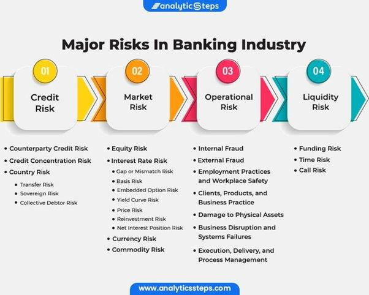

## Table of Contents

## What is a risk analyst and what do they do?

A risk analyst is a person who helps companies understand and manage risks. They look at things that could go wrong and figure out how likely those things are to happen and how bad they could be. This helps companies make better decisions and protect themselves.

Risk analysts use different tools and methods to do their job. They might use computers to look at data, make charts, and do math to predict risks. They also talk to people in the company to learn more about what could go wrong. After they figure out the risks, they tell the company leaders what they found and suggest ways to handle the risks.

In short, risk analysts are important because they help companies be ready for problems. They make sure that the company knows about possible dangers and has plans to deal with them. This can save the company money and keep it safe.

## What educational background is required to become a risk analyst?

To become a risk analyst, you usually need at least a bachelor's degree. Many risk analysts have degrees in fields like finance, economics, [statistics](/wiki/bayesian-statistics), or business. These subjects help you learn about money, numbers, and how businesses work, which are important for understanding and managing risks.

Some risk analysts also have master's degrees or other advanced education. A master's degree in fields like business administration (MBA), finance, or risk management can give you more specialized knowledge and make you a stronger candidate for jobs. While not always required, having more education can help you stand out and get better job opportunities in risk analysis.

In addition to formal education, many risk analysts get certifications. For example, the Financial Risk Manager (FRM) or the Professional Risk Manager (PRM) certifications can show that you have specific skills and knowledge in risk management. These certifications often require passing exams and can help you advance in your career as a risk analyst.

## What skills are essential for a risk analyst?

A risk analyst needs to be good with numbers and data. They use math and computer programs to look at information and figure out what risks a company might face. Being able to use tools like spreadsheets and data analysis software is important. They also need to understand how businesses work and know about finance and economics. This helps them see how different risks can affect a company's money and plans.

Good communication skills are also key for a risk analyst. They need to explain complicated ideas in a way that everyone in the company can understand. This means writing clear reports and giving presentations. They also need to work well with others, talking to people in different parts of the company to learn about risks and share their findings. Being able to listen and ask good questions helps them gather all the information they need.

Lastly, a risk analyst should be good at solving problems and thinking critically. They need to look at all the information they have and decide what the biggest risks are and how to deal with them. This involves thinking about different possibilities and coming up with plans to reduce risks. Being organized and able to manage their time well is also important, as they often work on several projects at once and need to meet deadlines.

## How can someone start preparing for a career in risk analysis?

To start preparing for a career in risk analysis, you should focus on getting a good education. A bachelor's degree in fields like finance, economics, or business can give you the knowledge you need. These subjects teach you about money, numbers, and how businesses work, which are important for understanding risks. If you can, try to take classes in statistics and data analysis too. These skills will help you look at information and predict risks. After getting your bachelor's degree, think about getting a master's degree or certifications like the Financial Risk Manager (FRM) or Professional Risk Manager (PRM). These can make you a stronger candidate for jobs in risk analysis.

While you're studying, it's a good idea to start building the skills you'll need as a risk analyst. Practice using computer programs like spreadsheets and data analysis software. These tools are important for looking at data and figuring out risks. Work on your communication skills too, because you'll need to explain your findings to others in the company. Try to get experience working with people and talking about complicated ideas in a simple way. Finally, practice solving problems and thinking critically. Look for ways to analyze situations and come up with plans to handle risks. These skills will help you do well as a risk analyst.

## What are the typical job responsibilities of a risk analyst?

A risk analyst's main job is to find and understand risks that could affect a company. They look at a lot of data and information to figure out what might go wrong and how likely it is to happen. This involves using math and computer programs to analyze numbers and make predictions. They also talk to people in different parts of the company to learn about specific risks and how they might impact the business. By putting all this information together, the risk analyst can see the big picture and understand what the company needs to be careful about.

Once they understand the risks, the risk analyst's job is to tell the company leaders what they found and suggest ways to handle the risks. This means writing reports and giving presentations that explain the risks in a clear and simple way. They need to make sure everyone understands the problems and the plans to deal with them. The risk analyst also helps the company make decisions by showing them how different choices could affect the risks they face. By doing this, they help the company be ready for problems and protect itself from harm.

## What industries commonly employ risk analysts?

Risk analysts work in many different industries. One common place you'll find them is in finance and banking. Banks and financial companies need to understand risks because they deal with money and investments. Risk analysts help them figure out if loans are safe or if investments might lose money. Insurance companies also use risk analysts a lot. They need to know how likely it is that they'll have to pay out on claims, so they can set the right prices for their insurance policies.

Another industry that often employs risk analysts is healthcare. Hospitals and health organizations need to manage risks related to patient care and safety. Risk analysts help them understand and reduce these risks, which can save lives and money. In the energy sector, like oil and gas companies, risk analysts look at risks related to safety, the environment, and the cost of projects. They help make sure that operations are safe and that the company can handle unexpected problems.

Other industries that use risk analysts include manufacturing, where they help manage risks related to production and supply chains, and technology, where they look at risks in projects and cybersecurity. No matter the industry, risk analysts play a key role in helping companies be ready for problems and make smart decisions.

## How does one gain practical experience in risk analysis?

To gain practical experience in risk analysis, you can start by looking for internships or entry-level jobs in companies that need risk analysts. Many big companies in finance, insurance, healthcare, and other industries offer internships where you can learn and work on real projects. These internships let you use what you learned in school and see how risk analysis works in the real world. You might help with data analysis, report writing, or talking to different parts of the company about risks. This hands-on experience is very important because it shows you what being a risk analyst is really like.

Another way to get practical experience is by working on projects or simulations. Some schools and training programs have risk analysis projects where you can practice using data and making decisions. You can also join professional groups or online communities where people share ideas and work on projects together. These groups often have events or workshops where you can learn new skills and meet people in the field. By doing these projects and working with others, you can build your skills and show future employers that you have real experience in risk analysis.

## What certifications can enhance a risk analyst's career?

Certifications can really help a risk analyst's career. One important certification is the Financial Risk Manager (FRM) offered by the Global Association of Risk Professionals (GARP). This certification shows that you know a lot about financial risks and how to manage them. You need to pass two exams to get it, and it can make you stand out when you're looking for jobs or trying to move up in your career. Another good certification is the Professional Risk Manager (PRM) offered by the Professional Risk Managers' International Association (PRMIA). This one also needs you to pass exams and shows that you have a deep understanding of risk management.

There are other certifications that can help too. For example, the Certified Risk Manager (CRM) from The National Alliance for Insurance Education & Research is good if you work in insurance. It focuses on risks that insurance companies face. The Certificate in Risk Management Assurance (CRMA) from The Institute of Internal Auditors (IIA) is helpful if you want to work in internal auditing and risk management. These certifications all show that you have special skills and knowledge, which can make you more valuable to employers and help you grow in your career as a risk analyst.

## What are the career progression opportunities for a risk analyst?

Starting as a risk analyst, you can move up in your career over time. At first, you might be an entry-level analyst, working on smaller projects and learning the ropes. As you gain more experience and show that you're good at your job, you can become a senior risk analyst. In this role, you'll handle bigger projects and have more responsibility. You might also start to lead teams or work on more complex problems.

After being a senior risk analyst, you could move into management. You might become a risk manager or a director of risk management. In these jobs, you'll oversee the whole risk management process for the company. You'll make big decisions, set strategies, and lead a team of analysts. Some people even go on to become chief risk officers, where they're in charge of all risk management for the company and report directly to the top leaders.

Getting more education and certifications can help you move up faster. For example, getting a master's degree or certifications like the Financial Risk Manager (FRM) can show that you're ready for bigger roles. As you grow in your career, you'll have the chance to work in different industries and take on new challenges, which can make your job even more interesting and rewarding.

## How do risk analysts use data and technology in their work?

Risk analysts use data and technology a lot in their work. They collect information from many places, like company records, market trends, and financial reports. They use computers to put all this data together and look for patterns. Special software helps them do math and make charts to see what risks the company might face. This can show them how likely a problem is to happen and how bad it could be. By using data and technology, risk analysts can make better predictions and help the company be ready for problems.

Technology also helps risk analysts share their findings with others. They use programs to write reports and make presentations that explain the risks in a clear way. This is important because everyone in the company needs to understand the risks and the plans to deal with them. Some risk analysts even use advanced tools like [artificial intelligence](/wiki/ai-artificial-intelligence) and [machine learning](/wiki/machine-learning) to look at data in new ways. These tools can find risks that might be hard to see otherwise, making the company even safer.

## What are the current trends and future outlook for risk analysis?

Risk analysis is changing because of new technology and new ways of thinking. More and more, risk analysts are using big data and artificial intelligence to look at information and find risks. These tools can handle huge amounts of data and see patterns that people might miss. This helps companies understand risks better and make smarter decisions. Another big trend is that companies are thinking about more kinds of risks, not just financial ones. They're looking at risks to the environment, to people's health, and to their reputation. This means risk analysts need to know about many different areas and work with experts from different fields.

The future of risk analysis looks bright. As technology keeps getting better, risk analysts will have even more powerful tools to use. This will make their work more accurate and help them find risks faster. Companies will keep needing risk analysts because the world is always changing and new risks keep coming up. Risk analysts who learn to use new technology and understand different kinds of risks will have good job opportunities. They'll be able to help companies stay safe and successful, no matter what challenges come their way.

## What are the common challenges faced by risk analysts and how can they be overcome?

Risk analysts often face challenges with data. They need a lot of information to do their job, but sometimes the data is hard to get or not good enough. It can take a long time to gather all the data they need, and sometimes the data they have is not complete or accurate. To overcome this, risk analysts can use technology to help them collect and clean up data faster. They can also work with other parts of the company to make sure they have the information they need. By using the right tools and working together, they can make sure they have the best data possible to analyze risks.

Another challenge is explaining complex ideas to others. Risk analysts need to share their findings with people who might not understand the details of risk analysis. It can be hard to explain complicated risks in a simple way. To solve this, risk analysts should practice their communication skills. They can use clear language and visuals like charts and graphs to help people understand. It's also important to listen to feedback and be ready to explain things in different ways if needed. By getting better at communicating, risk analysts can make sure everyone in the company knows about the risks and how to handle them.

## What are the key responsibilities of a risk analyst in algo trading?

Risk Analysts in [algorithmic trading](/wiki/algorithmic-trading) shoulder essential responsibilities to ensure that trading algorithms function within accepted risk frameworks, maintaining the delicate balance between trading efficiency and risk exposure. One of their primary duties involves the constant monitoring of trading algorithms. This task is crucial to ensure these algorithms execute trades only within the predefined risk parameters. By doing so, Risk Analysts help prevent unauthorized or potentially hazardous trading activities that could result in substantial financial losses.

Conducting stress testing and scenario analysis forms another critical part of a Risk Analyst’s role. Stress testing involves subjecting the algorithm to extreme market conditions to evaluate its performance and resilience. For example, scenarios such as an unexpected surge or drop in asset prices can be simulated to assess how the trading model responds. This process is vital for identifying vulnerabilities in the algorithm's design or strategy. The general idea is to assess the risk by examining the algorithm's performance under conditions such as:

$$
P(L > L_{\text{threshold}})
$$

Where $P(L > L_{\text{threshold}})$ represents the probability that losses $L$ exceed a specified threshold $L_{\text{threshold}}$.

Risk Analysts must also collaborate effectively with IT and trading teams to refine and improve trading algorithms. This collaboration ensures that the algorithms are not only streamlined for efficiency and speed but also robust enough to handle unforeseen market shifts and disruptions. By working together, these teams can address potential issues before they affect trading operations, thereby creating a more resilient trading system.

Furthermore, developing comprehensive risk reports is a key responsibility of Risk Analysts. These reports are designed to keep stakeholders informed about potential threats and the current risk landscape. Typically, these reports include detailed analysis and metrics that outline the risk exposure and implications of current trading strategies. Stakeholders can use this information to make informed decisions, adapt strategies, and mitigate risks effectively.

In conclusion, Risk Analysts play a multifaceted role that requires a keen awareness of both technical and strategic elements of trading operations. By carefully monitoring, testing, collaborating, and reporting, they ensure that algorithmic trading processes run efficiently and securely, safeguarding the financial interests of their institutions.

## References & Further Reading

[1]: Chan, E. P. (2009). ["Quantitative Trading: How to Build Your Own Algorithmic Trading Business."](https://github.com/ftvision/quant_trading_echan_book) Wiley Trading.

[2]: Jansen, S. (2020). ["Machine Learning for Algorithmic Trading."](https://github.com/stefan-jansen/machine-learning-for-trading) Packt Publishing.

[3]: Lopez de Prado, M. (2018). ["Advances in Financial Machine Learning."](https://books.google.com/books/about/Advances_in_Financial_Machine_Learning.html?id=oU9KDwAAQBAJ) Wiley.

[4]: Aronson, D. R. (2006). ["Evidence-Based Technical Analysis: Applying the Scientific Method and Statistical Inference to Trading Signals."](https://www.amazon.com/Evidence-Based-Technical-Analysis-Scientific-Statistical/dp/0470008741) Wiley.

[5]: Aldridge, I. (2013). ["High-Frequency Trading: A Practical Guide to Algorithmic Strategies and Trading Systems."](https://onlinelibrary.wiley.com/doi/pdf/10.1002/9781119203803.fmatter) Wiley.