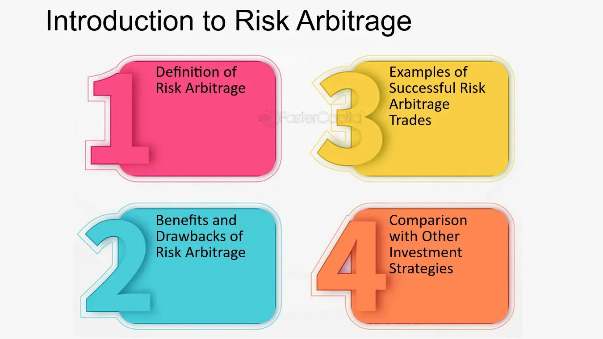

## Table of Contents

## What is risk arbitrage?

Risk arbitrage, also known as merger arbitrage, is a strategy used by investors to profit from the price difference between a company's stock price before and after a merger or acquisition is announced. When a company announces it is going to buy another company, the target company's stock price usually goes up, but it often doesn't reach the full price the buyer is offering. Investors who practice risk arbitrage buy the target company's stock hoping to sell it later at a higher price, once the merger is complete.

However, this strategy involves risk because the merger might not happen. If the deal falls through, the target company's stock price can drop significantly, causing investors to lose money. Because of this, risk arbitrage requires careful analysis of the likelihood of the merger going through, including looking at regulatory approvals, shareholder votes, and other factors that could affect the deal's success. Despite the risks, many investors find risk arbitrage appealing because it can offer potentially high returns if the merger is successful.

## How does risk arbitrage differ from traditional arbitrage?

Risk arbitrage and traditional arbitrage are both strategies to make money from price differences, but they work in different ways. Traditional arbitrage is about finding and taking advantage of price differences for the same thing in different places or markets. For example, if a stock is cheaper on one exchange than another, a trader can buy it where it's cheap and sell it where it's expensive, making a profit with little risk because the price difference is almost sure to go away.

Risk arbitrage, on the other hand, involves more uncertainty. It's about betting on the success of mergers or acquisitions. When a company wants to buy another, the target company's stock price usually goes up, but not all the way to the offer price. Investors using risk arbitrage buy the target company's stock hoping the merger will go through and they can sell it at a higher price later. But there's a risk: if the merger fails, the stock price can drop, and investors can lose money. So, risk arbitrage involves more risk and depends a lot on things like regulatory approval and shareholder votes.

## What are the basic mechanisms of risk arbitrage?

Risk arbitrage is all about trying to make money from the price difference that happens when one company wants to buy another. When a company says it wants to buy another company, the target company's stock price goes up, but usually not all the way to the price the buyer is offering. People who do risk arbitrage buy the target company's stock at the lower price, hoping that the merger will happen and they can sell the stock later at a higher price, making a profit.

But there's a big risk involved. The merger might not happen for different reasons, like if it doesn't get approved by regulators or if shareholders don't agree to it. If the merger fails, the target company's stock price can drop a lot, and people who bought it hoping for a profit can lose money instead. So, people doing risk arbitrage need to carefully look at how likely the merger is to happen, checking things like regulatory approvals and shareholder votes, to decide if it's a good bet.

## Can you explain the process of a typical risk arbitrage transaction?

When a company announces it wants to buy another company, the price of the target company's stock goes up. But it usually doesn't go up all the way to the price the buyer is offering. People who do risk arbitrage see this as a chance to make money. They buy the target company's stock at the lower price, hoping that the merger will go through. If it does, they can sell the stock later at the higher price the buyer is offering, making a profit.

But there's a risk involved. The merger might not happen. It could fail because regulators don't approve it, or because shareholders of the target company vote against it. If the merger falls through, the target company's stock price can drop a lot. People who bought the stock hoping for a profit can end up losing money instead. So, people doing risk arbitrage need to carefully study how likely the merger is to happen. They look at things like regulatory approvals and shareholder votes to decide if it's a good bet.

## What types of securities are typically involved in risk arbitrage?

Risk arbitrage usually involves stocks of companies that are about to be bought or merged with another company. When one company announces it wants to buy another, the target company's stock becomes the main focus. People doing risk arbitrage buy these stocks at the lower price before the merger happens, hoping to sell them later at a higher price if the merger goes through.

Sometimes, risk arbitrage can also involve other types of securities, like options and bonds of the target company. Options give the right to buy or sell stocks at a certain price, and bonds are loans to the company. These securities can also change in value based on whether the merger happens or not. People using risk arbitrage look at all these different securities to find the best way to make a profit while managing the risks involved.

## What are the key factors that risk arbitrageurs consider before entering a deal?

Before entering a risk arbitrage deal, investors look at how likely the merger is to happen. They check if the deal needs approval from regulators like the government, and if it does, they try to guess if it will be approved. They also look at what shareholders of the target company think. If a lot of shareholders are against the merger, it might not go through. So, risk arbitrageurs talk to people and read news to understand what shareholders are thinking.

Another big thing they consider is the timing of the merger. They want to know how long it will take for the merger to be completed. If it takes too long, there's more time for something to go wrong, and that's riskier. They also look at the price difference between the current stock price and the price the buyer is offering. If the difference is big, there's more potential profit, but also more risk if the merger fails. So, they weigh all these factors to decide if the deal is worth it.

## How do risk arbitrageurs manage the risks associated with their strategies?

Risk arbitrageurs manage the risks by carefully studying the merger deal before they decide to invest. They look at how likely the merger is to happen by checking if it needs approval from regulators like the government. If it does, they try to guess if it will be approved. They also talk to people and read news to understand what shareholders of the target company think. If a lot of shareholders are against the merger, it might not go through. So, they consider all these things to decide if the deal is worth the risk.

Another way they manage risk is by looking at the timing of the merger. They want to know how long it will take for the merger to be completed. If it takes too long, there's more time for something to go wrong, and that's riskier. They also look at the price difference between the current stock price and the price the buyer is offering. If the difference is big, there's more potential profit, but also more risk if the merger fails. By weighing all these factors, risk arbitrageurs can make better decisions and manage the risks involved in their strategies.

## What are the common challenges and pitfalls in risk arbitrage?

One big challenge in risk arbitrage is that the merger might not happen. This can happen if regulators like the government don't approve the deal, or if shareholders of the target company vote against it. If the merger falls through, the stock price of the target company can drop a lot, and people who bought the stock hoping to make a profit can lose money instead. So, it's really important for risk arbitrageurs to carefully study the deal and guess how likely it is to go through.

Another challenge is timing. Mergers can take a long time to complete, and the longer it takes, the more time there is for something to go wrong. Risk arbitrageurs have to wait until the merger is done to sell the stock at a higher price, but if the deal takes too long, they might get stuck with the stock if the merger fails. They also need to watch the stock price carefully because it can change a lot while they're waiting. 

Lastly, there's the challenge of competition. Other investors might be doing the same thing, which can make the stock price go up faster than expected. This can make it harder to buy the stock at a good price. Risk arbitrageurs need to be quick and smart about when to buy and sell to make a profit. All these challenges make risk arbitrage a tricky but potentially rewarding strategy.

## How has the practice of risk arbitrage evolved over time?

Risk arbitrage has changed a lot since it started. In the beginning, it was all about buying stocks of companies that were going to be bought by other companies. People would look at the news and try to guess if the merger would happen. They would buy the stock at a lower price and hope to sell it at a higher price once the merger went through. But back then, there wasn't much information available, and it was harder to know if a merger would really happen.

Over time, risk arbitrage got more complicated. Now, people use computers and special software to help them decide if a merger will go through. They look at a lot more information, like what regulators are saying and what shareholders think. They also use other types of investments, like options and bonds, to make their strategies better. Even though it's still risky, the way people do risk arbitrage today is much more detailed and uses a lot more tools than it did in the past.

## What are some notable historical examples of risk arbitrage?

One famous example of risk arbitrage happened in 1986 when RJR Nabisco was going to be bought by another company. A businessman named Carl Icahn saw a chance to make money. He bought a lot of RJR Nabisco's stock at a lower price before the merger happened. He hoped to sell it later at a higher price if the merger went through. But the merger didn't go as planned, and there were a lot of problems. Icahn ended up losing a lot of money because the merger didn't happen the way he thought it would.

Another well-known example is from 2000 when America Online (AOL) wanted to buy Time Warner. Investors who did risk arbitrage bought Time Warner's stock, hoping the merger would go through and they could sell it at a higher price. The merger did happen, but it didn't work out well. AOL and Time Warner had a lot of problems after they merged, and the stock price went down a lot. People who bought the stock hoping to make a profit ended up losing money because the merged company didn't do well.

## What criticisms are commonly leveled against risk arbitrage?

Some people say that risk arbitrage is too risky. They think it's like gambling because it depends a lot on whether a merger will happen or not. If the merger doesn't go through, people who bought the stock can lose a lot of money. Critics also say that risk arbitrageurs might not care about the long-term success of the companies they invest in. They just want to make a quick profit, which might not be good for the companies or the economy in the long run.

Another criticism is that risk arbitrage can make stock prices go up and down a lot. When a lot of people start buying the target company's stock hoping for a merger, it can push the price up really fast. But if the merger fails, the price can drop just as quickly. This can make the stock market more unstable, which can be bad for other investors who aren't doing risk arbitrage. Some people think this kind of activity can make the market less fair and more unpredictable.

## How do regulatory environments affect the practice of risk arbitrage?

Regulatory environments play a big role in risk arbitrage. When one company wants to buy another, they often need to get approval from government regulators. These regulators check if the merger is good for the economy and doesn't hurt competition. If regulators say no to the merger, it won't happen, and people doing risk arbitrage can lose money. So, risk arbitrageurs need to guess if the merger will get approved. They look at what regulators have said about similar mergers in the past and try to understand the rules to make better decisions.

Regulatory environments can also change how long it takes for a merger to happen. Sometimes, getting approval can take a long time, and the longer it takes, the more risk there is for arbitrageurs. They have to wait to sell the stock at a higher price, but if the merger gets delayed or rejected, they can get stuck with the stock. Also, different countries have different rules about mergers, so risk arbitrageurs need to know these rules if they're investing in companies from different places. Understanding the regulatory environment helps them manage the risks better and decide if a merger is a good bet.

## What is Understanding Risk Arbitrage?

Risk [arbitrage](/wiki/arbitrage), often termed merger arbitrage, is a sophisticated investment strategy that aims to capitalize on the price differentials resulting from anticipated corporate mergers or acquisitions. This strategy emerges from the typical market behavior following the announcement of such corporate actions: the stock price of the target company generally rises, while the stock of the acquiring company may decrease slightly or remain stable due to the immediate financial outlay involved.

The essence of risk arbitrage lies in exploiting the spread between the current trading price of the target company's stock and the tender offer, or acquisition price, proposed by the acquiring company. This spread represents the potential profit of the arbitrageur, assuming the merger is successfully completed.

### Key Mechanics of Risk Arbitrage

1. **Assessment of Merger Likelihood**: The core of risk arbitrage is to accurately assess the probability of the merger or acquisition being completed. This involves analyzing several factors such as regulatory approvals, shareholder votes, and potential objections from competition authorities.

2. **Positioning Strategies**:
   - **Long Position in Target**: Given that the target company's stock usually trades below the announced deal price, arbitrageurs often buy shares in the target. The expectation is that the stock will eventually align with the acquisition price once the merger is finalized.
   - **Short Position in Acquirer**: In certain cases, arbitrageurs might also short-sell shares of the acquiring company, especially if the deal involves a stock-for-stock transaction. This is based on the understanding that the acquiring company’s stock could face downward pressure post-announcement due to market perception of potential risks or integration challenges.

3. **Risk Elements**:
   - **Deal Risk**: The major risk in this strategy is the possibility of the merger deal falling through, which could occur due to various regulatory, legal, or financial complications. An incomplete merger can significantly impact stock prices, often leading to losses for arbitrageurs.
   - **Market Conditions**: Wider economic or market conditions can also affect the risk dynamics. Adverse market movements may impact the stock prices of the involved companies regardless of the merger’s specifics.

### Mathematical Framework

To model potential outcomes in risk arbitrage, an expected value framework can be useful:

$$
\text{Expected Profit} = (\text{Success Probability} \times \text{Profit if Success}) + ((1 - \text{Success Probability}) \times \text{Loss if Failure})
$$

Where:
- **Success Probability** is the estimated probability that the merger will be completed.
- **Profit if Success** is the profit realized if the merger is successful, calculated as the difference between the acquisition price and the purchase price of the target's shares.
- **Loss if Failure** is the potential loss if the merger fails, often influenced by how far the stock price of the target drops post-announcement of a failed deal.

### Example in Python

Here is a simple Python code snippet to estimate potential profit from a risk arbitrage scenario:

```python
def expected_profit(success_prob, success_profit, failure_loss):
    return (success_prob * success_profit) + ((1 - success_prob) * failure_loss)

# Example values
success_probability = 0.85
profit_if_success = 10  # dollars per share
loss_if_failure = -5   # dollars per share

profit = expected_profit(success_probability, profit_if_success, loss_if_failure)
print("Expected Profit per Share: $", profit)
```

Risk arbitrage is not without its perils, and it requires a meticulous evaluation of numerous variables pertinent to the merger process, along with precise timing to optimize risk-reward ratios. Despite its inherent risks, risk arbitrage remains an enticing strategy for investors seeking to navigate the complex landscape of financial mergers and acquisitions.

## References & Further Reading

[1]: Mitchell, M. L., & Pulvino, T. C. (2001). ["Characteristics of Risk and Return in Risk Arbitrage."](https://papers.ssrn.com/sol3/papers.cfm?abstract_id=268144) Financial Analysts Journal, 56(2), 54-72.

[2]: DeLong, J. B., Shleifer, A., Summers, L. H., & Waldmann, R. J. (1990). ["Noise Trader Risk in Financial Markets."](https://ms.mcmaster.ca/~grasselli/DeLongShleiferSummersWaldmann90.pdf) Journal of Political Economy, 98(4), 703-738.

[3]: Bloomberg. (2010). ["The May 6, 2010, Flash Crash."](https://en.wikipedia.org/wiki/2010_Flash_Crash) Bloomberg L.P.

[4]: Narang, R. K. (2013). ["Inside the Black Box: A Simple Guide to Quantitative and High-Frequency Trading."](https://onlinelibrary.wiley.com/doi/book/10.1002/9781118662717) John Wiley & Sons.

[5]: Aldridge, I. (2013). ["High-Frequency Trading: A Practical Guide to Algorithmic Strategies and Trading Systems."](https://www.amazon.com/High-Frequency-Trading-Practical-Algorithmic-Strategies/dp/1118343506) John Wiley & Sons.

[6]: Hendershott, T., Jones, C. M., & Menkveld, A. J. (2011). ["Does Algorithmic Trading Improve Liquidity?"](https://onlinelibrary.wiley.com/doi/full/10.1111/j.1540-6261.2010.01624.x) The Review of Financial Studies, 24(8), 2915-2955.

[7]: Patterson, S. (2013). ["Dark Pools: High-Speed Traders, A.I. Bandits, and the Threat to the Global Financial System."](https://dl.acm.org/doi/10.5555/2385786) Crown Business.