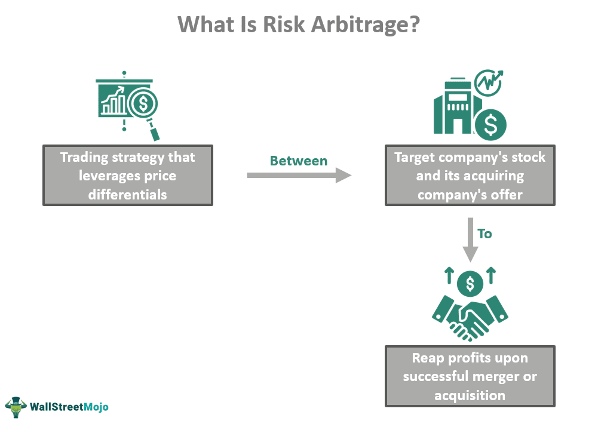

The financial market landscape is undergoing continuous transformation, driven by the rapid integration of sophisticated technologies and novel strategies. This progression is not merely a superficial evolution but represents a fundamental shift in how financial activities are conceptualized and executed. Key concepts such as investment critique, financial strategy, risk arbitrage, and algorithmic trading play pivotal roles in this dynamic environment, serving as both pillars and catalysts for change.

Investment critique is essential for analyzing and evaluating financial strategies, ensuring they align with desired business outcomes. This process involves assessing potential risks and returns, underlining the importance of informed decision-making. It forms the basis for developing robust financial strategies that are adaptable to varying market conditions.



Risk arbitrage, particularly in the context of mergers and acquisitions, involves capitalizing on price discrepancies prior to the completion of corporate transactions. It is characterized by inherent risk due to its dependence on the successful execution of mergers, reflecting the volatile nature of market operations.

Algorithmic trading, often seen as the future of investment, employs computer algorithms to execute trades at unparalleled speed and precision. This method leverages big data and artificial intelligence, significantly influencing market dynamics. It streamlines complex trading strategies, facilitating operations across multiple markets simultaneously.

The interplay between these elements showcases the interconnectedness of modern financial practices. As technology advances, the integration and implementation of these strategies become more intricate and sophisticated, necessitating a continuous adaptation of skills and knowledge. Understanding how these components interact allows for a comprehensive view of today's financial landscape and prepares market participants to navigate future changes successfully.

## Table of Contents

## The Role of Investment Critique in Financial Strategy

Investment critique is a critical component of financial strategy, responsible for assessing the viability of investment opportunities in terms of potential risks and returns. This evaluation process is essential for developing financial strategies that not only meet the business objectives but also adapt to various external factors. 

The process of investment critique begins with a thorough analysis of market conditions. Market conditions encompass the current trends in financial markets, which can significantly influence the performance of investment portfolios. For instance, during a bullish market, investment strategies might focus on capitalizing on rising stock prices, whereas bearish markets might necessitate a shift towards assets that preserve capital or generate fixed income.

Economic indicators provide another layer of insight during investment critiques. Key indicators such as Gross Domestic Product (GDP) growth rates, inflation rates, interest rates, and unemployment levels offer a macroeconomic perspective that helps in predicting the market's future direction. For example, high inflation might drive central banks to increase interest rates, which could negatively impact bond prices and alter investment strategies.

Company performance analysis considers firm-specific factors like revenue growth, profit margins, debt levels, and competitive positioning. This microeconomic evaluation ensures that the chosen investment strategy aligns with the firm's operational realities and growth prospects. For example, a company with strong revenue growth and low debt may be a worthwhile investment despite broader economic challenges.

Incorporating these factors enables investors to formulate robust strategies by evaluating the trade-offs between risk and expected returns. Risk assessment often involves quantifying uncertainty using variances, standard deviations, and Value at Risk (VaR) models. Mathematical models and simulations can provide a probabilistic understanding of potential outcomes, leading to more informed decision-making.

Ultimately, investment critique is a dynamic process that requires frequent reassessment as market variables and economic conditions evolve. By systematically evaluating investment opportunities and strategically responding to new information, investors and financial managers can optimize portfolios to achieve desired outcomes, supporting sustainable growth and profitability.

## Understanding Risk Arbitrage

Risk [arbitrage](/wiki/arbitrage), often termed merger arbitrage, is a sophisticated investment strategy that aims to capitalize on the price differentials resulting from anticipated corporate mergers or acquisitions. This strategy emerges from the typical market behavior following the announcement of such corporate actions: the stock price of the target company generally rises, while the stock of the acquiring company may decrease slightly or remain stable due to the immediate financial outlay involved.

The essence of risk arbitrage lies in exploiting the spread between the current trading price of the target company's stock and the tender offer, or acquisition price, proposed by the acquiring company. This spread represents the potential profit of the arbitrageur, assuming the merger is successfully completed.

### Key Mechanics of Risk Arbitrage

1. **Assessment of Merger Likelihood**: The core of risk arbitrage is to accurately assess the probability of the merger or acquisition being completed. This involves analyzing several factors such as regulatory approvals, shareholder votes, and potential objections from competition authorities.

2. **Positioning Strategies**:
   - **Long Position in Target**: Given that the target company's stock usually trades below the announced deal price, arbitrageurs often buy shares in the target. The expectation is that the stock will eventually align with the acquisition price once the merger is finalized.
   - **Short Position in Acquirer**: In certain cases, arbitrageurs might also short-sell shares of the acquiring company, especially if the deal involves a stock-for-stock transaction. This is based on the understanding that the acquiring company’s stock could face downward pressure post-announcement due to market perception of potential risks or integration challenges.

3. **Risk Elements**:
   - **Deal Risk**: The major risk in this strategy is the possibility of the merger deal falling through, which could occur due to various regulatory, legal, or financial complications. An incomplete merger can significantly impact stock prices, often leading to losses for arbitrageurs.
   - **Market Conditions**: Wider economic or market conditions can also affect the risk dynamics. Adverse market movements may impact the stock prices of the involved companies regardless of the merger’s specifics.

### Mathematical Framework

To model potential outcomes in risk arbitrage, an expected value framework can be useful:

$$
\text{Expected Profit} = (\text{Success Probability} \times \text{Profit if Success}) + ((1 - \text{Success Probability}) \times \text{Loss if Failure})
$$

Where:
- **Success Probability** is the estimated probability that the merger will be completed.
- **Profit if Success** is the profit realized if the merger is successful, calculated as the difference between the acquisition price and the purchase price of the target's shares.
- **Loss if Failure** is the potential loss if the merger fails, often influenced by how far the stock price of the target drops post-announcement of a failed deal.

### Example in Python

Here is a simple Python code snippet to estimate potential profit from a risk arbitrage scenario:

```python
def expected_profit(success_prob, success_profit, failure_loss):
    return (success_prob * success_profit) + ((1 - success_prob) * failure_loss)

# Example values
success_probability = 0.85
profit_if_success = 10  # dollars per share
loss_if_failure = -5   # dollars per share

profit = expected_profit(success_probability, profit_if_success, loss_if_failure)
print("Expected Profit per Share: $", profit)
```

Risk arbitrage is not without its perils, and it requires a meticulous evaluation of numerous variables pertinent to the merger process, along with precise timing to optimize risk-reward ratios. Despite its inherent risks, risk arbitrage remains an enticing strategy for investors seeking to navigate the complex landscape of financial mergers and acquisitions.

## Algorithmic Trading: The Future of Investment

Algorithmic trading, commonly referred to as algo-trading, employs computer algorithms to conduct trade executions based on pre-defined sets of rules and strategies. This technological approach revolutionizes trading by automating the buying and selling of securities, thus offering key benefits including enhanced speed, precision, and the capacity to manage complex trading strategies across multiple markets simultaneously.

One of the primary advantages of [algorithmic trading](/wiki/algorithmic-trading) is its speed. Computerized systems can analyze and react to market conditions in fractions of a second, outperforming human traders in executing trades at optimal prices. This ensures better pricing and minimizes slippage, the difference between the expected price of a trade and the actual price. Algo-trading systems are capable of continuously monitoring market conditions, allowing them to scrutinize massive volumes of data and perform trades that align with the trader’s set parameters almost instantaneously.

Precision in trade execution is another significant benefit enabled by algorithmic trading. Algorithms execute trades with a high degree of accuracy, following pre-determined criteria without allowing emotional or psychological biases to influence trading decisions. This disciplined approach ensures that the strategic integrity of the trading plan is maintained at all times.

The complexity of trades that can be handled by algorithmic systems further exemplifies their importance in modern finance. Algorithms can be programmed to execute multiple trading strategies simultaneously across different markets and asset classes, such as equities, commodities, or currencies. This multi-market and multi-asset capability allows traders to exploit arbitrage opportunities, optimize portfolios, and manage risks in a dynamic and efficient manner.

The rise of big data and [artificial intelligence](/wiki/ai-artificial-intelligence) (AI) has had a profound impact on algorithmic trading. With vast amounts of data generated every second, big data analytics helps interpret market trends, enhancing the predictive accuracy of algorithmic strategies. AI, particularly [machine learning](/wiki/machine-learning) algorithms, enables these systems to adapt and learn from historical data, thereby refining trading strategies over time. This adaptive learning capability is instrumental in navigating the ever-evolving market dynamics, providing traders with a competitive edge.

In conclusion, algorithmic trading epitomizes the future of investment by marrying technology with financial market activities. Its inherent advantages of speed, precision, and complexity handling, combined with advancements in big data and AI, are reshaping the contours of market dynamics. As the financial sector continues to evolve with technological progress, algorithmic trading stands at the forefront, delivering efficiency and innovation in investment practices.

## Risks and Criticisms of Algorithmic Trading

Algorithmic trading has revolutionized the financial markets by leveraging the power of advanced algorithms and high-speed data processing. However, alongside its benefits, it brings a range of risks and criticisms that warrant careful consideration.

One of the primary risks associated with algorithmic trading is the potential for system failures. Algorithms are heavily reliant on technology, which implies that any malfunction or bug within the trading system can lead to substantial financial losses. System failures can manifest as erroneous trade executions, incorrect buy/sell orders, or software glitches, adversely impacting market stability and investor trust. 

Market [volatility](/wiki/volatility-trading-strategies) is another significant concern. Algorithmic trading can amplify market fluctuations, particularly during periods of high stress. High-frequency trading ([HFT](/wiki/high-frequency-trading-strategies)), a subset of algorithmic trading, can exacerbate price swings as it involves executing a large number of orders at rapid speeds. This creates a feedback loop where sharp movements prompt algorithms to transact even more aggressively, potentially leading to "flash crashes." An infamous example is the Flash Crash of May 6, 2010, when the Dow Jones Industrial Average plummeted nearly 1,000 points within minutes, largely attributed to automated trading systems.

The technology-driven nature of algorithmic trading can result in over-reliance and a diminished role for human judgment. In fast-paced market environments, algorithms lack the ability to interpret nuanced information or adapt to unforeseen circumstances as a human trader might. This limits their effectiveness in complex scenarios where human intuition and decision-making are critical.

Regulatory challenges further complicate the landscape for firms engaged in algorithmic trading. The rapid execution and sheer [volume](/wiki/volume-trading-strategy) of trades executed by algorithms demand rigorous regulatory oversight to prevent market abuse and ensure fairness. Regulations such as the European Union's Markets in Financial Instruments Directive II (MiFID II) aim to address these issues by imposing stringent reporting and transparency requirements. Nonetheless, navigating these regulatory frameworks presents its own set of challenges, as compliance can be both costly and resource-intensive for trading firms.

In conclusion, while algorithmic trading offers significant efficiency and precision, it also poses notable risks that must be managed diligently. The potential for system failures, market volatility, over-reliance on technology, and regulatory complexities constitute core areas that require meticulous attention in the context of modern trading. As the financial markets continue to evolve, addressing these concerns will be crucial in harnessing the full potential of algorithmic trading while safeguarding market integrity.

## Strategies for Effective Risk Management in Algo-Trading

Risk management plays a vital role in algorithmic trading by preventing significant losses and ensuring successful trading operations. One key strategy is diversification, which involves spreading investments across a wide range of assets to reduce the risk of substantial losses from any single asset. By minimizing exposure to any one particular investment, traders can protect their portfolios from volatility and unforeseen market changes.

Another important risk management tool in algo-trading is the implementation of stop-loss mechanisms. A stop-loss order automatically sells a security when it reaches a specified price, limiting the potential loss traders can incur. This approach allows traders to control their financial risks and protect profit margins. Here's a simple Python example to demonstrate how a stop-loss order might be coded:

```python
def place_stop_loss_order(current_price, stop_loss_price):
    if current_price <= stop_loss_price:
        return "Sell Order Executed"
    return "Hold"

# Example usage:
current_price = 98
stop_loss_price = 100
print(place_stop_loss_order(current_price, stop_loss_price))
```

Continuous monitoring of market trends also proves essential for effective risk management. By keeping a close watch on economic indicators, news, and market movements, traders can quickly adapt their algorithms to reflect current market conditions. This proactive approach helps in mitigating risks associated with sudden market volatility.

In addition to these strategies, technological advancements, notably in artificial intelligence (AI), have provided new ways to bolster risk management. AI techniques, like machine learning, offer enhanced predictive analysis capabilities, allowing for improved risk assessments. These methods can effectively parse large datasets to identify patterns and forecast potential risks, facilitating the development of more refined trading strategies.

Moreover, algorithmic trading platforms are increasingly incorporating AI-driven analytics to support automated decision-making processes. This integration helps optimize trading strategies by continuously analyzing vast amounts of data in real-time. The ongoing refinement of such technology reduces latency in decision making and improves the general robustness of algorithms against unforeseen market dynamics.

In conclusion, effective risk management in algorithmic trading involves the combined use of diversification, stop-loss mechanisms, continuous market monitoring, and the adoption of technological advances like AI. Together, these strategies help traders navigate the complexities of the market, safeguard their investments, and achieve more consistent trading outcomes.

## Conclusion

Investment critique, risk arbitrage, and algorithmic trading collectively form the backbone of contemporary financial strategies. Their interplay not only underscores the complexity of modern financial markets but also highlights the potential for innovation and increased efficiency in investment practices. When these elements are effectively integrated, they provide a nuanced understanding of market dynamics, enabling more informed decision-making and facilitating the creation of robust investment portfolios.

Understanding and managing the risks inherent in each of these strategies are crucial for developing effective investment solutions. Investment critique offers a framework for evaluating potential returns against risks, ensuring alignment with broader financial objectives. Meanwhile, risk arbitrage leverages market inefficiencies, primarily surrounding mergers and acquisitions, to generate profit. However, its success is contingent on precise risk assessment and timing. Algorithmic trading further augments this framework by introducing computational power and speed to execute trades based on complex strategies, although it comes with its own set of challenges related to system reliability and market impact.

As technology continues to progress, these financial strategies are poised for further evolution. The proliferation of big data and advancements in artificial intelligence are driving significant changes, enabling more sophisticated risk assessment and strategy refinement. Consequently, financial professionals must commit to continuous adaptation and learning to harness these developments effectively. This ongoing adaptation is crucial not only for maintaining competitive advantage but also for navigating the increasingly complex financial landscape. This proactive approach will ensure that investment solutions remain relevant and effective, ultimately contributing to sustainable growth and profitability in the financial sector.

## References & Further Reading

[1]: Mitchell, M. L., & Pulvino, T. C. (2001). ["Characteristics of Risk and Return in Risk Arbitrage."](https://papers.ssrn.com/sol3/papers.cfm?abstract_id=268144) Financial Analysts Journal, 56(2), 54-72.

[2]: DeLong, J. B., Shleifer, A., Summers, L. H., & Waldmann, R. J. (1990). ["Noise Trader Risk in Financial Markets."](https://ms.mcmaster.ca/~grasselli/DeLongShleiferSummersWaldmann90.pdf) Journal of Political Economy, 98(4), 703-738.

[3]: Bloomberg. (2010). ["The May 6, 2010, Flash Crash."](https://en.wikipedia.org/wiki/2010_Flash_Crash) Bloomberg L.P.

[4]: Narang, R. K. (2013). ["Inside the Black Box: A Simple Guide to Quantitative and High-Frequency Trading."](https://onlinelibrary.wiley.com/doi/book/10.1002/9781118662717) John Wiley & Sons.

[5]: Aldridge, I. (2013). ["High-Frequency Trading: A Practical Guide to Algorithmic Strategies and Trading Systems."](https://www.amazon.com/High-Frequency-Trading-Practical-Algorithmic-Strategies/dp/1118343506) John Wiley & Sons.

[6]: Hendershott, T., Jones, C. M., & Menkveld, A. J. (2011). ["Does Algorithmic Trading Improve Liquidity?"](https://onlinelibrary.wiley.com/doi/full/10.1111/j.1540-6261.2010.01624.x) The Review of Financial Studies, 24(8), 2915-2955.

[7]: Patterson, S. (2013). ["Dark Pools: High-Speed Traders, A.I. Bandits, and the Threat to the Global Financial System."](https://dl.acm.org/doi/10.5555/2385786) Crown Business.