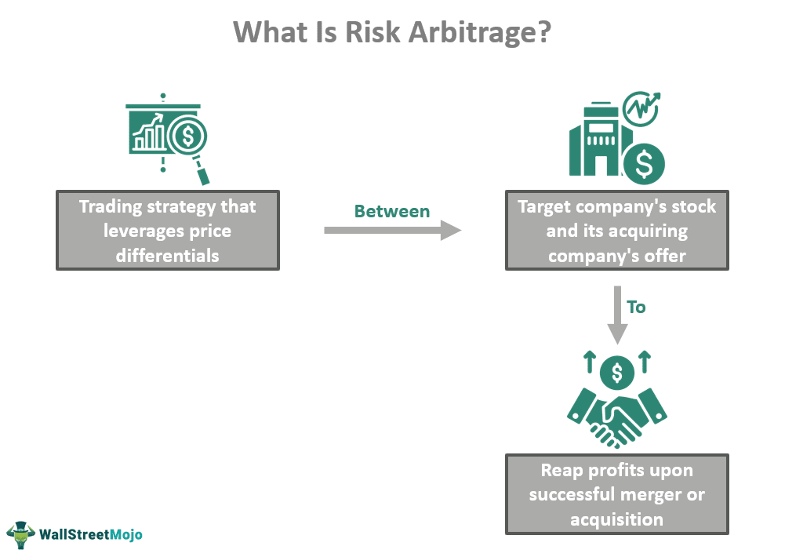

Investment profits are a primary focus for traders and investors aiming to increase their financial assets. The quest for higher returns has led to the development of sophisticated trading strategies and methodologies. Two notable strategies that significantly enhance investment returns are risk arbitrage and algorithmic trading.

Risk arbitrage, often referred to as merger arbitrage, is a strategy that seeks to capitalize on price inefficiencies that occur during merger and acquisition (M&A) activities. Traders using this strategy aim to profit from the anticipated movements in stock prices of companies involved in these corporate deals. By taking calculated positions, traders attempt to benefit from the successful completion of M&A activities.



Algorithmic trading, on the other hand, involves using computer algorithms to execute trades at high speed and efficiency. This approach encompasses various strategies, including trend-following and statistical arbitrage, optimizing trade execution by minimizing the influence of human emotions and maximizing operational efficiency. This proves particularly beneficial in markets characterized by rapid movements and high trading volumes.

Both risk arbitrage and algorithmic trading aim to exploit market inefficiencies, capturing profitable opportunities that may not be readily apparent through conventional trading methods. By employing these strategies, traders and investors are better positioned to identify and act on potential market advantages.

This article provides an exploration of these advanced strategies, examining their operational mechanisms, potential benefits, and associated risks. By integrating practical insights and real-world examples, readers will gain a comprehensive understanding of how these strategies can be effectively implemented to enhance their investment portfolios.

## Table of Contents

## Understanding Investment Profits

Investment profits are the financial returns generated by engaging in various trading activities in the financial markets. These profits are the result of buying and selling financial instruments such as stocks, bonds, commodities, or derivatives at opportune moments to capitalize on their price movements. Successful trading and investment often hinge on the foundation of thorough market analysis, a keen understanding of economic indicators, and the implementation of well-formulated strategies.

Profit generation in trading requires sharp insights into market dynamics, where traders analyze different factors such as political events, economic data releases, and market sentiment, which could influence asset prices. Such analyses help in predicting future price movements, thereby aiding traders in making informed decisions. Profitable trades emerge not by chance but through strategic execution, where a trader or investor enters and exits the market at optimal times.

Both individual traders and institutional investors, like hedge funds and investment banks, focus intensely on maximizing investment profits. Institutional investors usually have access to more resources, advanced tools, and proprietary data, enabling them to devise sophisticated strategies. However, individual traders, equipped with adequate knowledge and the right technologies, can also effectively pursue profitability.

In recent years, the utilization of advanced trading strategies and technologies has markedly influenced profit opportunities in trading. Technologies such as [machine learning](/wiki/machine-learning), [artificial intelligence](/wiki/ai-artificial-intelligence), and big data analytics facilitate the analysis of vast data sets to discern patterns and trends that are not readily apparent to human traders. These advancements are fostering a new era of trading where algorithmic and high-frequency trading play a prominent role.

Algorithmic trading, which employs computer algorithms to execute trades based on pre-determined criteria, is a testament to the integration of technology in financial markets. Such strategies reduce human error and emotional bias, allowing for rapid execution and capitalizing on transient market opportunities. Similarly, quantitative strategies, which rely on statistical methods to exploit market inefficiencies, are becoming increasingly popular among traders seeking to augment their profits.

The landscape of trading and investment is ever-evolving, and those who wish to maximize their investment profits must continuously adapt to new strategies and technological innovations. By staying informed on market developments and embracing cutting-edge tools, traders and investors can better position themselves to achieve their financial goals.

## Risk Arbitrage Strategies

Risk [arbitrage](/wiki/arbitrage), also known as merger arbitrage, is a sophisticated investment strategy primarily involving trading in the stocks of companies engaged in mergers and acquisitions (M&A). This strategy seeks to exploit price discrepancies that occur when such corporate deals are announced but not yet completed.

Traders engaged in risk arbitrage typically assume a long position in the shares of the target company. The premise is that the stock price will increase to reflect the acquisition offer. In certain instances, traders may also take a short position in the stock of the acquiring company. This is under the assumption that the acquirer’s stock may decrease due to the costs and potential disruptions associated with the merger.

The successful execution and profitability of risk arbitrage hinge on the completion of the announced corporate deal. While the potential for high returns is appealing, the strategy is not without its risks. Factors such as regulatory challenges, anti-trust issues, or shareholder dissent can derail an acquisition, leading to losses if the deal does not proceed as planned.

Hedge funds predominantly employ risk arbitrage strategies because they have the resources and expertise necessary to navigate the complexities of M&A transactions. However, individual traders with experience and a deep understanding of financial markets may also find opportunities in this area. The accessibility of market information and analysis tools has increased the feasibility of individual participation in risk arbitrage despite its historical association with institutional investors.

Prudent traders engaging in risk arbitrage must remain informed about the specifics of each deal, regulatory landscapes, and any potential disruptions. This diligence is essential to mitigate inherent risks and maximize potential returns. By effectively pricing the risk of deal failure and astutely timing their trades, arbitrageurs aim to profit from the successful completion of M&A activities.

## How Risk Arbitrage Works

Risk arbitrage, also known as merger arbitrage, exploits the opportunities arising from mergers and acquisitions (M&A). In an M&A transaction, the acquiring company offers to purchase the target company's shares at a premium over the current market price. This creates a spread between the offer price and the prevailing market price, which traders aim to capture.

### Lucrative Scenarios in Risk Arbitrage

Risk arbitrage becomes particularly lucrative in several scenarios. First, when a merger is announced, the market may not fully reflect the offer price immediately, allowing traders to buy the target's stock at a price below the offer. Similarly, in situations where the market perceives regulatory or other hurdles that might prevent the completion of the merger, the spread might widen, presenting an opportunity for seasoned traders to profit if the deal is ultimately successful.

A typical example includes a cash merger where the acquisition is to be paid entirely in cash. Traders purchase the target company's shares below the acquisition price, anticipating the deal's completion. In stock-for-stock mergers, traders might go long on the target company's stock and short sell the acquiring company's stock. The short sale is generally based on the exchange ratio established in the merger agreement, aiming to profit from the price alignment upon the merger's completion.

### Execution and Calculation of Potential Returns

In executing risk arbitrage, traders evaluate the potential return by assessing the spread between the market price of the target's stock and the proposed acquisition price. The expected return $R$ can be estimated by:

$$
R = \left( \frac{P_a - P_m}{P_m} \right) \times 100\%
$$

where $P_a$ is the acquisition price and $P_m$ is the current market price of the target company's shares.

Python can be employed to automate the calculations and monitor market conditions effectively:

```python
def calculate_arbitrage_return(acquisition_price, market_price):
    return ((acquisition_price - market_price) / market_price) * 100

# Example
acquisition_price = 100
market_price = 95
return_percentage = calculate_arbitrage_return(acquisition_price, market_price)
print(f"Expected Arbitrage Return: {return_percentage:.2f}%")
```

### Risk Factors and Uncertainties

Despite its potential for profit, risk arbitrage is fraught with uncertainties. The primary risk is deal risk, where the merger or acquisition may fail due to regulatory approval, financing issues, or opposition from shareholders. Additionally, there is price risk, as the spread can fluctuate based on market sentiment and new information regarding the transaction. Traders need to consider these risks and incorporate hedging strategies where feasible.

Moreover, global economic conditions and geopolitical factors can introduce uncertainties, impacting M&A transactions. As each deal is unique, understanding the specifics of the transaction and integrating thorough due diligence are pivotal to minimizing risk and maximizing potential returns in risk arbitrage.

## Algorithmic Trading Strategies

Algorithmic trading, also known as algo trading, employs computer algorithms to execute trades at speeds and frequencies that are impossible for a human trader. This method leverages advanced mathematical models and statistical analysis to make trading decisions, bypassing human emotions like fear and greed, which can influence market movements. The effectiveness of [algorithmic trading](/wiki/algorithmic-trading) lies in its ability to process vast amounts of market data in real-time and execute orders at optimal prices.

One popular strategy within algorithmic trading is trend-following, which identifies and exploits market [momentum](/wiki/momentum). In this strategy, traders create algorithms that detect upward or downward trends in prices, entering trades that align with these trends. Trend-following can be implemented using statistical indicators such as moving averages, Relative Strength Index (RSI), and the Average Directional Index (ADX). The objective is to catch trends early and [exit](/wiki/exit-strategy) before they reverse, maximizing gains.

Statistical arbitrage is another algorithmic approach that aims to profit from price inefficiencies between correlated securities. In this strategy, traders use statistical models to identify residual differences between the expected and actual prices of assets. Once identified, algorithms can execute trades to capitalize on the expected convergence of these price discrepancies. This often involves pairs trading, where an underperforming asset is bought while a correlated outperforming asset is sold, with the expectation that their price spread will normalize.

Market-making, a fundamental algorithmic trading strategy, provides [liquidity](/wiki/liquidity-risk-premium) to markets by simultaneously quoting buy and sell prices for financial instruments. Market makers earn a profit from the bid-ask spread, the difference between the buy (bid) and sell (ask) prices. Algorithms continuously monitor the market to adjust these prices dynamically, ensuring competitive spreads that attract trading counterparts while managing inventory risk.

Algorithmic trading is particularly advantageous in fast-moving markets characterized by high [volatility](/wiki/volatility-trading-strategies) and substantial trading volumes. For instance, high-frequency trading ([HFT](/wiki/high-frequency-trading-strategies)), a subset of algorithmic trading, relies on ultra-fast execution to capitalize on fleeting price opportunities. HFT algorithms are designed to execute thousands of orders per second, thriving in environments where speed and precision are crucial.

To illustrate the concept in Python, consider a simple moving average crossover strategy:

```python
import numpy as np
import pandas as pd

# Generate a sample dataframe with random price data
np.random.seed(42)
dates = pd.date_range('2023-01-01', periods=100)
prices = np.random.lognormal(mean=0.001, sigma=0.02, size=100) * 100
data = pd.DataFrame(data={'Price': prices}, index=dates)

# Calculate simple moving averages (SMA)
data['SMA_10'] = data['Price'].rolling(window=10).mean()
data['SMA_30'] = data['Price'].rolling(window=30).mean()

# Define buy/sell signals
data['Signal'] = np.where(data['SMA_10'] > data['SMA_30'], 1, 0)

# Calculate trading returns
data['Return'] = data['Price'].pct_change()
data['Strategy_Return'] = data['Signal'].shift(1) * data['Return']

# Print results
print(data.tail())
```

In this example, the strategy generates buy signals when the 10-day simple moving average (SMA) crosses above the 30-day SMA, and sell signals when it crosses below. While this is a simplified model, it demonstrates the basic mechanism of a trend-following strategy using algorithmic trading.

In conclusion, algorithmic trading provides significant efficiency and effectiveness in executing trades. By automating decision-making processes and removing emotional biases, traders can better navigate complex markets and achieve favorable results.

## Developing Effective Algo Trading Strategies

Designing effective algorithmic trading strategies involves multiple key considerations to enhance performance and sustainability. These strategies are constructed using computer algorithms that automate trading activities with precision and speed, key components of which include data analysis, [backtesting](/wiki/backtesting), and risk management.

### Key Considerations

Developing a robust trading algorithm begins with a clear understanding of market behavior and the establishment of trading goals. The trading strategy should clearly define entry and exit points, trade [volume](/wiki/volume-trading-strategy), and conditions under which trades are executed. This requires a sophisticated model that can adapt to market changes.

### Importance of Data Analysis and Backtesting

Data analysis serves as the foundation of algorithmic trading strategies. The quality of the input data significantly impacts the efficacy of the output decisions. High-frequency trading algorithms, for example, rely on streaming data to identify patterns and predict price movements. Utilizing techniques such as machine learning can enhance this decision-making process.

Backtesting is crucial to validate the performance of a trading strategy over historical data. It helps in understanding how an algorithm would have performed under previous market conditions. Standard metrics like Sharpe Ratio and Drawdown are often used to evaluate risk-adjusted performance. For a backtest, it’s important to consider:

- **Historical Data Range**: Ensure a comprehensive data set that includes various market conditions.
- **Simulating Real-world Trading Conditions**: Incorporate transaction costs, slippage, and time delays to ensure realistic outcomes.

Python, a widely used language for algorithmic trading, offers several libraries such as `pandas` for data manipulation and `[backtrader](/wiki/backtrader)` for strategy backtesting:

```python
import backtrader as bt

# Define a simple moving average strategy
class SmaStrategy(bt.Strategy):
    params = (('sma_period', 15), )

    def __init__(self):
        sma = bt.indicators.SimpleMovingAverage(self.data.close, period=self.params.sma_period)
        self.crossover = bt.indicators.CrossOver(self.data.close, sma)

    def next(self):
        if self.crossover > 0:
            self.buy()
        elif self.crossover < 0:
            self.sell()

# Initialize backtest environment
cerebro = bt.Cerebro()
cerebro.addstrategy(SmaStrategy)
data = bt.feeds.YahooFinanceData(dataname='AAPL', fromdate=datetime(2020, 1, 1), todate=datetime(2020, 12, 31))
cerebro.adddata(data)
cerebro.run()
```

### Implementation of Risk Management Practices

Risk management is integral to protect capital and ensure the longevity of trading strategies. This includes setting stop-loss and take-profit levels, diversifying the portfolio, and limiting the size of individual trades. These measures help mitigate potential losses and enhance the stability of returns.

### Common Pitfalls and How to Avoid Them

1. **Overfitting**: Designing a strategy that performs well on historical data but fails in live markets. This can be avoided by using out-of-sample testing and cross-validation techniques.

2. **Ignoring Slippage and Transaction Costs**: Many strategies overlook the impact of market frictions. Accounting for these factors during backtesting can prevent misleading performance statistics.

3. **Lack of Robustness**: Relying too much on short-term data or a narrow set of conditions can lead to fragile models. It is advisable to build adaptable systems capable of adjusting to diverse market environments.

Effective algorithmic trading strategies demand comprehensive planning, continuous monitoring, and fine-tuning. The blending of quantitative analysis with strategic planning can significantly bolster a trader's ability to gain consistent profits in the markets.

## Balancing Risk and Reward

All trading strategies involve varying levels of risk and potential reward, making the understanding of the risk-return profile vital for informed decision-making. The risk-return profile is essentially a comparison of the expected returns of an investment to the amount of risk undertaken to achieve those returns. For strategic decision-making, traders and investors must assess whether the potential rewards justify the risks involved.

### Assessing and Managing Risks

Risk assessment and management are crucial components of successful trading strategies. One effective method for assessing risk is the use of statistical measures such as Value at Risk (VaR), which estimates the maximum potential loss over a specific time frame at a given confidence level. For instance, a 95% VaR of $10,000 suggests that there is a 5% chance of losing more than $10,000 in a specified period.

$$
\text{VaR} = \mu - z \times \sigma
$$

where:
- $\mu$ is the expected return,
- $z$ is the z-score corresponding to the confidence level,
- $\sigma$ is the standard deviation of returns.

In addition to statistical measures, stress testing and scenario analysis can provide insights into how trading strategies might perform under extreme market conditions. Stress testing involves simulating unfavorable market scenarios to assess the impact on a portfolio. Similarly, scenario analysis examines the effects of specific economic events or market changes.

Risk management practices, such as setting stop-loss orders, can protect against significant losses by automatically executing trades when a security reaches a certain price. Portfolio rebalancing is another key strategy, ensuring that the asset allocation remains aligned with the investor's risk tolerance and investment goals.

### Role of Diversification

Diversification plays a fundamental role in mitigating risks while aiming for high returns. By spreading investments across various asset classes, sectors, or geographical regions, investors can reduce the impact of poor performance in any single investment. This is underpinned by the principle that not all asset classes will experience declines simultaneously.

An effectively diversified portfolio is likely to have a lower overall risk profile, as the performance of different assets may not be closely correlated. For instance, the correlation coefficient, denoted as $\rho$, indicates how asset returns relate to each other. A coefficient close to -1 suggests a strong negative correlation, providing potential for significant risk reduction.

Python code can be used to compute and visualize correlations and optimize portfolio diversification:

```python
import numpy as np
import pandas as pd
import matplotlib.pyplot as plt

# Sample data for returns
data = {
    'Asset_1': [0.05, 0.02, 0.04, 0.03],
    'Asset_2': [0.02, 0.01, 0.03, 0.04],
    'Asset_3': [0.03, 0.03, 0.02, 0.01]
}

returns_df = pd.DataFrame(data)

# Calculate correlation matrix
correlation_matrix = returns_df.corr()

# Plot correlation matrix
plt.imshow(correlation_matrix, cmap='coolwarm', interpolation='none')
plt.colorbar()
plt.xticks(range(len(correlation_matrix)), correlation_matrix.columns)
plt.yticks(range(len(correlation_matrix)), correlation_matrix.columns)
plt.show()
```

In conclusion, an understanding of risk-return profiles, combined with effective risk assessment, management techniques, and diversification strategies, can significantly enhance the potential for achieving high investment returns while minimizing associated risks. This balanced approach provides a robust framework for making informed trading decisions.

## Conclusion

Integrating risk arbitrage and algorithmic trading into investment strategies can significantly enhance potential profits. These advanced trading methodologies, while promising, necessitate meticulous planning, precise execution, and robust risk management to be effective. Risk arbitrage strategies enable investors to exploit market inefficiencies by taking advantage of price discrepancies arising from merger and acquisition activities. When these corporate deals successfully conclude, traders can realize substantial profits. However, this requires a keen understanding of the factors influencing deal completions and potential market reactions.

On the other hand, algorithmic trading, which involves the use of sophisticated computer algorithms, provides traders with the ability to execute high-speed and efficient trades. This strategy minimizes the risk of human error and emotional bias, making it a preferred choice in volatile markets or when handling large trade volumes. Algorithms can be designed using various strategies, such as trend-following or [statistical arbitrage](/wiki/statistical-arbitrage), each necessitating a deep comprehension of the market dynamics they exploit.

Both strategies require not only a technical mastery of trading technologies but also an extensive understanding of financial markets. Knowledge of how to interpret data and implement strategic adjustments in response to market changes is crucial for traders employing these methods. Moreover, the importance of risk management cannot be overstated; these strategies should be accompanied by risk assessment tools and diversification techniques to manage and mitigate potential losses effectively.

Ultimately, traders and investors who harness the full potential of risk arbitrage and algorithmic trading stand to gain considerably. However, as these are sophisticated financial strategies, they are best suited for individuals and institutions with the necessary expertise and resources to deploy them effectively.

## References & Further Reading

[1]: Mitchell, M. L., & Pulvino, T. C. (2001). ["Characteristics of Risk and Return in Risk Arbitrage."](https://www.jstor.org/stable/2697819)00051-0) Journal of Finance, 56(6), 2135-2175.

[2]: Elder, A. (2002). ["Come into My Trading Room: A Complete Guide to Trading"](https://www.amazon.com/Come-Into-My-Trading-Room/dp/0471225347). Wiley Trading.

[3]: Lopez de Prado, M. (2018). ["Advances in Financial Machine Learning"](https://www.amazon.com/Advances-Financial-Machine-Learning-Marcos/dp/1119482089). Wiley.

[4]: Stefan Jansen (2018). ["Machine Learning for Algorithmic Trading"](https://github.com/stefan-jansen/machine-learning-for-trading). 

[5]: Chan, E. (2009). ["Quantitative Trading: How to Build Your Own Algorithmic Trading Business"](https://github.com/ftvision/quant_trading_echan_book). Wiley Trading.

[6]: Gatev, E., Goetzmann, W. N., & Rouwenhorst, K. G. (2006). ["Pairs Trading: Performance of a Relative Value Arbitrage Rule."](http://www-stat.wharton.upenn.edu/~steele/Courses/434/434Context/PairsTrading/PairsTradingGGR.pdf) Review of Financial Studies, 19(3), 797–827.