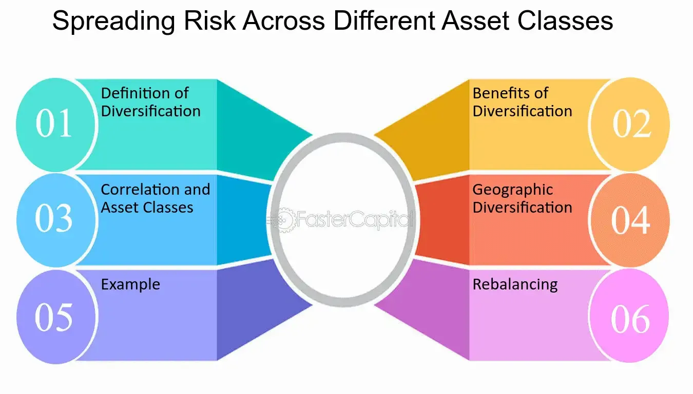

## Table of Contents

## What is risk assessment in the context of asset classes?

Risk assessment in the context of asset classes involves evaluating the potential risks associated with different types of investments, such as stocks, bonds, real estate, and commodities. The goal is to understand how likely it is that an investment will lose value and how much that loss could be. This helps investors make informed decisions about where to put their money, balancing the potential for higher returns against the risk of losing their investment.

Different asset classes have different levels of risk. For example, stocks are generally considered riskier than bonds because their value can go up and down a lot more. On the other hand, bonds are often seen as safer because they provide regular interest payments and are less likely to lose value suddenly. By assessing these risks, investors can choose a mix of assets that matches their comfort level with risk and their financial goals.

## Why is it important to assess the risk of different asset classes?

Assessing the risk of different asset classes is important because it helps investors make smarter choices with their money. When you know how risky an investment is, you can decide if it's worth the chance of losing money for the possibility of earning more. For example, if you're saving for something important like buying a house or retiring, you might not want to put all your money into very risky investments, even if they could make you a lot of money. Understanding risk helps you balance what you could gain with what you might lose.

Also, risk assessment helps you build a strong investment plan. By looking at the risks of different asset classes, you can spread your money across various types of investments. This is called diversification, and it's like not putting all your eggs in one basket. If one investment does poorly, others might do well and help balance things out. This way, you can protect your money better and still have a chance to grow it over time.

## What are the common types of asset classes and their associated risks?

There are several common types of asset classes, each with its own level of risk. Stocks are one type of asset class. They represent ownership in a company and can go up or down a lot in value. This makes them pretty risky, but they can also offer high returns if the company does well. Bonds are another type, and they're generally seen as less risky than stocks. Bonds are loans you give to a company or government, and they pay you back with interest over time. They're safer because they're more predictable, but they usually don't grow as much as stocks.

Real estate is another asset class, where you invest in property. It can be risky because property values can change a lot depending on the economy and location. But real estate can also provide steady income through rent and might grow in value over time. Commodities, like gold or oil, are also an asset class. They can be very volatile because their prices can swing wildly based on supply and demand. They're often used to protect against inflation, but they're risky because you never know what will happen with prices.

Cash and cash equivalents, like savings accounts and money market funds, are the least risky asset class. They don't offer much growth, but they're very safe because they're easy to turn into cash and usually don't lose value. Each type of asset class has its own risks and rewards, so understanding them helps you pick the right mix for your investment goals and how much risk you're comfortable with.

## How do you measure risk in asset classes?

Measuring risk in asset classes can be done in a few ways. One common way is to look at something called [volatility](/wiki/volatility-trading-strategies). Volatility is how much the price of an investment goes up and down over time. If an asset class like stocks goes up and down a lot, it's considered more risky. Another way to measure risk is by looking at something called standard deviation. This is a number that tells you how spread out the returns of an investment are. A higher standard deviation means more risk because the investment's returns are all over the place.

Another way to measure risk is by looking at the potential for loss, which is often called downside risk. This means figuring out how much money you could lose if things go badly. For example, if you invest in bonds, you might look at the credit risk, which is the chance that the company or government you loaned money to won't pay you back. With stocks, you might look at the beta, which tells you how much the stock moves compared to the overall market. A higher beta means more risk because the stock will swing more when the market goes up or down.

These methods help investors understand how risky different asset classes are. By using these measurements, you can compare the risks of stocks, bonds, real estate, commodities, and cash. This helps you pick the right investments for your goals and how much risk you're willing to take.

## What are the key factors to consider when assessing the risk of an asset class?

When assessing the risk of an asset class, one key [factor](/wiki/factor-investing) to consider is volatility. This means looking at how much the price of the asset goes up and down over time. If an asset class like stocks has a lot of ups and downs, it's considered more risky. Another important factor is the potential for loss, often called downside risk. This involves figuring out how much money you could lose if things go badly. For example, with bonds, you might look at the credit risk, which is the chance that the company or government you loaned money to won't pay you back.

Another factor is the economic environment. Different asset classes can be affected differently by things like interest rates, inflation, and economic growth. For instance, stocks might do well when the economy is growing, but they can be risky during a recession. Real estate can be influenced by local market conditions and interest rates. Commodities like oil can be very volatile because their prices can swing based on supply and demand. Understanding these economic factors helps you see how risky an asset class might be in different situations.

Lastly, consider the time horizon and [liquidity](/wiki/liquidity-risk-premium) of the asset class. If you need your money back quickly, you'll want to look at how easy it is to sell the asset without losing a lot of value. Stocks and bonds are generally more liquid than real estate, which can take time to sell. Your investment goals and how long you plan to keep your money invested also matter. If you're saving for something far in the future, you might be okay with more risk. But if you need your money soon, you'll want to stick with safer, less risky assets.

## How does diversification impact the risk assessment of asset classes?

Diversification helps lower the risk of your investments by spreading your money across different asset classes. Instead of putting all your money into one type of investment, like just stocks, you can invest in a mix of stocks, bonds, real estate, and maybe even some commodities. This way, if one type of investment does poorly, the others might do well and balance things out. For example, if the stock market goes down, your bonds might still be doing okay, which can help protect your money.

When you diversify, you're not just reducing the risk of losing a lot of money all at once. You're also making it easier to handle the ups and downs of the market. Different asset classes react differently to things like economic changes or [interest rate](/wiki/interest-rate-trading-strategies) shifts. By having a mix, you can smooth out the bumps and have a more stable investment plan. This means you can feel more confident about your investments because you're not relying on just one thing to do well.

## What role do economic cycles play in the risk assessment of asset classes?

Economic cycles play a big role in how risky different asset classes can be. An economic cycle is like a roller coaster with ups and downs, including times of growth and times of slowdown or even a recession. During a boom, when the economy is growing, stocks often do really well because companies are making more money and people feel good about spending. But stocks can be very risky during a downturn because if people stop spending, companies might not make as much money, and their stock prices can drop a lot. On the other hand, bonds might be safer during a recession because they pay regular interest, and people often move their money into safer investments when times are tough.

Real estate and commodities also feel the impact of economic cycles. Real estate can be a good investment during growth periods because more people are buying homes and businesses are expanding, pushing up property values. But during a recession, real estate can be risky because fewer people can afford to buy, and property values might go down. Commodities like oil and gold can be very volatile because their prices can swing wildly based on what's happening in the economy. For example, oil prices might drop if people are driving less during a recession. Understanding these economic cycles helps you see how the risks of different asset classes can change over time, so you can make better choices about where to put your money.

## How can historical data be used to assess the risk of asset classes?

Historical data is really helpful when you want to figure out how risky different types of investments might be. By looking at how stocks, bonds, real estate, and commodities have done in the past, you can see patterns and understand what might happen in the future. For example, if you see that stocks have gone up and down a lot over the years, you can guess they might be pretty risky. On the other hand, if bonds have stayed pretty steady, they might be safer. This information helps you make smarter choices about where to put your money.

But remember, just because something happened in the past doesn't mean it will happen again in the same way. The world changes, and new things can affect how investments do. Still, historical data gives you a good starting point to see how risky an asset class might be. It's like looking at old weather reports to guess what the weather might be like tomorrow. It's not perfect, but it's better than guessing without any information at all.

## What advanced statistical models are used in risk assessment of asset classes?

Advanced statistical models help investors understand how risky different types of investments might be. One common model is called the Value at Risk (VaR) model. This model tries to figure out the most money you could lose over a certain time, like a day or a week, with a certain chance of it happening. For example, if your VaR is $10,000 at a 5% chance over a day, it means there's a 5% chance you could lose $10,000 or more in one day. VaR is useful because it gives you a clear number to think about when deciding how much risk you're okay with. Another model is the Monte Carlo simulation, which runs lots of different scenarios to see what might happen to your investments. It's like playing out different futures to see how risky your investments might be.

Another important model is the Capital Asset Pricing Model (CAPM), which looks at how much risk you're taking compared to the whole market. It helps you figure out if you're getting enough return for the risk you're taking. CAPM uses something called beta, which tells you how much an investment moves compared to the market. If a stock has a high beta, it means it's more risky because it will swing more when the market goes up or down. There's also the Black-Scholes model, which is often used for options and other tricky investments. It helps you understand how much an option might be worth and how risky it is. These models are complex, but they give investors powerful tools to better understand and manage the risks of their investments.

## How do geopolitical events influence the risk assessment of asset classes?

Geopolitical events can really shake up how risky different investments seem. Things like wars, elections, and trade disagreements between countries can make the prices of stocks, bonds, and other stuff go all over the place. For example, if two countries start fighting, it might make people nervous about investing in companies from those countries. Or, if a country changes its leader and the new one wants to change a bunch of rules, that can make investors worried about what will happen next. All of this uncertainty can make stocks and other investments seem a lot riskier because nobody knows for sure what will happen.

These events don't just affect one type of investment; they can change how safe or risky everything feels. For instance, if there's a big trade fight, it might make people think twice about buying stuff from certain countries, which can hurt companies that rely on those trade deals. This can push down stock prices and make the whole market feel more unstable. On the other hand, some investors might move their money into safer things like bonds or gold when things get tense, thinking those will hold up better during tough times. So, when figuring out how risky an investment is, you've got to keep an eye on what's happening around the world because it can make a big difference.

## What are the limitations of current risk assessment models for asset classes?

Current risk assessment models for asset classes have some problems. One big issue is that they often look at the past to guess what might happen in the future. But the world changes, and what happened before might not happen again. For example, a model might say stocks are safe because they did well in the past, but then a big event like a war or a new law can change everything. These models can also miss out on rare but really bad events, like a huge market crash, because those don't happen often enough to show up in the data.

Another problem is that these models can be too complicated. They use a lot of math and numbers, which can make it hard for regular people to understand them. Sometimes, the models make guesses based on things that are hard to measure, like how people feel about the economy or what might happen with politics. This can make the models less accurate because they're trying to predict things that are really unpredictable. So, while these models can help, they're not perfect and should be used carefully.

## How can machine learning and AI enhance the risk assessment of asset classes?

Machine learning and AI can make risk assessment for different types of investments better by looking at huge amounts of data really fast. They can find patterns and connections that people might miss. For example, AI can look at not just stock prices, but also news, social media, and economic reports to guess how risky an investment might be. This means AI can give you a more complete picture of risk because it's not just looking at numbers from the past but also at what's happening right now.

Also, AI can keep learning and getting better over time. As new data comes in, the AI can update its guesses about how risky an investment is. This is really helpful because the world changes a lot, and what was true yesterday might not be true tomorrow. By using AI, investors can get more accurate and up-to-date information about the risks of their investments, which can help them make smarter choices about where to put their money.

## What is Investment Risk Explained?

Investment risk signifies the probability that an investment's actual return will deviate from the expected return. Understanding the components of investment risk is vital for investors aiming to navigate financial markets effectively.

Investment risks can be broadly categorized into systematic and unsystematic risks. Systematic risk, also known as market risk, is inherent to the entire market or a market segment. It is influenced by macroeconomic factors such as interest rates, inflation, and geopolitical events. Such risks cannot be eliminated through diversification. The Capital Asset Pricing Model (CAPM) is commonly used to assess systematic risk, represented by the formula:

$$
\text{Expected Return} = R_f + \beta (R_m - R_f)
$$

In this equation, $R_f$ is the risk-free rate, $\beta$ measures the sensitivity of the asset to market movements, and $R_m$ is the expected market return.

Unsystematic risk, or specific risk, affects a particular company or industry. This type of risk arises from factors such as management decisions, product recalls, or regulatory changes. Unlike systematic risk, unsystematic risk can be mitigated through diversification. By holding a portfolio of uncorrelated assets, investors can reduce the impact of unsystematic risk, thus stabilizing their returns.

To manage investment risk, diversification is a widely adopted strategy. By investing in a variety of asset classes and sectors, investors can spread out potential risks. This approach decreases the likelihood that any single investment will significantly affect the overall portfolio.

Understanding investment risk is integral for aligning portfolios with an investor's risk tolerance. Risk tolerance refers to the degree of variability in investment returns that an individual is willing to withstand. It is a personal attribute influenced by factors such as financial goals, investment horizon, and psychological comfort with uncertainty. By assessing risk tolerance, investors can construct portfolios that maximize potential returns while staying within acceptable risk limits.

In summary, discerning between systematic and unsystematic risks and applying strategies like diversification helps investors manage investment risks. Grasping these concepts enables investors to tailor their portfolios to match their risk appetite, thereby supporting long-term financial objectives.

## References & Further Reading

[1]: Bergstra, J., Bardenet, R., Bengio, Y., & Kégl, B. (2011). ["Algorithms for Hyper-Parameter Optimization."](https://papers.nips.cc/paper/4443-algorithms-for-hyper-parameter-optimization) Advances in Neural Information Processing Systems 24.

[2]: ["Advances in Financial Machine Learning"](https://www.amazon.com/Advances-Financial-Machine-Learning-Marcos/dp/1119482089) by Marcos Lopez de Prado

[3]: ["Evidence-Based Technical Analysis: Applying the Scientific Method and Statistical Inference to Trading Signals"](https://www.amazon.com/Evidence-Based-Technical-Analysis-Scientific-Statistical/dp/0470008741) by David Aronson

[4]: ["Machine Learning for Algorithmic Trading"](https://github.com/stefan-jansen/machine-learning-for-trading) by Stefan Jansen

[5]: ["Quantitative Trading: How to Build Your Own Algorithmic Trading Business"](https://books.google.com/books/about/Quantitative_Trading.html?id=j70yEAAAQBAJ) by Ernest P. Chan