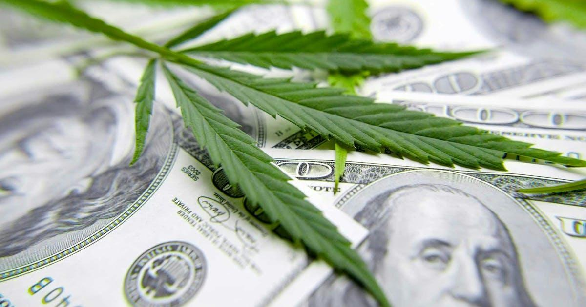

## Table of Contents

## What is cannabis investing and why is it considered a high-risk investment?

Cannabis investing means putting money into companies that grow, sell, or make products from the cannabis plant. This can include big companies that are listed on stock markets, or smaller businesses that might need money to grow. People invest in these companies hoping that the cannabis industry will keep growing and that the companies will make more money in the future.

Investing in cannabis is considered high-risk for a few reasons. First, the laws about cannabis are different in every country and can change quickly. This means that a company that is doing well today might run into big problems if the laws change. Second, the cannabis industry is still new and can be unpredictable. Many companies are still figuring out how to make money and stay successful. Because of these risks, there's a chance that investors could lose some or all of their money.

## What are the basic legal considerations for cannabis investors in different regions?

When thinking about investing in cannabis, it's important to know that the laws can be very different depending on where you are. In some places like Canada and certain states in the U.S., it's legal to use cannabis for fun or for health reasons. This means that companies in these areas can sell cannabis and make money from it. But in other places, like most countries around the world, cannabis is still against the law. If you invest in a company that works in these places, you could face big problems if the law changes or if the company gets in trouble.

Another thing to think about is how the laws can change over time. Even in places where cannabis is legal now, the government might decide to change the rules later. This could make it harder for companies to do business or even force them to stop selling cannabis. For example, in the U.S., cannabis is legal in some states but still illegal under federal law. This can create a lot of uncertainty for companies and investors. So, it's a good idea to keep an eye on the laws and understand how they might affect your investment.

## How does the regulatory environment impact the risk for cannabis investors?

The rules and laws about cannabis can make investing in it risky. In places where cannabis is legal, like Canada and some U.S. states, companies can sell it and make money. But the laws can change, and if they do, it could hurt the companies and the people who invested in them. For example, if a government decides to make cannabis illegal again, the companies would have to stop selling it, and investors could lose a lot of money.

Even in places where cannabis is legal, there are still many rules that companies have to follow. These rules can be about how cannabis is grown, how it's sold, and who can buy it. If a company breaks these rules, it might have to pay big fines or even close down. This makes investing in cannabis risky because the companies have to be very careful to follow all the rules, and if they don't, investors could lose their money.

## What are the common financial risks associated with investing in cannabis companies?

Investing in cannabis companies can be risky because these businesses often don't make money right away. They might spend a lot of money to start up and grow, but it can take a long time before they start making a profit. This means that if you invest in them, you might not see any money back for a while, and there's a chance you could lose your investment if the company fails before it becomes profitable.

Another financial risk is that the value of cannabis stocks can go up and down a lot. This is called volatility. Because the cannabis industry is new and the laws can change, the price of the stocks can change quickly. If you need to sell your stocks and their value has gone down, you could lose money. This makes investing in cannabis more risky than investing in more stable industries.

## How can market volatility affect cannabis investments?

Market volatility can make cannabis investments risky because the price of cannabis stocks can change a lot and very quickly. This happens because the cannabis industry is new and the laws about cannabis can change. When the laws change, it can affect how much money cannabis companies can make, and this can make their stock prices go up or down a lot. If you need to sell your stocks when their price is low, you could lose money.

Also, because the cannabis market can be unpredictable, it's hard to know what will happen to the value of your investment. Sometimes, news about new laws or changes in how people feel about cannabis can make the stock prices jump around. This means that if you invest in cannabis, you need to be ready for the price of your investment to go up and down a lot, and you might lose money if you're not careful.

## What role does company due diligence play in mitigating investment risks in the cannabis sector?

Doing careful research on a company, called due diligence, is really important when you're thinking about investing in cannabis. It helps you understand the company better, like how it makes money, who runs it, and if it follows the laws. By looking into these things, you can see if the company is a good investment or if there are big risks you should know about. For example, you might find out if the company has a lot of debt or if it's had problems with the law before. Knowing these things can help you decide if it's worth investing your money.

Due diligence also helps you see how the company is doing compared to others in the cannabis industry. You can check if it's growing, making money, or if it's struggling. This can give you a better idea of whether the company has a good chance of doing well in the future. By taking the time to do this research, you can make smarter choices and lower the chance of losing your money. Even though investing in cannabis can be risky, good due diligence can help you manage those risks better.

## How do supply chain and operational risks influence the cannabis investment landscape?

Supply chain and operational risks can really affect how well cannabis companies do, which in turn impacts people who invest in them. For example, growing cannabis needs special conditions like the right light, temperature, and water. If something goes wrong, like a problem with the power or water supply, it can hurt the plants and stop the company from making money. Also, moving cannabis from where it's grown to where it's sold can be tricky because of all the laws about transporting it. If a company can't get its products to stores on time, it might lose money and customers.

These risks can make investing in cannabis even more uncertain. If a company has a lot of problems with its supply chain or how it runs its business, it might not make as much money as expected. This can make the value of the company's stock go down, which means investors could lose money. Because the cannabis industry is still new and figuring things out, these kinds of problems can happen more often than in other industries. So, it's important for investors to think about these risks when deciding if they want to put their money into cannabis companies.

## What are the potential impacts of international trade policies on cannabis investments?

International trade policies can have a big impact on cannabis investments because they can change how easy it is for companies to sell their products in different countries. If a country decides to allow cannabis to be imported or exported, it can open up new markets for companies to make money. But if a country puts strict rules or bans on cannabis trade, it can make it hard for companies to sell their products and make a profit. This can affect how much money investors make from their investments, because if a company can't sell its products, its stock price might go down.

Also, trade policies can change over time, which adds more uncertainty to cannabis investments. For example, if a country that used to allow cannabis imports suddenly changes its mind and bans them, companies that were counting on selling in that market could lose a lot of money. This can make the value of their stocks drop quickly, which is risky for investors. So, when thinking about investing in cannabis, it's important to keep an eye on what's happening with international trade policies and how they might affect the companies you're interested in.

## How can investors assess the competitive landscape and market saturation in the cannabis industry?

To assess the competitive landscape in the cannabis industry, investors need to look at how many companies are already selling cannabis and how they are doing. They can check if there are a few big companies that control most of the market or if there are lots of smaller companies trying to get a piece of it. Investors can also look at what makes each company different, like if they have special products or ways of growing cannabis that others don't have. By understanding who the main players are and what they are good at, investors can see if a company has a good chance of doing well against its competition.

Market saturation is another important thing to think about. It means looking at if there are already too many cannabis companies in a certain area, making it hard for new ones to make money. Investors can check how much people are buying cannabis and if the market is still growing or if it's starting to slow down. They can also see if there are new laws that might open up more places to sell cannabis or if the rules are getting stricter, which could make the market more crowded. By understanding how saturated the market is, investors can decide if it's a good time to invest in a cannabis company or if they should wait.

## What advanced financial metrics should experienced investors use to evaluate cannabis investment opportunities?

Experienced investors should look at the price-to-earnings (P/E) ratio to see how much they are paying for each dollar of a cannabis company's earnings. A high P/E ratio might mean that the company is expected to grow a lot in the future, but it can also be a sign that the stock is overpriced. Another important metric is the price-to-sales (P/S) ratio, which shows how much investors are paying for each dollar of the company's revenue. This can be helpful for cannabis companies that are not making profits yet but are growing their sales quickly.

Investors should also pay attention to the company's EBITDA (Earnings Before Interest, Taxes, Depreciation, and Amortization). This metric gives a clearer picture of the company's operating performance by removing the effects of financing and accounting decisions. A positive and growing EBITDA can be a good sign that the company is on the right track, even if it's not profitable yet. Lastly, the debt-to-equity ratio is crucial because it shows how much the company is relying on borrowed money. A high debt-to-equity ratio can be risky, especially in the volatile cannabis market, as it might mean the company could struggle to pay back its loans if things don't go as planned.

## How do geopolitical shifts and policy changes pose risks to cannabis investors?

Geopolitical shifts and policy changes can make investing in cannabis risky because they can change the rules about how cannabis can be bought and sold. If a country decides to make cannabis legal or illegal, it can have a big impact on companies that sell it. For example, if a new government comes into power and decides to ban cannabis, companies that were doing well might suddenly lose a lot of money. This can make the value of their stocks drop quickly, which means investors could lose money too. So, it's important for investors to keep an eye on what's happening in different countries and how it might affect the companies they invest in.

Also, changes in international relations can affect how easy it is for cannabis companies to sell their products in other countries. If countries start to work together more on cannabis trade, it could open up new markets for companies to make money. But if countries start putting up more barriers or bans, it can make it harder for companies to sell their products and make a profit. This uncertainty can make the value of cannabis stocks go up and down a lot, which is risky for investors. So, understanding how geopolitical shifts and policy changes might affect the cannabis industry can help investors make smarter choices about where to put their money.

## What strategies can expert investors employ to hedge against the unique risks in the cannabis market?

Expert investors can use different strategies to protect their money when investing in cannabis. One way is to spread out their investments, which means not putting all their money into just one cannabis company. Instead, they can invest in several different companies or even in other industries that are not related to cannabis. This way, if one company or the whole cannabis market does badly, they won't lose all their money. Another strategy is to use options, which are agreements that let investors buy or sell stocks at a certain price in the future. By using options, investors can protect themselves if the price of cannabis stocks goes down.

Another important strategy is to keep a close eye on the laws and news about cannabis. Since the rules can change and affect how well cannabis companies do, staying informed can help investors make better decisions. They can also use stop-loss orders, which are instructions to sell a stock if its price drops to a certain level. This can help limit how much money they might lose if the market takes a sudden turn for the worse. By combining these strategies, expert investors can manage the unique risks in the cannabis market and protect their investments better.

## References & Further Reading

[1]: "Cannabis Market Size, Share & Trends Analysis Report by Application (Medical, Recreational), by Product Type (Buds, Oil), by Compound (THC-dominant, CBD-dominant), by Region, and Segment Forecasts, 2020 - 2027", Grand View Research, April 2020.

[2]: "Advances in Financial Machine Learning" by Marcos Lopez de Prado

[3]: "Evidence-Based Technical Analysis: Applying the Scientific Method and Statistical Inference to Trading Signals" by David Aronson

[4]: "Machine Learning for Algorithmic Trading" by Stefan Jansen

[5]: "Quantitative Trading: How to Build Your Own Algorithmic Trading Business" by Ernest P. Chan