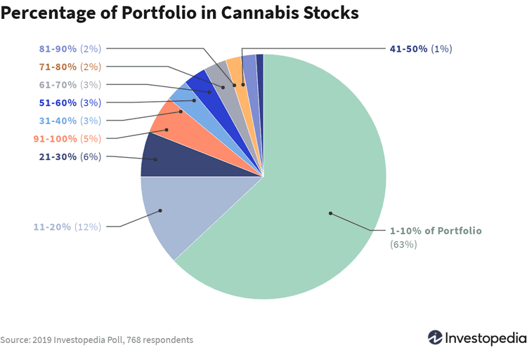

The cannabis market is gradually being recognized as a lucrative opportunity for investors, driven by a combination of legal reforms and growing societal acceptance. Despite its apparent volatility, this burgeoning sector presents numerous possibilities for financial growth and diversification. This article aims to provide an insightful analysis of the associated risks and opportunities within cannabis investments, emphasizing the increasingly employed strategy of algorithmic trading. 

Algorithmic trading, which involves using automated systems to carry out trading orders at high speeds and volumes, offers investors a strategic edge in the fast-moving and often unpredictable cannabis market. By utilizing advanced algorithms, investors can potentially capitalize on market fluctuations with precision and efficiency. In such a dynamic environment, understanding the application of algorithmic strategies can significantly impact investment outcomes.

Changing regulations play a pivotal role in shaping the cannabis market landscape. As governments around the world continually reassess cannabis laws, the market experiences shifts that can either benefit or pose challenges to investors. For instance, the legalization of cannabis for medical and recreational use in various regions has opened up new avenues for growth, yet it remains subject to the political climate and public health discussions, which may lead to abrupt regulatory changes. These evolving legal frameworks necessitate investors to be vigilant and adaptable, ensuring they are well-informed about the regulatory environment in which they operate.

In summarizing, the introduction of this article frames cannabis investments as a domain ripe with potential yet shadowed by significant risks largely dictated by market volatility and regulatory changes. With algorithmic trading emerging as a pivotal tool for navigating this landscape, investors are presented with both sophisticated strategies and evolving challenges that require careful consideration and informed decision-making.

## Table of Contents

## The Current State of the Cannabis Market

The cannabis market is experiencing significant growth, a phenomenon fueled largely by extensive legal reforms and increasing societal acceptance. This expansion is marked by the transition of cannabis from illicit status to a legitimate and thriving sector in numerous regions, particularly in North America and parts of Europe.

In recent years, several countries and states have legalized cannabis for medical and recreational use, prompting a surge in market size. For instance, the global legal cannabis market was valued at approximately USD 17.7 billion in 2019 and is projected to reach USD 73.6 billion by 2027, growing at a compound annual growth rate (CAGR) of 18.1% from 2020 to 2027[^1^]. This growth trajectory is attributed to the increasing legalization trend and a corresponding rise in consumer acceptance.

The cannabis industry is not monolithic; it encompasses a diverse array of businesses. Primarily, it includes cultivation enterprises that focus on the production of cannabis plants. These businesses range from small-scale farms to large, industrial operations. Additionally, the retail sector plays a crucial role, with dispensaries and cannabis shops proliferating in markets where legal frameworks permit the sale of cannabis products for medical and recreational use.

Moreover, the technological revolution has permeated the cannabis industry, giving rise to a variety of technology services aimed at optimizing operations and enhancing compliance with regulatory standards. Technology companies are developing sophisticated systems for cultivation management, supply chain logistics, and consumer engagement. For example, advanced data analytics and IoT (Internet of Things) solutions are increasingly employed to improve yield quality and efficiency in cannabis production. 

The industry's heterogeneity and rapid evolution present numerous opportunities for entrepreneurs and investors alike. Nonetheless, stakeholders must navigate the complexities of this volatile yet promising market landscape.

[^1^]: "Cannabis Market Size, Share & Trends Analysis Report by Application (Medical, Recreational), by Product Type (Buds, Oil), by Compound (THC-dominant, CBD-dominant), by Region, and Segment Forecasts, 2020 - 2027", Grand View Research, April 2020.

## Risks Associated with Cannabis Investments

The cannabis investment landscape is fraught with several risks that investors must navigate to achieve potential gains. One of the most significant challenges is the variability in legal and regulatory frameworks across different jurisdictions. While some regions have embraced the legalization of cannabis for both medical and recreational use, others maintain stringent restrictions. This patchwork of regulations can create uncertainty, complicating investment decisions and affecting the potential profitability of cannabis-related enterprises. Investors must regularly monitor legal developments to mitigate risks and adapt strategies accordingly. Potential changes at the federal level, especially in countries like the United States, where cannabis remains illegal under federal law despite state-level legalizations, could significantly impact market dynamics and investment outcomes.

Market [volatility](/wiki/volatility-trading-strategies) is another inherent risk within the cannabis sector. The fledgling nature of the market means that stock prices of cannabis companies can experience significant fluctuations, driven by investor sentiment, regulatory news, and sector-specific developments. For instance, announcements regarding new legislation or changes in public policy can lead to rapid shifts in stock valuations. This volatility can be both a risk and an opportunity, necessitating careful timing and strategic planning from investors who wish to harness these market movements for potential gains.

Supply chain challenges also pose a significant risk to cannabis investments. The industry faces unique hurdles, such as compliance with stringent regulations, ensuring product quality, and managing complex logistics chains from cultivation to retail. Variability in crop yields, delays in processing or distribution, and regulatory compliance issues can disrupt supply chains, affecting the profitability of involved businesses. Moreover, discrepancies in regulatory standards across regions can lead to further complications in interstate or international operations.

Overall, investors in the cannabis market must conduct thorough due diligence to understand these risks and develop strategies to mitigate them effectively. By staying informed and adaptable, they can better navigate the uncertainties inherent in this rapidly evolving industry.

## Opportunities in Cannabis Investments

The cannabis industry presents several investment opportunities driven by increasing consumer acceptance and legal reforms. One primary opportunity is the potential for significant market growth as societal attitudes shift, and more regions legalize cannabis use. According to a Grand View Research report, the global legal marijuana market size was valued at USD 17.8 billion in 2021 and is projected to expand at a compound annual growth rate (CAGR) of 25.1% from 2022 to 2030 (Grand View Research, 2022). This growth is largely fueled by both recreational and medicinal cannabis markets, as well as the increasing prevalence of public and private funding for research on therapeutic uses of cannabis.

Technological advancements offer another lucrative opportunity. Innovations in cultivation technologies, such as vertical farming and automation, improve production efficiency and yield. Companies are investing in genetic engineering to develop strains with specific traits, such as higher potency or disease resistance, enhancing product offerings. Technology also plays a crucial role in the retail segment, with e-commerce platforms enabling a broader reach to consumers and the implementation of blockchain technology improving supply chain transparency.

Product diversification is expanding beyond traditional smoking products to include edibles, oils, and topicals, capturing a broader consumer base. The introduction of cannabinoid-infused wellness products, including beverages and skincare items, illustrates the sector's potential to reach various markets.

The medical cannabis segment is pivotal in driving future growth. Increasing clinical research and evidence supporting cannabis’s efficacy in treating various conditions, such as chronic pain, epilepsy, and multiple sclerosis, are enhancing acceptance among medical professionals and patients. Nations with established healthcare infrastructure and regulatory frameworks are witnessing a surge in medical cannabis applications, offering a stable and promising market for investors.

As the landscape of cannabis investments evolves, the sector's potential appears robust, marked by substantial growth prospects, technological innovation, and an expanding product range, with medical applications being particularly promising. Investors can benefit from keeping abreast of developments within these domains to identify valuable opportunities.

## Algorithmic Trading in the Cannabis Market

Algorithmic trading, characterized by the use of computer algorithms to automate trading decisions, has increasingly permeated volatile markets like cannabis due to its potential to process large data volumes and execute trades at optimal speeds. In the cannabis sector, where market dynamics are often unpredictable due to fluctuating regulations and consumer trends, [algorithmic trading](/wiki/algorithmic-trading) offers a methodical approach to capitalize on price movements.

Algorithmic strategies in the cannabis market typically involve technical analysis, statistical [arbitrage](/wiki/arbitrage), and sentiment analysis. Technical analysis uses historical market data to forecast future price movements. Algorithms can quickly identify patterns and trading signals, executing trades based on predefined criteria. For instance, a popular algorithmic strategy is the moving average crossover, where a short-term moving average crosses over a long-term moving average, signaling a potential buy or sell opportunity.

Another effective strategy is [statistical arbitrage](/wiki/statistical-arbitrage), which seeks to exploit price inefficiencies between related cannabis securities. By using mathematical models, these algorithms can detect price discrepancies, enabling high-frequency trading that capitalizes on minute, temporary differences in asset pricing.

Sentiment analysis in algorithmic trading leverages data from news articles, social media, and other digital sources. Algorithms scan for keywords or sentiments that might influence stock prices and execute trades in anticipation of these market influences.

While algorithmic trading offers significant opportunities for profit, it also carries risks. High-frequency trading can lead to increased market volatility, and algorithms may fail to account for unexpected market events or changes in regulatory environments. Moreover, discrepancies in data feeds or errors in programming could lead to substantial financial losses.

The rewards of algorithmic trading in the cannabis market are closely tied to the trader’s ability to develop sophisticated algorithms and back-test strategies using historical data. Success in this field often requires not only technical expertise but also a comprehensive understanding of the cannabis sector's unique market dynamics. Consequently, while algorithmic trading can amplify gains in the cannabis market, investors must also be prepared to manage the associated risks through rigorous testing and continuous optimization of trading strategies.

## Investment Strategies

In the cannabis market, choosing between long-term and short-term investment strategies requires careful consideration of market dynamics and individual risk tolerance. Long-term investors focus on the sustained growth of the cannabis industry, propelled by ongoing legalization and evolving consumer habits. This strategy emphasizes patience, allowing investors to benefit from the gradual removal of legal barriers and the expansion of market opportunities. Long-term investors might target companies with strong fundamentals, scalable business models, and potential for enduring market presence. This can include companies involved in cultivation, distribution, or innovative cannabis-related technologies.

Conversely, short-term strategies in the cannabis sector leverage market volatility to gain from price fluctuations. Traders in this category prioritize quick returns, often employing technical analysis and market sentiment indicators to identify lucrative entry and [exit](/wiki/exit-strategy) points. However, this approach involves higher risk, necessitating vigilance and adaptability to rapidly changing market conditions. 

A diversified portfolio is crucial for managing risk exposure in the cannabis market. Diversification minimizes the impact of adverse events affecting a specific sector or company by spreading investments across multiple assets. A well-rounded cannabis portfolio might include stocks from varied segments such as medical cannabis, recreational products, and ancillary services like technology and logistics. Additionally, geographic diversification, investing in companies across different jurisdictions with varying legal frameworks, can further buffer against regulatory risks.

Conducting thorough due diligence is essential when investing in cannabis-related companies. Investors should evaluate the financial health of potential investments, scrutinizing balance sheets, cash flow statements, and revenue projections. Understanding management expertise, corporate governance, and competitive positioning is also crucial. It's advisable to keep abreast of regulatory developments and market trends that could affect the company's operations. Furthermore, investors should assess any legal challenges or compliance issues companies may face, which could significantly impact their performance.

By balancing these strategies and considerations, investors can better navigate the complexities of the cannabis market, potentially enhancing returns while mitigating associated risks.

## Social and Ethical Considerations

In the cannabis industry, social and ethical considerations have become increasingly central as the sector expands and evolves. Addressing social responsibility involves acknowledging the historical, legal, and cultural complexities associated with cannabis. This includes recognizing the impacts of past cannabis prohibition, particularly on marginalized communities, and striving to implement equitable business practices.

One of the primary ethical concerns in cannabis investments is ensuring that companies operate with transparency and integrity. Ethical practices extend beyond compliance with legal standards to encompass broader social responsibilities. Investors and companies are encouraged to engage in fair labor practices, sustainable cultivation methods, and responsible marketing strategies. Ethical investment decisions should prioritize companies that demonstrate a commitment to reducing stigma, improving community relations, and supporting equitable access to cannabis products.

Social equity is a critical element, especially considering the cannabis market's history of disproportionate legal actions against certain demographic groups. Many local and federal jurisdictions in the United States have established social equity programs intended to rectify historical inequalities. These programs aim to provide opportunities for individuals adversely affected by cannabis prohibition, facilitating their entry into the industry through grants, loans, and technical assistance.

Justice considerations involve advocating for policy reforms that seek to expunge the records of individuals with prior cannabis-related offenses, thereby improving their employment prospects. Companies and investors have a role in supporting such reforms and ensuring that their business practices do not perpetuate existing inequities. Being socially responsible also involves community engagement and reinvestment, such as funding education and healthcare in impacted areas.

Overall, the social and ethical responsibilities of the cannabis industry require a comprehensive and empathetic approach, aligning business operations with broader societal goals. Investors are urged to critically assess the social strategies of cannabis companies to contribute to a more equitable and just industry landscape.

## Conclusion

The cannabis investment landscape presents a range of opportunities and challenges influenced by regulatory changes, market volatility, and evolving consumer preferences. Investors must navigate these complexities with a blend of strategic foresight and caution to capitalize on potential gains while mitigating risks.

The potential within the cannabis market is substantial, driven by expanding legalization and increasing consumer acceptance. As more regions embrace cannabis reforms, the market is poised for considerable growth. Investors have the opportunity to explore diverse segments, from cultivation to retail and ancillary technology services, each presenting unique investment prospects. Furthermore, the growing recognition of medical cannabis promises to bolster the industry's expansion, offering additional avenues for investment.

However, the cannabis market is fraught with challenges. Regulatory risks persist, with variations across jurisdictions and the potential for sudden policy changes creating a precarious investment environment. Additionally, the inherent volatility of the cannabis market requires investors to be astute and adaptable, capable of managing unexpected market fluctuations.

In response to these challenges, informed and cautious investment approaches are crucial. Due diligence, comprehensive market research, and diversification strategies are vital in managing risk and optimizing returns. Investors should remain vigilant of regulatory developments and consumer trends to make timely, strategic decisions.

Looking forward, the cannabis investment landscape is likely to evolve with further legalization efforts and technological advancements. As the industry matures, increased transparency and regulatory standardization may contribute to a more stable investment environment. Innovations in product offerings and advancements in cultivation and distribution technologies could drive future growth, providing lucrative opportunities for investors.

In conclusion, while the cannabis industry offers significant potential, it demands a careful and informed approach. By staying attuned to market dynamics and adopting prudent investment strategies, investors can navigate the complexities of the cannabis market and position themselves for potential long-term success.

## References & Further Reading

[1]: "Cannabis Market Size, Share & Trends Analysis Report by Application (Medical, Recreational), by Product Type (Buds, Oil), by Compound (THC-dominant, CBD-dominant), by Region, and Segment Forecasts, 2020 - 2027", Grand View Research, April 2020.

[2]: "Advances in Financial Machine Learning" by Marcos Lopez de Prado

[3]: "Evidence-Based Technical Analysis: Applying the Scientific Method and Statistical Inference to Trading Signals" by David Aronson

[4]: "Machine Learning for Algorithmic Trading" by Stefan Jansen

[5]: "Quantitative Trading: How to Build Your Own Algorithmic Trading Business" by Ernest P. Chan