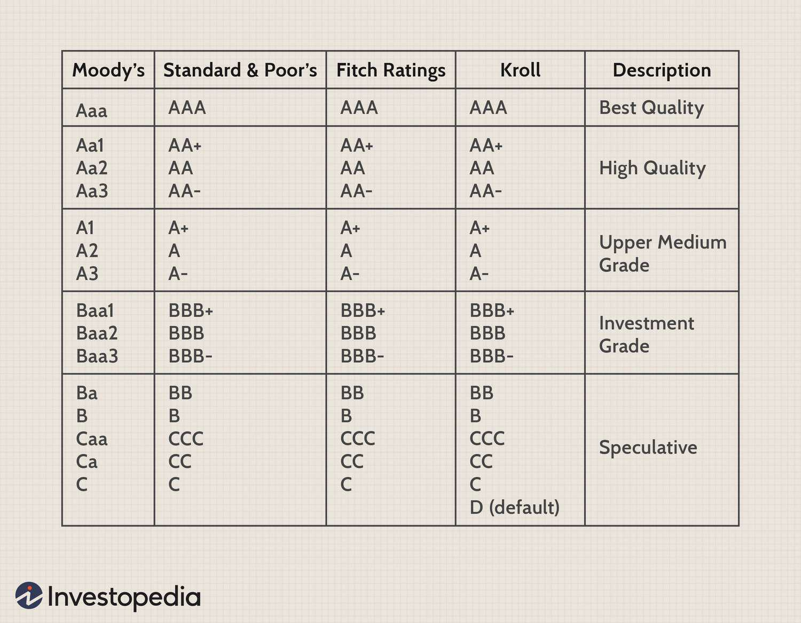

High-yield bonds, commonly known as junk bonds, present investors with the opportunity for greater returns than those offered by investment-grade securities. These bonds are characterized by higher interest rates, reflecting the increased risk associated with them. Investment-grade bonds typically have lower yields but are considered safer due to their higher credit ratings. High-yield bonds, on the other hand, are assigned lower ratings by credit rating agencies, often categorized as BB+ or lower, making them more prone to default risk.

The investment in high-yield bonds demands careful consideration of the associated risks. Default risk is one of the primary concerns, as issuers of junk bonds are more likely to face financial distress, potentially leading to a failure to meet the bond’s obligations. Additionally, other factors such as interest rate fluctuations and market liquidity must be evaluated, as these bonds are more sensitive to economic changes.



With the advancement of technology, innovative approaches like algorithmic trading have emerged as significant tools to aid in evaluating investment strategies for high-yield bonds. Algorithmic trading systems can analyze large volumes of data swiftly and identify trading opportunities that may not be evident through traditional methods. These systems can assess default probabilities, forecast market trends, and execute trades with precision, thus assisting investors in making informed decisions in a volatile market environment.

This article aims to explore high-yield bond trading, the inherent risks involved, and how algorithmic trading strategies can enhance risk assessment and investment outcomes. Understanding these elements can provide investors with the necessary insight to navigate the complexities of the high-yield bond market effectively.

## Table of Contents

## Understanding High-Yield Bonds

High-yield bonds, also known as junk bonds, are debt securities rated below investment-grade, typically BB+ or lower by major credit rating agencies such as Standard & Poor's and Moody's. These bonds offer higher interest rates as compensation for their elevated risk of default. Unlike investment-grade bonds, which are issued by financially stable entities, high-yield bonds are often issued by companies with weaker financial standings, leading to higher yield offerings to attract investors.

The attractiveness of high-yield bonds is primarily due to their potential for higher returns, which results from the interest rate spread over safer, investment-grade bonds. This risk-return trade-off is a crucial consideration for investors seeking to maximize returns on fixed-income investments. However, the increased yield carries a corresponding increase in risk factors, including heightened vulnerability to economic downturns and market volatility.

High-yield bonds are often issued by entities in sectors experiencing rapid growth or undergoing restructuring. Corporations with leveraged balance sheets, small-scale enterprises, or firms in cyclical industries are typical issuers within this category. Understanding the nature and financial health of these entities is fundamentally important for high-yield bond investments, as the issuer's creditworthiness greatly impacts the default risk and stability of returns.

Investors should also assess other characteristics of high-yield bonds, such as maturity dates, interest payment schedules (e.g., fixed or floating rates), and any embedded options like call provisions that allow the issuer to redeem the bonds before maturity. These elements can significantly affect the bond's yield and risk profile, influencing investor decisions on including these instruments within a diversified portfolio.

In conclusion, high-yield bonds are a complex yet potentially rewarding component of a broader investment strategy. Careful evaluation of the bond's risks, issuer characteristics, and the macroeconomic environment is essential for leveraging the advantage of high-yield bonds while mitigating potential losses.

## Risks Associated with High-Yield Bonds

High-yield bonds, also known as junk bonds, [carry](/wiki/carry-trading) an elevated risk of default compared to their investment-grade counterparts, which significantly contributes to their market [volatility](/wiki/volatility-trading-strategies). The default risk is a primary concern for investors as it reflects the likelihood that an issuer will fail to meet the interest or principal repayments. This risk is heightened by the credit ratings of high-yield bonds, which fall below BB+ according to Standard & Poor's or Ba1 according to Moody's, indicating a speculative nature.

Interest rate risk is another [factor](/wiki/factor-investing) impacting high-yield bonds. This risk stems from the inverse relationship between bond prices and interest rates. When interest rates rise, existing bonds with lower fixed rates tend to lose value because new bonds are issued with higher yields, making them more attractive. Consequently, in an environment of fluctuating rates, investors in high-yield bonds may experience significant price volatility.

Liquidity risk is also prevalent in this market. High-yield bonds are generally less liquid than investment-grade bonds, meaning that they are harder to sell quickly without significantly affecting the price. This risk is exacerbated during financial distress or economic downturns, when even buyers are scarce, leading to wider bid-ask spreads.

Economic downturns pose additional challenges, often leading to increased default rates among high-yield issuers as they tend to be more susceptible to adverse economic conditions. These periods can put a strain on the financial health of bond issuers, increasing the probability of default. Consequently, investors in high-yield bonds need to be vigilant regarding both macroeconomic indicators and the specific financial characteristics of the bond issuers. This vigilance allows for a more precise assessment of the risks associated with their investments.

## Advantages of Including High-Yield Bonds in Portfolios

High-yield bonds offer several notable advantages that make them attractive to certain investors, particularly those looking for higher returns and diversification. 

Firstly, these bonds provide the potential for higher yields compared to their investment-grade counterparts. This is primarily because high-yield bonds compensate investors for their higher risk of default by offering higher interest rates. During periods of economic expansion, the financial health of issuers typically improves, leading to lower default rates and enhanced performance of high-yield bonds. The additional income generated from the higher yields can significantly benefit an investment portfolio, especially in a low-interest-rate environment where traditional fixed-income investments might offer minimal returns.

Secondly, high-yield bonds contribute beneficial diversification to an investment portfolio. They typically exhibit a lower correlation with investment-grade bonds and equities. The correlation coefficient, which is a statistical measure of how two securities move in relation to each other, can be lower or negative between high-yield bonds and equities, enhancing diversification. This means that the inclusion of high-yield bonds can reduce the overall volatility of a portfolio and potentially improve risk-adjusted returns. By spreading investments across different types of assets, investors can buffer against market-specific downturns and improve the resilience of their overall investment strategy.

Lastly, high-yield bondholders generally enjoy more protections compared to equity holders in the event of bankruptcy. In a corporate liquidation process, bondholders are prioritized over equity holders, meaning that high-yield bond investors are more likely to recoup a portion of their investment compared to shareholders. This hierarchical advantage provides an additional level of security to bond investors, despite the higher risk profile typically associated with high-yield securities.

By factoring in these advantages, investors can strategically enhance their portfolios by capturing higher yields, achieving diversification, and gaining additional protections, all while managing the inherent risks through careful analysis and selection of bonds.

## The Role of Algorithmic Trading in Risk Assessment

Algorithmic trading has become an integral tool for assessing risk in high-yield bond markets. This approach capitalizes on advanced computational techniques to process vast amounts of financial data, facilitating informed decision-making with minimal human intervention. The capacity of [algorithmic trading](/wiki/algorithmic-trading) platforms to analyze complex datasets allows investors to identify intricate patterns and trends that might otherwise go unnoticed.

One of the primary benefits of employing algorithmic trading in high-yield bond markets is its ability to enhance the assessment of default probabilities. By utilizing [machine learning](/wiki/machine-learning) models, investors can predict the likelihood of bond issuers defaulting based on historical data, economic indicators, and other relevant variables. These models, such as logistic regression or neural networks, can quantify the risk associated with specific bonds, enabling investors to make data-driven adjustments to their portfolios.

For instance, consider a logistic regression model that predicts the probability of default $P(D=1)$ for a bond issuer. This model might take on the form:

$$
P(D=1) = \frac{1}{1 + e^{-(\beta_0 + \beta_1X_1 + \beta_2X_2 + \ldots + \beta_nX_n)}}
$$

where $X_1, X_2, \ldots, X_n$ are independent variables such as financial ratios, historical performance metrics, and macroeconomic indicators, and $\beta_0, \beta_1, \beta_2, \ldots, \beta_n$ are the model coefficients estimated from the data.

Beyond estimating default probabilities, algorithmic trading platforms can simulate various economic scenarios to mitigate associated risks. By running simulations that incorporate factors like [interest rate](/wiki/interest-rate-trading-strategies) changes, economic downturns, or shifts in market sentiment, investors can better understand how their high-yield bond portfolios might behave under different conditions. This predictive capability allows for the development of robust risk management strategies.

Advanced algorithmic systems might employ Monte Carlo simulations to explore a wide range of potential future states of the world. These simulations repeatedly sample from distributions of key economic variables to create a diverse set of possible outcomes. The results provide a probabilistic assessment of risks, guiding investors in making strategic decisions that align with their risk tolerance and investment objectives.

Overall, algorithms enhance the capability of investors to navigate the complexities of high-yield bond markets. With the continuous evolution of financial technologies, the role of algorithmic trading in risk assessment is poised to expand, offering new avenues for optimizing investment strategies and managing risk effectively.

## Strategies for Investing in High-Yield Bonds

Investing in high-yield bonds necessitates a strategic approach to balance potential returns with inherent risks. Fundamental and technical analysis serve as crucial tools in evaluating these investment opportunities. 

Fundamental analysis involves a thorough examination of the issuer's financial health, creditworthiness, and market position. Metrics such as debt-to-equity ratio, interest coverage ratio, and historical revenue growth are vital in assessing the issuer's ability to meet its obligations. Analysts often scrutinize the macroeconomic environment, industry trends, and the issuer's competitive landscape to forecast future performance accurately.

Technical analysis, on the other hand, involves the study of price movements and trading volumes to identify trends and patterns. Charting tools and indicators such as moving averages, relative strength index (RSI), and Bollinger Bands can provide insights into market sentiment and potential price movements. This analysis helps investors in determining optimal entry and [exit](/wiki/exit-strategy) points.

Diversification across multiple issuers and sectors mitigates risk by reducing exposure to any single entity's default. By allocating investments among different high-yield issuers, investors can spread risk and reduce the impact of individual defaults on their portfolios. Sector diversification further protects against industry-specific downturns. For instance, an economic slowdown affecting the energy sector may not equally impact the technology sector, thereby cushioning overall portfolio performance.

Active management and opportunistic trading enable investors to react promptly to market inefficiencies. This approach involves constantly monitoring the market for mispriced securities and taking advantage of fluctuating bond prices. Algorithmic trading can enhance this strategy by automating the identification and execution of trades based on predefined criteria. Such platforms can analyze vast datasets quickly, allowing investors to capitalize on [arbitrage](/wiki/arbitrage) opportunities and short-term price discrepancies.

Algorithmic trading relies on sophisticated models that incorporate factors like interest rate changes, credit spreads, and economic indicators to optimize investment strategies. Here's a simple example of a Python algorithm that could be used to backtest a trading strategy based on moving averages:

```python
import pandas as pd
import numpy as np

# Load historical bond price data
data = pd.read_csv('high_yield_bond_data.csv')
data['Date'] = pd.to_datetime(data['Date'])
data.set_index('Date', inplace=True)

# Calculate moving averages
data['Short_MA'] = data['Price'].rolling(window=10).mean()
data['Long_MA'] = data['Price'].rolling(window=50).mean()

# Signal generation: Buy when short-term MA crosses above long-term MA, sell otherwise
data['Signal'] = 0
data['Signal'][10:] = np.where(data['Short_MA'][10:] > data['Long_MA'][10:], 1, -1)

# Calculate daily returns
data['Returns'] = data['Price'].pct_change()

# Apply the strategy
data['Strategy_Returns'] = data['Signal'].shift(1) * data['Returns']

# Compute cumulative returns
cumulative_strategy_returns = (1 + data['Strategy_Returns']).cumprod()
```

This simple strategy generates buy or sell signals based on the crossover of short-term and long-term moving averages. The algorithm backtests the strategy on historical price data, calculating potential returns based on hypothetical trades.

By integrating [fundamental analysis](/wiki/fundamental-analysis), diversification techniques, and active management, including algorithmic trading, investors can formulate a robust strategy for high-yield bond investments. This comprehensive approach maximizes potential returns while mitigating the associated risks, paving the way for successful investment outcomes in the high-yield bond market.

## Conclusion

High-yield bonds, despite their higher risk profile, offer appealing opportunities for investors seeking amplified returns compared to investment-grade securities. These bonds come with inherent risks such as default, interest rate fluctuations, and [liquidity](/wiki/liquidity-risk-premium) challenges. However, integrating algorithmic trading into investment strategies can significantly mitigate these disadvantages. 

Algorithmic trading leverages advanced computational techniques to analyze large datasets, discern patterns, and execute trades with precision and speed beyond human capability. By automating the risk assessment process, algorithms can enhance the identification of default probabilities and dynamically adjust portfolios in response to changing market conditions. This technological approach not only diminishes manual errors but also provides a strategic edge in optimizing bond investments based on comprehensive market analysis.

Incorporating high-yield bonds into diversified portfolios can yield substantial benefits, particularly during periods of economic growth. Algorithmic trading, with its ability to simulate various economic scenarios and assimilate vast amounts of market data, is instrumental in navigating the complexities of high-yield bond markets. As investors strive for successful outcomes, understanding market dynamics and embracing technological advancements like algorithmic trading have become indispensable for robust investment decisions in the high-yield bond sector.

## References & Further Reading

[1]: Altman, E. I. (1989). ["Measuring Corporate Bond Mortality and Performance."](https://onlinelibrary.wiley.com/doi/abs/10.1111/j.1540-6261.1989.tb02630.x) The Journal of Finance, 44(4), 909-922.

[2]: ["Credit Risk Modeling using Excel and VBA"](https://onlinelibrary.wiley.com/doi/book/10.1002/9781119202219) by Gunter Löffler and Peter N. Posch

[3]: Hull, J. C. (2018). ["Risk Management and Financial Institutions,"](https://www.amazon.com/Management-Financial-Institutions-Wiley-Finance/dp/1119448115) 5th Edition, Wiley Finance Series.

[4]: Lopez de Prado, M. (2018). ["Advances in Financial Machine Learning."](https://www.amazon.com/Advances-Financial-Machine-Learning-Marcos/dp/1119482089) Wiley.

[5]: Iman, S. (2003). ["Junk Bonds: A Relationship between Risk and Yield."](https://books.google.com/books/about/Investing_in_Junk_Bonds.html?id=sR3jZ_uadlMC) Social Science Research Network (SSRN). 

[6]: Chan, E. P. (2008). ["Quantitative Trading: How to Build Your Own Algorithmic Trading Business."](https://github.com/ftvision/quant_trading_echan_book) Wiley Trading Series.