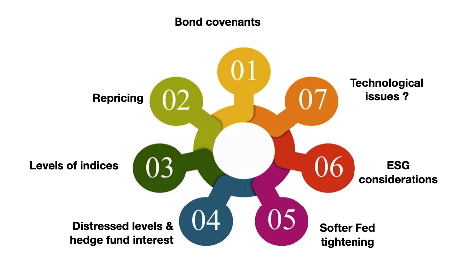

## Table of Contents

## What are high-yield bonds?

High-yield bonds are a type of bond that offers higher interest rates than regular bonds. They are also called junk bonds. These bonds are issued by companies that might have a higher risk of not being able to pay back the money they borrow. Because of this higher risk, investors get paid more interest as a reward for taking the chance.

Investors like high-yield bonds because they can earn more money from the higher interest rates. However, there is a bigger chance that the company might not be able to pay back the bond. This means investors need to be careful and do a lot of research before buying these bonds. If the company does well, investors can make a good profit, but if the company struggles, they could lose money.

## Why are high-yield bonds considered riskier than other types of bonds?

High-yield bonds are considered riskier than other types of bonds because they are issued by companies that have a lower credit rating. This means these companies are seen as more likely to have trouble paying back their debts. When a company has a lower credit rating, it's because financial experts think there's a bigger chance the company might not be able to make its interest payments or return the money it borrowed. So, if you buy a high-yield bond, you're taking a bigger chance that the company might not be able to pay you back.

Because of this higher risk, investors demand a higher interest rate as a reward for taking on the extra danger. This higher interest rate is what makes high-yield bonds attractive to some investors. However, if the company runs into financial trouble, the value of the bond can drop a lot, and investors could lose their money. That's why high-yield bonds are often called "junk bonds" – they can be a good way to earn more interest, but they come with a bigger chance of losing your investment.

## What is risk assessment in the context of high-yield bonds?

Risk assessment in the context of high-yield bonds is about figuring out how likely it is that the company issuing the bond might not be able to pay back the money it borrowed. When investors look at high-yield bonds, they need to check the company's financial health, its ability to make money, and how it manages its debts. This involves looking at things like the company's credit rating, which tells investors how risky the bond is. A lower credit rating means the bond is riskier, but it also means the interest rate is higher, which can be a good reward if the company does well.

Investors also look at the overall economy and the specific industry the company is in. If the economy is doing badly or the industry is struggling, it can be harder for the company to make its payments. So, part of the risk assessment is understanding these bigger factors that might affect the company's ability to pay back the bond. By doing a thorough risk assessment, investors can decide if the potential reward of a high-yield bond is worth the risk of possibly losing their money.

## What are the key factors to consider when assessing the risk of high-yield bonds?

When assessing the risk of high-yield bonds, it's important to look at the company's credit rating first. Credit ratings are like report cards that show how likely a company is to pay back its debts. A lower credit rating means the bond is riskier, but it also means the company has to offer a higher interest rate to attract investors. So, checking the credit rating helps you understand if the potential reward is worth the risk. You also need to look at the company's financial statements to see if it's making enough money and managing its debts well.

Another key factor is the overall economy and the industry the company is in. If the economy is doing poorly or the industry is facing challenges, it can be harder for the company to make its bond payments. For example, if a company makes cars and people are buying fewer cars because of a recession, that company might struggle to pay back its bonds. So, understanding the bigger picture of the economy and the industry helps you see if the company's situation might get better or worse.

Lastly, consider the bond's terms and conditions. Some high-yield bonds might have features like being able to be paid back early or having their interest rates change. These features can add more risk or make the bond more attractive. By looking at all these factors together—the company's credit rating, financial health, the economy, the industry, and the bond's terms—you can make a better decision about whether a high-yield bond is a good investment for you.

## How does credit rating impact the risk assessment of high-yield bonds?

Credit rating is a big deal when you're trying to figure out how risky a high-yield bond is. Think of it like a report card for the company that issued the bond. If a company has a low credit rating, it means that experts think there's a bigger chance the company might not be able to pay back the money it borrowed. So, if you buy a bond from a company with a low credit rating, you're taking a bigger risk. But, because of that risk, the company has to offer you a higher interest rate to make the bond more attractive to you.

When you're looking at high-yield bonds, checking the credit rating helps you decide if the higher interest rate is worth the extra risk. A lower credit rating means the bond is riskier, but it also means you could earn more money if the company does well. So, by understanding the credit rating, you can weigh the potential reward against the risk of possibly losing your money. It's like deciding if you want to play a game where you could win big, but you could also lose big.

## What role does the issuer's financial health play in the risk assessment of high-yield bonds?

The financial health of the company that issues a high-yield bond is really important when you're trying to figure out how risky the bond is. If a company is making good money and doesn't have too much debt, it's more likely to be able to pay back the money it borrowed. So, when you're looking at a high-yield bond, you want to check the company's financial statements to see if it's doing well. If the company is healthy, the bond is less risky, even if it's a high-yield bond.

On the other hand, if the company is struggling to make money or has a lot of debt, it might have a hard time paying back the bond. This makes the bond riskier. So, part of figuring out the risk of a high-yield bond is looking at the company's financial health. If the company's financial situation is shaky, you might want to think twice before investing, even if the bond offers a high interest rate.

## How can market conditions affect the risk profile of high-yield bonds?

Market conditions can really change how risky high-yield bonds are. If the economy is doing well, companies are usually making more money and it's easier for them to pay back their bonds. This makes high-yield bonds less risky because the companies are in a better spot to meet their payments. But if the economy starts to struggle, like during a recession, companies might find it harder to make money. This means they might have trouble paying back their bonds, making high-yield bonds riskier.

Also, the industry the company is in can affect the risk of its bonds. If the industry is doing well, the company is likely to be doing well too, which means its bonds are less risky. But if the industry is facing problems, like new regulations or less demand for its products, the company might struggle to make its bond payments. So, when you're thinking about buying a high-yield bond, you need to look at both the overall economy and the specific industry to understand how market conditions could change the risk of your investment.

## What are common methodologies used for risk assessment of high-yield bonds?

When people want to figure out how risky a high-yield bond is, they often start by looking at the company's credit rating. Credit ratings come from special agencies that give companies a score based on how likely they are to pay back their debts. A lower score means the bond is riskier, but it also means the company has to offer a higher interest rate to attract investors. So, checking the credit rating helps investors decide if the potential reward is worth the risk. Besides the credit rating, investors also look at the company's financial statements to see if it's making enough money and managing its debts well. If the company is healthy, the bond is less risky, even if it's a high-yield bond.

Another important thing to consider is the overall economy and the specific industry the company is in. If the economy is doing well, companies are usually making more money and it's easier for them to pay back their bonds. But if the economy is struggling, like during a recession, companies might find it harder to make their payments, making high-yield bonds riskier. The industry the company is in can also affect the risk of its bonds. If the industry is doing well, the company is likely to be doing well too, which means its bonds are less risky. But if the industry is facing problems, like new regulations or less demand for its products, the company might struggle to make its bond payments. So, understanding these bigger factors helps investors see if the company's situation might get better or worse.

## How do macroeconomic factors influence the risk assessment of high-yield bonds?

Macroeconomic factors play a big role in figuring out how risky high-yield bonds are. When the economy is doing well, companies usually make more money and it's easier for them to pay back their bonds. This means high-yield bonds are less risky because the companies are in a better spot to meet their payments. But if the economy starts to struggle, like during a recession, companies might find it harder to make money. This makes it tougher for them to pay back their bonds, which means high-yield bonds become riskier.

Also, things like interest rates set by the government can affect the risk of high-yield bonds. If interest rates go up, it can be harder for companies to borrow money and pay back what they owe, making their bonds riskier. On the other hand, if interest rates go down, it's easier for companies to manage their debts, which makes their bonds less risky. So, when investors look at high-yield bonds, they need to think about the overall health of the economy and how these big factors might change the risk of their investment.

## What advanced quantitative models are used to assess the risk of high-yield bonds?

Advanced quantitative models help investors figure out how risky high-yield bonds are by using math and numbers. One common model is called the Merton model, which looks at a company's assets and debts to see if it can pay back its bonds. It uses something called option pricing theory to figure out the chance of the company going bankrupt. Another model is the Altman Z-score, which uses different financial numbers from the company to predict if it might go out of business. These models help investors understand the risk better by giving them a more detailed picture of the company's financial health.

Another important model is the CreditMetrics model, which looks at how the value of a bond might change over time based on different things happening in the market. It uses historical data to guess what might happen in the future and helps investors see how much the bond's value could go up or down. There's also the KMV model, which is like the Merton model but uses more detailed information about the company's debts and how they are spread out. These models all help investors make smarter choices about high-yield bonds by giving them a clearer idea of the risks involved.

## How can investors mitigate risks associated with high-yield bonds?

Investors can lower the risks of high-yield bonds by spreading their money around. Instead of putting all their money into one bond, they can buy a bunch of different high-yield bonds. This way, if one company can't pay back its bond, the investor won't lose all their money. It's like not putting all your eggs in one basket. Another way to reduce risk is by looking at the company's credit rating and financial health before buying the bond. If the company looks strong and has a good chance of paying back its debts, the bond is less risky.

Another thing investors can do is keep an eye on the economy and the industry the company is in. If the economy is doing well and the industry is strong, the company is more likely to be able to pay back its bond. But if things start to go downhill, the investor might want to sell the bond before it loses too much value. Also, some investors use special tools and models to predict how risky a bond might be. These models look at lots of numbers and data to help investors make smarter choices. By using these strategies, investors can feel more confident about investing in high-yield bonds.

## What are the latest trends and developments in risk assessment practices for high-yield bonds?

Lately, people who invest in high-yield bonds have been using more advanced technology to figure out how risky these bonds are. They use big computers and special software to look at a lot of data at once. This helps them see patterns and make better guesses about what might happen in the future. For example, they use something called machine learning, which is like teaching a computer to learn from past information to predict what will happen next. This can help investors understand if a company is likely to pay back its bond or not.

Another big trend is that investors are paying more attention to things like environmental, social, and governance (ESG) factors. This means they look at how a company treats the environment, its workers, and how it's run. If a company is doing well in these areas, it might be less risky because it's more likely to be stable and successful in the long run. Investors are also using more real-time data to keep an eye on how the economy and different industries are doing, which helps them make quick decisions about buying or selling high-yield bonds.

## What is the role of algorithmic trading in risk assessment?

Algorithmic trading has become an integral tool for assessing risk in high-yield bond markets. This approach capitalizes on advanced computational techniques to process vast amounts of financial data, facilitating informed decision-making with minimal human intervention. The capacity of [algorithmic trading](/wiki/algorithmic-trading) platforms to analyze complex datasets allows investors to identify intricate patterns and trends that might otherwise go unnoticed.

One of the primary benefits of employing algorithmic trading in high-yield bond markets is its ability to enhance the assessment of default probabilities. By utilizing [machine learning](/wiki/machine-learning) models, investors can predict the likelihood of bond issuers defaulting based on historical data, economic indicators, and other relevant variables. These models, such as logistic regression or neural networks, can quantify the risk associated with specific bonds, enabling investors to make data-driven adjustments to their portfolios.

For instance, consider a logistic regression model that predicts the probability of default $P(D=1)$ for a bond issuer. This model might take on the form:

$$
P(D=1) = \frac{1}{1 + e^{-(\beta_0 + \beta_1X_1 + \beta_2X_2 + \ldots + \beta_nX_n)}}
$$

where $X_1, X_2, \ldots, X_n$ are independent variables such as financial ratios, historical performance metrics, and macroeconomic indicators, and $\beta_0, \beta_1, \beta_2, \ldots, \beta_n$ are the model coefficients estimated from the data.

Beyond estimating default probabilities, algorithmic trading platforms can simulate various economic scenarios to mitigate associated risks. By running simulations that incorporate factors like [interest rate](/wiki/interest-rate-trading-strategies) changes, economic downturns, or shifts in market sentiment, investors can better understand how their high-yield bond portfolios might behave under different conditions. This predictive capability allows for the development of robust risk management strategies.

Advanced algorithmic systems might employ Monte Carlo simulations to explore a wide range of potential future states of the world. These simulations repeatedly sample from distributions of key economic variables to create a diverse set of possible outcomes. The results provide a probabilistic assessment of risks, guiding investors in making strategic decisions that align with their risk tolerance and investment objectives.

Overall, algorithms enhance the capability of investors to navigate the complexities of high-yield bond markets. With the continuous evolution of financial technologies, the role of algorithmic trading in risk assessment is poised to expand, offering new avenues for optimizing investment strategies and managing risk effectively.

## References & Further Reading

[1]: Altman, E. I. (1989). ["Measuring Corporate Bond Mortality and Performance."](https://onlinelibrary.wiley.com/doi/abs/10.1111/j.1540-6261.1989.tb02630.x) The Journal of Finance, 44(4), 909-922.

[2]: ["Credit Risk Modeling using Excel and VBA"](https://onlinelibrary.wiley.com/doi/book/10.1002/9781119202219) by Gunter Löffler and Peter N. Posch

[3]: Hull, J. C. (2018). ["Risk Management and Financial Institutions,"](https://www.amazon.com/Management-Financial-Institutions-Wiley-Finance/dp/1119448115) 5th Edition, Wiley Finance Series.

[4]: Lopez de Prado, M. (2018). ["Advances in Financial Machine Learning."](https://www.amazon.com/Advances-Financial-Machine-Learning-Marcos/dp/1119482089) Wiley.

[5]: Iman, S. (2003). ["Junk Bonds: A Relationship between Risk and Yield."](https://books.google.com/books/about/Investing_in_Junk_Bonds.html?id=sR3jZ_uadlMC) Social Science Research Network (SSRN). 

[6]: Chan, E. P. (2008). ["Quantitative Trading: How to Build Your Own Algorithmic Trading Business."](https://github.com/ftvision/quant_trading_echan_book) Wiley Trading Series.