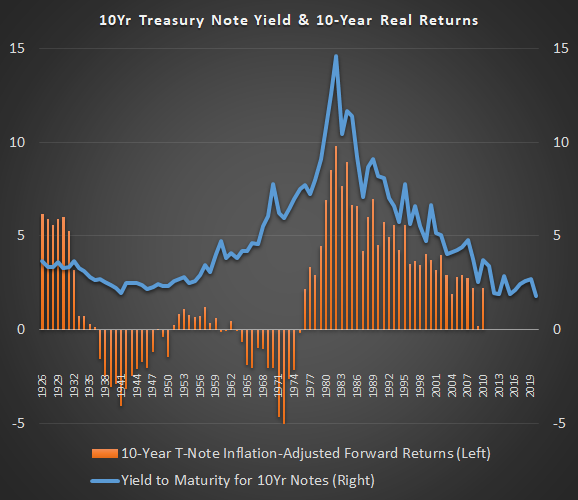

In an ever-evolving market landscape, understanding the dynamics of bond risk in long-term U.S. government bonds is crucial for investors. These bonds, often referred to as Treasury bonds, are characterized by their maturities extending from 10 to 30 years and are backed by the full faith and credit of the U.S. government. While generally perceived as safe investments due to their government backing, long-term bonds are not immune to risks, such as interest rate fluctuations, inflation, and opportunity costs related to alternative investments that could yield better returns.

In recent years, the bond market has seen significant transformations, particularly with the advent of algorithmic trading. This innovative approach utilizes advanced algorithms to execute trades based on specific criteria, enhancing trading speed and efficiency. Algorithmic trading not only minimizes human error but also improves the management of large portfolios, offering potential benefits during periods of market volatility.



This article aims to explore the inherent risks associated with long-term U.S. government bonds and examine the influence of algorithmic trading on the bond market. By offering insights into these developments, we seek to equip investors with the necessary understanding to navigate effectively through this shifting landscape of bond investments, helping them make informed decisions that align with their financial goals.

## Table of Contents

## Understanding Long-term U.S. Government Bonds

Long-term U.S. government bonds, commonly referred to as Treasury bonds, are debt securities with maturities that typically range from 10 to 30 years. These bonds are issued by the United States Department of the Treasury and are a vital component of the government's strategy to finance federal expenditures. 

Treasury bonds provide fixed interest payments, known as coupon payments, which are made semi-annually to bondholders. This predictable stream of income makes these bonds appealing to investors who prioritize stability and income generation over capital appreciation. The fixed nature of interest payments can be calculated as:

$$
\text{Coupon Payment} = \frac{\text{Coupon Rate} \times \text{Face Value}}{2}
$$

where the face value is commonly $1,000 per bond, and the coupon rate is determined at the bond's issuance.

Despite their reputation as low-risk investments due to their backing by the U.S. government's "full faith and credit," long-term Treasury bonds are not devoid of risks. Interest rate fluctuations, inflation, and other economic factors can significantly affect their performance in the market. The [interest rate](/wiki/interest-rate-trading-strategies) risk arises because bond prices and interest rates are inversely related; thus, when rates increase, existing bond prices tend to decrease. 

The perception of safety in U.S. Treasury bonds largely stems from the low credit risk associated with these instruments. The U.S. government has never defaulted on its obligations, reinforcing the confidence in Treasury securities as "risk-free" assets. However, the term "risk-free" primarily refers to the credit risk, as investors still face other potential risks.

Understanding the characteristics and associated risks of long-term U.S. government bonds is essential for investors who seek to include these instruments in their portfolios for diversification and risk management purposes. These bonds play a critical role in economic policy and individual investment strategies by providing an option for stable long-term returns safeguarded by the government's financial stability.

## Risks Associated with Long-term Bonds

Long-term U.S. government bonds, often viewed as secure investments due to their government backing, are inherently tied to several risks that investors must consider.

**Interest Rate Risk**

Interest rate risk is one of the most predominant risks associated with long-term bonds. This risk arises because the value of existing bonds typically decreases as interest rates increase. When new bonds are issued with higher interest rates, the price of older bonds with lower rates diminishes in comparison. For example, if an investor holds a bond with a 3% interest rate and new bonds are issued at a 4% rate, the market value of the older bond would generally decrease to make its yield align with current market conditions. This inverse relationship can be modeled mathematically by the duration and convexity of the bond, which quantify the sensitivity of the bond's price to interest rate changes.

**Inflation Risk**

Inflation risk refers to the potential erosion of purchasing power of the bond's future cash flows due to inflation. When inflation rises, the fixed payments received from the bond lose value in real terms. Real yield is calculated as the nominal yield minus the inflation rate. If the inflation rate increases beyond the nominal yield of the bond, the real yield becomes negative, reducing the investor's returns. This risk is prevalent in the long-term horizon as predicting inflationary trends accurately can be challenging.

**Credit Risk**

Even though U.S. government bonds are seen as the benchmark for a risk-free investment, they are not entirely devoid of credit risk. The credit risk in this context is minimal but not negligible, as it reflects the government's ability to meet its debt obligations. While a default by the U.S. government is highly unlikely, unforeseen financial or political crises could theoretically impact this ability. The credit risk is often reflected in the yield spread between U.S. Treasury bonds and other securities with similar maturities but different credit quality.

**Opportunity Cost**

Investing in long-term bonds also involves the opportunity cost of foregone investments in potentially higher-yielding assets. Locking funds in bonds with a fixed return over a long period can result in underperformance compared to equities or other investment vehicles that could generate higher returns in a bullish market. This risk becomes particularly significant in a diversified portfolio strategy, where an imbalance may limit the potential to capitalize on favorable market conditions.

In summary, understanding these risks associated with long-term U.S. government bonds enables investors to make informed decisions, balancing the desire for stable returns with the realities of market fluctuations and economic conditions.

## The Role of Algorithmic Trading

Algorithmic trading, often known as algo trading, is significantly transforming the bond markets by enhancing trading speed and efficiency. This form of trading employs advanced algorithms to automate the execution of trades based on predefined rules. Its integration into the bond markets has led to substantial improvements in transaction precision and expediency, effectively minimizing the impact of human error and circumventing time constraints traditionally associated with manual trading processes.

The core advantage of [algorithmic trading](/wiki/algorithmic-trading) lies in its ability to process vast amounts of data at high speeds, executing complex strategies that would be impractical for human traders to perform manually. Algorithms can evaluate multiple market variables simultaneously, allowing for rapid decision-making that is both accurate and consistent with the predefined trading criteria. This capability is particularly advantageous in volatile markets where timely execution can significantly influence the profitability of trades.

Algorithmic trading also facilitates more effective portfolio management, especially when dealing with large and diverse asset holdings. For instance, a fund manager overseeing a significant portfolio can utilize algorithms to rebalance the portfolio in real-time, ensuring optimal allocation across different asset classes. This automated capability not only enhances the precision of executed trades but also optimizes the overall performance of the portfolio.

Moreover, algorithmic trading can enhance price discovery and [liquidity](/wiki/liquidity-risk-premium) in bond markets, making it easier for participants to buy and sell securities. By providing continuous pricing information and executing trades at optimal prices, algorithms help maintain market equilibrium and reduce bid-ask spreads.

In addition to these benefits, algorithmic trading can adapt to different trading strategies and market conditions. For example, a simple moving average crossover strategy can be implemented using Python as follows:

```python
def moving_average_crossover(prices, short_window, long_window):
    short_mavg = prices.rolling(window=short_window, min_periods=1).mean()
    long_mavg = prices.rolling(window=long_window, min_periods=1).mean()
    signals = (short_mavg > long_mavg).astype(int)
    return signals
```

This code snippet calculates short and long moving averages and generates buy/sell signals based on their crossover. By leveraging such strategies through algorithmic trading, investors can systematically and efficiently navigate market movements.

Overall, the deployment of algorithmic trading in bond markets is a game-changer, optimizing the trading process while providing tactical advantages and improved market resilience.

## Opportunities and Challenges of Algorithmic Trading

Algorithmic trading has rapidly transformed the bond market, including the trading of long-term U.S. government bonds, by enhancing market liquidity and reducing transaction costs. This sophisticated trading strategy employs advanced algorithms to automate the buying and selling of bonds, thus enabling quicker execution of trades than traditional methods. This efficiency not only facilitates better price discovery but also narrows bid-ask spreads, making the bond market more accessible and cost-effective for a wide array of investors [1].

Despite these advantages, algorithmic trading's impact on market [volatility](/wiki/volatility-trading-strategies) raises significant concerns. The rapid execution of large volumes of trades can exacerbate price swings and contribute to flash crashes, where market prices plummet and recover swiftly in extremely short timeframes. Such increased volatility can create uncertainty and instability, particularly for traditional investors like pension funds and insurance companies that prefer stable, predictable markets [2].

Another critical challenge lies in the potential for technical failures. Automated systems are not immune to glitches or erroneous data inputs that could lead to unintended trading outcomes. These technical issues can result in significant financial losses, particularly in high-frequency trading environments, where split-second decisions and execution speeds are crucial. Therefore, robust system checks, real-time monitoring, and redundancy protocols are essential components to mitigate these risks.

Moreover, regulatory oversight is a vital consideration in the implementation of algorithmic trading strategies. The complex nature of algorithmic systems necessitates comprehensive compliance with evolving regulations aimed at ensuring market integrity and protecting investors. Regulatory bodies such as the Securities and Exchange Commission (SEC) in the United States have established rules to prevent market abuses associated with algorithmic trading, such as the requirement for pre-trade risk checks and clear audit trails [3].

Overall, while algorithmic trading offers significant advantages by enhancing liquidity and reducing costs in the bond market, it also presents challenges that must be managed effectively. Addressing these concerns requires a combination of technological safeguards and stringent regulatory frameworks to ensure the stability and integrity of the bond trading ecosystem.

### References
1. Narang, R.K., *Inside the Black Box: A Simple Guide to Quantitative and High Frequency Trading*. Wiley, 2013.
2. Aldridge, I., *High-Frequency Trading: A Practical Guide to Algorithmic Strategies and Trading Systems*. Wiley, 2013.
3. U.S. Securities and Exchange Commission, "SEC Rule 15c3-5: Risk Management Controls for Brokers or Dealers with Market Access", 2010.

## Conclusion

Investing in long-term U.S. government bonds traditionally provides a stabilizing anchor for many investment portfolios due to their perception of safety and reliability. However, investors must remain vigilant in assessing and understanding the inherent risks tied to these bonds, such as interest rate fluctuations, inflationary pressures, and the minimal but present credit risk. Such comprehension allows investors to tailor their strategies to mitigate potential downsides effectively.

The advent of algorithmic trading introduces a paradigm shift within the bond markets, fundamentally altering how bonds are traded and managed. This technology streamlines the trading process, enhancing market liquidity and reducing transaction costs by executing trades based on sophisticated mathematical models and real-time data analysis. Nonetheless, the introduction of algorithmic trading is not without its challenges. Increased market volatility and the potential for technical failures are significant concerns that investors must consider. Moreover, navigating a landscape where regulatory frameworks continuously evolve necessitates a proactive approach.

To optimize investment strategies in this rapidly changing environment, it is imperative for investors to maintain an informed perspective on technological advancements continually. Understanding and adapting to these shifts enable more strategic decision-making, ensuring that portfolios can withstand both existing risks and potential market disruptions. Ultimately, striking a balance between embracing innovative trading technologies and mitigating risks is crucial for maximizing the benefits of investing in long-term U.S. government bonds.

## References & Further Reading

[1]: Fabozzi, F. J. (2016). ["Bond Markets, Analysis, and Strategies"](https://books.google.com/books/about/Bond_Markets_Analysis_and_Strategies_ten.html?id=bQpNEAAAQBAJ). Pearson Education.

[2]: Aldridge, I. (2013). ["High-Frequency Trading: A Practical Guide to Algorithmic Strategies and Trading Systems"](https://www.amazon.com/High-Frequency-Trading-Practical-Algorithmic-Strategies/dp/1118343506). Wiley.

[3]: Hurd, M. D., & Rohwedder, S. (2008). ["The Effect of Large Capital Gains or Losses on Retirement"](https://pensionresearchcouncil.wharton.upenn.edu/wp-content/uploads/2015/09/WP-2011-09-Hurd-Rohwedder.pdf). National Bureau of Economic Research.

[4]: Bertsimas, D., Lo, A. W., & Himonas, V. A. (1996). ["Optimal Control of Execution Costs"](http://web.mit.edu/dbertsim/www/papers/Finance/Optimal%20control%20of%20execution%20costs.pdf). Journal of Financial Markets.

[5]: Narang, R. K. (2013). ["Inside the Black Box: A Simple Guide to Quantitative and High-Frequency Trading"](https://onlinelibrary.wiley.com/doi/book/10.1002/9781118662717). Wiley.

[6]: U.S. Securities and Exchange Commission. (2010). ["SEC Rule 15c3-5: Risk Management Controls for Brokers or Dealers with Market Access"](https://www.sec.gov/files/rules/final/2010/34-63241.pdf).